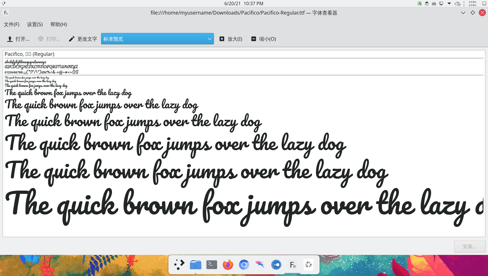

# archlinux 系统美化（下篇）

> ### 🌺 爱美之心，人皆有之
>
> 美化这个话题是永恒的。有些人用 Linux 的原因就是一开始被美化后桌面的截图惊艳到了
>
> 这一小节将会介绍如何对 KDE 桌面环境进行美化。受限于篇幅，本小节分为上下篇

> ### 🔖 这一节将会讨论：
>
> [[toc]]

## 0. 配置 Split Digital Clock

1. 在 [Google Fonts](https://fonts.google.com/specimen/Pacifico) 上点击右上角的 `Download family` 下载 Pacifico 字体

2. 解压后安装字体：

   

3. 将 Split Digital Clock 拖拽到桌面后配置：

   - 更改 `Font Style` 为 `Pacifico`
   - 勾选 `Show Date`
   - 调整 `Color of text` 为 `#ffffff` 或合适颜色
   - 调整小部件为合适大小

   

4. 查看效果：

   

## 1. 文字艺术与终端玩具

## 2. 设置 Konsole 样式

打开 konsole， _设置_ > _编辑当前方案_ > _外观_，选择`Red-Black` 应用确认即可。

## 3. zsh 美化

## 4. 更改 Fcitx5 输入法皮肤

## 5. 更改全局主题

::: tip ℹ️ 提示

若切换主题后，`windows` 键不能呼出菜单，则需要重新配置快捷键：

1. 在程序启动器（开始菜单）右键 > 点击 `配置程序启动器...`

2. 在键盘快捷键中重新设置 `windows` + `F1` 键，windows 键会显示为 Meta 键。

:::

## 6. 设置窗口装饰

在 _系统设置_ > _外观_ > _窗口装饰_ 中，获取新窗口装饰，搜索 layan，并应用即可。

## 7. 配置 Kvantum Manager

主题配合 Kvantum Manager 可以达到更好的效果。

```bash
sudo pacman -S kvantum-qt5
```

在[这里](https://www.pling.com/p/1325246/)下载 Layan 的 Kvantum 主题，并解压。打开 Kvantum Manager,选择主题并安装，接下来在`Change/Delete Theme`中选择 Layan,Use this theme。最后在系统设置，外观中的应用程序风格中选择 kvantum 即可。

> 如果透明的效果没有显示，确保 KDE 的全局缩放比例为整数倍。或者尝试切换混成器中 openGL 的设置。

## 8. 更改字体

## 9. 引导界面美化

### 9-1. 设置 GRUB 主题

开机时有个漂亮的 GRUB 也是很舒服的。

在[这里](https://www.pling.com/p/1482847/)下载 Distro 的 GRUB 主题并解压。接下来 `cd` 进解压出来的文件夹，打开 konsole 输入

```bash
sudo cp . /usr/share/grub/themes/Distro -rf
```

以将主题放置在系统的 GRUB 默认文件夹内。

接着编辑 `/etc/default/grub` 文件，找到 `#GRUB_THEME=` 一行，将前面的注释去掉，并指向主题的 `theme.txt` 文件。即

```bash
#GRUB_THEME=
GRUB_THEME="/usr/share/grub/themes/Distro/theme.txt" #修改后
```

然后再在终端输入

```bash
grub-mkconfig -o /boot/grub/grub.cfg
```

更新 GRUB 即可。

### 9-2. 设置 rEFind 主题
