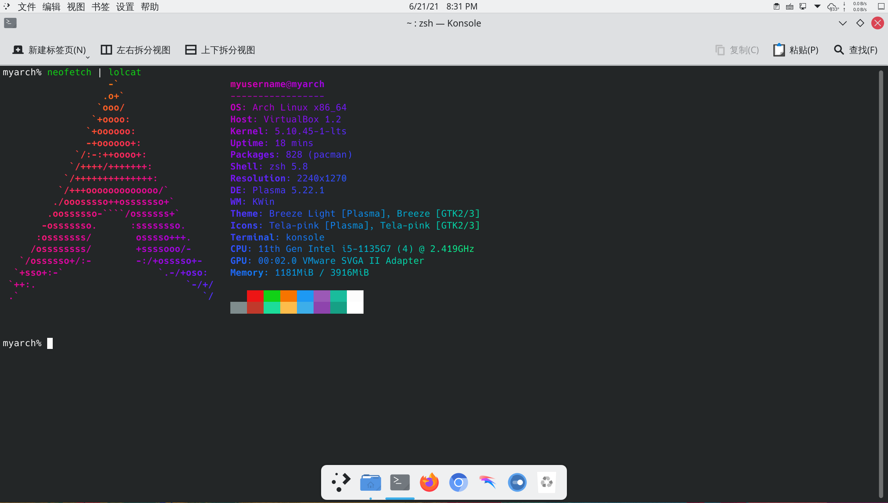
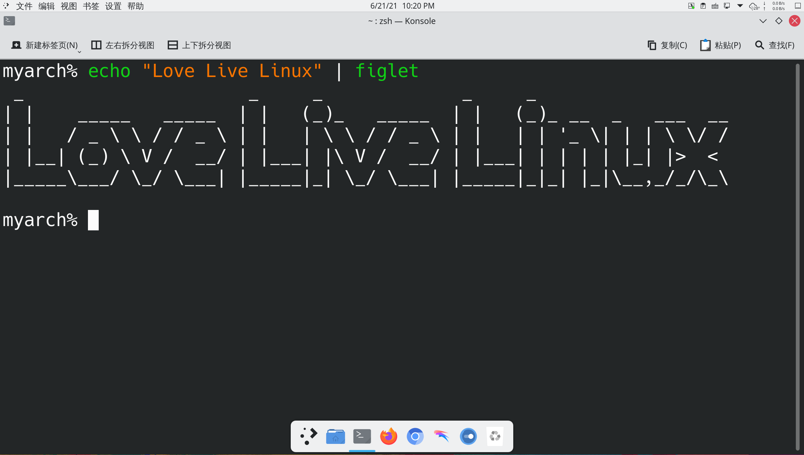
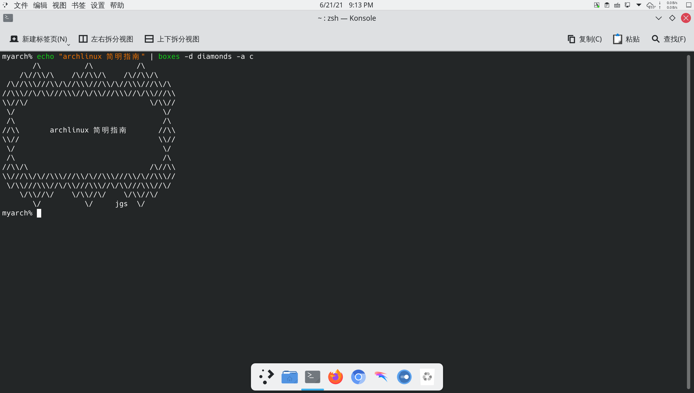
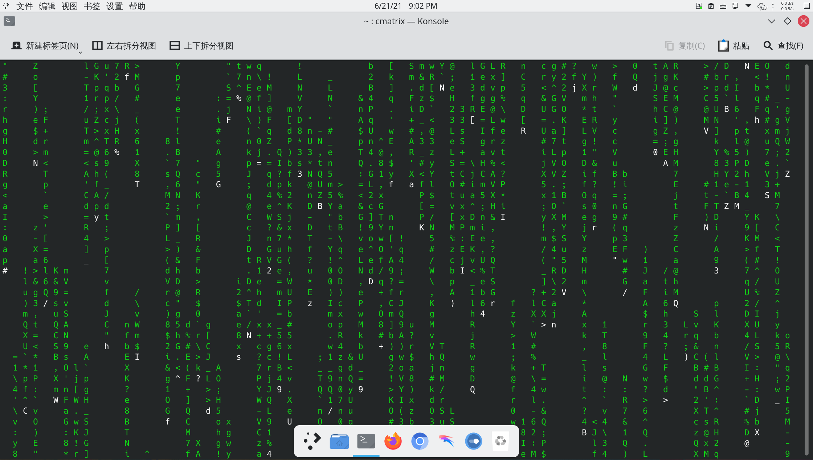
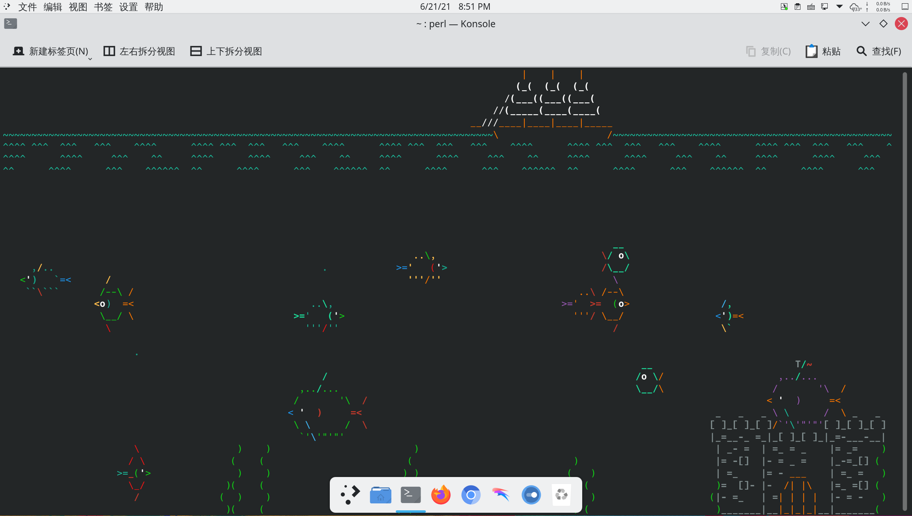
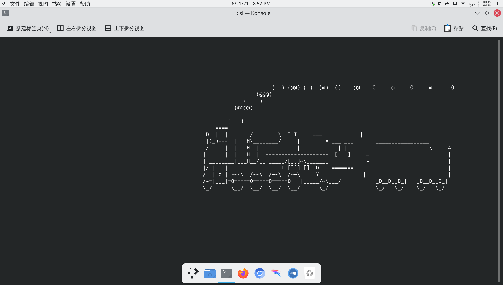

# archlinux 系统美化（终端篇）

> ### 🌺 爱美之心，人皆有之
>
> 美化这个话题是永恒的。有些人用 Linux 的原因就是一开始被美化后桌面的截图惊艳到了
>
> 这一小节将会介绍如何对 KDE 桌面环境进行美化。受限于篇幅，本小节分为上下篇

> ### 🔖 这一节将会讨论：
>
> [[toc]]

## 1. ASCII 艺术与终端玩具

### lolcat

用渐变为终端输出着色，看起来就像彩虹一样！

1. 安装 [lolcat](https://archlinux.org/packages/community/any/lolcat/)：

   ```bash
   sudo pacman -S lolcat
   ```

2. 通过管道符（`|`）将其它命令（如 `neofetch`）的输出传递给 `lolcat`：

   ```bash
   neofetch | lolcat
   ```

   

### cowsay

将文本作为 ASCII 艺术牛的讲话文本输出。

1. 安装 [cowsay](https://archlinux.org/packages/extra/any/cowsay/)：

   ```bash
   sudo pacman -S cowsay
   ```

2. 通过管道符（`|`）将简短的其它命令输出传递给 `cowsay`：

   ```bash
   echo "archlinux 简明指南" | cowsay
   ```

   

### figlet

显示由不同风格的 ASCII 艺术字符组成的文本。

1. 安装 [figlet](https://archlinux.org/packages/extra/x86_64/figlet/)：

   ```bash
   sudo pacman -S figlet
   ```

2. 通过管道符（`|`）将简短的其它命令输出传递给 `figlet`：

   ```bash
   echo "Love Live Linux" | figlet
   ```

   

   更多样式请参阅 [figlet 官网](http://www.figlet.org/)。

### boxes

使用 ASCII 艺术风格的字符形状框来包围文本。

1. 安装 [boxes](https://archlinux.org/packages/extra/any/cowsay/)<sup>aur</sup>：

   :::: code-group
   ::: code-group-item aur

   ```bash
   yay -S boxes
   ```

   :::
   ::: code-group-item aur（git）

   ```bash
   yay -S boxes-git
   ```

   :::
   ::::

2. 通过管道符（`|`）将简短的其它命令输出传递给 `boxes`：

   ```bash
   echo "archlinux 简明指南" | boxes -d diamonds -a c
   ```

   

   更多样式请参阅 [boxes 官网](https://boxes.thomasjensen.com/) 以及 [boxes repo](https://github.com/ascii-boxes/boxes)。

### cmatrix

向下滚动的代码流如同黑客帝国一样！

1. 安装 [cmatrix](https://archlinux.org/packages/community/x86_64/cmatrix/)：

   :::: code-group
   ::: code-group-item community

   ```bash
   sudo pacman -S cmatrix
   ```

   :::
   ::: code-group-item aur（git）

   ```bash
   yay -S aur/cmatrix-git
   ```

   :::
   ::::

2. 输入以下命令：

   ```bash
   cmatrix
   ```

   

3. 按下 `q` 即可退出

### asciiquarium

将终端化身海洋馆！

1. 安装 [asciiquarium](https://archlinux.org/packages/community/any/asciiquarium/)<sup>community / aur</sup>：

   :::: code-group
   ::: code-group-item community

   ```bash
   sudo pacman -S asciiquarium
   ```

   :::
   ::: code-group-item aur（git）

   ```bash
   yay -S aur/asciiquarium-git
   ```

   :::
   ::::

2. 输入以下命令：

   ```bash
   asciiquarium
   ```

   

3. 按下 `q` 即可退出

### sl

终端里的小火车。

1. 安装 [sl](https://archlinux.org/packages/community/x86_64/sl/)：

   ```bash
   sudo pacman -S sl
   ```

2. 输入以下命令：

   ```bash
   sl
   ```

   

## 2. 设置 Konsole 样式

打开 konsole， _设置_ > _编辑当前方案_ > _外观_，选择`Red-Black` 应用确认即可。

## 3. zsh 美化

## 4. vim 美化

## 5. Linux 彩蛋
