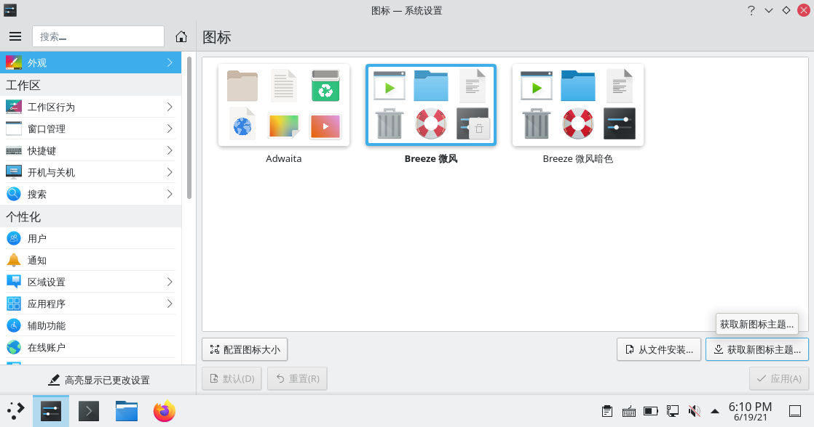
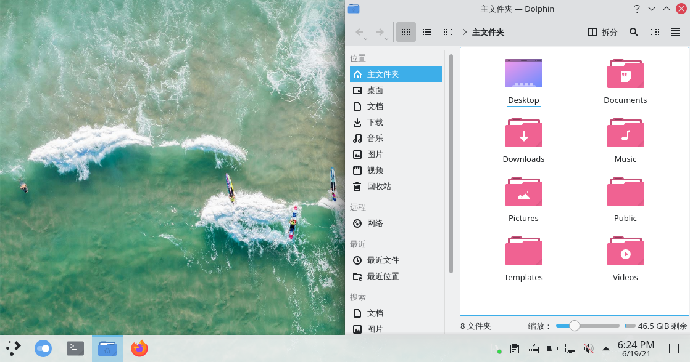
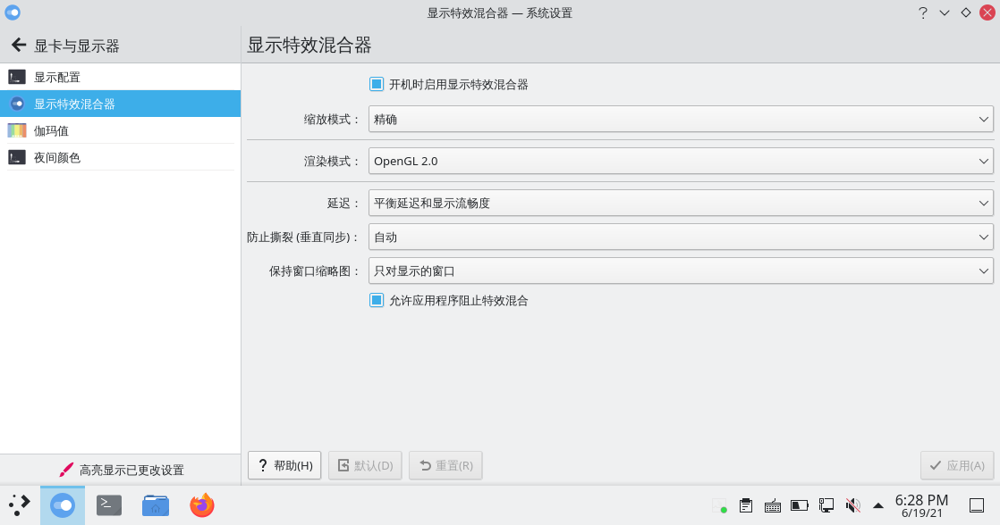
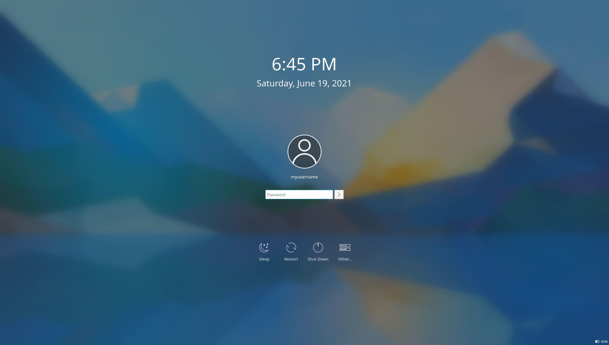

# archlinux 系统美化

> ### 🌺 爱美之心，人皆有之
>
> 这一小节将会介绍如何对 KDE 桌面环境进行美化。需要说明的是，不要过度美化！过度美化可能导致系统稳定性和性能下降等后果
>
> 实际上默认的 [微风（breeze）](https://github.com/KDE/breeze)主题是最耐看的。当然，这是用户的个人选择，也是 arch 之道

> ### 🔖 这一节将会讨论：
>
> [[toc]]

美化这个话题是永恒的。有些人用 Linux 的原因就是一开始被美化后桌面的截图惊艳到了。

本节介绍的步骤建议按顺序进行，您可以选择在任何一步收手，因为剩下的步骤可能显得多余，甚至可能适得其反。同时，本小节将介绍两种桌面布局方式 —— 一种是传统的类似 windows 的菜单栏布局，另一种是类似 macOS 的 Dock 栏布局。

::: tip ℹ️ 提示

若使用虚拟机，请不要过度美化！否则会降低性能甚至卡死。

:::

## 0. 换一张漂亮的壁纸

1. 在桌面右键 > 选择 `配置桌面和壁纸`

2. 在右下角选择 `添加图片` > 选择你想要的图片

3. `位置` 保持 `缩放并剪切` 即可，当然也可根据个人喜好自定义

4. 选择刚才添加的图片 > 点击 `应用`


::: tip ℹ️ 提示

- 若希望壁纸能够定时轮换，可以将 `壁纸类型` 改为 `幻灯片`
- 也可以将 `壁纸类型` 改为 `每日一图` > 将 `提供` 改为喜欢的来源（如 `必应`，这将和 [必应](https://cn.bing.com) 保持一致）

:::

## 1. 更改系统图标

如果觉得默认的微风主题图标不能满足你的审美，那么可以下载新的图标主题。

1. 打开 `系统设置` > 点击侧栏 `外观` > `图标` > 点击右下角 `获取新图标主题`：



::: tip ℹ️ 提示

为了流畅的连接服务器，你可能需要按照章节 [透明代理](/rookie/transparent.md) 配置透明代理。

:::

2. 搜索图标名 `Tela-icon-theme` 或喜欢的一套图标主题 > 点击 `安装` > 选择喜欢的颜色 `安装`：


3. 安装完成后点击 `关闭`

4. 选择刚刚下载好的图标主题 > 点击 `应用` 即可：




可以看到图标已经成功修改。

## 2. 确认显示特效混合器（混成器）状态

1. 打开 `系统设置` > 点击侧栏 `显卡与显示器` > `显示特效混合器`

2. 确认显示特效混合器运行状态：



## 3. 设置 SDDM 主题

默认的登录界面不太好看，我们将它替换掉。

1. 打开 `系统设置` > 点击侧栏 `开机和关机` > `登录屏幕（SDDM）`

2. 选择并应用 SDDM 主题：

   - 若希望使用微风 SDDM 主题：

     你可能会发现默认选择的 SDDM 主题就是微风，实际上这只是显示有问题而已。

     1. 随便选择另外一套 SDDM 主题 > 点击 `应用`

     2. 重新选择微风 SDDM 主题 > 点击 `应用`

     3. 重启，查看效果：

   

   - 若希望使用其它 SDDM 主题：

     1. 点击右下角的 `获取新 SDDM 主题...`

     2. 搜索 SDDM 主题名 `McSur-light Sddm Theme` 或喜欢的一套 SDDM 主题 > 点击 `安装`：

     

     3. 安装完成后点击 `关闭`

     4. 选择刚刚下载好的 SDDM 主题 > 点击 `应用` 即可：

     

     5. 重启，查看效果：

     

3. 部分 SDDM 主题可以更换背景。点击对应 SDDM 主题中间的图片小图标 > `加载图像文件...` > 选择你想要的图片

4. 点击 `应用`

5. 重启，查看效果：


## 4. 设置欢迎屏幕主题

登录界面后的欢迎屏幕也可以进行美化。

1. 打开 `系统设置` > 点击侧栏 `外观` > `欢迎屏幕`：


2. 点击右下角的 `获取新欢迎屏幕...`

3. 搜索欢迎屏幕主题名 `Snowy Night Miku` 或喜欢的一套欢迎屏幕主题 > 点击 `安装`：


4. 选择刚刚下载好的欢迎屏幕主题 > 点击 `应用` 即可：


5. 注销，查看效果：


## 5. 修改桌面布局

桌面布局之前，需要了解一些基本的概念：

- KDE 桌面中无论是菜单栏还是顶栏，本质上都是**面板**
- 面板上的元素（如托盘图标、数字时钟、网速显示、开始菜单图标）等都是**小组件**
- 小组件可以放置在面板里，也可以独立存在

更改桌面布局，本质上就是**调整面板和小组件的位置以及样式**。

### 5-1. 菜单栏布局

KDE 默认即菜单栏布局。

### 5-2. Dock 栏布局

1. 为了实现 Dock 栏布局，需要安装 Latte-

## 6. 更换全局主题

使用一个高质量的系统主题可以直线提升系统的美观程度。

1. _系统设置_ > _全局主题_ > _获取新的全局主题_

2. 搜索主题 layan，进行设置即可

::: tip ℹ️ 提示

若切换主题后，`windows` 键不能呼出菜单，则需要重新配置快捷键：

1. 在程序启动器（开始菜单）右键 > 点击 `配置程序启动器...`

2. 在键盘快捷键中重新设置 `windows` + `F1` 键，windows 键会显示为 Meta 键。

:::

## 7. 设置窗口装饰

在 _系统设置_ > _外观_ > _窗口装饰_ 中，获取新窗口装饰，搜索 layan，并应用即可。

## 8. 桌面插件

在任务栏空白处右键，选择编辑面板，添加部件。

- Netspeed widget 网速组件，这个很实用
- simple monitor 系统信息
- resources monitor cpu 内存任务栏组件
- todolist 任务组件

## 9. 终端样式设置

打开 konsole， _设置_ > _编辑当前方案_ > _外观_，选择`Red-Black` 应用确认即可。

## 10. Kvantum Manager

主题配合 Kvantum Manager 可以达到更好的效果。

```bash
sudo pacman -S kvantum-qt5
```

在[这里](https://www.pling.com/p/1325246/)下载 Layan 的 Kvantum 主题，并解压。打开 Kvantum Manager,选择主题并安装，接下来在`Change/Delete Theme`中选择 Layan,Use this theme。最后在系统设置，外观中的应用程序风格中选择 kvantum 即可。

> 如果透明的效果没有显示，确保 KDE 的全局缩放比例为整数倍。或者尝试切换混成器中 openGL 的设置。

## 11. 更换 Fcitx5 输入法皮肤

## 12. 引导界面美化

### 12-1. 设置 GRUB 主题

开机时有个漂亮的 GRUB 也是很舒服的。

在[这里](https://www.pling.com/p/1482847/)下载 Distro 的 GRUB 主题并解压。接下来 `cd` 进解压出来的文件夹，打开 konsole 输入

```bash
sudo cp . /usr/share/grub/themes/Distro -rf
```

以将主题放置在系统的 GRUB 默认文件夹内。

接着编辑 `/etc/default/grub` 文件，找到 `#GRUB_THEME=` 一行，将前面的注释去掉，并指向主题的 `theme.txt` 文件。即

```bash
#GRUB_THEME=
GRUB_THEME="/usr/share/grub/themes/Distro/theme.txt" #修改后
```

然后再在终端输入

```bash
grub-mkconfig -o /boot/grub/grub.cfg
```

更新 GRUB 即可。

### 12-2. 设置 rEFind 主题
