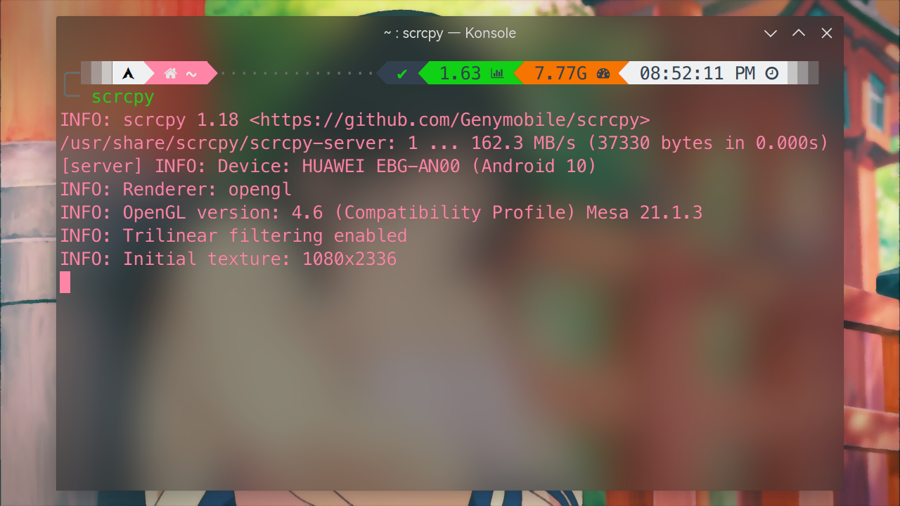
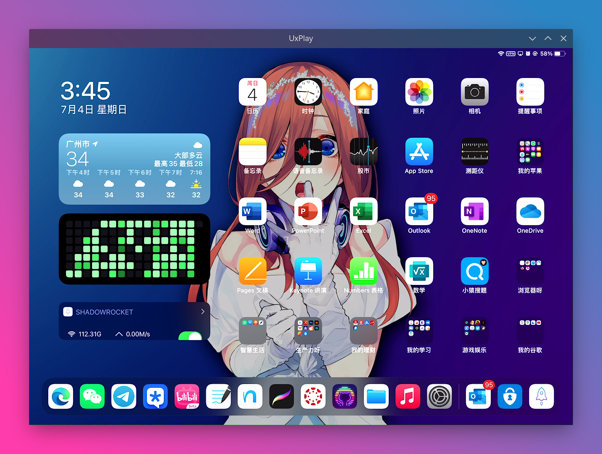
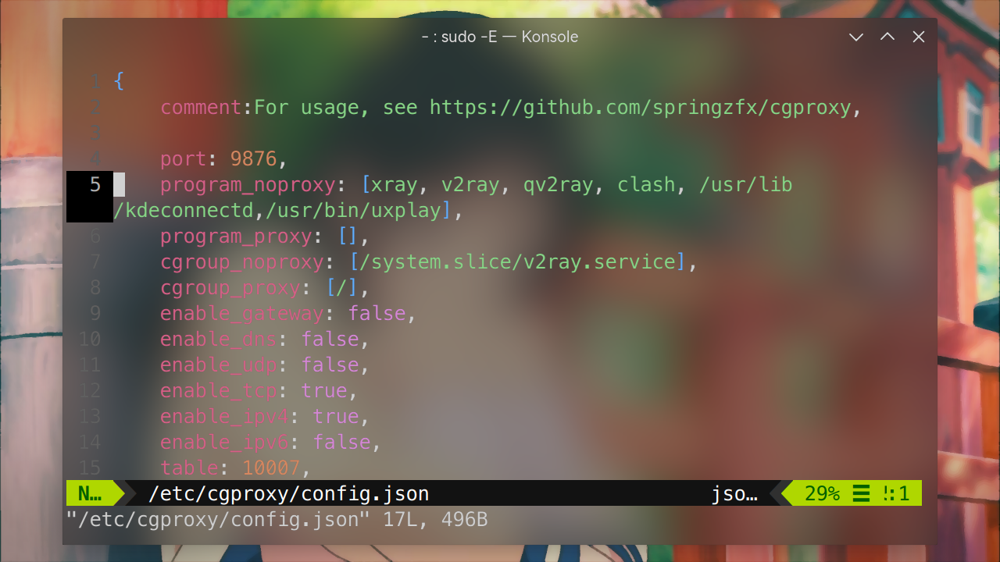

# 多屏协同

> ### 📲 二人同心，其利断金
>
> 本小节内容讨论如何投屏安卓或苹果设备到 archlinux 上以及安卓设备如何和 archlinux 协同工作。

> ### 🔖 这一节将会讨论：
>
> ::: details 目录
>
> [[toc]]
>
> :::

::: tip ℹ️ 提示

指南中带有 <sup>aur</sup> 角标的软件代表是在 [AUR](https://aur.archlinux.org/)（Arch User Repository）中用户自行打包的软件。不在 arch 官方支持范围内，可能会出现各种问题如更新不及时、无法安装、使用出错等。

指南中带有 <sup>cn</sup> 角标的软件代表是在 [archlinuxcn](https://www.archlinuxcn.org/archlinux-cn-repo-and-mirror/)（Arch Linux 中文社区仓库）中用户自行打包的软件。不在 arch 官方支持范围内，可能会出现各种问题如更新不及时、无法安装、使用出错等。

指南中带有 <sup>EULA</sup> 角标的软件代表是 [专有软件](https://www.gnu.org/proprietary/proprietary.html)。请自行斟酌是否使用。

:::

## 🤖 安卓设备投屏（scrcpy）

[scrcpy](https://github.com/Genymobile/scrcpy/blob/master/README.zh-Hans.md) 可以显示并控制通过 USB 或无线连接的安卓设备，且不需要任何 root 权限。

scrcpy 有以下优点：

- 轻量（原生，仅显示设备屏幕）
- 性能（30 ~ 60fps）
- 质量（分辨率可达 1920×1080 或更高）
- 低延迟（35 ~ 70ms）
- 快速启动（最快 1 秒内即可显示第一帧）
- 无侵入性（不会在设备上遗留任何程序）

::: tip ℹ️ 提示

安卓版本要大于等于 5.0。

:::

1. 安装 [scrcpy](https://aur.archlinux.org/packages/scrcpy/)<sup>cn / aur</sup> 以及 [安卓工具包](https://archlinux.org/packages/extra/x86_64/android-tools/)：

   ::: code-group

   ```sh [cn]
   sudo pacman -S scrcpy android-tools
   ```

   ```sh [aur]
   yay -S aur/scrcpy android-tools
   ```

   ```sh [aur (git)]
   yay -S scrcpy-git android-tools
   ```

   :::

2. 打开安卓设备的 `设置` > `开发人员选项`（多次点击 `关于手机（平板）` 中的 `版本号`，提示处在 `开发者模式` 后即可在设置中找到）> 打开 `USB 调试`：

   

   ::: tip ℹ️ 提示

   部分设备还需要开启 `USB 调试（安全设置）`。

   :::

3. 通过数据线连接安卓设备和计算机 > 将 `USB 连接方式` 改为 `传输文件`：

   

4. 在终端执行以下命令：

   ```sh
   adb devices
   ```

   终端上也会显示连接的安卓设备号：

   

   ::: tip ℹ️ 提示

   如果是第一次执行这条命令（或没有永远信任计算机），在安卓设备上应该会出现一个确认使用该电脑调试安卓设备的通知，确认即可。

   :::

   ::: tip ℹ️ 提示

   有些设备可能会自动关闭 `USB 调试`，若没有显示请确认 `USB 调试` 开启。

   :::

### 有线连接

1. 保持数据线连接，直接在终端执行以下命令即可：

   ```sh
   scrcpy
   ```

   

   

2. 关闭窗口即可结束连接

### 无线连接

1. 保持数据线连接，执行以下命令：

   ```sh
   adb tcpip 8848 # 可自定义端口，默认为 5555
   ```

2. 开启成功之后就可以拔掉数据线了

3. 打开安卓设备的 `设置` > `关于手机（平板）` > `状态信息`（或类似位置）> 查看手机（平板）的 `IP 地址`：

   

4. 在终端执行以下命令即可看到现在的安卓设备界面了：

   ```sh
   adb connect ANDROID_IP:8848 # 刚刚自定义的端口
   ```

   ::: tip ℹ️ 提示

   部分设备可能无法通过无线连接（断开数据线后会自动关闭 `USB 调试`），会显示以下错误信息：

   ```sh
   failed to connect to 192.168.x.xxx:xxxx
   ```

   :::

5. 连接成功后在终端执行以下命令即可看到现在的安卓设备界面了：

   ```sh
   scrcpy
   ```

   

   

   ::: tip ℹ️ 提示

   若报以下错误：

   ```sh
   adb: error: failed to get feature set: more than one device/emulator
   ```

   请执行以下步骤后再尝试：

   1. 通过 `adb devices` 命令查看信息，找到不存在的设备（因连接失败留下的，显示为 `offline`）

   2. 断开不存在的设备：

      ```sh
      adb disconnect HOST:PORT
      ```

      

   :::

6. 关闭窗口即可结束连接

### 快捷使用

下面介绍一些快捷使用的方法。

#### 常用快捷键

| 作用                                 | 快捷键                 |
| :----------------------------------- | :--------------------- |
| 返回                                 | `meta` + `B`           |
| 主界面                               | `meta` + `H`           |
| 多任务界面                           | `meta` + `S`           |
| 关闭手机屏幕（电脑上的界面正常显示） | `meta` + `O`           |
| 开启手机屏幕                         | 右键单击               |
| 展开通知栏                           | `meta` + `N`           |
| 折叠通知栏                           | `meta` + `Shift` + `N` |

#### 文件传输

若需要将计算机的文件传到安卓设备，直接将文件拖拽到计算机上的安卓设备界面即可。文件默认存放在用户的主目录下。

若感觉不太方便可使用 [KDE Connect](collaboration.md#🔗-kde-connect) 协同 scrcpy 使用。

#### 屏幕常亮

在连接到电脑之后很可能都希望手机息屏而计算机端的镜像可以常亮，虽然可以通过键盘快捷键 `meta` + `O` 来实现，但这种方式实现的亮屏会在达到手机屏幕休眠时间之后自动黑屏。

所以想要实现常亮的话需要在启动 scrcpy 的时候添加一个可以保持屏幕唤醒的参数：

```sh
scrcpy --turn-screen-off --stay-awake
```

若亮屏是常用选项，可将这个命令设置为 scrcpy 的别名（alias）。只需要使用以下命令在 `~/.zshrc` 或者 `~/.bashrc` 中添加如下内容 > 重新打开终端或者 `source` 该文件即可：

::: code-group

```sh [bash]
echo 'alias scrcpy="scrcpy --turn-screen-off --stay-awake"' >> ~/.bashrc
```


```sh [zsh]
echo 'alias scrcpy="scrcpy --turn-screen-off --stay-awake"' >> ~/.zshrc
```

:::

## 🍎 苹果设备投屏（UxPlay）

[UxPlay](https://github.com/antimof/UxPlay) 是一款将 iPadOS 或 IOS 投屏到 Linux 的软件。该项目是 UNIX / 类 UNIX 系统中 AirPlay 服务器的早期原型。

通过投屏到 archlinux 可以方便的在 [Zoom](communication.md#zoom) 等各种情景下将内容分享给他人（课堂演示等等）。

::: details 视频指南（视频不清晰请前往哔哩哔哩观看）

<div
  style="
    position: relative;
    padding: 30% 45%;
    margin-top: 32px;
  "
>
  <iframe
    style="position: absolute; width: 100%; height: 100%; left: 0; top: 0"
    src="//player.bilibili.com/player.html?aid=972705991&bvid=BV1fp4y1t71r&cid=328263624&page=1&as_wide=1&high_quality=1&danmaku=1&autoplay=0"
    scrolling="no"
    border="0"
    frameborder="no"
    framespacing="0"
    allowfullscreen="true"
  ></iframe>
</div>

:::

1. 安装 [UxPlay](https://aur.archlinux.org/packages/uxplay-git/)<sup>aur</sup>：

   ```sh
   yay -S uxplay-git
   ```

2. 启动 `avahi-daemon` 服务：

   ```sh
   sudo systemctl start avahi-daemon.service
   systemctl status avahi-daemon.service # 复查一下
   ```

3. 确保计算机和 iPad 或者 iPhone 连接至同一个 **5Ghz** 无线网络

4. 在终端执行以下命令启动 UxPlay：

   ```sh
   uxplay
   ```

   

5. 在 iPad 或 iPhone 中打开屏幕镜像，选择并连接 `Uxplay`，等待一会即可：

   

   

::::: tip ℹ️ 提示

每次运行 UxPlay 之前都需要开启 `avahi-daemon` 服务，若觉得麻烦可将其添加到自动启动中：

```sh
sudo systemctl enable avahi-daemon.service
```

或者使用以下命令创建 `uxplay` 命令的别名（alias），只需要使用以下命令在 `~/.zshrc` 或者 `~/.bashrc` 中添加如下内容 > 重新打开终端或者 `source` 该文件即可：

::: code-group

```sh [bash]
echo 'alias uxplay="sudo systemctl start avahi-daemon.service && uxplay"' >> ~/.bashrc
```

```sh [zsh]
echo 'alias uxplay="sudo systemctl start avahi-daemon.service && uxplay"' >> ~/.zshrc
```

:::

::: tip ℹ️ 提示

若使用了 [透明代理](../../guide/rookie/transparent.md#_7-配置-cgproxy)，请将 `/usr/bin/uxplay` 添加到 `/etc/cgproxy/config.json` 中的 `program_noproxy` 一行（不使用透明代理的名单）：



:::

## 🔗 KDE Connect

[KDE Connect](https://kdeconnect.kde.org/) 提供了各种用于整合移动设备和计算机的功能。它可以将文件发送到另一台设备、控制它的媒体播放、发送远程输入、查看它的通知，以及做许多其它事情。

1. 安装 [KDE Connect](https://archlinux.org/packages/extra/x86_64/kdeconnect/)<sup>extra / cn / aur</sup> 及其相关可选依赖：

   ::: code-group

   ```sh [extra]
   sudo pacman -S kdeconnect sshfs
   ```

   ```sh [cn (git)]
   sudo pacman -S skdeconnect-git sshfs
   ```

   ```sh [aur (git)]
   yay -S aur/kdeconnect-git sshfs
   ```

   :::

2. 移动端可在 [Google Play](https://play.google.com/store/apps/details?id=org.kde.kdeconnect_tp) [App Store](https://apps.apple.com/us/app/kde-connect/id1580245991)下载并安装

3. 将计算机和移动设备连接至同一个无线网络，根据提示信任并连接即可：

   

4. 为了让计算机可以访问移动设备的文件系统，需要在移动设备点击对应计算机右上角的 `更多按钮`（三个点） > `插件设置` > 打开 `开放文件系统` > 点击 `开放文件系统` 进入 `开放文件系统设置` > `添加储存位置` > 选择要共享的文件夹：

   

5. 然后便可以在 Dolphin 中查看并操作移动设备的文件系统了：

   

::: tip ℹ️ 提示

若使用了 [透明代理](../../guide/rookie/transparent.md#_7-配置-cgproxy)，请将 `/usr/lib/kdeconnectd` 添加到 `/etc/cgproxy/config.json` 中的 `program_noproxy` 一行（不使用透明代理的名单）：


:::

---

> 📔 本节参考资料：
>
> - [Android 手机投屏到 Linux 下](https://www.dianbanjiu.com/post/android-%E6%89%8B%E6%9C%BA%E6%8A%95%E5%B1%8F%E5%88%B0-linux-%E4%B8%8B/)
