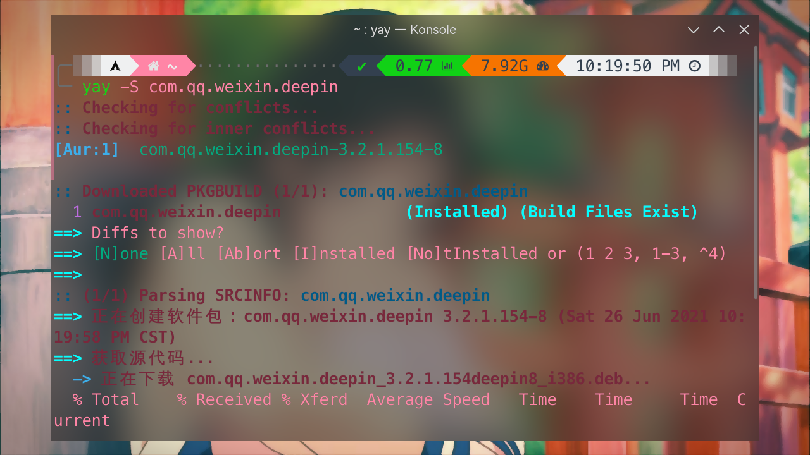
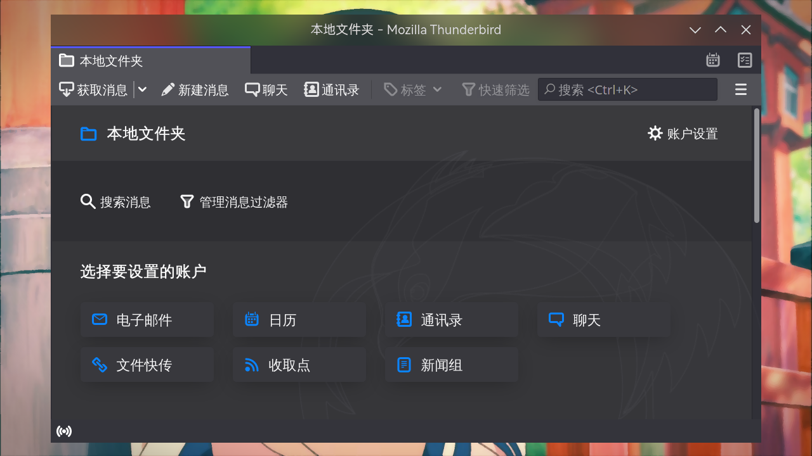

# 聊天通讯

> ### 🍻 海上生明月，天涯共此时
>
> 这一小节讨论在 archlinux 上安装常用的聊天通讯软件

> ### 🔖 这一节将会讨论：
>
> ::: details 目录
>
> [[toc]]
>
> :::

::: tip ℹ️ 提示

指南中带有 <sup>aur</sup> 角标的软件代表是在 [AUR](https://aur.archlinux.org/)（Arch User Repository）中用户自行打包的软件。不在 arch 官方支持范围内，可能会出现各种问题如更新不及时、无法安装、使用出错等。

指南中带有 <sup>cn</sup> 角标的软件代表是在 [archlinuxcn](https://www.archlinuxcn.org/archlinux-cn-repo-and-mirror/)（Arch Linux 中文社区仓库）中用户自行打包的软件。不在 arch 官方支持范围内，可能会出现各种问题如更新不及时、无法安装、使用出错等。

指南中带有 <sup>EULA</sup> 角标的软件代表是 [专有软件](https://www.gnu.org/proprietary/proprietary.html)。请自行斟酌是否使用。

:::

## 💬 即时通讯

### Telegram

Telegram（电报）是跨平台的即时通信软件。其客户端是自由软件（桌面端在 [GPLv3](https://github.com/telegramdesktop/tdesktop/blob/dev/LICENSE) 协议下发布），但服务器是专有软件。

Telegram 有两种加密模式：

- 一般聊天 —— 使用**端到端**的加密通信，但服务端会有访问密钥的权限，而且可以经由多重设备登录
- 秘密聊天 —— 使用**端对端**的加密通信，而且只能经由两个特定设备登录

官方宣称当两名用户进行通信时，第三方包含管理人员皆无法访问用户的通信内容。当用户在进行秘密聊天时，消息包含多媒体皆可以被指定为自毁消息，当消息被用户阅读之后，消息在指定的时间内会自动销毁。一旦消息过期，消息会消失在用户的设备上。

1. 安装 `Telegram`<sup>extra / cn / aur</sup>：

   ::: code-group

   ```sh [extra]
   sudo pacman -S telegram-desktop
   ```

   ```sh [cn (git)]
   sudo pacman -S telegram-desktop-git
   ```

   ```sh [aur]
   yay -S telegram-desktop-bin
   ```

   ```sh [aur（dev）]
   yay -S telegram-desktop-bin-dev
   ```

   :::

   

2. 调整隐私权限以及自动下载：

   - 在 `Settings`（设置） > `Advanced`（高级） > `Automatic media download`（自动媒体下载） 中分别将 `In private chats`（私聊中）、`In groups`（群组中） 和 `In channels`（频道中） 的 `Files`（文件） 关掉，以避免下载病毒以及垃圾文件
   - 在 `Settings`（设置） > `Privacy and Security`（隐私和安全） > `Privacy`（隐私） 中将 `Phone number`（电话号码） 改为 `Nobody`（仅联系人可见）、将 `Forwarded messages`（转发的消息）、`Calls`（语音通话） 和 `Groups & channels`（邀请权限） 分别改为 `My contacts`（仅联系人）

     ::: tip ℹ️ 提示

     更进一步，可将 `Phone number` 中的 `Who can find me by my number` 改为 `My contacts`，这将使只有双向联系人（即双方手机都有对方的电话号码）才可以通过电话号码添加您为好友。这可以在一定程度增加安全性。

     :::

> #### 💕 相关链接：archlinux Telegram 相关群组
>
> - [#archlinux-cn](https://t.me/archlinuxcn_group)
> - [#archlinux-cn-offtopic](https://t.me/archlinuxcn_offtopic)
> - [ArchLinuxStudio🇨🇦🏳️‍⚧️🏳️‍🌈](https://t.me/FSF_Ministry_of_Truth)

::: tip ℹ️ 提示

目前官方中文语言包还不完整，可以通过点击第三方语言包链接设置 Telegram 为中文：

- 简体：
  - [聪聪](https://t.me/setlanguage/zhcncc)
  - [江湖](https://t.me/setlanguage/jianghu)
  - [langCN](https://t.me/setlanguage/zhlangcn)
  - [zh-hans](https://t.me/setlanguage/zh-hans-beta)
  - [Moecn](https://t.me/setlanguage/moecn)
- 繁体：
  - [繁體一](https://t.me/setlanguage/hongkong)
  - [繁體二](https://t.me/setlanguage/zhhant-hk)

:::

::: tip ℹ️ 提示

虽然 Telegram 很“自由”，但也带来了很多问题：

- 牵涉恐怖活动 —— 2015 年 11 月，由于伊斯兰国（ISIS）相关组织使用频繁，Telegram 移除了近 250 个所使用广播频道，并屏蔽其所属账号并且持续每天移除近百频道
- 非法出售个人信息 —— 2020 年 3 月中旬，中华人民共和国江苏园区公安分局网安大队在“净网 2020”专项行动的网络巡查中获取了一条网民通过 Telegram 出售公民个人信息的线索，并于 4 月 22 日在广东东莞和湖南衡阳逮捕 6 名嫌疑犯，查获过百万条公民个人信息
- 传播钓鱼木马 —— 2020 年 12 月 26 日，金山毒霸安全团队通过“捕风”威胁感知系统捕获一类新的钓鱼木马，该类木马在 Telegram 群组中传播，通过命名成各种时政热点消息的标题或者更改图标伪装成正规软件，诱使用户点击
- 传播色情、侵犯著作权的内容 —— 2018 年下半年至 2020 年 3 月间，韩国有人通过 Telegram 组建多个聊天室并收取费用，进行了有组织的、大规模的性虐待事件，即震惊韩国社会的 N 号房事件
- 颠覆国家政权 —— 2019 年 6 月，“反修例运动”期间，香港很多“抗议者”使用 Telegram 来逃避电子监视

使用 Telegram 时注意安全，保护好个人隐私；同时也要注意谨言慎行。

:::

> #### 🍧 碎碎念
>
> 道也者，不可须臾离也；可离，非道也。是故君子戒慎乎其所不睹，恐惧乎其所不闻。莫见乎隐，莫显乎微，故君子慎其独也。

### QQ

推荐安装官方最新的[`linuxqq`](https://aur.archlinux.org/packages/linuxqq)<sup>EULA / aur</sup>（基于 Electron 框架）

```sh
yay -S linuxqq
```

wrap 版本[`linuxqq-nt-bwrap`](https://aur.archlinux.org/packages/linuxqq-nt-bwrap)<sup>EULA / aur</sup>，该版本限制了 qq 的目录访问

```sh
yay -S linuxqq-nt-bwrap
```


#### 其它版本

基于 [`deepin-wine5`](https://aur.archlinux.org/packages/deepin-wine5)<sup>EULA / extra / cn / aur</sup> 的 QQ。

1. 安装 [`deepin-wine-qq`](https://aur.archlinux.org/packages/deepin-wine-qq/)<sup>aur</sup>：

   ```sh
   yay -S deepin-wine-qq
   ```

   

2. 参考 [deepin-wine5 相关](../../guide/advanced/debug.md#deepin-wine5-相关) 完成配置：

   

#### 第三方

以下为第三方版本 QQ

- Icalingua [`Icalingua`](https://aur.archlinux.org/packages/icalingua/)<sup>aur</sup> - electron 开发的第三方~~QQ~~ ([~~github~~](https://github.com/Icalingua/Icalingua))(作者已删库)
  ```sh
  yay -S icalingua
  ```
- Icalingua++ [`Icalingua++`](https://aur.archlinux.org/packages/icalingua++/)<sup>aur</sup> - electron 开发的第三方 QQ ([github](https://github.com/Icalingua-plus-plus/Icalingua-plus-plus))(为 icalingua 升级版)
  ```sh
  yay -S icalingua++
  ```

### 微信

2024 年 3 月，微信 Linux 原生版重构，可以安装 [`wechat-uos-qt`](https://aur.archlinux.org/packages/wechat-uos-qt/)<sup>aur</sup> 体验，这是目前最好的解决方案。

```bash
yay -S wechat-uos-qt
```

对于沙盒等存在的一些问题可以参照[Wiki](https://wiki.archlinuxcn.org/wiki/%E5%BE%AE%E4%BF%A1)来解决。

### wine版

基于目前社区的反馈，更推荐使用上游来自 Deepin 社区主导的星火商店，用 `wine` 运行的 [`com.qq.weixin.spark`](https://aur.archlinux.org/packages/com.qq.weixin.spark)<sup>EULA / aur</sup>，功能相对较全也较少 bug。

1. 安装 [`com.qq.weixin.spark`](https://aur.archlinux.org/packages/com.qq.weixin.spark)<sup>EULA / aur</sup>：

   ```sh
   yay -S com.qq.weixin.spark
   ```

   

2. 如果存在透明窗口等问题，可以考虑使用 [`wine-for-wechat`](https://github.com/archlinuxcn/repo/tree/master/archlinuxcn/wine-for-wechat)<sup>cn</sup>：

   

#### 其它版本

以下为其它的微信版本，但体验一般：

- [`wechat-uos`](https://aur.archlinux.org/packages/wechat-uos/)<sup>aur</sup> —— UOS 版本原生微信的移植版本

  ```sh
  yay -S wechat-uos
  ```

相关内容：[ArchWiki - 微信](https://wiki.archlinuxcn.org/wiki/%E5%BE%AE%E4%BF%A1)

### Skype

Skype 是一款通信应用软件，可通过互联网为电脑、平板电脑和移动设备提供与其它联网设备或传统电话 / 智能手机间进行视频通话和语音通话的服务。用户也可通过 Skype 收发即时通讯信息、传输文件、收发多媒体信息、进行视频会议。

目前 Skype 归微软所有。

安装 [Skype](https://www.skype.com/zh-Hans/)<sup>EULA / cn / aur</sup>：

::: code-group

```sh [cn]
sudo pacman -S skypeforlinux-stable-bin
```

```sh [aur]
yay -S aur/skypeforlinux-stable-bin
```

```sh [cn（preview）]
sudo pacman -S skypeforlinux-preview-bin
```

```sh [aur（preview）]
yay -S aur/skypeforlinux-preview-bin
```

:::


### Discord

[Discord](https://discord.com/) 是一款专为社区设计的免费网络实时通话软件与数字发行平台，主要针对游戏玩家、教育人士及商业人士，用户之间可以在其中的聊天频道通过信息、图片、视频和音频进行互动。

安装 [Discord](https://archlinux.org/packages/extra/x86_64/discord/)：

```sh
sudo pacman -S discord
```


::: tip ℹ️ 提示

类似 Telegram，Discord 同样存在诸多不正当内容（包括但不限于种族歧视、色情内容等）。

请注意安全、保护好隐私、文明上网。
:::

### TeamSpeak 3

一款代替 `YY语音` `Discord` 等游戏语音聊天软件，有占用资源低、连接快捷、自带 Opus 音频解码器、无广告、全平台、语音加密传输、可自建服务器、可随意调节的“语音感应激活”功能告别通讯底噪和键盘噪音。

```sh
sudo pacman -S teamspeak3
```


::: tip ℹ️ 提示

1. [中文汉化](https://www.wevg.org/archives/fix-ts3-linux-plugin/) 没有目录就创建目录，脚本需要给执行权限

2. 直接 `/opt/teamspeak3/package_inst Chinese_Translation_zh-CN.ts3_translation`

3. 以上汉化 二选一

4. [新手指南](https://www.wevg.org/archives/how-to-use-teamspeak3/)  
   :::

## 🤝🏻 团队合作

### Slack

[Slack](https://slack.com/intl/zh-cn/features) 是一款基于云端运算的即时通讯软件。为团队和工作提供一个单一的平台。类似 Discord，也分有许多频道，通过频道组织工作。

安装 [Slack](https://aur.archlinux.org/packages/slack-desktop/)<sup>EULA / cn / aur</sup>：

::: code-group

```sh [cn]
sudo pacman -S slack-desktop
```

```sh [aur]
yay -S aur/slack-desktop
```

:::


## 📹 网络会议

### Zoom

安装 [Zoom](https://aur.archlinux.org/packages/zoom/)：

```sh
yay -S zoom
```


### 腾讯会议

安装 [`wemeet-bin`](https://aur.archlinux.org/packages/wemeet-bin)<sup>EULA / aur</sup>：

```sh
yay -S wemeet-bin
```


## ✉️ 电子邮件

### Thunderbird

Mozilla Thunderbird（雷鸟）是由 Mozilla 基金会研发的一款自由开源的跨平台电子邮件客户端、新闻阅读器、聚合器以及即时通信软件。

安装 [Thunderbird](https://archlinux.org/packages/extra/x86_64/thunderbird/)：

```sh
sudo pacman -S thunderbird
```



### KMail

KMail 是一款功能先进的电子邮件客户端，能与 GMail 等常用电子邮件服务提供商进行整合。KMail 支持各种电子邮件协议，包括 POP3、IMAP、Microsoft Exchange（EWS）等。

安装 [KMail](https://archlinux.org/packages/extra/x86_64/kmail/)：

```sh
sudo pacman -S kmail
```


### Mailspring

MailSpring 是一款界面简约、操作便捷、功能出众的邮件管理工具。MailSpring 官方版可以帮助用户管理多个邮箱，提高工作效率，同时还能够对重要事项进行提醒，并可以编辑自己的签名，给大家带来了不一样的感受和体验。其客户端在 github 上开源，但使用时需要注册 mailspring 账户。

KDE 用户使用 mailspring 前需要安装`gnome-keyring`

安装 [mailspring](https://github.com/Foundry376/Mailspring)<sup>EULA / cn / aur</sup>：

::: code-group

```sh [cn]
sudo pacman -S mailspring
```

```sh [aur]
yay -S aur/mailspring
```

:::


