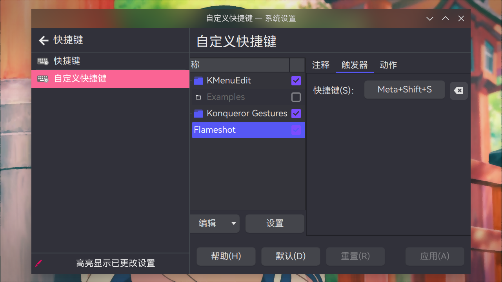
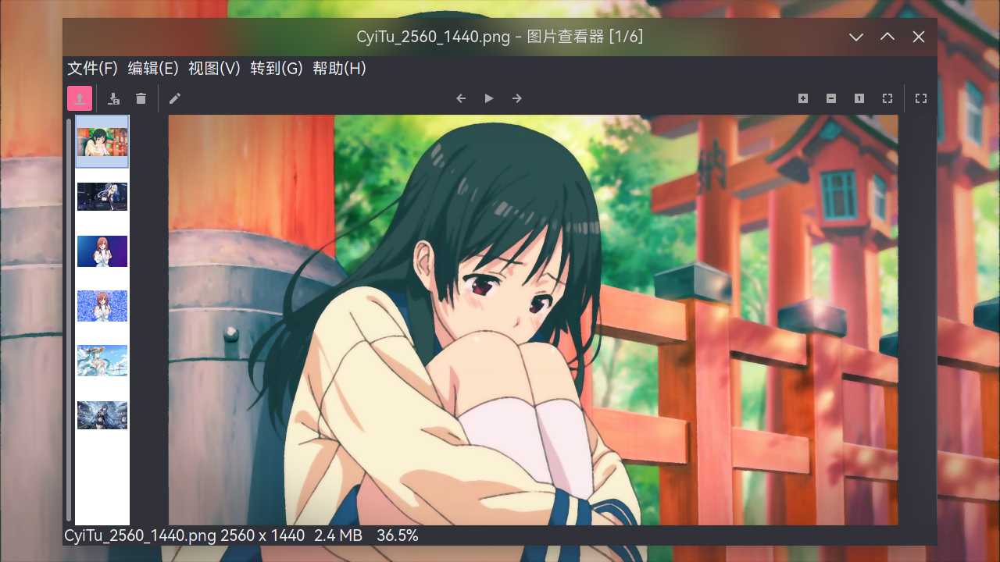
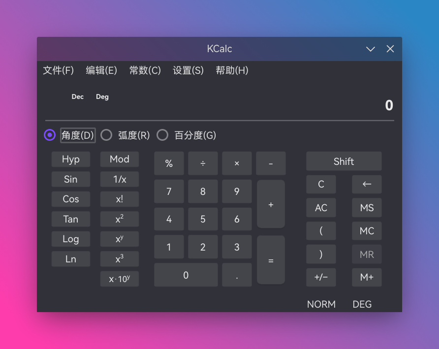

# 常用软件

> ### 🌼 采菊东篱下，悠然见南山
>
> 本小节讨论日常常用的软件，包括浏览器、电子书阅读器、截图工具、网盘、图片查看器等等

> ### 🔖 这一节将会讨论：
>
> ::: details 目录
>
> [[toc]]
>
> :::

::: tip ℹ️ 提示

指南中带有 <sup>aur</sup> 角标的软件代表是在 [AUR](https://aur.archlinux.org/)（Arch User Repository）中用户自行打包的软件。不在 arch 官方支持范围内，可能会出现各种问题如更新不及时、无法安装、使用出错等。

指南中带有 <sup>cn</sup> 角标的软件代表是在 [archlinuxcn](https://www.archlinuxcn.org/archlinux-cn-repo-and-mirror/)（Arch Linux 中文社区仓库）中用户自行打包的软件。不在 arch 官方支持范围内，可能会出现各种问题如更新不及时、无法安装、使用出错等。

指南中带有 <sup>EULA</sup> 角标的软件代表是 [专有软件](https://www.gnu.org/proprietary/proprietary.html)。请自行斟酌是否使用。

:::

## 🏄🏻 网页浏览器

### Mozilla Firefox

::: tip ℹ️ 提示

在步骤 [6. 安装基础功能包](../../guide/rookie/desktop-env-and-app.md#_6-安装基础功能包) 中若已安装，则无需重复安装。

:::

火狐浏览器（Mozilla Firefox）是一个自由开源的网页浏览器，由 [Mozilla 基金会](https://foundation.mozilla.org/) 及其非营利子公司 [Mozilla 公司](https://www.mozilla.org/zh-CN/about/) 开发。

安装 [Firefox 浏览器](https://archlinux.org/packages/extra/x86_64/firefox/)：

```sh
sudo pacman -S firefox
```

同时还有 [Firefox 浏览器开发者版](https://www.mozilla.org/zh-CN/firefox/developer/)，使用此版本可获得最新功能、高速性能，以及打造开放 Web 所需的开发工具：

```sh
sudo pacman -S firefox-developer-edition
```


### Chromium

::: tip ℹ️ 提示

在步骤 [6. 安装基础功能包](../../guide/rookie/desktop-env-and-app.md#_6-安装基础功能包) 中若已安装，则无需重复安装。

:::

[Chromium](https://www.chromium.org/) 是 Google 为发展浏览器 Google Chrome 而发布的免费开源软件项目，以 [BSD 许可协议](https://chromium.googlesource.com/chromium/src/+/refs/heads/main/LICENSE) 等数种许可发行并开源。Chromium 与 Google Chrome 共享大部分代码和功能。

安装 [Chromium](https://archlinux.org/packages/extra/x86_64/chromium/)：

```sh
sudo pacman -S chromium
```


::: tip ℹ️ 提示

Chromium 已不支持登录谷歌帐号进行同步。若有需要请使用 [Google Chrome](daily.md#google-chrome)。

:::

### Brave

Brave 是一个基于 Chromium 网页浏览器及其 Blink 排版引擎的自由开源的网页浏览器，由 Mozilla 项目的联合创始人、JavaScript 的创造者布兰登·艾克宣布。它宣称阻止网站跟踪器和移除侵入式网络广告。该浏览器也宣称通过与广告客户分享更少数据来改善网络隐私。

安装 [Brave](https://archlinux.org/packages/extra/x86_64/falkon/)<sup>cn / aur</sup>：

::: code-group

```sh [cn]
sudo pacman -S brave-bin
```

```sh [aur]
yay -S aur/brave-bin
```

```sh [aur (git)]
yay -S brave-git
```

:::


### Falkon

Falkon 是 KDE 开发的一款全新的 Qt 网络浏览器。它是一款轻量级的跨平台浏览器。这个项目当初仅仅作为教育项目。但是从一开始，Falkon 就成长为一款功能丰富的浏览器。

安装 [Falkon](https://archlinux.org/packages/extra/x86_64/falkon/)<sup>extra / aur</sup>：

::: code-group

```sh [extra]
sudo pacman -S falkon
```

```sh [aur (git)]
yay -S falkon-git
```

:::


### Tor 浏览器

[Tor 浏览器](https://www.torproject.org/zh-CN/) 是实现匿名通信的自由软件。其名源于“The Onion Router”（洋葱路由器）的英语缩写。用户可透过 Tor 浏览器接达由全球志愿者免费提供，包含 6000+ 个中继的覆盖网络，从而达至隐藏用户真实地址、避免网络监控及流量分析的目的。Tor 浏览器用户的互联网活动（包括浏览在线网站、帖子以及即时消息等通信形式）**相对**较难追踪。Tor 的设计原意在于保障用户的个人隐私，以及不受监控地进行秘密通信的自由和能力。

安装 [Tor 浏览器](https://aur.archlinux.org/packages/tor-browser/)<sup>cn / aur</sup>：

::: code-group

```sh [cn]
sudo pacman -S tor-browser
```

```sh [aur]
yay -S tor-browser
```

:::


### Mircrosoft Edge

Microsoft Edge（微软前沿浏览器）是一个由微软研发的浏览器，于 2015 年 1 月 21 日公布，2015 年 3 月 30 日公开发布第一个预览版。

安装 [Microsoft Edge](https://aur.archlinux.org/packages/microsoft-edge-stable-bin)<sup>EULA / aur</sup>：

::: code-group

```sh [aur（beta）]
yay -S microsoft-edge-beta-bin
```

```sh [aur（dev）]
yay -S microsoft-edge-dev-bin
```

:::


### Google Chrome

Google Chrome 是由 Google 开发的免费网页浏览器。Chrome 相应的开放源代码计划名为 Chromium，而 Google Chrome 本身是专有软件，未开放全部源代码。

安装 [Google Chrome](https://aur.archlinux.org/packages/google-chrome/)<sup>EULA / cn / aur</sup>：

::: code-group

```sh [cn]
sudo pacman -S google-chrome
```

```sh [aur]
yay -S google-chrome
```

:::


### Opera

Opera 是由 Opera 软件公司为个人电脑推出的网页浏览器。

Opera 软件公司为纳斯达克上市的挪威软件公司，现在已被中国商人周亚辉联合 [奇虎 360](https://www.360.cn/) 收购。

安装 [Opera](https://archlinux.org/packages/extra/x86_64/opera/)<sup>EULA / community / cn / aur</sup>：

::: code-group

```sh [extra]
sudo pacman -S opera
```

```sh [cn（beta）]
sudo pacman -S opera-beta
```

```sh [aur（beta）]
yay -S aur/opera-beta
```

:::


### Vivaldi

‎Vivaldi‎‎ 是韦瓦第技术（Vivaldi Technologies）公司开发的网页浏览器 ‎‎。由创始人谭咏文（前 ‎‎Opera 软件公司的首席执行官、创始人）与富田龙起（Tatsuki Tomita，前 Opera 软件公司资深副总经理）在离开 Opera 公司后另起炉灶新创办的浏览器 ‎‎。 ‎

‎Vivaldi 追求「为我们的朋友而打造」，旨在为原先 Opera 的忠实用户，如高阶技术专家、重度的互联网用户，提供原 Presto Opera 的诸多专属功能，例如自订面板、笔记、分页群组、单键快捷键等等。

安装 [‎Vivaldi](https://archlinux.org/packages/extra/x86_64/vivaldi/)<sup>EULA</sup>：

```sh
sudo pacman -S vivaldi
```


## 📖 PDF 以及电子书阅读器

PDF 可以使用上述的网页浏览器进行查看，也可使用专门的阅读器。而一些特别的电子书格式（如 azw3）则只能使用专门的电子书阅读器。

### Okular

Okular 是 KDE 开发的一款功能丰富、轻巧快速的跨平台文档阅读器。可以使用它来阅读 PDF 文档、漫画电子书、Epub 电子书，浏览图像，显示 Markdown 文档等。

安装 [Okular](https://archlinux.org/packages/extra/x86_64/okular/)<sup>extra / aur</sup>：

::: code-group

```sh [extra]
sudo pacman -S okular
```

```sh [aur (git)]
yay -S okular-git
```

:::


### calibre

calibre 是一款功能强大且易于使用的电子书管理器。支持 epub、txt、azw3 等文件格式。

安装 [calibre](https://archlinux.org/packages/extra/x86_64/calibre/)<sup>extra / aur</sup>：

::: code-group

```sh [extra]
sudo pacman -S calibre
```

```sh [aur (git)]
yay -S calibre-git
```

:::


## 📷 截图工具

### 火焰截图

[火焰截图（Flameshot）](https://github.com/flameshot-org/flameshot) 是一款强大但简单易用的屏幕截图软件。截图后可以进行快捷的编辑。

::: details 视频指南（视频不清晰请前往哔哩哔哩观看）

<div
  style="
    position: relative;
    padding: 30% 45%;
    margin-top: 32px;
  "
>
  <iframe
    style="position: absolute; width: 100%; height: 100%; left: 0; top: 0"
    src="//player.bilibili.com/player.html?aid=417575346&bvid=BV1hV411H7Sf&cid=322832461&page=1&as_wide=1&high_quality=1&danmaku=1&autoplay=0"
    scrolling="no"
    border="0"
    frameborder="no"
    framespacing="0"
    allowfullscreen="true"
  ></iframe>
</div>

:::

1. 安装 [火焰截图](https://archlinux.org/packages/extra/x86_64/flameshot/)<sup>extra / cn / aur</sup>：

   ::: code-group

   ```sh [extra]
   sudo pacman -S flameshot
   ```

   ```sh [cn (git)]
   sudo pacman -S flameshot-git
   ```

   ```sh [aur (git)]
   yay -S aur/flameshot-git
   ```

   :::

2. 配置快捷键：

   1. 打开 `系统设置` > 点击侧栏 `快捷键` > `自定义快捷键`

   2. 点击 `编辑` > `新建` > `全局快捷键` > `命令/URL：`

   3. 点击选项卡 `触发器` > 将 `快捷键` 设置为自定义快捷键：

   

   4. 点击选项卡 `动作` > 将 `命令/URL：` 设置为 `flameshot gui`：

   

### Spectacle

Spectacle 是 KDE 开发的用于抓取桌面截图的简单应用程序。它可以抓取整个桌面、单个显示器、当前活动窗口、鼠标所在的窗口或是屏幕上的一块矩形区域的图像。截取的图像可被打印、发送到其它应用程序进行处理、或是直接保存下来。

相比火焰截图可以准确的抓取单个窗口，但编辑功能没有火焰截图强大。

安装 [Spectacle](https://archlinux.org/packages/extra/x86_64/spectacle/)<sup>extra / aur</sup>：

::: code-group

```sh [extra]
sudo pacman -S spectacle
```

```sh [aur (git)]
yay -S spectacle-git
```

:::


## 💾 网盘存储

带有客户端的网盘可以使用 [MEGA](https://mega.io/start)、[百度网盘](https://pan.baidu.com/) 以及 [坚果云](https://www.jianguoyun.com/)。其它网盘如 [Microsoft OneDrive](https://www.microsoft.com/zh-cn/microsoft-365/onedrive/online-cloud-storage)、[Google 云端硬盘](https://www.google.com/intl/zh-CN/drive/) 直接使用网页版即可。

### MEGA

MEGA 是 Mega Limited 公司推出的一款云存储服务。2013 年 1 月 19 日在新西兰上线，该服务供应商广泛宣传其隐私性，所有文件在上传之前进行本地加密，提供 20 GB 的免费存储空间，付费账户最高存储空间可达 16 TB。

1. 安装 [MEGA](https://aur.archlinux.org/packages/megasync)<sup>EULA / aur</sup>：

   ::: code-group

   ```sh [cn]
   sudo pacman -S megasync
   ```

   ```sh [aur]
   yay -S aur/megasync
   ```

   :::

2. 根据提示登录账户以及配置同步文件夹后即可：

   

::: tip ℹ️ 提示

虽然该服务供应商广泛宣传其隐私性，但是否将数据存储在其服务器仍需用户判断：

- `2015` —— 7 月 1 日，MEGA 创始人金·达康（Kim Dotcom）在技术网站 Slashdot 表示，他将不信任 MEGA 服务，并声称该公司已经受到因犯有欺诈罪被通缉的中国投资者闫永明（中国吉林通化快大茂人，1969 年 6 月 15 日出生，曾为通化金马药业集团有限公司董事长，因涉嫌职务侵占犯罪被吉林省通化市公安局立案，2001 年 11 月逃亡新西兰，2005 年 8 月 22 日由国际刑警组织发布红色通缉令）的恶意收购
- `2016`
  - 8 月 23 日，闫永明与新西兰法院达成和解，需缴纳 4285 万新西兰币的财产，包括 Mega 公司 18.8%的股份
  - 11 月 12 日，在中央反腐败协调小组国际追逃追赃工作办公室的统筹协调下，经中新两国执法部门密切合作，潜逃海外 15 年之久的闫永明回国投案自首
- `2017` —— 1 月 12 日，闫永明返回新西兰

:::

### 百度网盘

安装 [百度网盘](https://aur.archlinux.org/packages/baidunetdisk-bin/)<sup>EULA / aur</sup>：

```sh
yay -S baidunetdisk-bin
```


### 坚果云

坚果云通过文件自动同步、共享、备份功能，为用户实现智能文件管理，提供高效办公解决方案。

坚果云是微软加速器云存储合作伙伴，IBM 全球创业企业扶持计划成员，安全稳定的服务着数百万企业用户，包括东风雷诺、郑州日产、上海通用、银河证券、中石油、中海油、阿里巴巴等大型企事业单位。

1. 安装 [坚果云实验版](https://aur.archlinux.org/packages/nutstore-experimental/)<sup>EULA / aur</sup>：

   ```sh
   yay -S nutstore-experimental
   ```

   ::: tip ℹ️ 提示

   [坚果云稳定版](https://aur.archlinux.org/packages/nutstore/)<sup>EULA / cn / aur</sup> 的界面存在问题，请使用坚果云实验版<sup>EULA / aur</sup>。

   :::

2. 类似 [MEGA](daily.md#mega)，根据提示登录账户以及配置同步文件夹后即可

## 🖼️ 图像查看器

除了 Gwenview，还有其它开源免费的优秀图片浏览器可供选择。

### Gwenview

::: tip ℹ️ 提示

在步骤 [6. 安装基础功能包](../../guide/rookie/desktop-env-and-app.md#_6-安装基础功能包) 中若已安装，则无需重复安装。

:::

Gwenview 是 KDE 出品的一款轻便易用的图像查看器，是浏览、显示多张图像时的理想工具。

安装 [Gwenview](https://archlinux.org/packages/extra/x86_64/gwenview/)<sup>extra / aur</sup>：

::: code-group

```sh [extra]
sudo pacman -S gwenview
```

```sh [aur (git)]
yay -S gwenview-git
```

:::


### nomacs

nomacs 是一个免费的开源图像查看器，支持多平台。可以使用它来查看所有常见的图像格式，包括 RAW 和 psd 图像。

安装 [nomacs](https://archlinux.org/packages/extra/x86_64/nomacs/)<sup>extra / aur</sup>：

::: code-group

```sh [extra]
sudo pacman -S nomacs
```

```sh [aur (git)]
yay -S nomacs-git
```

:::


::: tip ℹ️ 提示

可能需要在菜单栏 `编辑` > `设置` > 侧边栏 `一般` > `颜色设置` 中改变颜色以适应暗色模式：


:::

### Ristretto

Xfce 开发的图像查看器。相对来说更加简洁。

安装 [Ristretto](https://archlinux.org/packages/extra/x86_64/ristretto/)：

```sh
sudo pacman -S ristretto
```



### feh

> 🔗 相关链接：
>
> - [ArchWiki 相关内容](<https://wiki.archlinux.org/title/Feh_(%E7%AE%80%E4%BD%93%E4%B8%AD%E6%96%87)>)

feh 是一款轻巧而功能强大的图像查看器，通过命令行操作，**还可用于管理缺少此类功能的独立窗口管理器的桌面壁纸**。

1. 安装 [feh](https://archlinux.org/packages/extra/x86_64/feh/)<sup>extra / aur</sup>。若需要读取 SVG 图像，则还需要安装 [`imagemagick`](https://archlinux.org/packages/extra/x86_64/imagemagick/)：

   ::: code-group

   ```sh [extra]
   sudo pacman -S feh imagemagick

   ```

   ```sh [aur (git)]
   yay -S feh-git imagemagick
   ```

   :::

2. 通过以下命令使用 feh。feh 是高度可配置的。有关选项的完整列表，请运行 `feh --help` 或 `man feh`：

   ```sh
   feh /path/of/pic # 查看图像
   feh --conversion-timeout 1 /path/of/svg # 查看 SVG 图像
   ```

### XnView MP

XnView MP 是一个免费的图像查看器，可以轻松打开和编辑照片文件。图像查看器支持所有主要图像格式（JPEG、TIFF、PNG、GIF、WEBP、PSD、JPEG2000、OpenEXR、camera RAW、HEIC、PDF、DNG、CR2）。

作为图像查看器，拥有诸如颜色调整、图像大小调整、裁剪、屏幕捕获、元数据编辑（IPTC、XMP）等功能。XnView MP 具有易于使用的类似浏览器的界面，允许您快速查看图像和照片，还可以进行图像管理。并且有批重命名、批转换器、重复图像查找、图像比较等功能，还可以创建联系表、幻灯片。

安装 [`XnView MP`](https://aur.archlinux.org/packages/xnviewmp)<sup>EULA / aur</sup>：

```sh
yay -S xnviewmp
```


## 🧰 实用工具

日常用到的各类小工具有很多实现，其中 [KDE 的套件](https://apps.kde.org/zh-cn/) 中就有很多，可以自行查询。

此处仅列出几个常用的小工具。

- [KCalc](https://archlinux.org/packages/extra/x86_64/kcalc/) —— 科学计算器

  ```sh
  sudo pacman -S kcalc
  ```

  

- [Kamoso](https://archlinux.org/packages/extra/x86_64/kamoso/) —— 相机

  ```sh
  sudo pacman -S kamoso
  ```

  

- [KTimer](https://archlinux.org/packages/extra/x86_64/ktimer/) —— 倒计时执行器

  ```sh
  sudo pacman -S ktimer
  ```

  

## 🍷 Wine

> 🔗 相关链接：
>
> - [ArchWiki 相关内容](<https://wiki.archlinux.org/title/Wine_(%E7%AE%80%E4%BD%93%E4%B8%AD%E6%96%87)>)
> - [WineWiki](https://wiki.winehq.org/%E4%B8%BB%E9%A1%B5)

Wine 是类 UNIX 系统下运行 Windows 程序的“兼容层”，是正在持续开发中的自由软件。在 Wine 中运行的 Windows 程序，就如同运行原生 Linux 程序一样，不会有模拟器那样的严重性能问题。

::: warning ⚠️ 注意

Wine 不是沙箱。如果很重视安全，请使用虚拟机。

:::

1. 安装 [Wine](https://archlinux.org/packages/multilib/x86_64/wine/) 以及其它相关依赖：

   ```sh
   sudo pacman -S wine wine-mono wine_gecko wine-staging giflib lib32-giflib libpng lib32-libpng libldap lib32-libldap gnutls lib32-gnutls \
   mpg123 lib32-mpg123 openal lib32-openal v4l-utils lib32-v4l-utils libpulse lib32-libpulse libgpg-error \
   lib32-libgpg-error alsa-plugins lib32-alsa-plugins alsa-lib lib32-alsa-lib libjpeg-turbo lib32-libjpeg-turbo \
   sqlite lib32-sqlite libxcomposite lib32-libxcomposite libxinerama lib32-libgcrypt libgcrypt lib32-libxinerama \
   ncurses lib32-ncurses opencl-icd-loader lib32-opencl-icd-loader libxslt lib32-libxslt libva lib32-libva gtk3 \
   lib32-gtk3 gst-plugins-base-libs lib32-gst-plugins-base-libs vulkan-icd-loader lib32-vulkan-icd-loader
   ```

2. 通过以下命令配置 `Wine`。随后会弹出一个窗口，可对 Wine 进行配置。Wine 默认路径为 ~/.wine：

   ```sh
   winecfg
   ```

3. 通过以下命令运行简单的 Windows 应用：

   ```sh
   wine /path/of/xxx.exe
   ```

   

   ::: danger ☢️ 警告

   千万**不要**以 root 身份运行 Wine！

   :::

::: tip ℹ️ 提示

有关解决 Wine 字体显示异常请参考 [安装 Windows 字体](../../guide/advanced/optional-cfg-1.md#安装-windows-字体)。

:::
