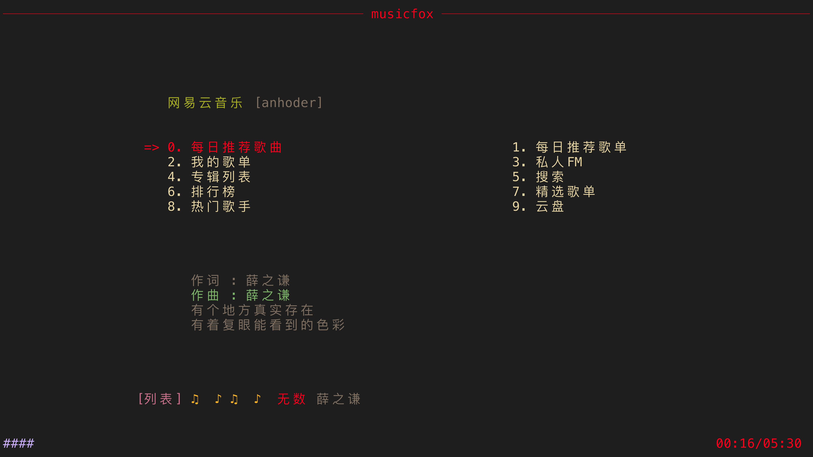

# 视频影音

> ### 🍵 采菊东篱下，悠然见南山
>
> 本小节讨论在 archlinux 上观看视频，聆听音乐等相关信息。

> ### 🔖 这一节将会讨论：
>
> ::: details 目录
>
> [[toc]]
>
> :::

::: tip ℹ️ 提示

指南中带有 <sup>aur</sup> 角标的软件代表是在 [AUR](https://aur.archlinux.org/)（Arch User Repository）中用户自行打包的软件。不在 arch 官方支持范围内，可能会出现各种问题如更新不及时、无法安装、使用出错等。

指南中带有 <sup>cn</sup> 角标的软件代表是在 [archlinuxcn](https://www.archlinuxcn.org/archlinux-cn-repo-and-mirror/)（Arch Linux 中文社区仓库）中用户自行打包的软件。不在 arch 官方支持范围内，可能会出现各种问题如更新不及时、无法安装、使用出错等。

指南中带有 <sup>EULA</sup> 角标的软件代表是 [专有软件](https://www.gnu.org/proprietary/proprietary.html)。请自行斟酌是否使用。

:::

## 🎬 音视频播放器

本地音视频播放一般使用 VLC 或 MPV，但也有很多其它优秀的开源音视频播放器。

### VLC

[VLC](https://www.videolan.org/vlc/) 是一款自由开源的跨平台多媒体播放器及框架，可播放大多数多媒体文件，以及 DVD、音频 CD、VCD 及各类流媒体协议。

安装 [`VLC`](https://archlinux.org/packages/extra/x86_64/vlc/)<sup>extra / cn / aur</sup>：

::: code-group

```sh [extra]
sudo pacman -S vlc
```

```sh [cn (git)]
sudo pacman -S vlc-git
```

```sh [aur（obs）]
yay -S vlc-luajit
```

```sh [aur (git)]
yay -S aur/vlc-git
```

:::


### mpv

[mpv](https://mpv.io/) 是一个自由免费的媒体播放器。它支持多种媒体文件格式、音频和视频编解码器以及字幕类型。相比 VLC 更加简洁。

安装 [`mpv`](https://archlinux.org/packages/extra/x86_64/mpv/)<sup>extra / cn / aur</sup>：

::: code-group

```sh [extra]
sudo pacman -S mpv
```

```sh [cn (git)]
sudo pacman -S mpv-git
```

```sh [aur (git)]
yay -S aur/mpv-git
```

:::


### Dragon Player

Dragon Player 是 KDE 开发的一个相比于功能来说更注重简洁的多媒体播放器。Dragon Player 做且只做一件事，就是播放多媒体文件。界面简单、减少干扰、立即播放文件。

安装 [`Dragon Player`](https://archlinux.org/packages/extra/x86_64/dragon/)：

```sh
sudo pacman -S dragon
```


### SMplayer

[SMPlayer](https://www.smplayer.info/) 是个适用于 Windows 和 Linux 的自由免费的媒体播放器，内置解码器，可以播放几乎所有格式的视频和音频文件。无需再安装任何外部解码器。只要安装了 SMPlayer，就能够播放所有的格式，不用再费事查找安装解码包。

1. 安装 [`SMplayer`](https://archlinux.org/packages/extra/x86_64/smplayer/)<sup>extra / cn / aur</sup>：

   ::: code-group

   ```sh [extra]
   sudo pacman -S smplayer
   ```

   ```sh [aur（svn）]
   yay -S smplayer-svn
   ```

   :::

2. 默认的外观不太美观，可选安装皮肤 [`papirus-smplayer-theme-git`](https://github.com/PapirusDevelopmentTeam/papirus-smplayer-theme)<sup>aur</sup>：

   ```sh
   yay -S papirus-smplayer-theme-git
   ```

3. 在设置中调整为下图即可：

   


### parole

Xfce 开发的基于 GStreamer 框架的现代媒体播放器。

安装 [`parole`](https://archlinux.org/packages/extra/x86_64/parole/)：

```sh
sudo pacman -S parole
```


### ZY Player

如果想收看在线影视资源等等，[ZY Player](https://aur.archlinux.org/packages/zy-player-bin/) 是一个很好的选择。

ZY Player 是一个简洁、免费、无广告的跨平台视频资源播放器，整合全网资源，甚至可以观看 📺 IPTV（需自行配置直播源）。

安装 [`ZY Player`](https://github.com/cuiocean/ZY-Player)<sup>aur</sup>：

```sh
yay -S zy-player-bin
```


## 🎵 音乐播放器

本地音乐播放可以使用上述的音视频播放器，也可以使用 DeaDBeeF（Linux 下的 [foobar2000](https://www.foobar2000.org/)<sup>EULA</sup>）等播放器。

在线音乐收听可以使用官方的网易云音乐或企鹅的 QQ 音乐，但在 Linux 下体验不佳，且很久没有更新了。显然这些企业是不会愿意向 Linux 桌面投放精力的。推荐使用维护到位的自由开源软件，它们一般是资源整合类型的第三方客户端，曲库较为完整。

### DeaDBeeF

[DeaDBeeF](https://deadbeef.sourceforge.io/) 是一个自由开源（[GPLv2](https://www.gnu.org/licenses/old-licenses/gpl-2.0.html)）模块化的**无损**音频播放器，用于 GNU/Linux、\*BSD、OpenSolaris、macOS 和其它类 UNIX 系统。

DeaDBeeF 可以播放各种音频格式，在它们之间进行转换，以几乎任何想要的方式自定义 UI，并使用许多额外的插件来扩展它。

安装 [`deadbeef`](https://aur.archlinux.org/packages/deadbeef)<sup>cn / aur</sup>：

::: code-group

```sh [cn]
sudo pacman -S deadbeef
```

```sh [cn (git)]
sudo pacman -S deadbeef-git
```

```sh [aur]
yay -S aur/deadbeef
```

```sh [aur (git)]
yay -S aur/deadbeef-git
```

:::


::: tip ℹ️ 提示

若音乐无法正常播放，请将菜单栏 `编辑` > `偏好设置` > 标签页 `声音` > `输出插件` 改为其它选项：


:::

### Juk

JuK 是 KDE 开发的一款音乐播放器和管理程序，支持 MP3、Ogg Vorbis 和 FLAC 等音频文件。它侧重于音乐管理功能，可以用它编辑音频文件的标签、管理音乐和播放列表。

安装 [`juk`](https://archlinux.org/packages/extra/x86_64/juk/)：

```sh
sudo pacman -S juk
```


### YesPlayMusic（推荐）

高颜值的第三方网易云播放器，显著的优点包括但不限于：

- ☑️ 使用 Vue.js 全家桶开发
- 🔴 网易云账号登录（扫码/手机/邮箱登录）
- 📺 支持 MV 播放
- 📃 支持歌词显示
- 📻 支持私人 FM / 每日推荐歌曲
- 🚫🤝 无任何社交功能
- 🌎 海外用户可直接播放（需要登录网易云账号）

安装 [`YesPlayMusic`](https://github.com/qier222/YesPlayMusic)<sup>aur</sup>：

```sh
yay -S yesplaymusic
```


### go-musicfox

go-musicfox 是用 Go 写的又一款网易云音乐命令行客户端，支持各种音质级别、UnblockNeteaseMusic、Last.fm、MPRIS 和 macOS 交互响应（睡眠暂停、蓝牙耳机连接断开响应和菜单栏控制等）等功能特性。

安装 [`go-musicfox`](https://github.com/go-musicfox/go-musicfox)<sup>aur/cn</sup>：

```sh
yay -S go-musicfox
```

安装完之后通过 `musicfox` 命令启动，快捷键可参考[官方 Readme](https://github.com/go-musicfox/go-musicfox/blob/master/README.md#%E5%BF%AB%E6%8D%B7%E9%94%AE)。



### Listen 1（推荐）

Listen 1 作为“老牌”的听歌软件可以搜索和播放来自网易云音乐、虾米、QQ 音乐、酷狗音乐、酷我音乐、Bilibili、咪咕音乐网站的歌曲，让你的曲库更全面。

安装 [`Listen 1`](https://aur.archlinux.org/packages/listen1-desktop-appimage/)<sup>aur</sup>：

```bash
yay -S listen1-desktop-appimage
```


### 网易云音乐

不推荐使用，建议使用上述第三方客户端。

网易和深度合作开发的客户端。已经很久没更新了，无法输入中文并且缩放有问题。

安装 [`netease-cloud-music`](https://aur.archlinux.org/packages/netease-cloud-music/)<sup>EULA / cn / aur</sup>：

::: code-group

```sh [cn]
sudo pacman -S netease-cloud-music
```

```sh [aur]
yay -S aur/netease-cloud-music
```

:::


### QQ 音乐

不推荐使用，建议使用上述第三方客户端。

基于 `deepin-wine5` 的 QQ 音乐 [`com.qq.music.deepin`](https://aur.archlinux.org/packages/com.qq.music.deepin/)<sup>EULA / aur</sup> 已无法下载，只能用官方的原生 QQ 音乐：

安装 [`qqmusic-bin`](https://aur.archlinux.org/packages/qqmusic-bin/)<sup>aur</sup>：

```sh
yay -S qqmusic-bin
```


