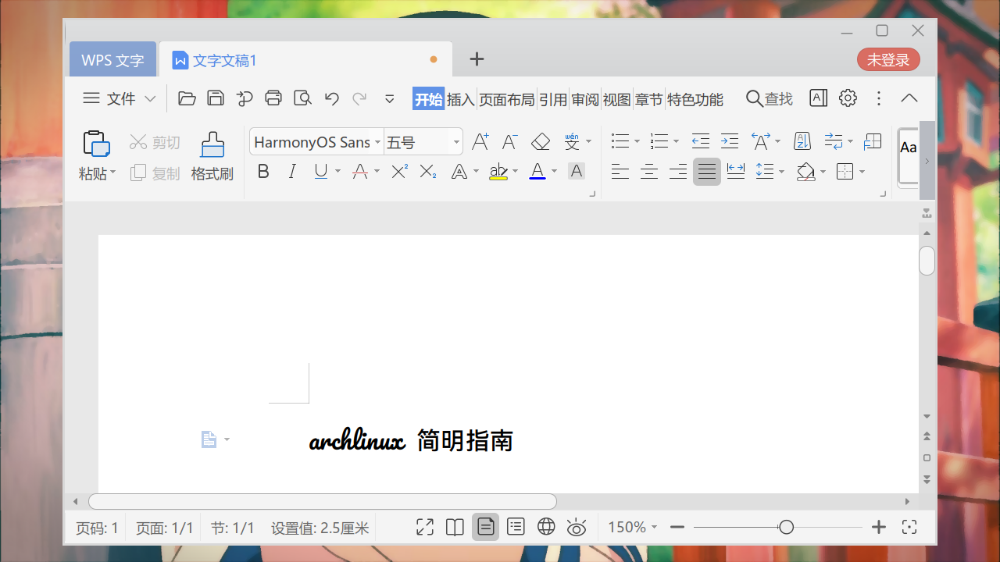
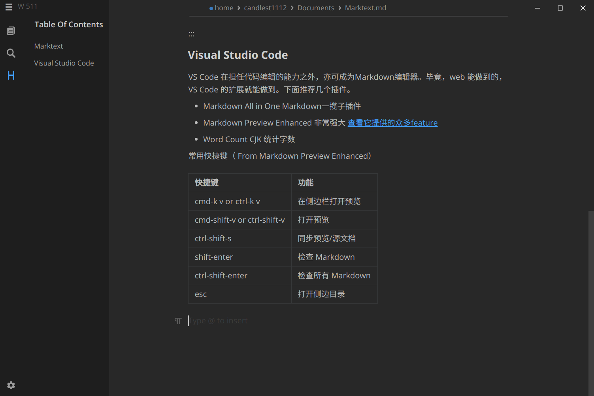
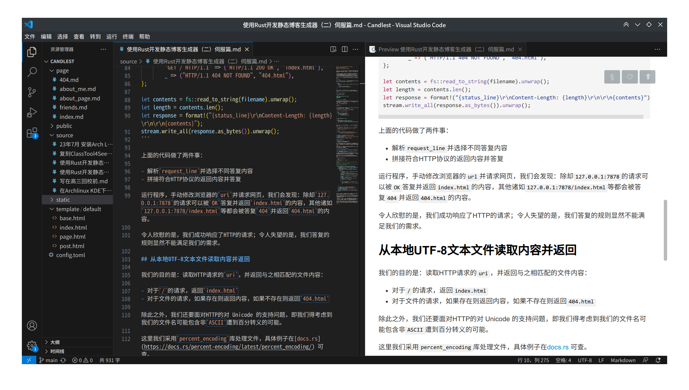
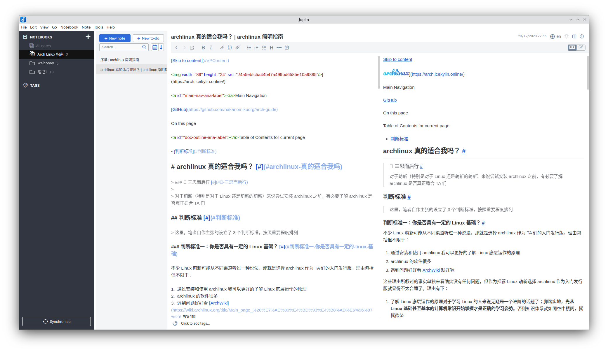

# 办公软件

> ### ⏳ 莫等闲，白了少年头，空悲切！
>
> 本小节讨论工作上常用的软件，包括办公套件、Markdown 编辑器以及团队合作软件等。

> ### 🔖 这一节将会讨论：
>
> ::: details 目录
>
> [[toc]]
>
> :::

::: tip ℹ️ 提示

指南中带有 <sup>aur</sup> 角标的软件代表是在 [AUR](https://aur.archlinux.org/)（Arch User Repository）中用户自行打包的软件。不在 arch 官方支持范围内，可能会出现各种问题如更新不及时、无法安装、使用出错等。

指南中带有 <sup>cn</sup> 角标的软件代表是在 [archlinuxcn](https://www.archlinuxcn.org/archlinux-cn-repo-and-mirror/)（Arch Linux 中文社区仓库）中用户自行打包的软件。不在 arch 官方支持范围内，可能会出现各种问题如更新不及时、无法安装、使用出错等。

指南中带有 <sup>EULA</sup> 角标的软件代表是 [专有软件](https://www.gnu.org/proprietary/proprietary.html)。请自行斟酌是否使用。

:::

## 办公套件

办公套件可选国内常用的 WPS Office 以及自由开放的 LibreOffice。

### WPS Office

[WPS Office](https://www.wps.cn/) 是由 [金山软件](https://www.kingsoft.com/) 发布的一款办公软件，用于办公软件最常用的文字编辑、电子表格、演示文稿等功能。

安装 WPS Office（可选 [国内版](https://aur.archlinux.org/packages/wps-office-cn/)<sup>EULA / aur</sup> 或 [国际版](https://aur.archlinux.org/packages/wps-office/)<sup>EULA / aur</sup>）以及 [相关字体](https://aur.archlinux.org/packages/ttf-wps-fonts/)<sup>EULA / cn / aur</sup>：

::: code-group

```sh [cn (cn)]
yay -S wps-office-cn wps-office-mui-zh-cn ttf-wps-fonts freetype2-wps
```

```sh [cn]
sudo pacman -S wps-office ttf-wps-fonts libtiff5
```

```sh [aur (cn)]
yay -S wps-office-cn aur/ttf-wps-fonts aur/wps-office-mui-zh-cn aur/freetype2-wps
```

```sh [aur]
sudo pacman -S wps-office aur/ttf-wps-fonts aur/libtiff5
```

:::



::: tip ℹ️ 提示

WPS可能会出现部分中文字体过粗的情况。文本看起来特别粗，标题、粗体文本几乎不可用。

可以通过降级`freetype2`至2.13.0版本解决

:::

> 🔗 相关链接：
>
> - [ArchWiki 相关内容](<https://wiki.archlinux.org/title/WPS_Office_(%E7%AE%80%E4%BD%93%E4%B8%AD%E6%96%87)>)

### LibreOffice

[LibreOffice](https://zh-cn.libreoffice.org/) 是由 [文档基金会](https://www.documentfoundation.org/) 开发的自由及开放源代码的办公室套件。LibreOffice 是一款功能强大的办公软件，默认使用 ODF 开放文档格式（OpenDocument Format），并支持 \*.docx、\*.xlsx、\*.pptx 等其它格式。

它包含了 Writer、Calc、Impres、Draw、Base 以及 Math 等组件，可用于处理文本文档、电子表格、演示文稿、绘图、数据库管理以及公式编辑。

安装 [LibreOffice](https://archlinux.org/packages/extra/x86_64/libreoffice-still/) 以及 [其中文语言包](https://archlinux.org/packages/extra/any/libreoffice-still-zh-cn/)：

::: code-group

```sh [正式版]
sudo pacman -S libreoffice-still libreoffice-still-zh-cn
```

```sh [尝鲜版]
sudo pacman -S libreoffice-fresh libreoffice-fresh-zh-cn
```

:::


::: tip ℹ️ 提示

可能需要在菜单栏 `工具` > `选项` > `视图` 中调整 `图标样式` 以适应暗色模式：


:::

> 🔗 相关链接：
>
> - [ArchWiki 相关内容](<https://wiki.archlinux.org/title/LibreOffice_(%E7%AE%80%E4%BD%93%E4%B8%AD%E6%96%87)>)

### Foxit PDF Reader

[Foxit PDF Reader](https://www.foxitsoftware.com/products/pdf-reader/)<sup>EULA / aur</sup>是福建福昕软件开发股份有限公司推出的一款轻量级 PDF 编辑器，是目前笔者在 Linux 平台下使用过免费且最好用的 PDF 编辑器。Foxit PDF Reader 提供常规的 PDF 注释功能：段落高亮、区域高亮、下划线、波浪线、图形、删除线和备注等标记，也提供许多其他平台付费 PDF 编辑器提供的打字机、文本框、笔迹等轻量级 PDF 编辑。加载和保存 PDF 速度较 Libre Office Draw 快，打字机功能较 KDE Okular 支持非拉丁字符输入，是 PDF 笔记文档注释的好帮手。

安装[Foxit PDF Reader](https://aur.archlinux.org/packages/foxitreader/)<sup>EULA / aur</sup>:

```sh
yay -S foxitreader
```


## Markdown 编辑器

### Typora

[Typora](https://typora.io/) 是一款由 Abner Lee（上海人）开发的轻量级 Markdown 编辑器。

Typora 没有采用源代码和预览双栏显示的方式，而是采用所见即所得的编辑方式，实现了即时预览的功能，但也可切换至源代码编辑模式。在编辑时，除了通过传统的 Markdown 代码的方式来实现富文本之外，Typora 支持通过菜单栏或者鼠标右键选取命令的方式来实现富文本，也支持通过快捷键的方式插入。Typora 也支持通过以 TeX 的格式来插入行间公式和行内公式。在完成编辑后导出文件时，Typora 支持以 PDF 或 Html 的形式导出，如果安装了 Pandoc，也能够以 Word、RTF、MediaWiki、LaTeX 等形式导出。

安装 [Typora](https://aur.archlinux.org/packages/typora/)<sup>EULA / cn / aur</sup> 以及 [Pandoc](https://archlinux.org/packages/extra/x86_64/pandoc/)：

::: code-group

```sh [cn]
sudo pacman -S typora pandoc
```

```sh [aur]
yay -S aur/typora pandoc
```

:::

值得注意的是，目前 typora 软件已经开始收费。如果有能力购买的话可以进行购买。对于囊中羞涩的学生党或其他不愿购买的用户，我们可以选择使用 typora 的最后一个免费版本（注意：不是盗版），安装方式如下：

```sh
yay -S typora-free
```


### VNote

[VNote](https://vnotex.github.io/vnote/zh_cn/#!index.md) 是一款跨平台开源自由的 Markdown 笔记软件。VNote 的目标是做一个带有舒适 Markdown 编辑体验的笔记软件，或者带有强大文件管理功能的 Markdown 编辑器。

VNote 借鉴了程序员日常使用的代码编辑器的很多优点，特别是 Vim 的很多优秀思想，尽力成为一款更懂程序员和 Markdown 的笔记软件。

Markdown 有着天生的编辑和阅读的割裂感。当前主流的处理方式主要有三种：

- 单纯按纯文本处理，代表软件是为知笔记，其缺点是只有黑压压的文字
- 双边实时预览，左侧编辑模式，右侧实时预览阅读效果，代表软件就很多了，其缺点是仍然割裂，而且浪费空间。现在如果一个软件还采用双边实时预览来编辑 Markdown，那基本是拿不出手了
- 类富文本实时渲染模式，代表软件是 Typora，其缺点是矫枉过正，和 Markdown 的设计理念背道而驰

VNote 采用的是一种折中的方案——语法高亮和原地预览。通过精心的语法高亮以及图片原地预览，希望能在保证 Markdown 简洁的前提下，尽可能帮助用户掌握文章信息和脉络。

安装 [VNote](https://aur.archlinux.org/packages/vnote3-git/)<sup>aur</sup>：

```sh
yay -S vnote3-git
```


### Marktext



[Marktext](https://github.com/marktext/marktext) 是一个简单而优雅的开源 Markdown 编辑器，专注于速度和可用性，使用 **MIT License** 开源。和 Typora 一样，Marktext 亦是 Electron 应用，目前在 Github 上有 40k+ Stars 。

Marktext 常常被人视作 Typora 的替代品。事实上，论易用性， Marktext 在追赶 Typora 的过程上还有很长的一段路要走。

> 摘自 README ：
>
> 如上所述，**MarkText**是完全免费和开源的，并且将永远开源。我们希望所有 Markdown 爱好者贡献自己的代码，帮助将**MarkText**开发成流行的 Markdown 编辑器。
>
> Markdown 编辑器有很多，并且都有各自的优点，有些具有其他功能而没有的功能。满足每个 Markdown 用户的需求是很困难的，但我们希望**MarkText**能够尽可能满足每个 Markdown 用户。虽然最新的**MarkText**还不够完美，但我们会尽力做到最好。

在 AUR 中，有四个关于 Marktext 的包： `marktext`, `marktext-bin`, `marktext-git`  和  `marktext-appimage` 。

为了减少维护成本，同时尽量避免 appimage 对性能的影响，我们从 AUR 安装 marktext -bin：

```bash
yay -S marktext-bin
```

::: tip ℹ️ 提示

marktext-git 在 `archlinuxcn` 提供，但是其所依赖的 electron17 需要自行从 AUR 安装。

```bash
yay -S electron17 #或者是 electron17-bin
sudo pacman -S marktext-git
```

:::

### Visual Studio Code



VS Code 在担任代码编辑的能力之外，亦可成为 Markdown 编辑器。毕竟，web 能做到的，VS Code 的扩展就能做到。下面推荐几个插件。

- Markdown All in One Markdown 一揽子插件

- Markdown Preview Enhanced 非常强大 [查看它提供的众多 feature](https://shd101wyy.github.io/markdown-preview-enhanced/#/zh-cn/)

- Word Count CJK 统计字数

常用快捷键（ From Markdown Preview Enhanced）

| 快捷键                      | 功能              |
| --------------------------- | ----------------- |
| cmd-k v or ctrl-k v         | 在侧边栏打开预览  |
| cmd-shift-v or ctrl-shift-v | 打开预览          |
| ctrl-shift-s                | 同步预览/源文档   |
| shift-enter                 | 检查 Markdown     |
| ctrl-shift-enter            | 检查所有 Markdown |
| esc                         | 打开侧边目录      |

### Joplin

[Joplin](https://joplinapp.org/) 是一款免费、开源的笔记和待办事项应用程序，可以处理大量整理到笔记本中的笔记。笔记可以搜索，可以直接从应用程序或从自己的文本编辑器中复制、标记和修改。

笔记支持“端到端”的数据加密 (需要手动开启)，可以与各种目标同步，包括文件系统（例如网络目录）、Nextcloud、Dropbox、OneDrive 或 WebDAV。同步笔记时，笔记本、标签和其他元数据都会保存到纯文本文件中，便于检查、备份和移动。

Joplin 桌面客户端支持插件拓展，在 [Firefox](https://addons.mozilla.org/firefox/addon/joplin-web-clipper/) 和 [Chrome](https://chrome.google.com/webstore/detail/joplin-web-clipper/alofnhikmmkdbbbgpnglcpdollgjjfek) 浏览器也有 Web Clipper 可用于保存网页和浏览器截图。

安装 [Joplin](https://aur.archlinux.org/packages/joplin-desktop/)<sup>aur</sup>：

```sh
sudo pacman -S joplin-desktop
```



::: tip ℹ️ 提示

[Joplin](https://aur.archlinux.org/packages/joplin/) 也提供了 cli 版本,需要搭配终端文本编辑器使用。

详情请参阅[官方文档](https://joplinapp.org/help/apps/terminal)

```sh
sudo pacman -S joplin
```

:::
