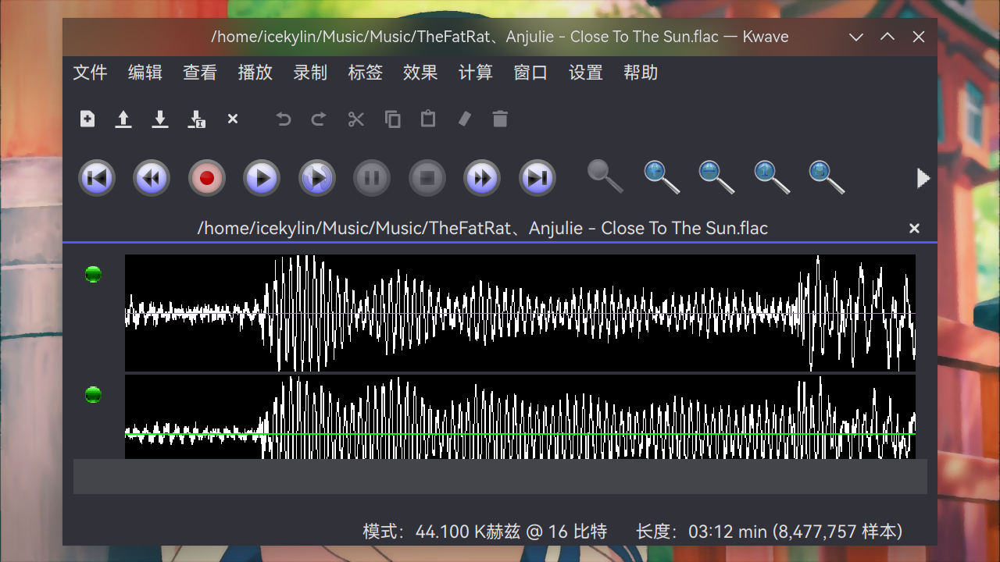
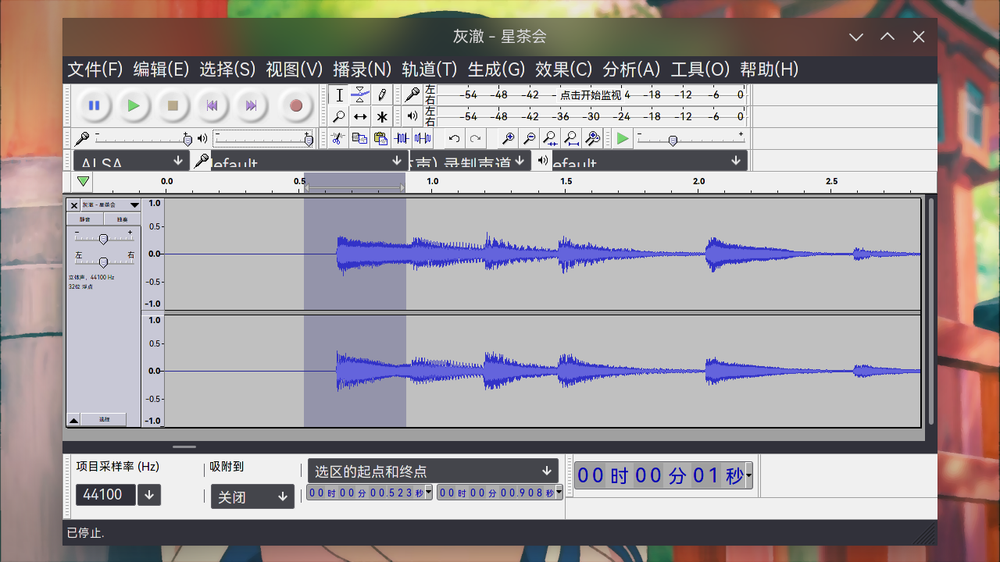
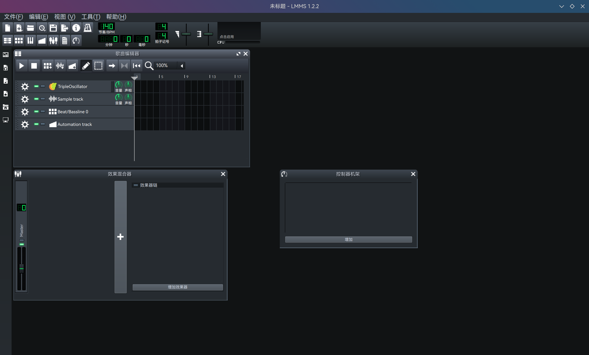

# 音频制作

> ### 🎵 此曲只应天上有，人间能得几回闻
>
> 本小节讨论如何在 archlinux 上制作音乐、编辑音频等信息。

> ### 🔖 这一节将会讨论：
>
> ::: details 目录
>
> [[toc]]
>
> :::

::: tip ℹ️ 提示

指南中带有 <sup>aur</sup> 角标的软件代表是在 [AUR](https://aur.archlinux.org/)（Arch User Repository）中用户自行打包的软件。不在 arch 官方支持范围内，可能会出现各种问题如更新不及时、无法安装、使用出错等。

指南中带有 <sup>cn</sup> 角标的软件代表是在 [archlinuxcn](https://www.archlinuxcn.org/archlinux-cn-repo-and-mirror/)（Arch Linux 中文社区仓库）中用户自行打包的软件。不在 arch 官方支持范围内，可能会出现各种问题如更新不及时、无法安装、使用出错等。

指南中带有 <sup>EULA</sup> 角标的软件代表是 [专有软件](https://www.gnu.org/proprietary/proprietary.html)。请自行斟酌是否使用。

:::

## 🎚️ 音频编辑

### Ardour

[Ardour](https://ardour.org/) 是一款自由开源的让你可以在 Linux 上录音、编辑和混音的软件。

安装 [Ardour](https://archlinux.org/packages/extra/x86_64/ardour/)<sup>extra / aur</sup>：

::: code-group

```sh [extra]
sudo pacman -S ardour
```

```sh [aur (git)]
yay -S ardour-git
```

:::


### Kwave

[Kwave](https://apps.kde.org/zh-cn/kwave/) 是 KDE 开发的一款自由开源的音频编辑软件，可以录制、播放、导入和编辑许多音频文件，包括多声道文件。

安装 [Kwave](https://archlinux.org/packages/extra/x86_64/kwave/)<sup>extra / aur</sup>：

::: code-group

```sh [extra]
sudo pacman -S kwave
```

```sh [aur (git)]
yay -S kwave-git
```

:::



### Audacity

[Audacity](https://www.audacityteam.org/) 是一款跨平台的自由开源音频编辑软件，用于录音和编辑音频。2021 年 4 月 30 日，Audacity 被 [Muse Group](https://mu.se/) 收购。

安装 [Audacity](https://archlinux.org/packages/extra/x86_64/audacity/)<sup>extra / aur</sup>：

::: code-group

```sh [extra]
sudo pacman -S audacity
```

```sh [aur (git)]
yay -S audacity-git
```

:::



::: tip ℹ️ 提示

Audacity 被 Muse Group 收购后，根据 [相关报道](https://fosspost.org/audacity-is-now-a-spyware/)，其隐私政策的变化显示该工具正在收集其用户的数据并与其它公司共享。

在各大开源社区中出现了许多愤怒的回应，[GitHub](https://github.com/audacity/audacity/issues/1213) 和 [Reddit](https://www.reddit.com/r/linux/comments/od3h8b/audacity_may_collect_data_necessary_for_law/) 上的用户纷纷呼吁尽快派生（Fork）该软件（已经有了）。

若对此有关切，可以使用派生的版本 [`audiocity-git`](https://aur.archlinux.org/packages/audiocity-git/)<sup>aur</sup>（功能没有改动）：

```sh
yay -S audiocity-git
```

或者 [audacium](https://aur.archlinux.org/packages/audacium-git/)<sup>aur</sup>（添加了新特性）：

```sh
yay -S audacium-git
```

:::

### VCV Rack

[VCV Rack](https://vcvrack.com/) 是一款开源可视化、模块化的音响合成器。

1. 安装 [VCV Rack](https://archlinux.org/packages/extra/x86_64/audacity/)<sup>aur</sup>：

   ::: code-group

   ```sh [aur (bin)]
   sudo pacman -S vcvrack-bin
   ```

   ```sh [aur]
   sudo pacman -S vcvrack
   ```

   ```sh [aur (git)]
   yay -S vcvrack-git
   ```

   :::

2. 在终端通过 `vcvrack` 命令启动 VCV Rack：

   

## 🎛️ 唱片骑师

### Mixxx

[Mixxx](https://mixxx.org/) 集成了 DJ 使用数字音乐文件进行创造性现场混音所需的工具。

安装 [Mixxx](https://archlinux.org/packages/extra/x86_64/mixxx/)<sup>extra / aur</sup>：

::: code-group

```sh [extra]
sudo pacman -S mixxx
```

```sh [aur (git)]
yay -S mixxx-git
```

:::


## 🎼 编曲软件

### LMMS

[LMMS](https://lmms.io/) 是免费自由开源并且跨平台的作曲工具。通过制作旋律和节拍，合成和混合音频，安排音频片段等方法创作音乐。

安装 [LMMS](https://archlinux.org/packages/extra/x86_64/lmms/)<sup>extra / aur</sup>：

::: code-group

```sh [extra]
sudo pacman -S lmms
```

```sh [aur (git)]
yay -S lmms-git
```

:::



### MuseScore

[MuseScore](https://musescore.org/zh-hans) 是 Muse Group 开发的一个跨平台的自由开源制谱软件。

安装 [MuseScore](https://archlinux.org/packages/extra/x86_64/lmms/)<sup>extra / cn / aur</sup>：

::: code-group

```sh [extra]
sudo pacman -S musescore
```

```sh [cn (git)]
sudo pacman -S musescore-git
```

```sh [aur (git)]
yay -S aur/musescore-git
```

:::


## 🎙️ 变声器

### Lyrebird

[Lyrebird](https://github.com/lyrebird-voice-changer/lyrebird)是 自由开源且简单强大的 Linux 变声器，用 GTK 3 编写。

安装 [Lyrebird](https://archlinux.org/packages/extra/x86_64/lmms/)<sup>aur</sup>：

```sh
yay -S lyrebird
```


## 🗄️ 管理与转换

### SoundConverter

[SoundConverter](https://soundconverter.org/) 是 GNOME 桌面的音频文件转换器（这不影响在 Plasma 桌面环境下使用）。

安装 [SoundConverter](https://archlinux.org/packages/extra/any/soundconverter/)<sup>extra / aur</sup>：

::: code-group

```sh [extra]
sudo pacman -S soundconverter
```

```sh [aur (git)]
yay -S soundconverter-git
```

:::


