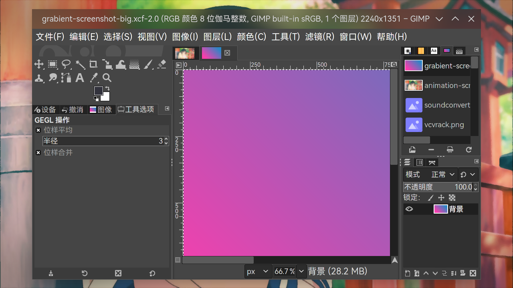
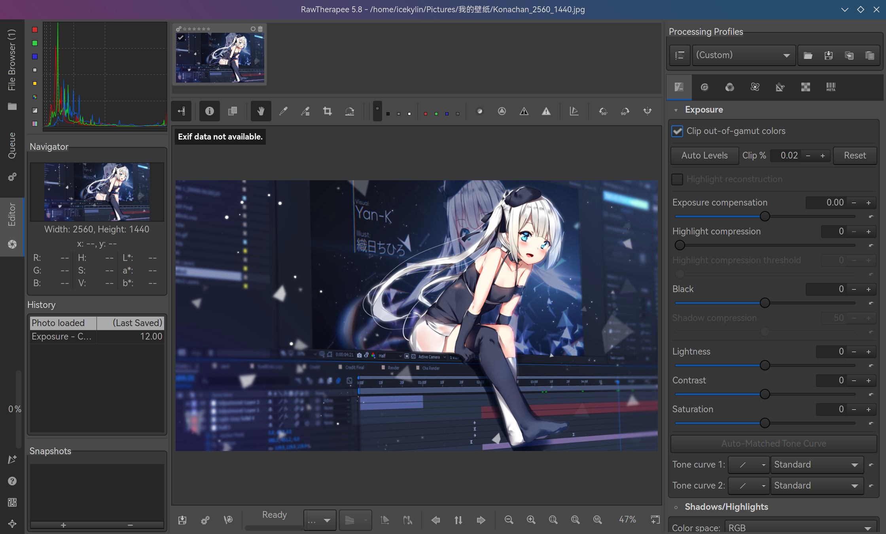
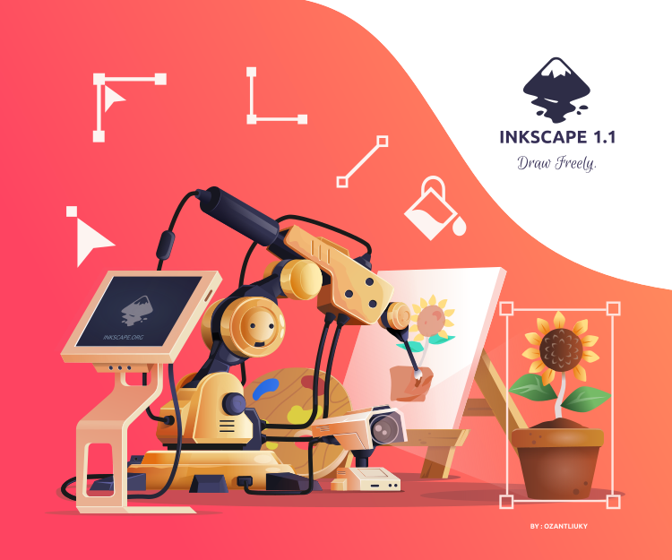

# 图像制作

> ### 🌺 乱花渐欲迷人眼，浅草才能没马蹄
>
> 本小节讨论如何在 archlinux 上编辑、管理位图以及矢量图，以及绘画。

> ### 🔖 这一节将会讨论：
>
> ::: details 目录
>
> [[toc]]
>
> :::

::: tip ℹ️ 提示

指南中带有 <sup>aur</sup> 角标的软件代表是在 [AUR](https://aur.archlinux.org/)（Arch User Repository）中用户自行打包的软件。不在 arch 官方支持范围内，可能会出现各种问题如更新不及时、无法安装、使用出错等。

指南中带有 <sup>cn</sup> 角标的软件代表是在 [archlinuxcn](https://www.archlinuxcn.org/archlinux-cn-repo-and-mirror/)（Arch Linux 中文社区仓库）中用户自行打包的软件。不在 arch 官方支持范围内，可能会出现各种问题如更新不及时、无法安装、使用出错等。

指南中带有 <sup>EULA</sup> 角标的软件代表是 [专有软件](https://www.gnu.org/proprietary/proprietary.html)。请自行斟酌是否使用。

:::

## 🖼️ 位图编辑

### GIMP

[GIMP](https://www.gimp.org/) 是一个自由开源的位图图像编辑器。其对标 [Adobe](https://www.adobe.com/cn/) 的 [Photoshop](https://www.adobe.com/cn/products/photoshop.html)<sup>EULA</sup>。

安装 [GIMP](https://archlinux.org/packages/extra/x86_64/gimp/)<sup>extra / cn / aur</sup>：

::: code-group

```sh [extra]
sudo pacman -S gimp
```

```sh [cn (git)]
sudo pacman -S gimp-git
```

```sh [aur (git)]
yay -S aur/gimp-git
```

:::



### Aseprite

[Aseprite](https://www.aseprite.org/) 是一款像素艺术绘制工具。

安装 [Aseprite](https://aur.archlinux.org/packages/aseprite/)<sup>EULA / aur</sup>：

::: code-group

```sh [aur]
yay -S aseprite
```

```sh [aur (bin)]
yay -S aseprite-bin
```

```sh [aur (git)]
yay -S aseprite-git
```

:::


### RawTherapee

[RawTherapee](https://rawtherapee.com/) 是一个自由开源的跨平台 RAW 格式图像处理程序。

安装 [RawTherapee](https://archlinux.org/packages/extra/x86_64/rawtherapee/)<sup>extra / aur</sup>：

::: code-group

```sh [extra]
sudo pacman -S rawtherapee
```

```sh [aur (git)]
yay -S rawtherapee-git
```

:::



### KolourPaint

KolourPaint 是 KDE 开发的一个简单易用的自由开源的绘图程序（类似 Windows 自带的画图），可以创建点阵图像。可用来对图片进行润色和简单编辑。

安装 [KolourPaint](https://archlinux.org/packages/extra/x86_64/kolourpaint/)<sup>extra / aur</sup>：

::: code-group

```sh [extra]
sudo pacman -S kolourpaint
```

```sh [aur (git)]
yay -S kolourpaint-git
```

:::


## 🖼️ 矢量图编辑

### Inkscape

Inkscape 是自由开源的矢量图形编辑器。该软件的开发目标是成为强大的绘图软件，且能完全遵循与支持 XML、SVG 及 CSS 等开放性的标准格式。

安装 [Inkscape](https://archlinux.org/packages/extra/x86_64/inkscape/)<sup>extra / aur</sup>：

::: code-group

```sh [extra]
sudo pacman -S inkscape
```

```sh [aur (git)]
yay -S inkscape-git
```

:::


> #### 📑 相关资料：什么是矢量图形？
>
> 矢量图形是计算机图形学中用点、直线或者多边形等基于数学方程的几何图元表示的图像。
>
> 矢量图形与使用像素表示图像的位图不同。任意放大矢量图形，不会丢失细节或影响清晰度。
>
> 下面这个图片便是矢量图，可以尝试将其放大：
>
> 

## 🎨 绘画

### Krita

[Krita](https://krita.org/zh/) 是一个自由开源的位图图像编辑器。它针对数字绘画和动画创作特化，提供包括低干扰用户界面、OpenGL 加速画布、色彩管理、功能强大的笔刷引擎、非破坏性图层和蒙版、图层分组、矢量图形支持和可切换界面预设等在内的一系列特色功能。

安装 [Krita](https://archlinux.org/packages/extra/x86_64/krita/)<sup>extra / aur</sup>：

::: code-group

```sh [extra]
sudo pacman -S krita
```

```sh [aur (git)]
yay -S krita-git
```

:::


## 🖼️ GIF 制作

### Gifcurry

[Gifcurry](https://lettier.github.io/gifcurry/) 是面向 GIF 制作者的开源、Haskell 构建的视频编辑器。

安装 [Gifcurry](https://aur.archlinux.org/packages/gifcurry/)<sup>aur</sup>：

```sh
yay -S gifcurry
```
