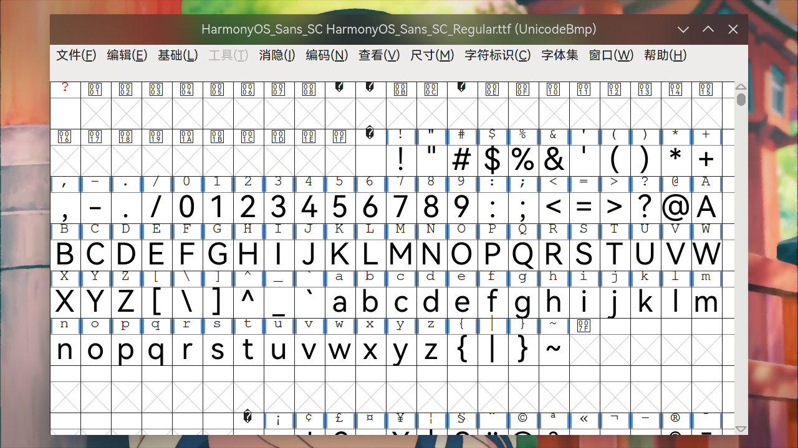

# 其它内容

> ### 🌖 深林人不知，明月来相照
>
> 本小节讨论其它形式的多媒体创作。包括建模、UI & UX 设计、字体创作、动画创作，甚至家装辅助设计等。

> ### 🔖 这一节将会讨论：
>
> ::: details 目录
>
> [[toc]]
>
> :::

::: tip ℹ️ 提示

指南中带有 <sup>aur</sup> 角标的软件代表是在 [AUR](https://aur.archlinux.org/)（Arch User Repository）中用户自行打包的软件。不在 arch 官方支持范围内，可能会出现各种问题如更新不及时、无法安装、使用出错等。

指南中带有 <sup>cn</sup> 角标的软件代表是在 [archlinuxcn](https://www.archlinuxcn.org/archlinux-cn-repo-and-mirror/)（Arch Linux 中文社区仓库）中用户自行打包的软件。不在 arch 官方支持范围内，可能会出现各种问题如更新不及时、无法安装、使用出错等。

指南中带有 <sup>EULA</sup> 角标的软件代表是 [专有软件](https://www.gnu.org/proprietary/proprietary.html)。请自行斟酌是否使用。

:::

## 🗿 建模渲染与动画制作

### 斑斓（Blender）

[Blender](https://www.blender.org/) 是一款开源免费的三维图形图像软件，提供从建模、动画、材质、渲染、到音频处理、视频剪辑等一系列动画短片制作解决方案。

安装 [Blender](https://archlinux.org/packages/extra/x86_64/blender/)<sup>extra / aur</sup>：

::: code-group

```sh [extra]
sudo pacman -S blender
```

```sh [aur (git)]
yay -S blender-git
```

:::


### Sweet Home 3D

[Sweet Home 3D](http://www.sweethome3d.com/zh-cn/) 是一款免费的家装辅助设计软件。它能帮您通过二维的家居平面图来设计和布置您的家具，还可以用三维的视角浏览整个装修布局的全貌。

安装 [Sweet Home 3D](https://archlinux.org/packages/extra/x86_64/sweethome3d/)：

```sh
sudo pacman -S sweethome3d
```


### Synfig Studio

[Synfig Studio](https://www.synfig.org/) 是一款免费开源的 2D 动画软件，用于使用矢量和位图图稿创建电影质量的动画。

安装 [Synfig Studio](https://archlinux.org/packages/extra/x86_64/synfigstudio/)<sup>extra / aur</sup>：

::: code-group

```sh [extra]
sudo pacman -S synfigstudio
```

```sh [aur (git)]
yay -S synfigstudio-git
```

:::


### Linux Stopmotion

[Linux Stopmotion](http://linuxstopmotion.org/) 是一个开源免费的应用程序，用于创建定格动画。

安装 [Linux Stopmotion](https://aur.archlinux.org/packages/linuxstopmotion-git/)<sup>aur</sup>：

```sh
yay -S linuxstopmotion-git
```


## ✏️ UI & UX 设计

可使用 [Figma 网页版](https://www.figma.com/)，或者使用一个非官方的 Linux Figma 桌面端软件 [Figma electron app](https://github.com/Figma-Linux/figma-linux)。

### Figma electron app

安装 [Figma electron app](https://aur.archlinux.org/packages/figma-linux/)<sup>aur</sup>：

```sh
yay -S figma-linux
```


## ✍️ 字体创作

### FontForge

[FontForge](https://fontforge.org/en-US/) 是一款自由开源、全功能、支持所有通用字体格式的字体编辑器。

安装 [FontForge](https://archlinux.org/packages/extra/x86_64/fontforge/)<sup>extra / aur</sup>：

::: code-group

```sh [extra]
sudo pacman -S fontforge
```

```sh [aur (git)]
yay -S fontforge-git
```

:::


