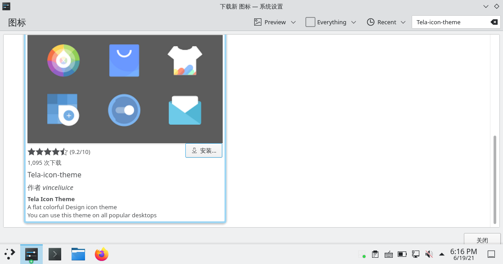
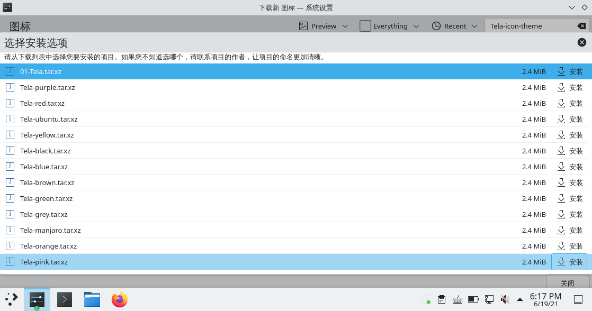
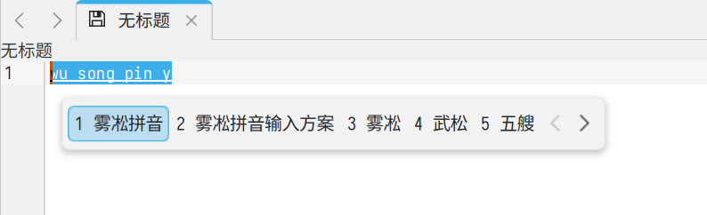
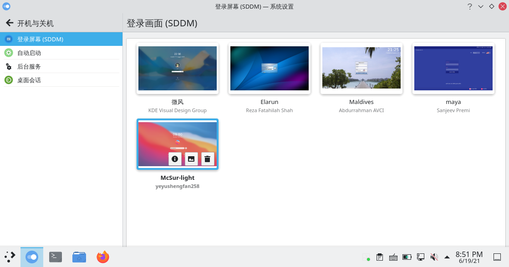
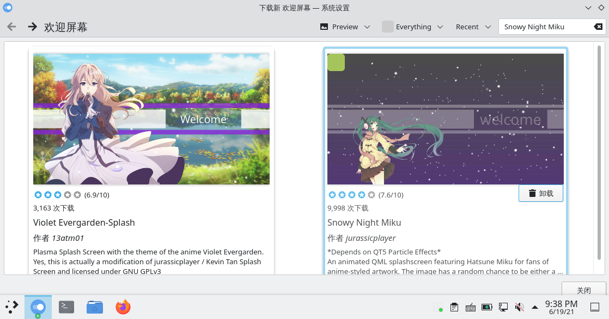
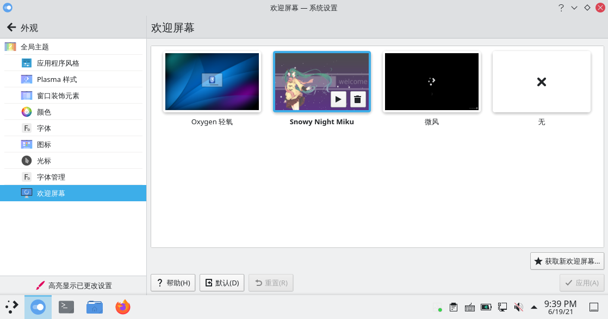

# archlinux 系统美化（主题篇）

> ### 🌺 爱美之心，人皆有之
>
> 美化这个话题是永恒的。有些人用 Linux 的原因就是一开始被美化后桌面的截图惊艳到了
>
> 这一小节将会介绍如何对 KDE 桌面环境进行美化。受限于篇幅，本小节分为上下篇

## 1. 更改系统图标

如果觉得默认的微风主题图标不能满足你的审美，那么可以下载新的图标主题。

1. 安装图标主题：

   - 使用包管理器安装（推荐）

     ::: tip ℹ️ 提示

     推荐使用包管理器安装。

     实际上所有能用包管理器安装的（无论是图标主题、全局主题还是小组件）**都应该用包管理器安装**。

     这样做不仅可以简化安装步骤，还可以将这些东西纳入升级。

     :::

     1. 安装 [`tela-icon-theme`](https://github.com/vinceliuice/Tela-icon-theme)<sup>cn / aur</sup> 图标主题：

        ::: code-group

        ```bash [cn (git)]
        sudo pacman -S tela-icon-theme-git
        ```

        ```bash [aur (git)]
        yay -S aur/tela-icon-theme-git
        ```

        ```bash [aur]
        yay -S aur/tela-icon-theme
        ```

        :::

        

        ::: tip ℹ️ 提示

        其它图标主题请自行寻找对应包。

        :::

     2. 打开 `系统设置` > 点击侧栏 `外观` > `图标`

     3. 选择刚刚下载好的图标主题 > 点击 `应用`：

        

        查看效果：

        

   - 使用 KDE 系统设置安装

     1. 打开 `系统设置` > 点击侧栏 `外观` > `图标` > `获取新图标主题`：

        

        ::: tip ℹ️ 提示

        为了流畅的连接服务器，你可能需要按照章节 [透明代理](/guide/rookie/transparent.md) 配置透明代理。

        :::

     2. 搜索图标名 `Tela-icon-theme` 或喜欢的一套图标主题 > 点击 `安装` > 选择喜欢的颜色 `安装`：

        

        

     3. 安装完成后点击 `关闭`

     4. 选择刚刚下载好的图标主题 > 点击 `应用`：

        

        查看效果：

        

## 2. 更改 Fcitx5 输入法皮肤

默认的输入法主题并不好看,这里有三个漂亮的主题：

### [内置的Breeze](https://planet.kde.org/weng-xuetian-2022-07-04-fcitx-5-plasma-theme-support/)



只需在 fcitx5 的经典 UI 配置中选择“KDE Plasma (Experimental)”作为主题即可。

原作者的视频教程如下：

<video controls="" src="https://www.csslayer.info/wordpress/wp-content/uploads/2022/07/demo.mp4"></video>

### [fcitx5-nord](https://github.com/ayamir/fcitx5-nord)


按照 github 的说明安装即可：

```bash
git clone https://github.com/tonyfettes/fcitx5-nord.git
mkdir -p ~/.local/share/fcitx5/themes/
cd fcitx5-nord
cp -r Nord-Dark/ Nord-Light/ ~/.local/share/fcitx5/themes/
```

### [fcitx5-gruvbox](https://github.com/ayamir/fcitx5-gruvbox)


安装过程同上：

```bash
git clone https://github.com/ayamir/fcitx5-gruvbox
mkdir -p ~/.local/share/fcitx5/themes/ # 若安装nord主题时已经执行过此命令，则不必再执行一次
cd fcitx5-gruvbox
cp -r Gruvbox-Light/ Gruvbox-Dark ~/.local/share/fcitx5/themes/
```

## 3. 设置 SDDM 主题

默认的登录界面不太好看，我们将它替换掉。

1. 打开 `系统设置` > 点击侧栏 `开机和关机` > `登录屏幕（SDDM）`

2. 设置 SDDM 主题：

   - 若希望使用微风 SDDM 主题：

     你可能会发现默认选择的 SDDM 主题就是微风，实际上这只是显示有问题而已。

     1. 随便选择另外一套 SDDM 主题 > 点击 `应用`

     2. 重新选择微风 SDDM 主题 > 点击 `应用`

     3. 重启，查看效果：

        

   - 若希望使用其它 SDDM 主题：

     1. 点击右下角的 `获取新 SDDM 主题...`

     2. 搜索 SDDM 主题名 `McSur-light Sddm Theme` 或喜欢的一套 SDDM 主题 > 点击 `安装`：

        

     3. 安装完成后点击 `关闭`

     4. 选择刚刚下载好的 SDDM 主题 > 点击 `应用` 即可：

        

     5. 重启，查看效果：

        

3. 部分 SDDM 主题可以更换背景。点击对应 SDDM 主题中间的图片小图标 > `加载图像文件...` > 选择你想要的图片

4. 点击 `应用`

5. 重启，查看效果：

   

::: tip ℹ️ 提示

若发现 SDDM 显示字体和图标过小，请参阅 [✨ DPI 设置](optional-cfg-1.md#✨-dpi-设置)。

:::

## 4. 设置欢迎屏幕主题

登录界面后的欢迎屏幕也可以进行美化。

1. 打开 `系统设置` > 点击侧栏 `外观` > `欢迎屏幕` > `获取新欢迎屏幕...`：

   

2. 搜索欢迎屏幕主题名 `Snowy Night Miku` 或喜欢的一套欢迎屏幕主题 > 点击 `安装`：

   

3. 选择刚刚下载好的欢迎屏幕主题 > 点击 `应用` 即可：

   

4. 注销，查看效果：

   

## 5. 更改全局主题

::: tip ℹ️ 提示

若切换主题后，`Windows` 键不能呼出菜单，则需要重新配置快捷键：

1. 在程序启动器（开始菜单）右键 > 点击 `配置程序启动器...`

2. 在键盘快捷键中重新设置 `Windows` + `F1` 键，Windows 键会显示为 Meta 键。

:::

### 5-1. 设置窗口装饰

在 _系统设置_ > _外观_ > _窗口装饰_ 中，获取新窗口装饰，搜索 layan，并应用即可。

### 5-2. 配置 Kvantum Manager

主题配合 Kvantum Manager 可以达到更好的效果。

```bash
sudo pacman -S kvantum
```

在[这里](https://www.pling.com/p/1325246/)下载 Layan 的 Kvantum 主题，并解压。打开 Kvantum Manager,选择主题并安装，接下来在`Change/Delete Theme`中选择 Layan,Use this theme。最后在系统设置，外观中的应用程序风格中选择 kvantum 即可。

> 如果透明的效果没有显示，确保 KDE 的全局缩放比例为整数倍。或者尝试切换混成器中 openGL 的设置。

## 6. 更改字体

## 7. 引导界面美化

### 7-1. 设置 GRUB 主题

开机时有个漂亮的 GRUB 也是很舒服的。

在[这里](https://www.pling.com/p/1482847/)下载 Distro 的 GRUB 主题并解压。接下来 `cd` 进解压出来的文件夹，打开 konsole 输入

```bash
sudo cp . /usr/share/grub/themes/Distro -rf
```

以将主题放置在系统的 GRUB 默认文件夹内。

接着编辑 `/etc/default/grub` 文件，找到 `#GRUB_THEME=` 一行，将前面的注释去掉，并指向主题的 `theme.txt` 文件。即

```bash
#GRUB_THEME=
GRUB_THEME="/usr/share/grub/themes/Distro/theme.txt" #修改后
```

然后再在终端输入

```bash
grub-mkconfig -o /boot/grub/grub.cfg
```

更新 GRUB 即可。

### 7-2. 设置 rEFind 主题
