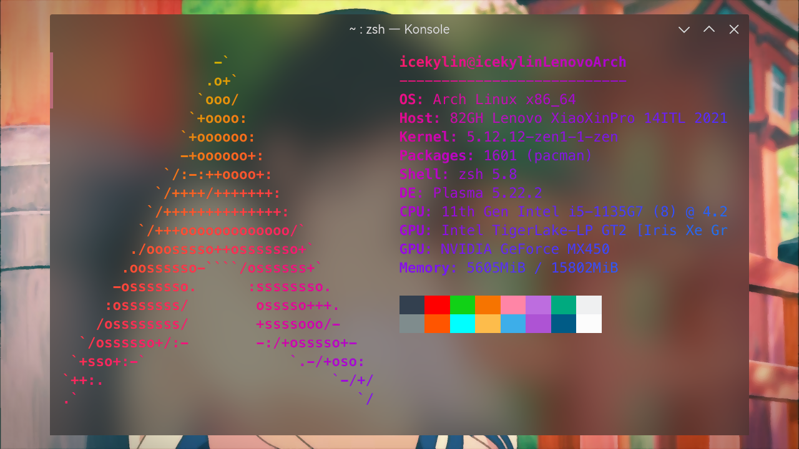

# archlinux 系统美化（终端篇）

> ### 🌺 爱美之心，人皆有之
>
> 美化这个话题是永恒的。有些人用 Linux 的原因就是一开始被美化后桌面的截图惊艳到了
>
> 这一小节将会介绍如何对 KDE 桌面环境进行美化。受限于篇幅，本小节分为上下篇

## 1. 设置 Konsole 样式

打开 Konsole， _设置_ > _编辑当前方案_ > _外观_，选择 `Red-Black` （或你喜欢的颜色主题），应用确认即可。

## 2. zsh 美化

::: tip ℹ️ 提示

确保你安装过 zsh ，安装方法及相关配置可在 [可选配置（基础）](/guide/advanced/optional-cfg-1.html) 一章中查看。

[oh-my-zsh](https://ohmyz.sh/) 实际上并没有那么好用，反而拖慢了 Zsh 的速度，本指南不会介绍。

若有需要请自行查阅相关资料。

:::

### 2-1. powerlevel10k

由于本指南不使用 `oh-my-zsh` ,因此使用另一个 Zsh 框架 `zim` 安装 powerlevel10k。

1.  安装 `zim` 。

```sh
curl -fsSL https://raw.githubusercontent.com/zimfw/install/master/install.zsh | zsh
```

2.  编辑 Zsh 配置文件 `~/.zimrc` ：

```sh
vim ~/.zimrc
```

3.  在文件最后加入下面的一行文字，以添加 `powerlevel10k` 模块，然后退出。

```
zmodule romkatv/powerlevel10k
```

4.  安装 `powerlevel10k` 模块，在终端输入如下命令即可。

```sh
zimfw install
```

安装之后，`powerlevel10k`会让你进行配置。

在此时配置时，很多图标符号看不到，因为 `powerlevel10k` 中包含许多特殊图标符号，需要与之兼容的字体。

5.  安装 Nerd Font 字体

Nerd Fonts 是一系列打过补丁的字体，支持 `powerlevel10k` 中的图标。

AUR 和 ArchLinuxCN 源中都有很多 Nerd Font，在终端使用 yay 搜索安装即可。

```sh
yay -Ss nerd-font
```

个人推荐使用 [ttf-jetbrains-mono-nerd](https://archlinux.org/packages/extra/any/ttf-jetbrains-mono-nerd/) 字体，可在 aur 中安装

```sh
sudo pacman -S ttf-jetbrains-mono-nerd
```

安装完任意一个 Nerd Font 字体后，打开 Konsole 的 _设置_ > _编辑当前方案_ > _外观_，把 _字体_ 改为刚刚安装的 Nerd Font 即可。

现在再打开 `powerlevel10k` 配置（`p10k configure`），就可以看到图标符号，正常配置了。

## 3. vim 美化

## 4. ASCII 艺术与终端玩具

### lolcat

用渐变为终端输出着色，看起来就像彩虹一样！

1. 安装 [lolcat](https://archlinux.org/packages/extra/any/lolcat/)：

   ```bash
   sudo pacman -S lolcat
   ```

2. 通过管道符（`|`）将其它命令（如 `neofetch`）的输出传递给 `lolcat`：

   ```bash
   neofetch | lolcat
   ```

   

### cowsay

将文本作为 ASCII 艺术牛的讲话文本输出。

1. 安装 [cowsay](https://archlinux.org/packages/extra/any/cowsay/)：

   ```bash
   sudo pacman -S cowsay
   ```

2. 通过管道符（`|`）将简短的其它命令输出传递给 `cowsay`：

   ```bash
   echo "archlinux 简明指南" | cowsay
   ```

   

### figlet

显示由不同风格的 ASCII 艺术字符组成的文本。

1. 安装 [figlet](https://archlinux.org/packages/extra/x86_64/figlet/)：

   ```bash
   sudo pacman -S figlet
   ```

2. 通过管道符（`|`）将简短的其它命令输出传递给 `figlet`：

   ```bash
   echo "Love Live Linux" | figlet
   ```

   

   更多样式请参阅 [figlet 官网](http://www.figlet.org/)。

### boxes

使用 ASCII 艺术风格的字符形状框来包围文本。

1. 安装 [boxes](https://archlinux.org/packages/extra/any/cowsay/)<sup>aur</sup>：

   ::: code-group

   ```bash [aur]
   yay -S boxes
   ```

   ```bash [aur (git)]
   yay -S boxes-git
   ```

   :::

2. 通过管道符（`|`）将简短的其它命令输出传递给 `boxes`：

   ```bash
   echo "archlinux 简明指南" | boxes -d diamonds -a c
   ```

   

   更多样式请参阅 [boxes 官网](https://boxes.thomasjensen.com/) 以及 [boxes repo](https://github.com/ascii-boxes/boxes)。

### cmatrix

向下滚动的代码流如同黑客帝国一样！

1. 安装 [cmatrix](https://archlinux.org/packages/extra/x86_64/cmatrix/)：

   ::: code-group

   ```bash [extra]
   sudo pacman -S cmatrix
   ```

   ```bash aur (git)
   yay -S aur/cmatrix-git
   ```

   :::

2. 输入以下命令：

   ```bash
   cmatrix
   ```

   

3. 按下 `q` 即可退出

### asciiquarium

将终端化身海洋馆！

1. 安装 [asciiquarium](https://archlinux.org/packages/extra/any/asciiquarium/)<sup>extra / aur</sup>：

   ::: code-group

   ```bash [extra]
   sudo pacman -S asciiquarium
   ```

   ```bash [aur (git)]
   yay -S aur/asciiquarium-git
   ```

   :::

2. 输入以下命令：

   ```bash
   asciiquarium
   ```

   

3. 按下 `q` 即可退出

### sl

终端里的小火车。

1. 安装 [sl](https://archlinux.org/packages/extra/x86_64/sl/)：

   ```bash
   sudo pacman -S sl
   ```

2. 输入以下命令：

   ```bash
   sl
   ```

   

## 5. Linux 彩蛋
