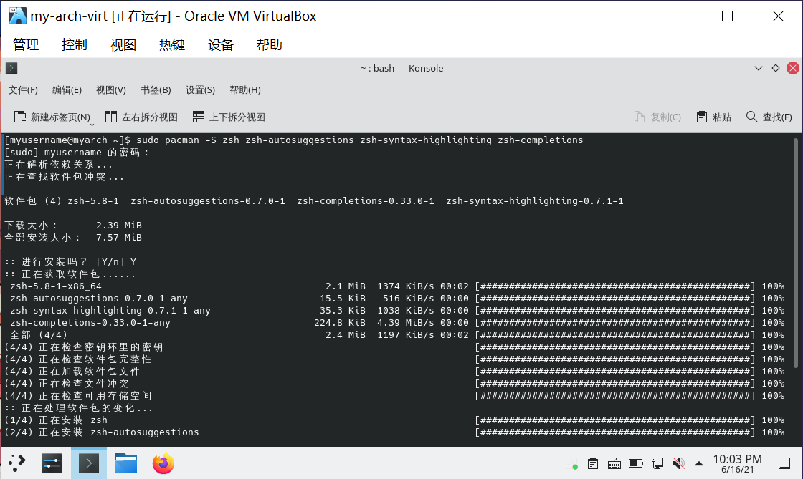
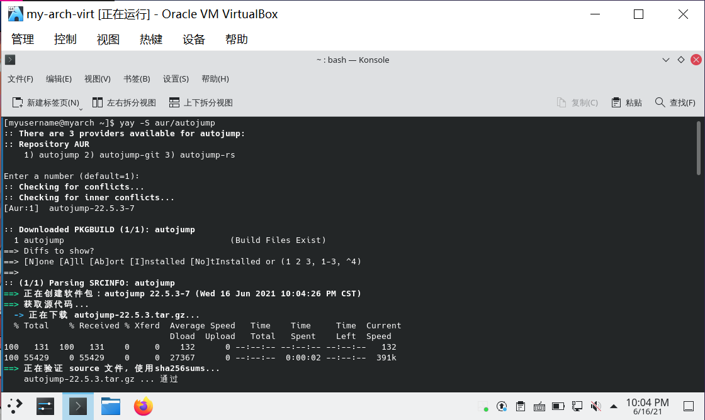
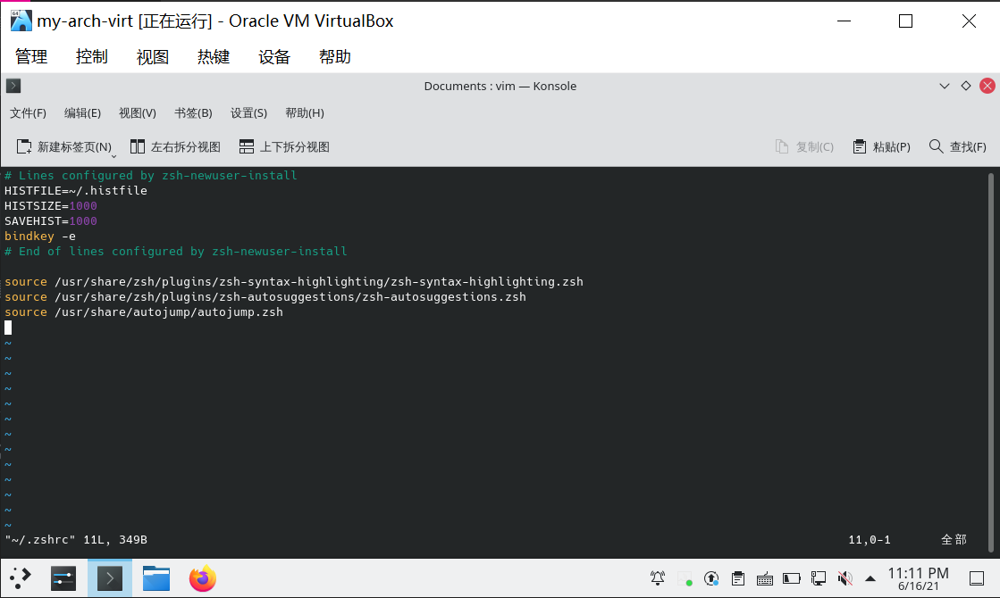
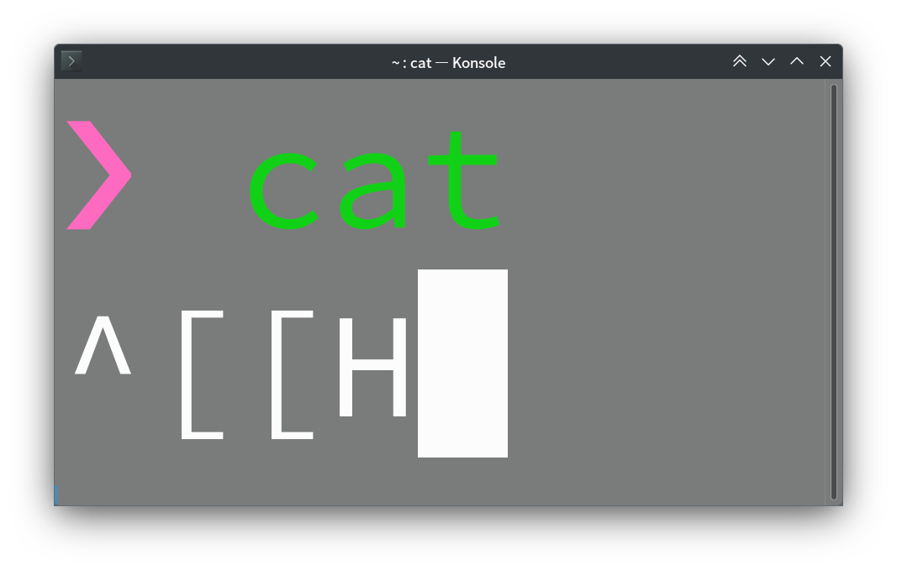

# 可选配置（基础篇）

> ### 🎑 一分耕耘，一分收获
>
> 这一节的配置都是可选的。这些配置根据个人喜好进行配置，往往可以让系统变得更好用
>
> Linux 基础相关的一些配置（如 alias 的配置）**不会**被讨论

## ⚙ 调整部分系统设置

### 以空会话启动

默认情况下，KDE 桌面环境中关机之后再开机会恢复先前保存的对话（如浏览器没有关掉，那么开机之后浏览器还在）。

如果你不喜欢这样，请按照以下步骤设置：

1. 打开 `系统设置` > 点击侧栏 `开机与关机` > `桌面会话`

2. 将 `登入时` 的选项改为 `以空会话启动`：


3. 点击 `应用` 保存设置

### 点击文件 / 文件夹行为

默认情况下，KDE 桌面环境中打开文件 / 文件夹是单击，若不习惯常常造成误触发。

若希望改为双击打开文件 / 文件夹（类似 win10），请按照以下步骤设置：

1. 打开 `系统设置` > 点击侧栏 `工作区行为` > `常规行为`

2. 将 `点击文件或文件夹时` 的选项改为 `选中它们`：


3. 点击 `应用` 保存设置

### 触摸板

一般情况下，libinput 已经安装到你的电脑，触摸板应该可用。

但是默认情况下，触摸板并不启用 `轻触点击`、`自然滚动` 等功能，打开 `系统设置` > 点击侧栏 `输入设备` > `触摸板` 来修改你想要的触摸板行为。

::: tip ℹ️ 提示

虽然 libinput 已经提供了手势操作，比如：捏、滑。但部分桌面环境（DE）和窗口管理器（WM）可能还没有支持这些功能。想要使用更多触摸板手势，可参阅 [ArchWiki 相关说明](https://wiki.archlinuxcn.org/zh/Libinput#%E6%89%8B%E5%8A%BF%E6%93%8D%E4%BD%9C)。

:::

## 🀄 字体设置

字体可以在 `系统设置` > `外观` > `字体` 中进行设置，一般默认即可：


::: tip ℹ️ 提示

有关用户全局级别更改日文异型字的设置，可参阅 [ArchWiki 相关说明](<https://wiki.archlinux.org/index.php/Localization_(%E7%AE%80%E4%BD%93%E4%B8%AD%E6%96%87)/Simplified_Chinese_(%E7%AE%80%E4%BD%93%E4%B8%AD%E6%96%87)#%E4%BF%AE%E6%AD%A3%E7%AE%80%E4%BD%93%E4%B8%AD%E6%96%87%E6%98%BE%E7%A4%BA%E4%B8%BA%E5%BC%82%E4%BD%93%EF%BC%88%E6%97%A5%E6%96%87%EF%BC%89%E5%AD%97%E5%BD%A2>)。

:::

::: tip ℹ️ 提示

如果使用了 noto-fonts-cjk 作为汉字字体，请注意在该包从 20230817-2 版本 (打包于2024年06月08日) 开始移除了 `70-noto-cjk.conf`，可能会导致部分字体回落（表现为字体显示不统一，如 `字体` 的 `体`，`桌面` 的 `面` 在部分应用中显示为衬线字体（宋体））。
要解决这个问题，请参阅 [这里](https://bbs.archlinuxcn.org/viewtopic.php?pid=60100)

:::

### 安装 Windows 字体

Windows 字体不仅日常可能会使用到，还可以让部分需要这些字体的应用（如 Wine）显示字体不会乱码。

* 从本地 Windows 获取字体文件

   1. 首先需要挂载 Windows 下的 C 盘所在分区。若分区为 Bitlocker 上锁分区，可通过 Dolphin 使用对应的恢复密钥解锁

      ::: tip ℹ️ 提示

      有关解锁密钥的获取请参阅 [5. 获取 Bitlocker 恢复密钥](../rookie/pre-install.md#_5-%E8%8E%B7%E5%8F%96-bitlocker-%E6%81%A2%E5%A4%8D%E5%AF%86%E9%92%A5)。

      :::

   2. 建立 archlinux 下存放 Windows 字体的文件夹：

      ```sh
      sudo mkdir /usr/share/fonts/WindowsFonts
      ```

   3. 进入 Windows 的 `Fonts` 文件夹，将字体复制到建立的文件夹并设置合理的权限：

      ```sh
      cd /path/to/C:/Windows/Fonts # 或者通过 Dolphin 在此文件夹下右键 > 点击 打开终端
      sudo cp ./* /usr/share/fonts/WindowsFonts
      sudo chmod 755 /usr/share/fonts/WindowsFonts/* # 设置合理的权限
      ```

      

   4. 刷新字体：

      ```sh
      fc-cache -vf # -v：显示过程
      ```

* 从 AUR 安装

   通过以下命令安装 Windows 11 的中文字体
   ```
   yay -S ttf-ms-win11-auto-zh_cn
   ```
   ::: tip ℹ️ 提示

   原理是网络挂载 Windows 11 安装镜像并从中提取字体文件，完全合法   

   :::

> 🔗 相关链接：
>
> 关于字体的美化请参阅 [系统美化](./beauty-2.html#_6-更改字体)。

## 🍀️ 输入法

由于 Fcitx5 自带词库简陋，部分本地化符号难以输入（如中文输入下按下 `/` 键无法打出 `、`），Emoji 输入复杂等问题，本指南提供额外输入方案。

在步骤 [10. 安装输入法](/guide/rookie/desktop-env-and-app.md#_10-安装输入法) 中，我们已经安装了 Fcitx5 相关的包。接下来的操作要依赖之前的包。

1. 通过以下命令安装 Rime 输入法：

```bash
sudo pacman -S fcitx5-rime
```


2. 然后添加 Rime 输入法。打开 `系统设置` > 点击侧栏 `语言和区域设置` > `输入法`：


::: tip ℹ️ 提示

若提示检测到更新，点击 `更新` 即可。

:::

3. 点击 `添加输入法` > 找到**汉语**下的 `中州语` > 点击 `添加`：


4. 若不想要之前的 Pinyin 输入法了，可以点击它最右边的按钮移除掉：


5. 通过以下命令安装 [🍀️ 四叶草拼音输入方案](https://github.com/fkxxyz/rime-cloverpinyin)<sup>cn / aur</sup>（四叶草许久没更新了，可换后文的雾凇拼音）：

::: code-group

```bash [cn]
sudo pacman -S rime-cloverpinyin
```

```bash [aur]
yay -S aur/rime-cloverpinyin
```

:::


5. 然后切换到 🍀️ 四叶草拼音输入方案。使用 `vim` 创建并编辑下述文件：

```bash
mkdir ~/.local/share/fcitx5/rime # 创建 rime 目录
vim ~/.local/share/fcitx5/rime/default.custom.yaml
```

在文件中加入以下内容：

```yaml
patch:
  "menu/page_size": 8
  schema_list:
    - schema: clover
```

其中 `8` 表示打字的时候输入面板的每一页的候选词数目，可以设置成 `1 ~ 9` 任意数字。


::: tip ℹ️ 提示

若有需要，关于 `default.custom.yaml` 文件的更多解释，可以参考 [Rime 官方定制指南](https://github.com/rime/home/wiki/CustomizationGuide)。

:::

6. 保存并退出 `vim`

7. 在可输入的位置通过 `Ctrl` + `空格` 切换到 `Rime` 输入法（此时将提示 `Rime` 就绪），在输入法托盘菜单的 `🌏 方案列表` 里面应该就有 `🍀️四叶草拼音输入法` 的选项了：


::: tip ℹ️ 提示

若之前 Rime 输入法已经启动了，那么请右键输入法托盘图标 > 点击 `重新部署`。在输入法托盘菜单的 `🌏 方案列表` 里应该就有 `🍀️四叶草拼音输入法` 的选项了。

若 `🍀️四叶草拼音输入法` 不是默认方案，只需点击 `🌏 方案列表` > 点击 `🍀️四叶草拼音输入法` 即可：


:::

8. 尝试在各个软件中输入中文：


::: tip ℹ️ 提示

同样的，通过 `Ctrl` + `空格` 切换中英文输入（若 Pinyin 输入法未移除则会在这三者之间循环切换）。

:::

### 雾凇拼音(Rime-ice)输入法

1. 安装[rime-ice输入法](https://github.com/iDvel/rime-ice)：

```bash
yay -S rime-ice
```

2. 创建ice的配置文件：

```bash
mkdir ~/.local/share/fcitx5/rime # 创建 rime 目录
vim ~/.local/share/fcitx5/rime/default.custom.yaml
```

输入以下内容

```yaml
patch:
  # 仅使用「雾凇拼音」的默认配置，配置此行即可
  __include: rime_ice_suggestion:/
  # 以下根据自己所需自行定义
  __patch:
    menu/page_size: 5   #候选词个数
```

保存并退出

3. 右键输入法图标，重新启动或重新部署即可启用雾凇拼音输入法

4. （可选）增加萌娘百科词库

雾凇拼音取消了对萌娘词库的支持，如果需要得自己添加

```bash
yay -S fcitx5-pinyin-moegirl-rime
```

安装完成之后将配置复制到个人配置目录

```bash
cp /usr/share/rime-data/rime_ice.dict.yaml ~/.local/share/fcitx5/rime/rime_ice.dict.yaml
```

打开配置文件

```bash
vim ~/.local/share/fcitx5/rime/rime_ice.dict.yaml
```

根据提示在`import_tables:`中添加词库

```yaml
import_tables:
  ...
  ...
  - moegirl
```

5. 尝试输入中文

> 🔗 相关链接：
>
> 关于 Fcitx5 输入法的美化请参阅 [系统美化](./beauty-2.html#_2-更改-fcitx5-输入法皮肤)。

## 🚀 zsh

zsh 基本兼容 bash，但相比 bash，又有诸多优点：

1. 更强大的 `tab` 补全
2. 更智能的切换目录
3. 大小写字母自动更正
4. 更强大的 `alias` 命令
5. 丰富多彩的主题
6. 可以集成各种类型的插件

> #### 🍧 碎碎念
>
> 当然，也有很多人对 bash 爱的深沉，这些都看个人喜好啦。

::: tip ℹ️ 提示

[oh-my-zsh](https://ohmyz.sh/) 实际上并没有那么好用，反而拖慢了 Zsh 的速度，本指南不会介绍。

若有需要请自行查阅相关资料。

:::

1. 通过以下命令安装 zsh 相关的包：

```bash
sudo pacman -S zsh zsh-autosuggestions zsh-syntax-highlighting zsh-completions
```

> 📑 相关包说明：
>
> - [`zsh-autosuggestions`](https://github.com/zsh-users/zsh-autosuggestions) —— 命令自动补全插件
> - [`zsh-syntax-highlighting`](https://github.com/zsh-users/zsh-syntax-highlighting) —— 语法上高亮插件
> - [`zsh-completions`](https://github.com/zsh-users/zsh-completions) —— 补充补全定义



2. 安装 [autojump](https://github.com/wting/autojump)<sup>cn / aur</sup> 插件：

::: code-group

```bash [cn]
sudo pacman -S autojump
```

```bash [aur]
yay -S aur/autojump
```

:::



3. 更改账户的默认 Shell：

::: code-group

```bash [非 root 账户]
chsh -l # 查看安装了哪些 Shell
chsh -s /usr/bin/zsh # 修改当前账户的默认 Shell
```

```bash [root]
chsh -l # 查看安装了哪些 Shell
sudo chsh -s /usr/bin/zsh root
```

:::


::: tip ℹ️ 提示

可以不为 root 账户更改默认 shell。

:::

4. 注销并重新登录 > 打开终端，此时会弹出如下界面进行设置：


- 按下 `0` 将创建一个只包含注释的 `~/.zshrc` 文件，在下次启动时不会再次弹出设置选项。
- 按下 `1` 即可进入设置：

```zsh
Please pick one of the following options:

(1)  Configure settings for history, i.e. command lines remembered
     and saved by the shell.  (Recommended.)

(2)  Configure the new completion system.  (Recommended.)

(3)  Configure how keys behave when editing command lines.  (Recommended.)

(4)  Pick some of the more common shell options.  These are simple "on"
     or "off" switches controlling the shell's features.

(0)  Exit, creating a blank ~/.zshrc file.

(a)  Abort all settings and start from scratch.  Note this will overwrite
     any settings from zsh-newuser-install already in the startup file.
     It will not alter any of your other settings, however.

(q)  Quit and do nothing else.  The function will be run again next time.
```

根据提示完成设置即可。也可以创建一个只包含注释的 `~/.zshrc` 文件以使用默认值。

::: tip ℹ️ 提示

root 账户需要手动创建 `root/.zshrc` 文件。

:::

::: tip ℹ️ 提示

若希望重新设置，只需要把 `~/.zshrc` 文件删掉即可。

:::

5. 为了让插件生效，需要修改 `~/.zshrc`。使用 `vim` 编辑 `~/.zshrc` 文件：

::: code-group

```zsh [非 root 账户]
vim ~/.zshrc
```

```zsh [root]
sudo vim root/.zshrc
```

:::

将以下内容分别添加到需要设置 zsh 账户的 `~/.zshrc` 中：

```zsh
source /usr/share/zsh/plugins/zsh-autosuggestions/zsh-autosuggestions.zsh
source /usr/share/autojump/autojump.zsh
source /usr/share/zsh/plugins/zsh-syntax-highlighting/zsh-syntax-highlighting.zsh
```



6. 关闭并重新打开终端，测试一下：


::: tip ℹ️ 提示

有关 autojump 的使用可以参阅 [autojump repo](https://github.com/wting/autojump)。

:::

::: tip ℹ️ 提示

可能需要：

- 将在 `~/.bash_profile` 所做的配置复制到 `~/.zsh_profile`
- 将在 `~/.bashrc` 所做的配置复制到 `~/.zshrc`

如在步骤 [1. 配置 root 账户的默认编辑器](/guide/rookie/desktop-env-and-app.md#_1-配置-root-账户的默认编辑器) 和 [8. 配置非 root 账户的默认编辑器](/guide/rookie/desktop-env-and-app.md#_8-配置非-root-账户的默认编辑器) 所做的配置。

:::

::: tip ℹ️ 提示

在部分终端，<kbd>Home</kbd>键，<kbd>End</kbd>键和<kbd>Del</kbd>键在zsh里不起作用。一种方法是`autoload zkbd` 来问答式生成按键和含义对应表，一种是手动绑定按键。
前者是通用成熟的解决方案，但是为了一个<kbd>Home</kbd>键而去安装一个插件未免有些小题大做了。实际上，我们只需要我们的按键的转义字符，并
 在`~/.zshrc`追加`bindkey`便可。

下面这个小技巧可能鲜为人知，就是利用 `cat` 来查看按键码。很简单，在命令行下直接`cat`+ <kbd>Enter</kbd>，然后接着按你想知道转义字符的按键，下面以<kbd>Home</kbd>键为例：



我们获知：在我的设备上，<kbd>Home</kbd>键对应的转义字符是`^[[H`。依样画葫芦，我以如此格式在`~/.zshrc`绑定我的按键：

```bash
bindkey  "^[[H"   beginning-of-line
bindkey  "^[[F"   end-of-line
bindkey  "^[[3~"  delete-char
```

不同设备按键的转义字符不一样，请务必依照自己设备的实际情况操作。

:::

> 🔗 相关链接：
>
> 关于 zsh 的美化请参阅 [系统美化](./beauty-3.html#_2-zsh-美化)。

## ✨ DPI 设置

若发现 SDDM 显示字体和图标过小，可以尝试以下步骤。

1. 打开 `系统设置` > 点击侧栏 `开机与关机` > `登录屏幕（SDDM）`：


2. 点击 `同步配置` > `同步`：


3. 重启查看是否成功修改。若大小已经改变，则无需下面的步骤。若没有改变（通常发生在 NVIDIA 独显模式下），请确保你已经按照步骤 []() 安装了 optimus-manager，然后右键 optimus-manager 托盘图标 > 点击 `设置` > 点击侧栏 `NVIDIA`

4. 将 `DPI` 的数值适量提高：


::: tip ℹ️ 提示

`DPI` 数值可参考步骤 [🀄 字体设置](./optional-cfg.md#🀄-字体设置) 中下方的 `固定字体 DPI`：


:::

5. 点击 `确定` 保存设置

6. 重启查看效果

## ⚒ 虚拟机增强功能（客体机插件）

[VirtualBox 客体机插件](https://archlinux.org/packages/?name=virtualbox-guest-utils) 为虚拟机提供了必要的驱动与应用，作用包括改善图像分辨率与鼠标支持等。通过安装此插件，虚拟机分别率会自动适应虚拟机窗口大小。

1. 通过以下命令安装 VirtualBox 客体机插件：

```bash
sudo pacman -S virtualbox-guest-utils
```

2. 启动 `vboxservice` 服务：

```bash
sudo systemctl enable vboxservice.service
```


3. 重启虚拟机 > 点击菜单栏 `设备` > `拖放` > 点击 `双向`：


4. 同理，`共享粘贴板` > 点击 `双向`：


5. 尝试调整窗口大小、共享粘贴板、拖拽文件功能：


archlinux 向 win10 拖拽文件。

::: tip ℹ️ 提示

即使开启了双向拖拽文件，win10 向 archlinux 拖拽文件也可能无效。

:::


archlinux 根据窗口大小自动调整分辨率。


共享粘贴板。
