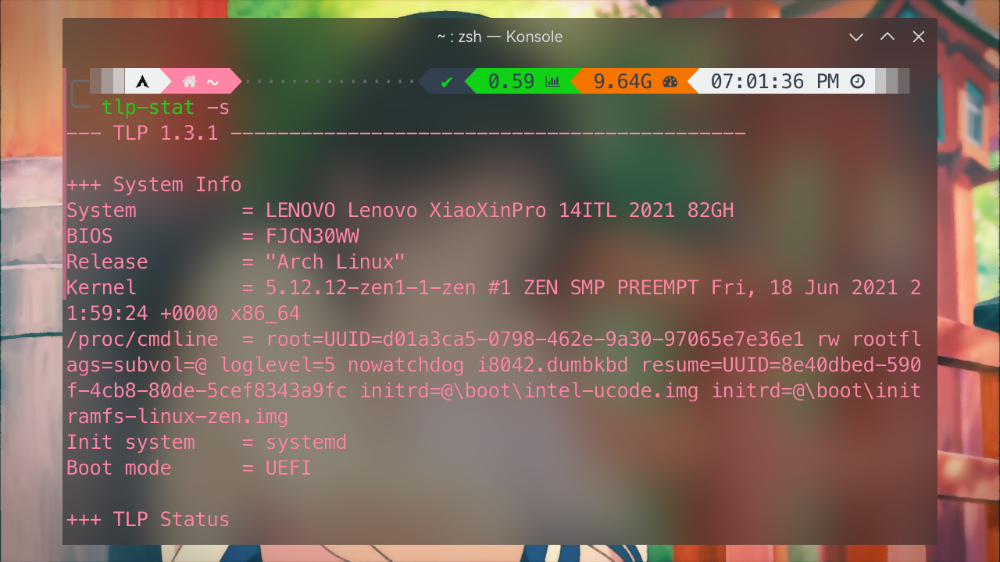
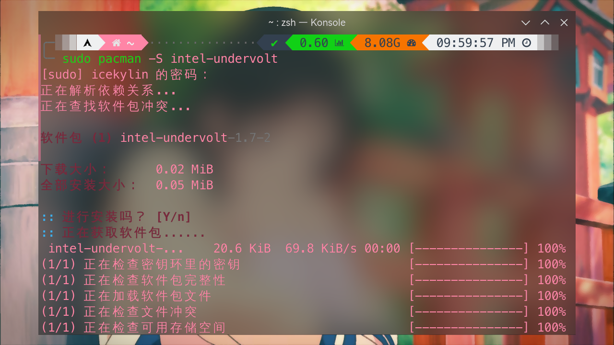

# 功耗控制

> ### ⚡️ 千山鸟飞绝，万径人踪灭
>
> 针对散热不好的设备或者续航能力不佳的笔记本，功耗控制显得非常必要

## 使用 TLP 延长电池寿命及续航

> 🔗 相关链接：
>
> 如有需要可参阅 [TLP 官方文档](https://linrunner.de/tlp/settings/index.html) 和 [ArchWiki 相关内容](<https://wiki.archlinux.org/title/TLP_(%E7%AE%80%E4%BD%93%E4%B8%AD%E6%96%87)>)。

多年来，Linux 在电池优化方面取得了很大进步，但仍然有一些可选步骤改善笔记本电脑的电池寿命并且延长续航。

TLP 作为一款自由开源的高级电源管理工具提供开箱即用的默认配置。同时也可以高度定制化，以满足特定需求。

### 安装与配置

1. 安装 [TLP](https://linrunner.de/tlp/index.html)<sup>extra / aur</sup>、[`tlp-rdw`](https://archlinux.org/packages/extra/any/tlp-rdw/)<sup>extra / aur</sup> 以及可选安装图形界面 [TLPUI](https://github.com/d4nj1/TLPUI)<sup>aur</sup>：

   ::: code-group

   ```bash [extra]
   sudo pacman -S tlp tlp-rdw
   ```

   ```bash [aur (git)]
   yay -S tlp-git tlp-rdw-git
   ```

   :::

   ::: code-group

   ```bash [aur]
   yay -S tlpui
   ```

   ```bash [aur (git)]
   yay -S tlpui-git
   ```

   :::

   ::: tip ℹ️ 提示

   另外请参阅 [Smartmontools](/guide/advanced/system-ctl.html#smartmontools) 安装 Smartmontools 以显示 `tlp-stat` 中的 S.M.A.R.T. 数据。

   :::

   ::: tip ℹ️ 提示

   若是 ThinkPad 机型请查阅 [TLP 官方安装说明](https://linrunner.de/tlp/installation/arch.html#thinkpads-only)。

   :::

2. 相关服务设置：

   ```bash
   sudo systemctl enable tlp.service
   sudo systemctl enable NetworkManager-dispatcher.service
   sudo systemctl mask systemd-rfkill.service # 屏蔽以下服务以避免冲突，确保 TLP 无线设备的开关选项可以正确运行
   sudo systemctl mask systemd-rfkill.socket
   ```

3. 安装后，TLP 将在开机时自动启动。为了避免第一次重启系统，可以使用以下命令手动启动：

   ```bash
   sudo tlp start
   ```

   ::: tip ℹ️ 提示

   还可以使用此命令在编辑配置后应用更改。

   所有 TLP 设置都存储在 `/etc/tlp.conf` 中。一般情况下默认配置即可满足需求。

   :::

::: tip ℹ️ 提示

若安装了 TLPUI 可在图形界面进行相关配置。语言可在菜单栏 `Language` 处更改：


:::

### 使用 TLP 显示相关系统信息

通过 TLP 相关命令也可查看系统信息：

```bash
sudo tlp-stat -b # 显示电池信息
sudo tlp-stat -d # 显示磁盘信息
sudo tlp-stat -e # 显示 PCI 设备信息
sudo tlp-stat -g # 显示 GPU 信息
sudo tlp-stat -p # 显示 CPU 信息
tlp-stat -s # 显示系统数据信息 / 验证 TLP 服务运行状况
```



## 电压下探

> 🔗 相关链接：
>
> 如有需要可参阅 [ArchWiki 相关内容](https://wiki.archlinux.org/index.php/Undervolting_CPU)。

对处理器的电压进行最大限度的下探，在挖掘 CPU 体质的极限的同时，起到既能降低发热，又能最大限度保持性能的效果。

如果正常操作，降低电压**一般**不会损害 CPU，一般建议从 50 毫伏进行尝试，每次降压尝试多增加 10 毫伏。只要确保在降低电压前，系统中任务均被正确保存即可。

::: tip ℹ️ 提示

以下方法**仅适用于 Intel 四代酷睿 ™ Haswell 及更新 CPU**。有关 AMD CPU 和 Intel 四代酷睿 ™ Haswell 之前的 CPU 请参考 [ArchWiki 相关内容](https://wiki.archlinux.org/index.php/Undervolting_CPU)。

:::

使用 [`intel-undervolt`](https://github.com/kitsunyan/intel-undervolt)<sup>extra / aur</sup> 即可降压。

::: danger ☢️ 警告

`intel-undervolt` 可能会损坏您的硬件，因为它使用了一些逆向工程得到的方法。

使用它的风险自负。

:::

1. 安装 `intel-undervolt`：

   ::: code-group

   ```bash [extra]
   sudo pacman -S intel-undervolt
   ```

   ```bash [aur (git)]
   yay -S intel-undervolt-git
   ```

   :::

   

2. 编辑 `intel-undervolt.conf` 配置文件：

   ```bash
   sudo vim /etc/intel-undervolt.conf
   ```

   对于其配置文件中降压部分的五个参数含义如下:

   - `0` —— CPU 核心电压
   - `1` —— CPU 核芯显卡电压
   - `2` —— CPU 缓存电压
   - `3` —— 系统周边电压，与内存等设备相关
   - `4` —— 模拟 I/O 电压

   

   一般来说只调整 `0`（CPU 核心电压）和 `2`（CPU 缓存电压）两项电压即可。

3. 保存并退出 vim，使用以下命令应用配置：

   ```bash
   sudo intel-undervolt apply # 应用配置
   sudo intel-undervolt read # 复查是否成功降压
   ```

4. 可以尝试使用 [s-tui](https://archlinux.org/packages/extra/any/s-tui/) 这个工具进行烤机测试，同时观察温度、频率、TDP 的数据。

5. 在调整到一个合适的降压配置后，开启 `intel-undervolt.service` 服务即可：

   ```bash
   sudo systemctl enable --now intel-undervolt
   ```

## 降低功率墙

除了电压的下探，同时也可以尝试对处理器的功率墙（TDP）做出降低的限制。比如考虑这种情况 —— 在 CPU 满睿频时，其实不需要默认的那么多功耗来维持，也许在默认功耗的基础上减几瓦，也能维持满睿频，这样就又可以进一步降低温度。对功率墙进行限制不同于对电压进行下探，若限制功率墙的参数较低，这会不可避免的损失较多的性能，但是在散热过差的设备上这也是一个好办法。

对于功率墙的调整，有些主板在 BIOS 中提供了设置项可以直接调整。对于没有设置项的主板，有的主板是锁定了瞬时和长时功率墙，这种情况就无法调整功率墙了。有的主板 BIOS 随没有提供功率墙调整项，但依旧可以通过命令行设置。

通过以下的命令可以查看主板是否可以调整功率墙：

```bash
grep . /sys/class/powercap/intel-rapl/intel-rapl:0/* 2> /dev/null
```

如果在输出中看到了如下的 `enable` 值为 `1`，即可以调整。第一行的数字代表现有的功率墙限制：

```bash {2}
/sys/class/powercap/intel-rapl/intel-rapl:0/constraint_0_power_limit_uw:100000000
/sys/class/powercap/intel-rapl/intel-rapl:0/enabled:1
```

具体的调整步骤参考 [askubuntu](https://askubuntu.com/questions/1226254/set-max-tdp-of-intel-h-series-cpu)。

::: tip ℹ️ 提示

此外，`intel-undervolt` 也可直接进行功率墙限制。

如看到 `package power limit is locked`，则说明这台电脑不可更改功率墙。

:::
