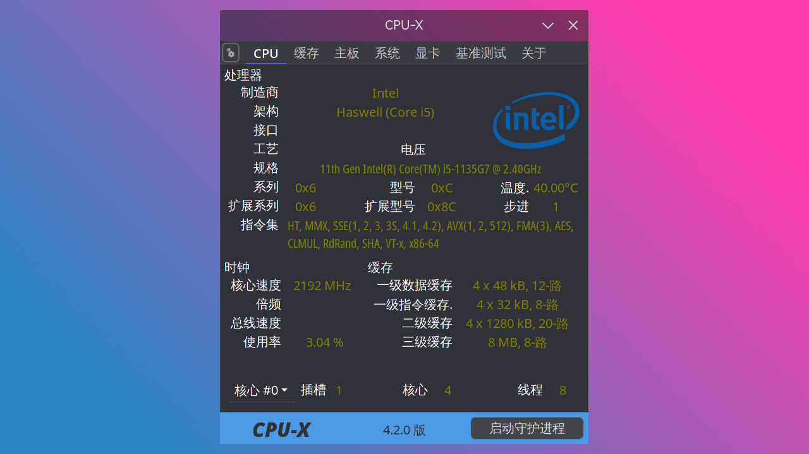

# Linux 日常操作与基础知识

> ### 🐱‍🚀 路漫漫其修远兮，吾将上下而求索
>
> 阅读完 🌱 新手上路章节，你的系统已完全可以使用
>
> KDE 桌面环境提供了强大的 [GUI](https://zh.wikipedia.org/wiki/%E5%9B%BE%E5%BD%A2%E7%94%A8%E6%88%B7%E7%95%8C%E9%9D%A2) 以供普通用户使用
>
> 绝大多数系统设置项可在 KDE 系统设置中找到（就像 Windows 一样！）
>
> 但如果想要游刃有余的掌控你的系统，你还需要阅读掌握本小节的内容

::: tip ℹ️ 提示

如果你想进一步详细了解本文各部分的详细知识，可以点击在各个小节给出的相关链接进行学习。

如果你不想详细了解，本章介绍的知识也足够你来应付日常的使用。

:::

## 必须掌握的 Linux 知识

此处只介绍最基本的，最必要的 Linux 知识点与小技巧。

1. 在 Linux 中，文件目录结构与 Windows 完全不同。Windows 存在 C 盘、D 盘等盘符，而在 Linux 中不存在这些划分。最上层的目录是根目录，路径为 `/` ，并以一个树形结构从此向下一级一级区分
2. 对于 Linux 的树形文件结构，存在相对路径与绝对路径之分：

   - 绝对路径代表从根目录 `/` 开始的完整路径：

     - 比如 `/home/myusername/Download`

   - 相对路径代表从当前目录或当前目录的上级目录，到目标目录的一个部分路径：

     - `.` 代表当前目录
     - `..` 代表当前目录的上级目录
     - 比如当前你所在的目录为 `/home/myusername` ，那么绝对路径下的 `/home/myusername/Download` 文件夹的相对路径即为 `./Download`

     - 比如你当前所在的路径为 `/home/myusername/Download` ，向上寻找到 `/home/myusername/Desktop` 的相对路径即为 `../Desktop`

3. 简单来说，Linux 中存在两类用户：

   - 第一类用户即为 root 用户，也称为超级用户，它拥有系统中最高的权限
   - 第二类用户就是除了 root 用户之外的普通用户，它们可以拥有不同等级的权限

     使用 root 权限时需要十分小心

4. 理论上来说，任何图形化界面中的操作都可以用对应的命令行命令完成。如果你打开某个程序报错，不妨试试找到它的对应启动命令，在终端中执行此命令，并观察它运行时的错误日志输出，查阅相关资料，解决问题
   
5. 不能未经辨别执行来源不明的命令。举个例子：

   ::: danger ☢️ 警告

   该命令具有高危险性，请勿执行。

   :::
   
   ```sh
   echo "c3VkbyBybSAtcmYgLyo=" | base64 -d | zsh
   ```
   它的含义是让 zsh 执行 `sudo rm -rf /*`, 会摧毁整个系统。
   
## 终端操作基础

如果想要熟练掌握 Linux，就必须掌握终端的常见命令与使用方式。

```bash
ls /some_path # 查看某个文件夹下的文件与子文件夹。/ 代表根目录，是 Linux 最顶端的路径，以此开头则为绝对路径
pwd # 查看当前终端所在路径
cat /home/testuser/testfile # 以输出流方式查看某个文件
cd /home/testuser # 切换目录命令。将当前终端切换到某一个路径下
cp ./a.py ./b.py # 复制命令。将当前路径下的 a.py 复制一份并命名为 b.py。./ 代表当前文件夹所在路径，以此开头则为相对路径
cp -r ./a ./b # 复制整体文件夹
rm b.py # 删除命令。删除 b.py
mv a.py b.py # 移动（重命名）命令。将 a.py 更名为 b.py
mkdir my_folder # 新建名为 my_folder 的文件夹
sudo some_command # 使普通用户以 root 权限执行某些命令
```

> 🔗 相关链接：
>
> - [Linux 命令行与 Shell 脚本教程](https://archlinuxstudio.github.io/ShellTutorial/#/)

## Pacman 包管理

在 archlinux 上安装的软件都通过 Pacman 来进行管理。

为了使用 Pacman 额外的命令需要先安装 [ `pacman-contrib` ](https://archlinux.org/packages/extra/x86_64/pacman-contrib/)<sup>extra / aur</sup>。

安装 `pacman-contrib` ：

::: code-group

```bash [extra]
sudo pacman -S pacman-contrib
```

```bash [aur (git)]
yay -S pacman-contrib-git
```

:::

可以把 Pacman 理解为一个软件管理器（软件管家？），可以进行软件的安装、删除、查询等：

```bash {1-4, 6-8, 10}
sudo pacman -S package_name # 安装软件包
pacman -Ss # 在同步数据库中搜索包，包括包的名称和描述
sudo pacman -Syu # 升级系统。 -y:标记刷新、-yy：标记强制刷新、-u：标记升级动作（一般使用 -Syu 即可）
sudo pacman -Rns package_name # 删除软件包，及其所有没有被其他已安装软件包使用的依赖包
sudo pacman -R package_name # 删除软件包，保留其全部已经安装的依赖关系
pacman -Qi package_name # 检查已安装包的相关信息。-Q：查询本地软件包数据库
pacman -Qdt # 找出孤立包。-d：标记依赖包、-t：标记不需要的包、-dt：合并标记孤立包
sudo pacman -Rns $(pacman -Qtdq) # 删除孤立包
sudo pacman -Fy # 更新命令查询文件列表数据库
pacman -F some_command # 当不知道某个命令属于哪个包时，用来在远程软件包中查询某个命令属于哪个包（即使没有安装）
pactree package_name # 查看一个包的依赖树

```

> 🔗 相关链接：
>
> - [ArchWiki 相关内容](<https://wiki.archlinux.org/title/Pacman_(%E7%AE%80%E4%BD%93%E4%B8%AD%E6%96%87)>)
>
> 关于 Pacman 常见错误的排除请参阅 [常见问题](debug.md)。

::: danger ☢️ 警告

部分 Pacman 命令具有危险性，请谨慎执行。

:::

::: tip ℹ️ 提示

yay 的用法和 Pacman 是基本一样的。有额外几条常用命令：

```bash {1-3}
yay # 等同于 yay -Syu
yay package_name # 等同于 yay -Ss package_name && yay -S package_name
yay -Ps # 打印系统统计信息
yay -Yc # 清理不需要的依赖
```

:::

### Octopi

此外，还可以使用图形化的包管理软件（Pacman / yay 的图形前端）[Octopi](https://github.com/aarnt/octopi)<sup>aur</sup>。

1. 安装 Octopi：

::: code-group

```bash [aur]
   yay -S octopi
```

```bash [aur (git)]
   yay -S octopi-git
```

:::

2. 打开 Octopi 即可看到图形化的 Pacman / yay 界面：


> 🔗 相关链接：
>
> - [ArchWiki 相关内容](https://wiki.archlinux.org/index.php/Pacman)

### downgrade

由于 archlinux 的更新策略很激进, 导致某些软件过新, 而一些依赖并没有支持, 比如著名的[virtualbox 在 linux5.18 内核下的崩溃](https://bugs.archlinux.org/task/74900) , 所以有时候我们不得不安装过时的软件或者降级已安装的软件。

在 archlinux 上安装旧版软件都通过 downgrade 来进行管理。

为了使用 downgrade 额外的命令需要先安装 [ `downgrade` ](https://aur.archlinux.org/packages/downgrade)<sup>aur</sup>。

```bash
yay -S downgrade
```

这时我们就可以用 downgrade 降级软件了


## 终端编辑器 vim 的使用

我们需要掌握一个能在终端中进行文本编辑的软件，这里介绍 vim。

1. 创建并编辑名为 `hello.txt` 的文件：

```bash
   vim hello.txt
```

2. 此时可以看到进入了一个空的界面：


- 此时处在 vim 的 `命令模式` 。在 `命令模式` 下，可以用一些快捷指令来对文本进行操作
- 输入 `a` 进入 vim 的 `编辑模式` ，此时即可输入任意文本进行编辑
- 在输入完成后按下 Esc 键，即可从 `编辑模式` 退出到 `命令模式` 。此时输入 `:wq` 即可保存并退出 vim

下面介绍一些在命令模式下常用的命令：

- `:wq` —— 保存退出
- `:q!` —— 不保存，强制退出
- `dd` —— 删除一行
- `2dd` —— 删除两行
- `gg` —— 回到文本第一行
- `shift` + `g` —— 转到文本最后一行
- `/xxx` —— 在文中搜索 xxx 内容。回车 `Enter` 搜索，按 `n` 键转到下一个
- `?xxx` —— 反向搜索

::: tip ℹ️ 提示

可以在终端中输入以下命令来学习完整的 vim 教程：

```bash
vimtutor
```


:::

## 系统服务的介绍与操作

Linux 系统中运行着各种服务，你需要掌握查询，变更服务状态的方式。同时对创建服务最好也有大致的了解。

这里讲述命令 `systemctl` 的用法。以 `dhcpcd` 服务为例：

```bash
systemctl start dhcpcd # 启动服务
systemctl stop dhcpcd # 停止服务
systemctl restart dhcpcd # 重启服务
systemctl reload dhcpcd # 重新加载服务以及它的配置文件
systemctl status dhcpcd # 查看服务状态
systemctl enable dhcpcd # 设置开机启动服务
systemctl enable --now dhcpcd # 设置服务为开机启动并立即启动这个单元
systemctl disable dhcpcd # 取消开机自动启动
systemctl daemon-reload dhcpcd # 重新载入 systemd 配置。扫描新增或变更的服务单元、不会重新加载变更的配置
```

> 🔗 相关链接：
>
> - [ArchWiki 相关内容](https://wiki.archlinux.org/index.php/Systemd#Basic_systemctl_usage)
> - [systemd 配置文件样例解释](https://www.freedesktop.org/software/systemd/man/systemd.service.html#Examples)
>
> 关于关闭出错服务（出错启动项）请参阅 [常见问题](debug.md)。

## 文件解压缩

除了众所周知的 `tar` 命令，我们在之前安装过的 `ark` 包可以配合 Dolphin 文件管理器轻松的右键压缩包直接解压。其可选依赖提供了各个压缩格式的支持，可以自行选择安装。

但是使用此方法解压 Windows 下的压缩包可能会乱码。使用 [Unarchiver](https://archlinux.org/packages/extra/x86_64/unarchiver/) 可以避免这个问题。

1. 安装 Unarchiver：

```bash
sudo pacman -S unarchiver
```

2. 解压压缩包：

```bash
unar xxx.zip
```

## 磁盘空间信息

### df 命令

使用 `df` 命令即可显示目前在 Linux 系统上的文件系统对应的磁盘空间使用情况统计：

```bash
df -h # 以人类可读格式显示
```

### Filelight

使用 [Filelight](https://github.com/KDE/filelight)<sup>extra / aur</sup> 即可在图形化界面直观查看磁盘占用情况。

1. 安装 Filelight：

::: code-group

```bash [extra]
sudo pacman -S filelight
```

```bash [aur (git)]
yay -S filelight-git
```

:::

2. 打开 Filelight 即可直观的看到空间占用情况：


::: tip ℹ️ 提示

点击相应区块即可进一步深入分析。

:::

## 磁盘空间清理

有时需要对磁盘空间进行清理，以免磁盘空间不足，从而保证系统的正常运行。

首先应通过上文介绍的内容 [磁盘空间信息](/guide/system-ctl.md#磁盘空间信息) 对磁盘空间占用情况进行分析，随后采取对应的有效应对措施。

下面介绍一些通用措施。

### 清理软件包缓存及孤立包

执行以下命令清理软件包文件缓存及删除孤立软件包：

```bash {1-2, 4}
sudo pacman -Rns $(pacman -Qtdq) # 如上文所述，删除孤立软件包（常用）
sudo pacman -Sc # 删除当前未安装的所有缓存包和未使用的同步数据库（可选）
sudo pacman -Scc # 从缓存中删除所有文件，这是最激进的方法，不会在缓存文件夹中留下任何内容（一般不使用）
paccache -r # 删除已安装和未安装包的所有缓存版本，但最近 3 个版本除外

```

还可以在 `/etc/pacman.d/hooks` 文件夹下创建 `clean_package_cache.hook` 文件来在使用 `pacman` 时自动执行 `paccache`。

```bash
[Trigger]
Operation = Upgrade
Operation = Install
Operation = Remove
Type = Package
Target = *

[Action]
Description = Cleaning pacman cache...
When = PostTransaction
Exec = /usr/bin/paccache -rk 2
```

### 清理 yay 缓存

如果使用了 yay 来安装 AUR 中的软件包的话，可以选择清理 yay 的缓存目录：

```bash
rm -rf ~/.cache/yay
```

### 考虑快照大小

若在步骤 [13. 设置 Timeshift 快照](../rookie/desktop-env-and-app.md#_13-设置-timeshift-快照) 中没有使用 BTRFS 方式的 Timeshift 快照，而是使用了 RSYNC 方式的 Timeshift 快照，还应考虑 Timeshift 快照占用情况。

一般来说 RSYNC 方式的快照大小略大于当前实际使用大小。因为虽然 RSYNC 方式的快照是增量的，但**历史最久远的快照依然是完整备份**，随后才是增量的。而简单来说增量大小取决于历史最久远的快照和最新快照之间的差异。

通过 Timeshift 自动清理历史最久远的快照是简单有效的方法，但仍然需要注意不要保存太多快照。

## 硬件信息检测

### 磁盘信息

#### Smartmontools

[Smartmontools](https://archlinux.org/packages/extra/x86_64/smartmontools/) 通过使用自我监控（Self-Monitoring）、分析（Analysis）和报告（Reporting）三种技术（缩写为 S. M. A. R. T 或 SMART）来管理和监控存储硬件。

1. 安装 Smartmontools：

```bash
sudo pacman -S smartmontools
```

2. 查看磁盘信息：

::: code-group

```bash [SATA]
sudo smartctl -A /dev/sdx # 硬盘
sudo smartctl -d sat -A /dev/sdx # USB 设备
```

```bash [NVME]
sudo smartctl -A /dev/nvmexn1 # 硬盘
sudo smartctl -d sat -A /dev/sdx # USB 设备
```

:::

### CPU 信息

类似 Windows 下的 [CPU-Z](https://www.cpuid.com/softwares/cpu-z.html)<sup>EULA</sup>，Linux 下有 [CPU-X](https://x0rg.github.io/CPU-X/)<sup>cn / aur</sup>。

1. 安装 CPU-X：

::: code-group

```bash [cn]
sudo pacman -S cpu-x
```

```bash [aur]
yay -S aur/cpu-x
```

```bash [aur (git)]
yay -S cpu-x-git
```

:::

2. 打开 CPU-X 即可看到 CPU 详细信息：



### GPU 信息

使用 [GPU-Viewer](https://github.com/arunsivaramanneo/GPU-Viewer)<sup>aur</sup> 即可。

1. 安装 GPU-Viewer：

```bash
yay -S gpu-viewer
```

2. 打开 GPU-Viewer 即可看到 GPU 详细信息：


### 硬件完整信息

使用 [Dmidecode](http://www.nongnu.org/dmidecode/)<sup>extra / aur</sup> 可以完整查看系统绝大部分硬件信息，包括较难得到的内存频率等。

1. 安装 Dmidecode：

::: code-group

```bash [extra]
sudo pacman -S dmidecode
```

```bash [aur (git)]
yay -S dmidecode-git
```

:::

2. 输入以下命令使用 Dmidecode 查看系统硬件信息：

```bash
sudo dmidecode
```

## 系统快照（备份）与文件传输

### 从 Timeshift 快照中恢复

::: tip ℹ️ 提示

Timeshift 还能恢复到其它硬盘用作系统迁移，通过 arch 安装盘重新安装引导即可，这里不再赘述。

:::

#### 若能够进入桌面环境 😎

直接打开 Timeshift，选择快照后根据提示还原即可。

#### 若无法进入桌面环境

1. 通过 `Ctrl` + `Alt` + `F2 ~ F6` 进入 tty 终端

2. 使用快照还原系统：

```bash
sudo timeshift --list # 获取快照列表
sudo timeshift --restore --snapshot '20XX-XX-XX_XX-XX-XX' --skip-grub # 选择一个快照进行还原，并跳过 GRUB 安装，一般来说 GRUB 不需要重新安装
```

3. 根据提示继续，完成还原

#### 若无法进入系统 😱

此时系统一般已经完全奔溃，可以通过 Live CD 进行还原。（若使用 arch 安装盘请连接网络和配置好源后安装 Timeshift，然后通过命令行方式还原）

1. 进入 Live 系统后打开 Timeshift，点击设置按钮，设置为原来快照的存储位置。
2. 选择快照后根据提示还原即可。

或者通过命令行进行还原，但需要首先设置原来快照存储的位置：

```bash
sudo timeshift --restore --snapshot-device /dev/sdbx
```

后续步骤同 [若无法进入桌面环境](#若无法进入桌面环境)。

#### 恢复后无法挂载目录

Timeshift 恢复 Btrfs 快照时，可能出现由于子卷 ID 变更导致无法挂载目录而无法进入系统。

此时可以通过手动修改 fstab 配置，移除 `subvolid` 参数，改为通过名称指定子卷。

使用 `vim` 编辑器修改 `/etc/fstab` 文件：

```bash
vim /etc/fstab
```

进行如下修改：

- 删除 `/` 和 `/home` 条目中最后的 `subvolid=xxx` 参数

保存后重启即可正常使用。以后恢复快照时无需再次进行此操作。

也可以手动更正 `subvolid` ，通过以下命令查看正确的 ID：

```bash
sudo btrfs sub list -u /
```

#### 恢复后无法挂载 boot

Timeshift 恢复 Btrfs 快照时，可能出现由于内核版本不一致导致无法挂载 boot 分区而无法进入系统。执行 `journalctl -xb` 查看，可能会发现 _unknown filesystem type 'vfat'_ error。这里给出一个解法：进入 archiso 并[联网](../rookie/basic-install.md#_3-连接网络)后，执行以下修复：

```bash
# 手动挂载子卷 / 和 /boot（nvmexnxpx 填写实际分区号）
mount -t btrfs -o subvol=/@,compress=zstd /dev/nvmexnxpx /mnt
mount /dev/nvmexnxpx /mnt/boot
# chroot
arch-chroot /mnt
# 更新内核与软件包
pacman -Syu linux
# 重启
reboot
```

#### 定时任务不生效

Timeshift 设定任务后定时不生效，那是因为相关的服务 `cron` 没有启动导致的问题。
在终端命令行下输入以下命令，第一行为设置开机启动，第二行为启动相关服务：

```bash
sudo systemctl enable --now cronie.service
sudo systemctl start --now cronie.service
```

### rsync 命令

有一点 Linux 经验的同学应该知道 `scp` 这个命令。它常被用来在服务器间传输文件。

但是目前它应该被更现代的工具 [rsync](https://rsync.samba.org/) 替代。其拥有即时压缩、差量传输等新特性。同时， `rsync` 也被用来进行备份操作（Timeshift 的 RSYNC 模式即基于此实现）。

```bash
rsync foo.txt me@server:/home/me/ # 最基础的复制文件。与 scp 的操作完全相同
rsync -a bar/ me@server:/home/me/ # -a：标记实现目录复制等。比 scp -r 能更好的处理符号链接等情况
```

> 🔗 相关链接：
>
> - [ArchWiki 相关内容](https://wiki.archlinux.org/index.php/Rsync#Full_system_backup)
