# archlinux 基础安装

> ### ⛵ 万事俱备，只欠东风
>
> 经过了上一节的准备工作，我们可以开始正式安装 archlinux 了。如果你还没有完成前面的阅读，请先仔细阅读章节 [安装前的准备](pre-install.md)。如果对本节的步骤不理解或者有疑问，请阅读下一节 [基础安装详解](basic-install-detail.md)

本节从安装最基础的、无图形化界面的 archlinux 系统开始。如有需要可以参阅 [ArchWiki 官方安装指南](<https://wiki.archlinux.org/title/Installation_guide_(%E7%AE%80%E4%BD%93%E4%B8%AD%E6%96%87)>)。

::: tip ℹ️ 提示

本节中的截图来自虚拟机和已经安装好的 archlinux。不用担心！和你在实体机看到的是一样的。

:::

::: warning ⚠️ 注意

请按照指南的步骤一步一步进行！不要跳步、也不要在步骤中添加多余的动作！

另外，如果安装中有报错，请弄清楚报错的原因（这要求你起码能看懂有报错）！常见的原因包括但不限于输错了命令、添加了多余的步骤等。在解决了问题之后再进行下一步！

:::

## 0. 进入安装环境


1. 在第一个选项回车


2. 进入安装环境后，便可以开始通过命令安装 archlinux 了

## 1. 禁用 reflector 服务

2020 年，archlinux 安装镜像中加入了 `reflector` 服务，它会自己更新 `mirrorlist`（软件包管理器 `pacman` 的软件源）。在特定情况下，它会误删某些有用的源信息。这里进入安装环境后的第一件事就是将其禁用。也许它是一个好用的工具，但是很明显，因为地理上造成的特殊网络环境，这项服务并不适合启用。

1. 通过以下命令将该服务禁用：

```zsh
systemctl stop reflector.service
```

2. 通过以下命令查看该服务是否被禁用，按下 `q` 退出结果输出：

```zsh
systemctl status reflector.service
```

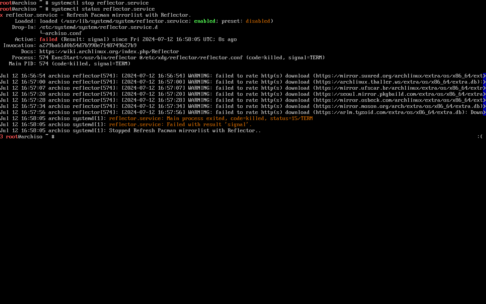

::: tip ℹ️ 提示

- 在命令行中你可以使用如下命令清屏：

  ```zsh
  clear
  ```

  同时，你可以使用 `Tab` 键在输入命令的时候对命令、参数或文件路径进行自动补全，提高效率的同时降低输入错误的风险。

- `Tab` 无法补全时，有些设备的蜂鸣器会发出“哔——”声，可以使用如下命令禁用蜂鸣器内核模块：

  ```zsh
  rmmod pcspkr
  ```
  
:::

## 2. 再次确认是否为 UEFI 模式

禁用 `reflector` 服务后，我们再来确认一下是否为 `UEFI` 模式：

```zsh
ls /sys/firmware/efi/efivars
```

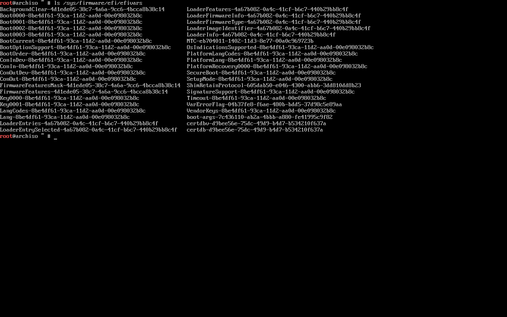

若输出了一堆东西（`efi` 变量），则说明已在 `UEFI` 模式。否则请确认你的启动方式是否为 `UEFI`。

## 3. 连接网络

::: tip ℹ️ 提示

archlinux 的安装**必须**要求网络环境。

:::

::: tip ℹ️ 提示

若为虚拟机且按照上一节 [虚拟机安装前的准备](pre-virt.md#_3-配置-virtualbox) 进行了配置；同时宿主机连接了网络，那么虚拟机应该已经连接网络了。

:::

### 若使用**无线连接**

使用 `iwctl` 进行连接：

```zsh {2,4}
iwctl # 进入交互式命令行
device list # 列出无线网卡设备名，比如无线网卡看到叫 wlan0
station wlan0 scan # 扫描网络
station wlan0 get-networks # 列出所有 wifi 网络
station wlan0 connect wifi-name # 进行连接，注意这里无法输入中文。回车后输入密码即可
exit # 连接成功后退出
```

::: tip ℹ️ 提示

若无线网卡无法显示，请按照上一节 [确保网络环境](pre-install.md#_1-确保网络环境) 的说明**确保你的无线网卡硬件开关处于打开状态**。

你可以使用如下命令查看内核是否加载了你的无线网卡驱动。

```zsh
lspci -k | grep Network
```

以我的硬件为例，输出如下：

```zsh
00:14.3 Network controller: Intel Corporation Wi-Fi 6 AX201 (rev 20)
```

如果你的 BIOS 没有开启无线网卡的开关可以参考下列的命令来开启 `WIFI`

```zsh
rfkill list #查看无线连接 是否被禁用(blocked: yes)
ip link set wlan0 up #比如无线网卡看到叫 wlan0
```

若看到类似`Operation not possible due to RF-kill`的报错，继续尝试`rfkill unblock wifi`来解锁无线网卡。

```zsh
rfkill unblock wifi
```

部分无线网卡不兼容，请考虑使用有线连接安装 archlinux。

:::

### 若使用**有线连接**

正常来说，只要插上一个已经联网的路由器分出的网线（DHCP），直接就能联网。

可以等待几秒等网络建立连接后再进行下一步测试网络的操作。

若笔记本没有网线接口请使用带网线接口的扩展坞。

## 4. 测试网络连通性

通过 `ping` 命令测试网络连通性：

```zsh
ping www.bilibili.com
```

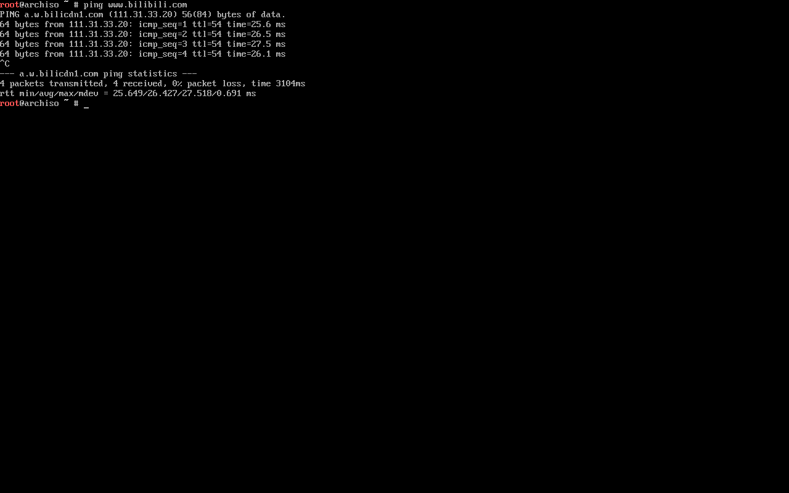

稍等片刻，若能看到数据返回，即说明已经联网。与 Windows 不同的是，需要按下 `Ctrl` + `C` 手动退出 `ping` 命令。

::: tip ℹ️ 提示

如果无线网络还是无法连接，请使用 `ip link` 命令查看无线网卡设备，使用 `ip link set <设备名> up` 命令激活对应的无线网卡。若看到类似 `Operation not possible due to RF-kill` 的报错，继续尝试 `rfkill unblock wifi` 来解锁无线网卡。

如有需要，可以参考 [ArchWiki 相关内容](<https://wiki.archlinux.org/title/Network_configuration_(%E7%AE%80%E4%BD%93%E4%B8%AD%E6%96%87)/Wireless_(%E7%AE%80%E4%BD%93%E4%B8%AD%E6%96%87)#%E6%A3%80%E6%9F%A5%E8%AE%BE%E5%A4%87%E7%8A%B6%E6%80%81>)。

:::

## 5. 更新系统时钟

使用 `timedatectl` 确保系统时间是准确的。这一步**不是**可选的，正确的系统时间对于部分程序来说非常重要：

```zsh
timedatectl set-ntp true # 将系统时间与网络时间进行同步
timedatectl status # 检查服务状态
```


## 6. 更换国内软件仓库镜像源加快下载速度

使用 `vim` 编辑器修改 `/etc/pacman.d/mirrorlist` 文件。将 `pacman` 软件仓库源更换为国内软件仓库镜像源：

```zsh
vim /etc/pacman.d/mirrorlist
```

::: tip ℹ️ 提示

如果不会使用 `vim` 编辑器，请参阅 [这里](../advanced/system-ctl.md#终端编辑器-vim-的使用)。

`vim` 编辑器在安装和配置系统的过程中还需要使用多次。

:::

放在最上面的是会使用的软件仓库镜像源，推荐的镜像源如下：

```mirrorlist {1}
Server = https://mirrors.ustc.edu.cn/archlinux/$repo/os/$arch # 中国科学技术大学开源镜像站
Server = https://mirrors.tuna.tsinghua.edu.cn/archlinux/$repo/os/$arch # 清华大学开源软件镜像站
Server = https://repo.huaweicloud.com/archlinux/$repo/os/$arch # 华为开源镜像站
Server = http://mirror.lzu.edu.cn/archlinux/$repo/os/$arch # 兰州大学开源镜像站
```

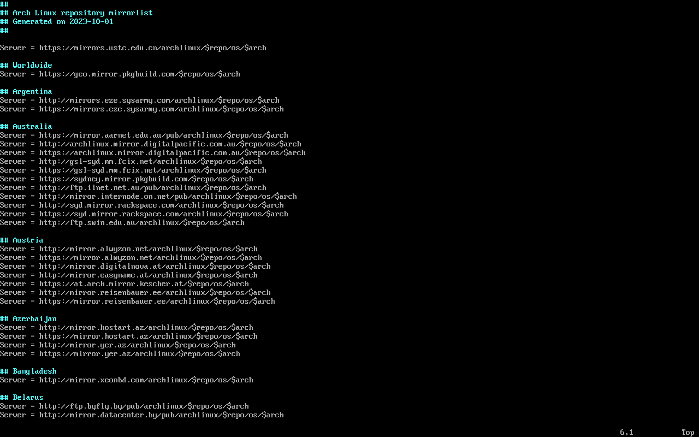

修改完成的 `/etc/pacman.d/mirrorlist` 文件如图所示。

::: tip ℹ️ 提示

如果发现 `/etc/pacman.d/mirrorlist` 是如图这个样子的，那么说明你禁用 `reflector` 服务晚了。`reflector` 已经自动帮你生成了新的软件仓库镜像源列表。不过没有关系，手动将国内软件仓库镜像源放在最前面即可。

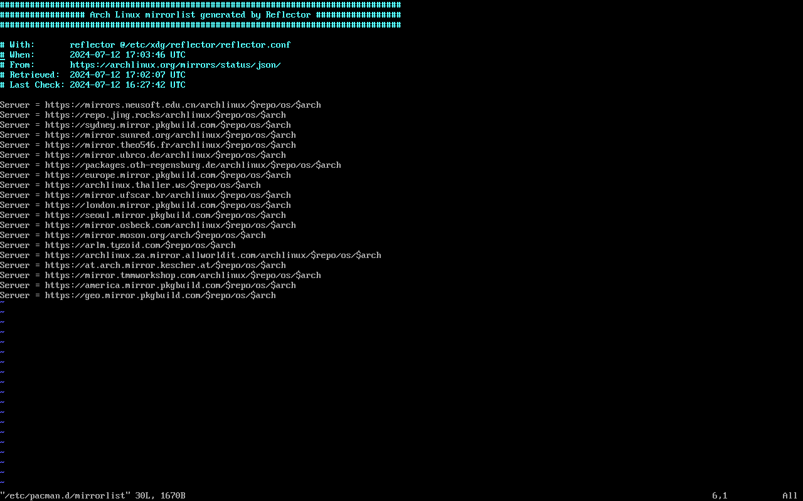

:::

::: warning ⚠️ 注意

前车之鉴 —— 请不在这一步中添加 `archlinuxcn` 源！如果你在 `/etc/pacman.conf` 中添加了内容，请将它们删掉。

:::

## 7. 分区和格式化（使用 Btrfs 文件系统）

### 7-1. 分区

::: tip ℹ️ 提示

虚拟机安装请同时参阅步骤 [🆕 全新安装](basic-install-detail.md#🆕-全新安装)。

分区步骤对于有些人来说是个难点，如果有不理解的地方请参阅下一节 [基础安装详解](basic-install-detail.md#💾-分区和格式化)。

同时，分区其它说明也会在下一节 [基础安装详解](basic-install-detail.md#💾-分区和格式化) 详细列出。

:::

::: danger ☢️ 警告

分区操作的部分命令具有危险性！除非你知道每一个命令在干什么，否则请不要执行！

同时，请提前做好数据备份，防止数据丢失！

:::

本指南考虑到多数情况，在这里首先介绍 win10 和 archlinux 在一个磁盘上双系统的分区配置。

- `/` 根目录：`>= 128GB`（和用户主目录在同一个 `Btrfs` 文件系统上）
- `/home` 用户主目录：`>= 128GB`（和根目录在同一个 `Btrfs` 文件系统上）
- `/boot` EFI 分区：`256MB`（由电脑厂商或 Windows 决定，无需再次创建）
- Swap 分区：`>= 电脑实际运行内存的 60%`（设置这个大小是为了配置休眠准备）

::: tip ℹ️ 提示

因为采用 `Btrfs` 文件系统，所以根目录和用户主目录实际在一个分区上，只是在不同的子卷上而已。这里根目录和用户主目录的大小仅为参考，一般来说日常使用的 linux 分配 128GB 已经够用了。

:::

1. 通过 `lsblk` 命令，区分要安装 archlinux 的磁盘（通过观察磁盘的大小、已存在的分区情况等判断）并显示当前磁盘的分区情况：

```zsh
lsblk # 显示当前分区情况
```


此处要分区和安装 archlinux 的磁盘即为 `sda`。请根据你的实际情况判断！

::: tip ℹ️ 提示

为了模拟真实的环境，笔者手动创建了三个分区分别代表：

1. `sda1` —— EFI 分区
2. `sda2` —— win10 下的 C 盘（象征性的分了 `1GB`）
3. `sda3` —— win10 下的 D 盘（象征性的分了 `1GB`）

:::

::: tip ℹ️ 提示

注意此处并不会显出出未分配的磁盘空间！只有在使用 `cfdisk` 执行分区操作后才会显示出来。

:::

::: tip ℹ️ 提示

如果你的硬盘是 NVME 协议的固态硬盘，那么将不是 `sdx` 而是 `nvmexn1`。

:::

2. 接下来使用 `cfdisk` 命令对磁盘分区（对于 SATA 协议的硬盘，`x` 为字母 `a`、`b` 或 `c` 等等；对于 NVME 协议的硬盘，`x` 为数字 `0`、`1` 或 `2` 等等，请根据实际情况判断）：

::: code-group

```zsh [SATA]
cfdisk /dev/sdx # 对安装 archlinux 的磁盘分区
```

```zsh [NVME]
cfdisk /dev/nvmexn1 # 对安装 archlinux 的磁盘分区
```

:::

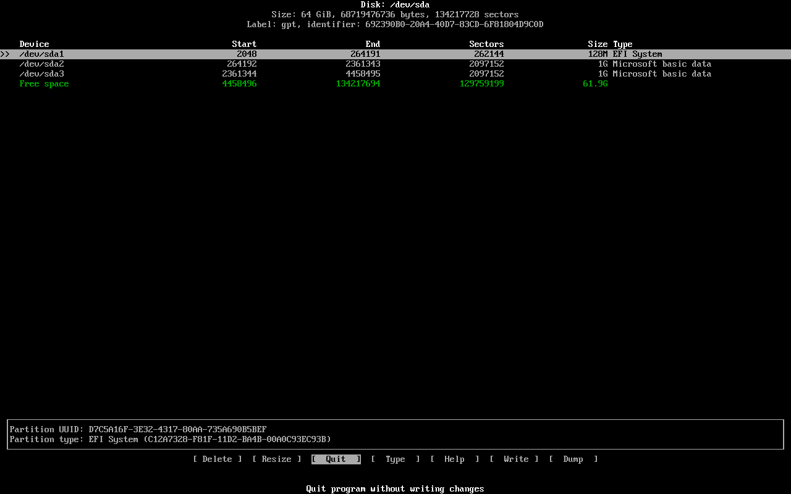

进入 `cfdisk` 分区工具之后，你会看到如图所示的界面。通过方向键 `↑` 和 `↓` 可以在要操作磁盘分区或空余空间中移动；通过方向键 `←` 和 `→` 在对当前高亮的磁盘分区或空余空间要执行的操作中移动。

3. 首先创建 Swap 分区。选中 `Free space` > 再选中操作 `[New]` > 然后按下回车 `Enter` 以新建 `swap` 分区（类似 Windows 的交换文件）

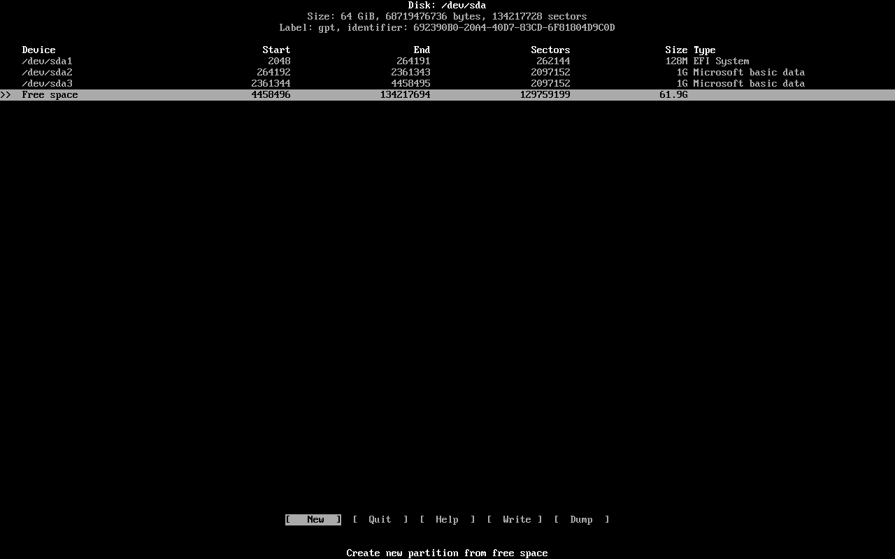

4. 按下回车后会提示输入 `分区大小`，Swap 分区建议为**电脑内存大小的 60%**，或者和内存大小相等 > 然后按下回车 `Enter`

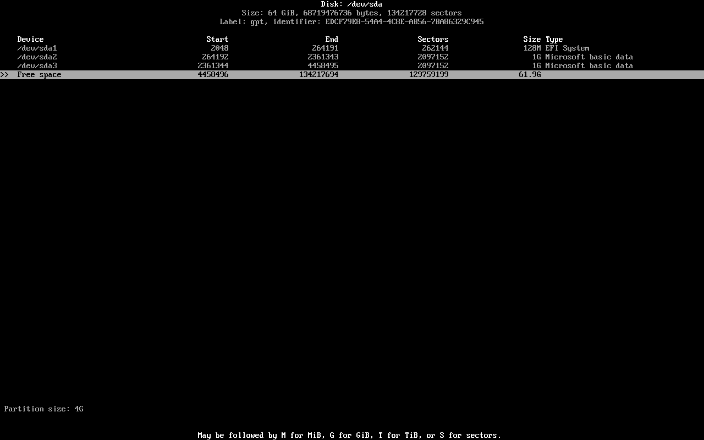

::: tip ℹ️ 提示

单位可以自行输入，如 `GB`、`MB` 等等。

:::

5. 默认新建的类型是 `Linux filesystem`，我们需要将类型更改为 `Linux swap`。选中操作 `[Type]` > 然后按下回车 `Enter` > 通过方向键 `↑` 和 `↓` 选中 `Linux swap` > 最后按下回车 `Enter`

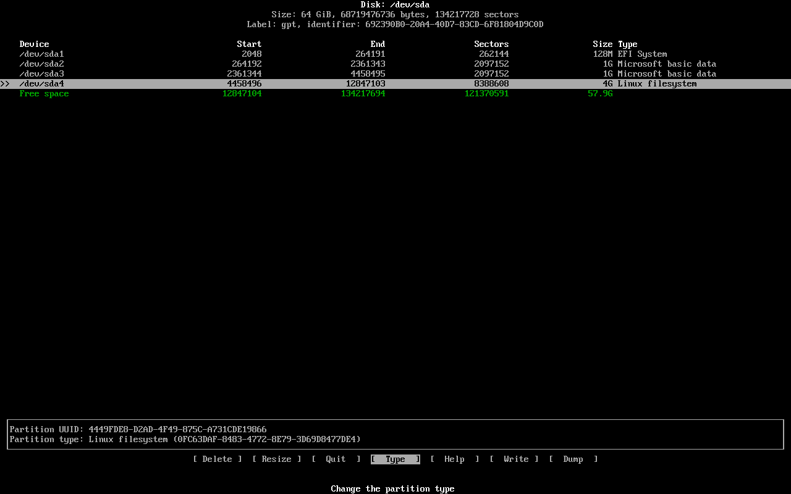

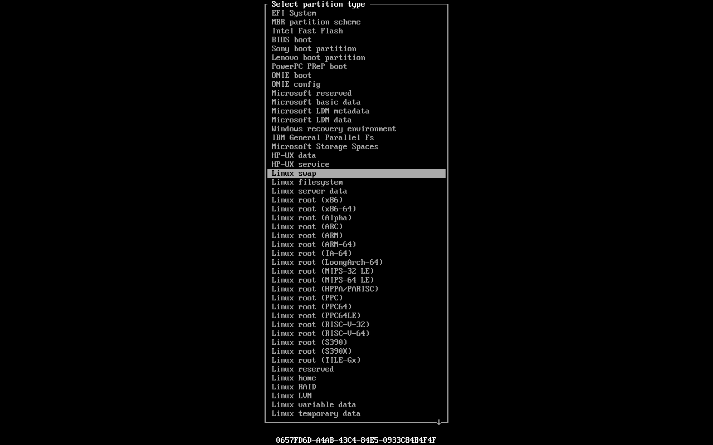

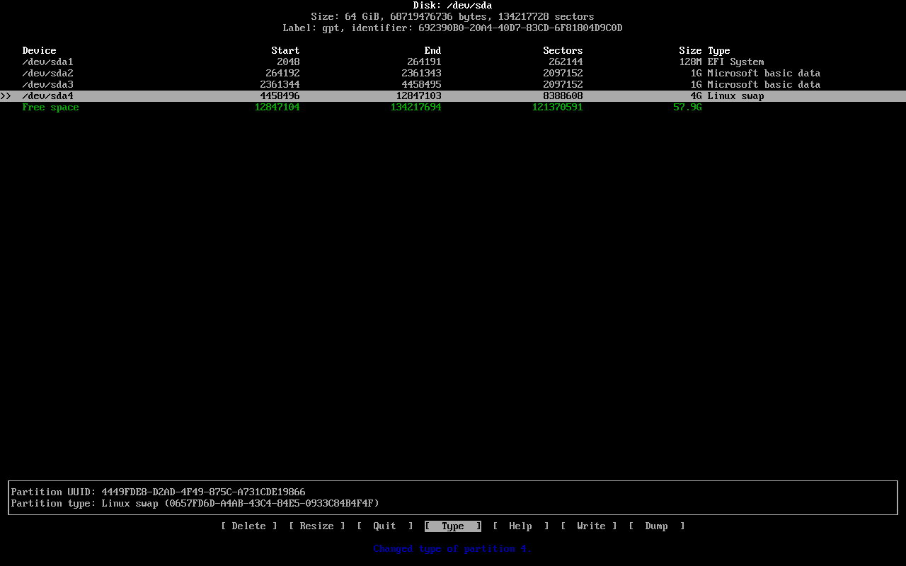

6. 我们再只需要一个分区即可（因为使用 `Btrfs` 文件系统，所以根目录和用户主目录在一个分区上），所以类似的：选中 `Free space` > 再选中操作 `[New]` > 然后按下回车 `Enter` 以新建分区

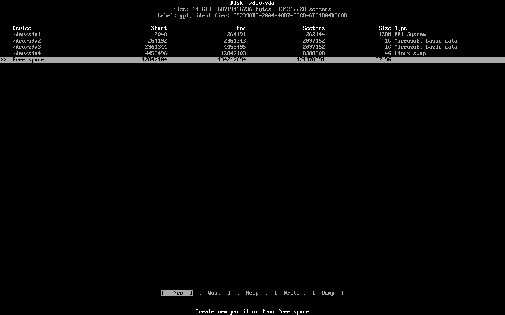

7. 输入 `分区大小`（默认是剩余的全部空间。请根据实际情况输入）> 然后按下回车 `Enter`

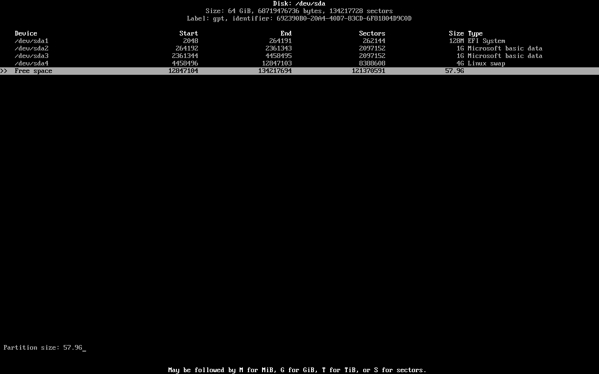

8. 分区类型默认即可，无需更改。接下来选中操作 `[Write]` 并回车 `Enter` > 输入 `yes` 并回车 `Enter` 确认分区操作

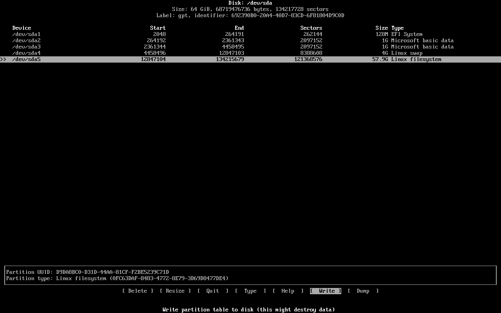

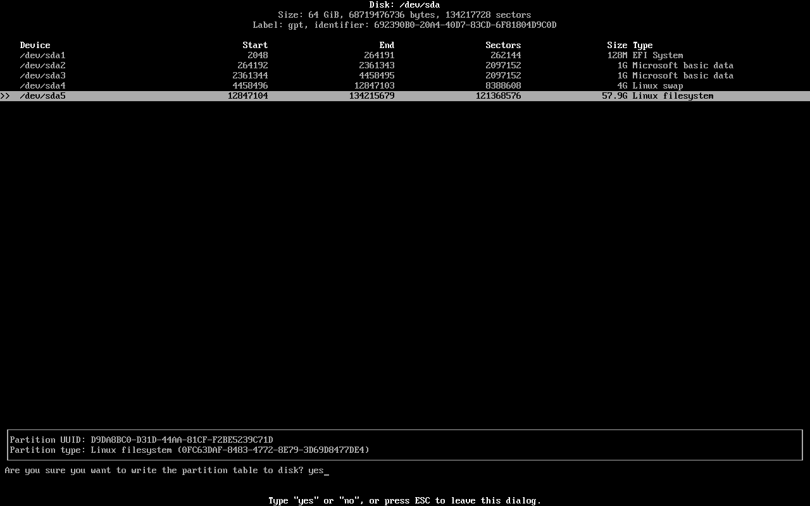

::: warning ⚠️ 注意

只有写入了操作分区表才会更改。

:::

9. 选中操作 `[Quit]` 并回车 `Enter` 以退出 `cfdisk` 分区工具

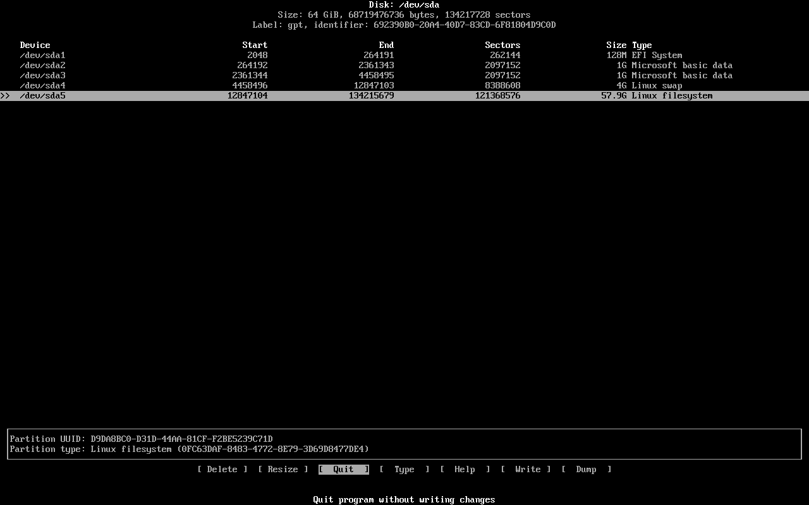

::: danger ☢️ 警告

再次提醒！请仔细检查命令和操作的正确性，否则将出现不可预料的情况。最危险的是可能造成数据丢失！

常见的错误包括不小心把 Windows 的分区删掉了 😥。

:::

10. 分区完成后，使用 `fdisk` 或 `lsblk` 命令复查分区情况：

::: code-group

```zsh [fdisk]
fdisk -l # 复查磁盘情况
```

```zsh [lsblk]
lsblk # 复查磁盘情况
```

:::


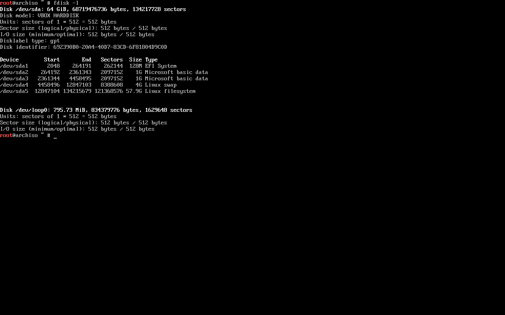

### 7-2. 格式化并创建 Btrfs 子卷

#### 7-2.0. 格式化 EFI 分区

::: code-group

```zsh [SATA]
mkfs.fat -F32 /dev/sdxn
```

```zsh [NVME]
mkfs.fat -F32 /dev/nvmexn1pn
```

:::

::: warning ⚠️ 注意

如果目标是双系统（Win10/Win11 + Arch Linux），并且 Win10/Win11 和 Arch Linux 将要共存在一个硬盘上的话，不要重新格式化原有的 EFI 分区，因为它可能包含启动其他操作系统所需的文件。

:::

#### 7-2-1. 格式化 Swap 分区

通过以下命令格式化对应的 Swap 分区，请按照实际情况替换 `x` 和 `n`（下同）：

::: code-group

```zsh [SATA]
mkswap /dev/sdxn
```

```zsh [NVME]
mkswap /dev/nvmexn1pn
```

:::

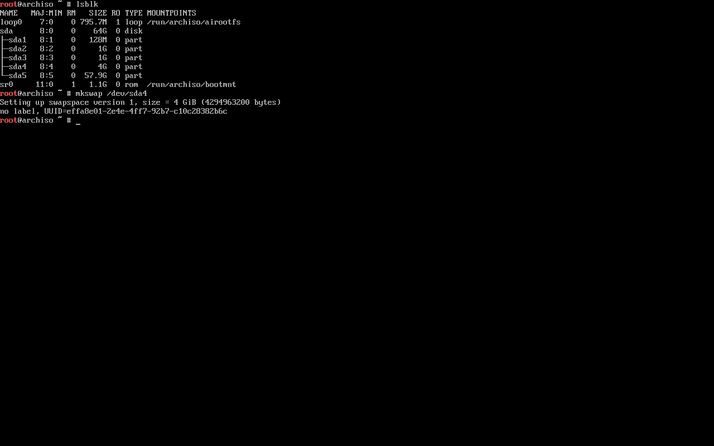

#### 7-2-2. 格式化 Btrfs 分区

1. 首先我们需要将整一个分区格式化为 `Btrfs` 文件系统。使用如下命令进行格式化：

::: code-group

```zsh [SATA]
mkfs.btrfs -L myArch /dev/sdxn
```

```zsh [NVME]
mkfs.btrfs -L myArch /dev/nvmexn1pn
```

:::

> 📑 命令参数说明：
>
> - `-L` 选项后指定该分区的 `LABLE`，这里以 `myArch` 为例，也可以自定义，但不能使用特殊字符以及空格，且最好有意义

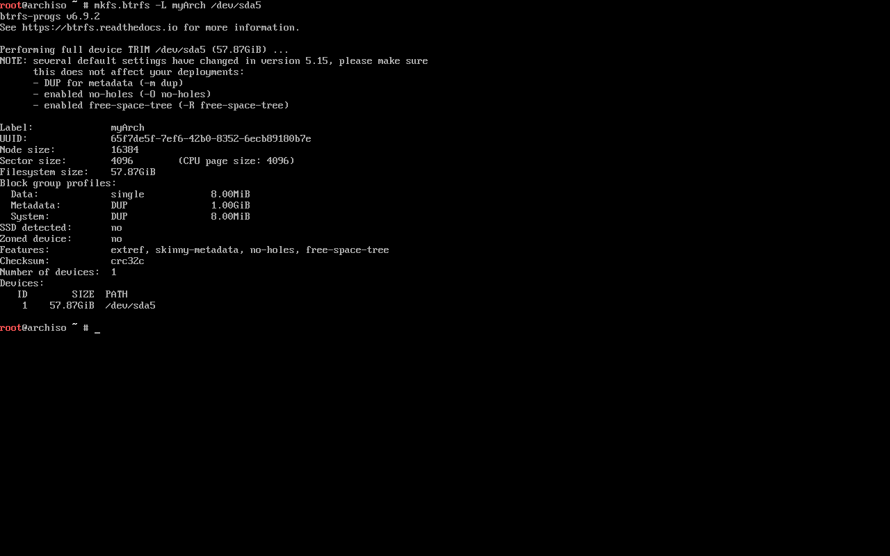

2. 为了创建子卷，我们需要先将 `Btrfs` 分区挂载到 `/mnt` 下：

::: code-group

```zsh [SATA]
mount -t btrfs -o compress=zstd /dev/sdxn /mnt
```

```zsh [NVME]
mount -t btrfs -o compress=zstd /dev/nvmexn1pn /mnt
```

:::

> 📑 命令参数说明：
>
> - `-t` 选项后指定挂载分区文件系统类型
> - `-o` 选项后添加挂载参数：
>   - `compress=zstd` —— 开启透明压缩

3. 使用 `df` 命令复查挂载情况：

```zsh
df -h # -h 选项会使输出以人类可读的单位显示
```

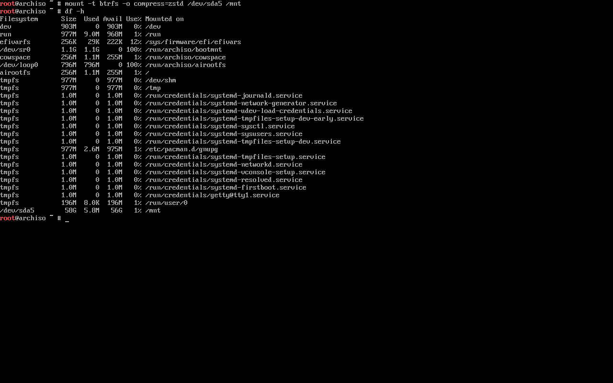

#### 7-2-3. 创建 Btrfs 子卷

1. 通过以下命令创建两个 `Btrfs` 子卷，之后将分别挂载到 `/` 根目录和 `/home` 用户主目录：

```zsh
btrfs subvolume create /mnt/@ # 创建 / 目录子卷
btrfs subvolume create /mnt/@home # 创建 /home 目录子卷
```


::: warning ⚠️ 注意

除非你清楚你的操作产生的后果，否则请保持子卷名称和结构与本指南一致，因为在后面我们会设置的快照工具 `timeshift` 只支持这种子卷布局。

:::

2. 通过以下命令复查子卷情况：

```zsh
btrfs subvolume list -p /mnt
```


3. 子卷创建好后，我们需要将 `/mnt` 卸载掉，以挂载子卷：

```zsh
umount /mnt
```


## 8. 挂载

1. 在挂载时，挂载是有顺序的，需要从根目录开始挂载。使用如下命令挂载子卷：

::: code-group

```zsh [SATA]
mount -t btrfs -o subvol=/@,compress=zstd /dev/sdxn /mnt # 挂载 / 目录
mkdir /mnt/home # 创建 /home 目录
mount -t btrfs -o subvol=/@home,compress=zstd /dev/sdxn /mnt/home # 挂载 /home 目录
mkdir -p /mnt/boot # 创建 /boot 目录
mount /dev/sdxn /mnt/boot # 挂载 /boot 目录
swapon /dev/sdxn # 挂载交换分区
```

```zsh [NVME]
mount -t btrfs -o subvol=/@,compress=zstd /dev/nvmexn1pn /mnt # 挂载 / 目录
mkdir /mnt/home # 创建 /home 目录
mount -t btrfs -o subvol=/@home,compress=zstd /dev/nvmexn1pn /mnt/home # 挂载 /home 目录
mkdir -p /mnt/boot # 创建 /boot 目录
mount /dev/nvmexn1pn /mnt/boot # 挂载 /boot 目录
swapon /dev/nvmexn1pn # 挂载交换分区
```

:::

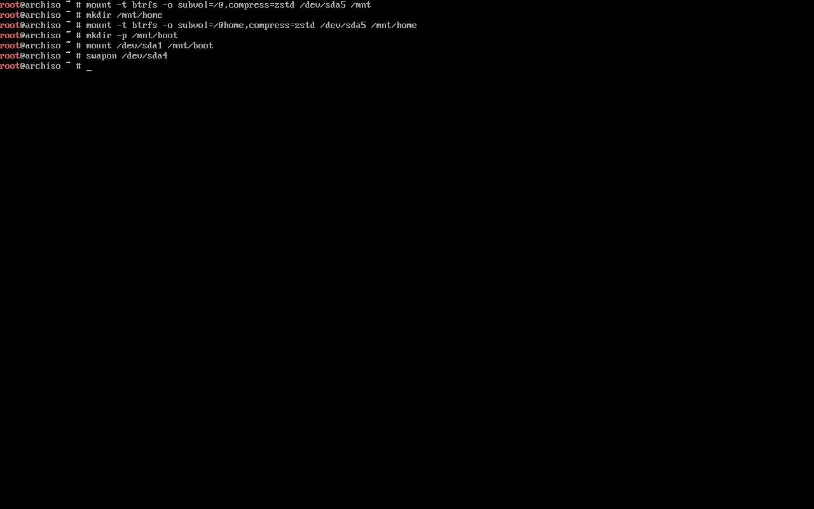

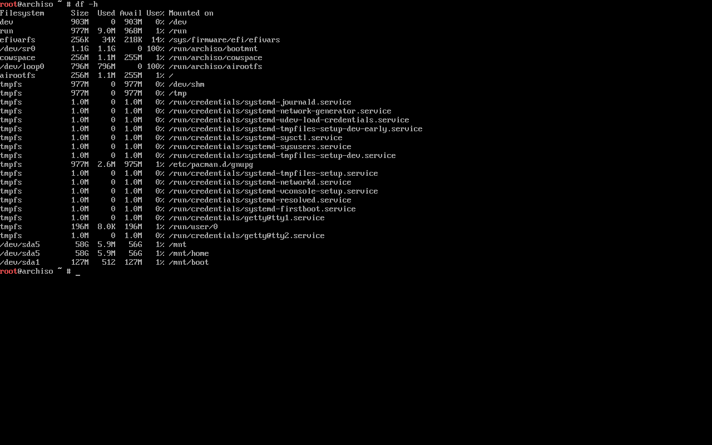

2. 使用 `df` 命令复查挂载情况：

```zsh
df -h
```

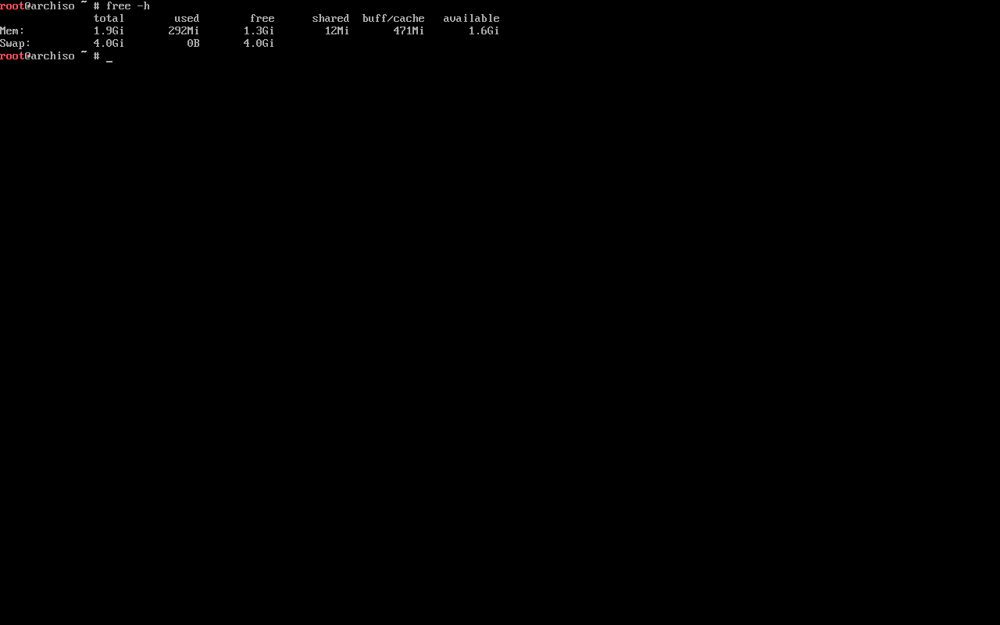

3. 使用 `free` 命令复查 Swap 分区挂载情况：

```zsh
free -h # -h 选项会使输出以人类可读的单位显示
```


## 9. 安装系统

1. 通过如下命令使用 `pacstrap` 脚本安装基础包：

```bash
pacstrap /mnt base base-devel linux linux-firmware btrfs-progs
# 如果使用btrfs文件系统，额外安装一个btrfs-progs包
```

> 📑 命令参数说明：
>
> - `base-devel` —— `base-devel` 在 `AUR` 包的安装过程中是必须用到的
> - `linux` —— 内核软件包，这里建议先不要替换为其它内核


如果提示 GPG 证书错误，可能是因为使用的不是最新的镜像文件，可以通过更新 `archlinux-keyring` 解决此问题

```bash
pacman -S archlinux-keyring
```

2. 通过如下命令使用 `pacstrap` 脚本安装其它必要的功能性软件：

```bash
pacstrap /mnt networkmanager vim sudo zsh zsh-completions
```

> 📑 命令参数说明：
>
> - `zsh` —— `zsh-completions` 如果你是 bash 的爱好者，请把这两个包换成`bash-completion`
> - 如果你是第一次接触\*nix 系统的新手，不建议换成 bash

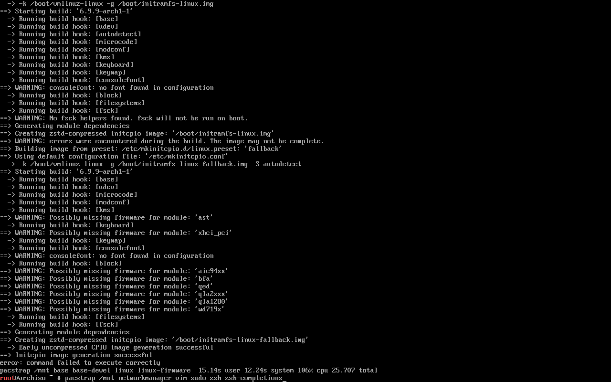

经过一系列安装时提示信息的刷屏，这些包就安装好了。

::: warning ⚠️ 注意

在执行命令前，请仔细检查命令的拼写正确；同时注意不要漏装东西。

很多人在后续的步骤中报错就是因为这里漏装了东西。

如果报错，请**检查拼写**，同时请确保之前的步骤 [更换国内软件仓库镜像源加快下载速度](#_6-更换国内软件仓库镜像源加快下载速度) 中**没有**添加 `archlinuxcn` 源。

:::

## 10. 生成 fstab 文件

1. `fstab` 用来定义磁盘分区。它是 Linux 系统中重要的文件之一。使用 `genfstab` 自动根据当前挂载情况生成并写入 `fstab` 文件：

```zsh
genfstab -U /mnt > /mnt/etc/fstab
```

2. 复查一下 `/mnt/etc/fstab` 确保没有错误：

```zsh
cat /mnt/etc/fstab
```

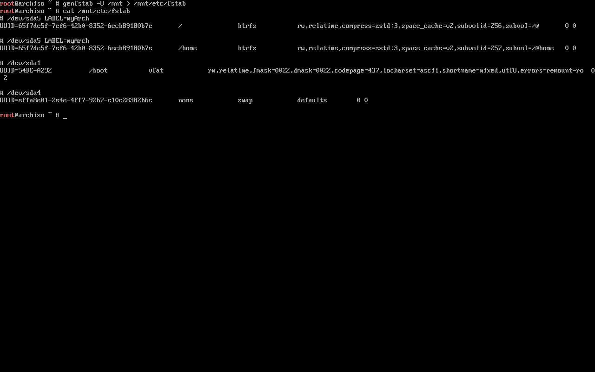

若为 NVME 协议的硬盘，输出结果应该与此类似：

```fstab {2,5,8,11}
# /dev/nvme0n1p6  /  btrfs  rw,relatime,compress=zstd:3,ssd,space_cache,subvolid=256,subvol=/@,subvol=@ 0 0
UUID=d01a3ca5-0798-462e-9a30-97065e7e36e1 /  btrfs  rw,relatime,compress=zstd:3,ssd,space_cache,subvolid=256,subvol=/@,subvol=@  0 0

# /dev/nvme0n1p1  /boot vfat  rw,relatime,fmask=0022,dmask=0022,codepage=437,iocharset=ascii,shortname=mixed,utf8,errors=remount-ro      0 2
UUID=522C-80C6  /boot vfat  rw,relatime,fmask=0022,dmask=0022,codepage=437,iocharset=ascii,shortname=mixed,utf8,errors=remount-ro 0 2

# /dev/nvme0n1p6  /home btrfs rw,relatime,compress=zstd:3,ssd,space_cache,subvolid=257,subvol=/@home,subvol=@home 0 0
UUID=d01a3ca5-0798-462e-9a30-97065e7e36e1 /home btrfs rw,relatime,compress=zstd:3,ssd,space_cache,subvolid=257,subvol=/@home,subvol=@home 0 0

# /dev/nvme0n1p5  none  swap  defaults  0 0
UUID=8e40dbed-590f-4cb8-80de-5cef8343a9fc none  swap  defaults  0 0
```

## 11. change root

使用以下命令把系统环境切换到新系统下：

```zsh
arch-chroot /mnt
```


此时，原来安装盘下的 `/mnt` 目录就变成了新系统的 `/` 目录。同时，可以发现命令行的提示符颜色和样式也发生了改变。

## 12. 设置主机名与时区

1. 首先在 `/etc/hostname` 设置主机名：

```bash
vim /etc/hostname
```


加入你想为主机取的主机名，这里比如叫 myarch。

::: tip ℹ️ 提示

主机名不要包含特殊字符以及空格。

:::

2. 接下来在 `/etc/hosts` 设置与其匹配的条目：

```bash
vim /etc/hosts
```

加入如下内容：

```bash
127.0.0.1   localhost
::1         localhost
127.0.1.1   myarch.localdomain myarch
```

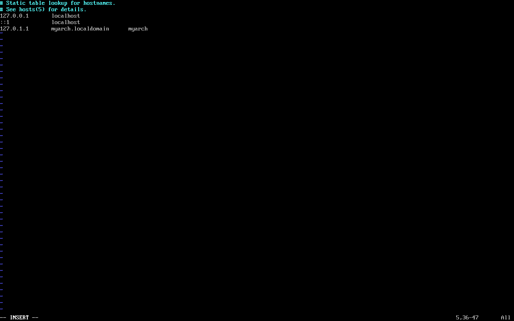

::: tip ℹ️ 提示

你可以使用 `Tab` 对齐。

:::

::: tip ℹ️ 提示

某些情况下如不设置主机名，在 KDE 下可能会存在网络情况变更时无法启动 GUI 应用的问题，在终端中出现形如 `No protocol specified qt.qpa.xcb: could not connect to display` 的错误。这种情况极为少见。

但不管如何，即使没有问题，我们都应该设置好主机名。

:::

3. 随后设置时区，在 `/etc/localtime` 下用 `/usr` 中合适的时区创建符号链接：

```bash
ln -sf /usr/share/zoneinfo/Asia/Shanghai /etc/localtime
```


> #### 🍧 碎碎念
>
> 不要找北京啦！这里没有北京，只有上海啦！🚀

::: tip ℹ️ 提示

同时，你也可以使用其它时区：

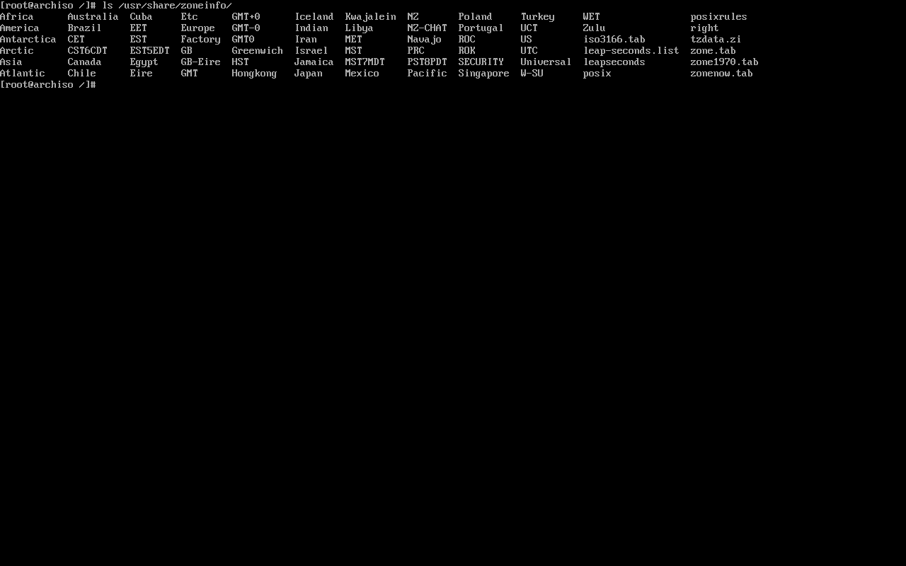

:::

## 13. 硬件时间设置

使用如下命令将系统时间同步到硬件时间：

```bash
hwclock --systohc
```

## 14. 设置 Locale

`Locale` 决定了软件使用的语言、书写习惯和字符集。

1. 编辑 `/etc/locale.gen`，去掉 `en_US.UTF-8 UTF-8` 以及 `zh_CN.UTF-8 UTF-8` 行前的注释符号（`#`）：

```bash
vim /etc/locale.gen
```


::: tip ℹ️ 提示

有几个选项极具迷惑性，请不要取消注释错了。

:::

2. 然后使用如下命令生成 `locale`：

```bash
locale-gen
```


3. 向 `/etc/locale.conf` 输入内容：

```bash
echo 'LANG=en_US.UTF-8'  > /etc/locale.conf
```

::: warning ⚠️ 注意

不推荐在此设置任何中文 `locale`，会导致 `tty` 乱码。

:::

## 15. 为 root 用户设置密码

```bash
passwd root
```


::: tip ℹ️ 提示

根据提示操作即可。注意输入密码时不会显示哦，不要以为 ⌨ 键盘坏了。

:::

## 16. 安装微码

通过以下命令安装对应芯片制造商的微码：

```bash
pacman -S intel-ucode # Intel
pacman -S amd-ucode # AMD
```

::: tip ℹ️ 提示

🎉 恭喜你！这是你在新系统中第一次使用 `pacman` 软件包管理器安装软件！在这里一路回车完成安装即可。

如果你不会使用，请参阅 [这里]()。

:::

## 17. 安装引导程序

如有需要可以参阅 [ArchWiki 相关内容](<https://wiki.archlinux.org/title/GRUB_(%E7%AE%80%E4%BD%93%E4%B8%AD%E6%96%87)>)。

1. 安装相应的包：

```bash
pacman -S grub efibootmgr os-prober
```

> 📑 命令参数说明：
>
> - `-S` 选项后指定要通过 `pacman` 包管理器安装的包：
>   - `grub` —— 启动引导器
>   - `efibootmgr` —— `efibootmgr` 被 `grub` 脚本用来将启动项写入 NVRAM
>   - `os-prober` —— 为了能够引导 win10，需要安装 `os-prober` 以检测到它

2. 安装 GRUB 到 EFI 分区：

```bash
grub-install --target=x86_64-efi --efi-directory=/boot --bootloader-id=ARCH
```

> 📑 命令参数说明：
>
> - `--efi-directory=/boot` —— 将 `grubx64.efi` 安装到之前的指定位置（EFI 分区）
> - `--bootloader-id=ARCH` —— 取名为 `ARCH`

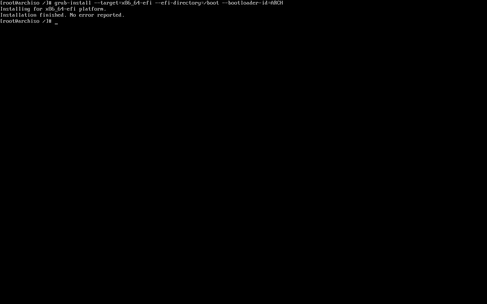

3. 接下来使用 `vim` 编辑 `/etc/default/grub` 文件：

```bash
vim /etc/default/grub
```

进行如下修改：

- 去掉 `GRUB_CMDLINE_LINUX_DEFAULT` 一行中最后的 `quiet` 参数
- 把 `loglevel` 的数值从 `3` 改成 `5`。这样是为了后续如果出现系统错误，方便排错
- 加入 `nowatchdog` 参数，这可以显著提高开关机速度

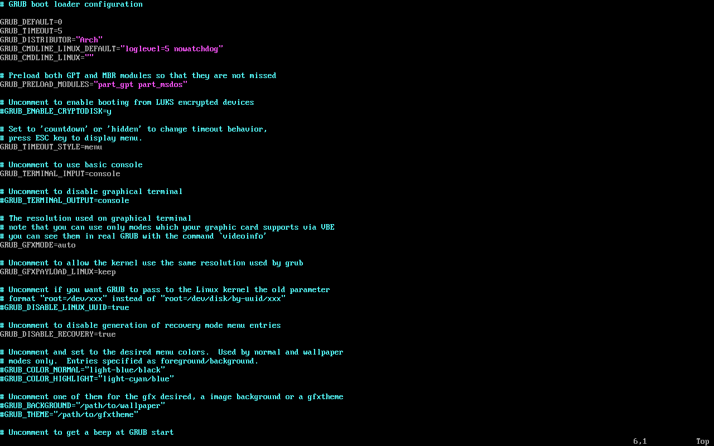

- 为了引导 win10，则还需要添加新的一行 `GRUB_DISABLE_OS_PROBER=false`

```grub {8}
# GRUB boot loader configuration

GRUB_DEFAULT=0
GRUB_TIMEOUT=5
GRUB_DISTRIBUTOR="Arch"
GRUB_CMDLINE_LINUX_DEFAULT="loglevel=5 nowatchdog"
GRUB_CMDLINE_LINUX=""
GRUB_DISABLE_OS_PROBER=false
...
```

::: tip ℹ️ 提示

`nowatchdog` 参数无法禁用英特尔的看门狗硬件，改为 `modprobe.blacklist=iTCO_wdt` 即可。如有需要可以参考 [ArchWiki 对应内容](https://wiki.archlinuxcn.org/wiki/性能优化#看门狗)

:::

4. 最后生成 `GRUB` 所需的配置文件：

```bash
grub-mkconfig -o /boot/grub/grub.cfg
```

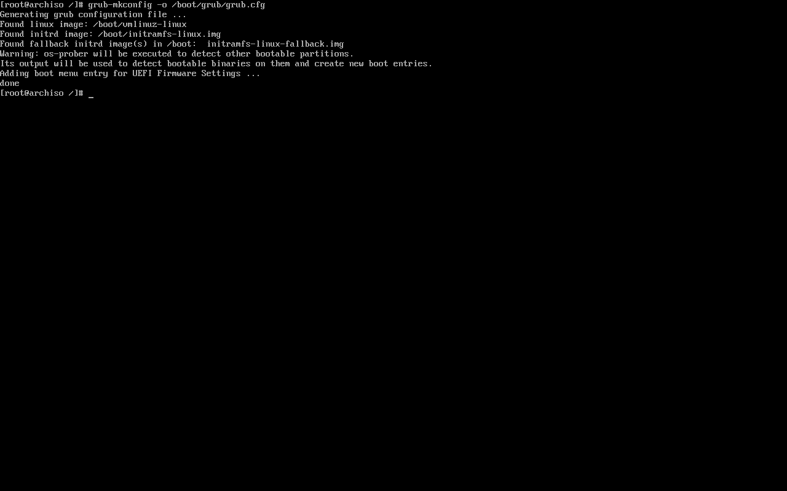

若引导了 win10，则输出应该包含倒数第二行：


若 win10 安装在另一个硬盘中则不会输出
可在进入系统后挂载硬盘并重新执行该命令

::: tip ℹ️ 提示

1.在某些主板安装完成后，你会发现没有启动条目。这是因为某些主板的 UEFI 固件在显示 UEFI NVRAM 引导条目之前，需要在特定的位置存放可引导文件，不支持自定义存放 `efi` 文件（如微星 Z170-A Gaming PRO）。解决方案是在默认启动路径下安装 `GRUB`。重新插入安装优盘，按原先顺序挂载目录（不需要再次创建文件夹了），`chroot` 到 `/mnt`，然后你可以直接把已经生成好的 `efi` 文件移动到默认目录下，如下命令所示。只有安装完成后你的主板不出现启动条目才需要尝试如下命令，正常安装无需执行。如有需要可以参考 [ArchWiki 对应内容](https://wiki.archlinuxcn.org/wiki/GRUB#缺省/后备启动路径)。

```bash
mv /boot/EFI/grub /boot/EFI/BOOT
mv /boot/EFI/GRUB/grubx64.efi /boot/EFI/BOOT/BOOTX64.EFI
```

2.`os-prober` 在 chroot 环境中可能无法正常运作。如果遇到这种情况，重启并引导进入系统后再次尝试生成配置文件。
:::

## 18. 完成安装

1. 输入以下命令：

```bash
exit # 退回安装环境
umount -R /mnt # 卸载新分区
reboot # 重启
```

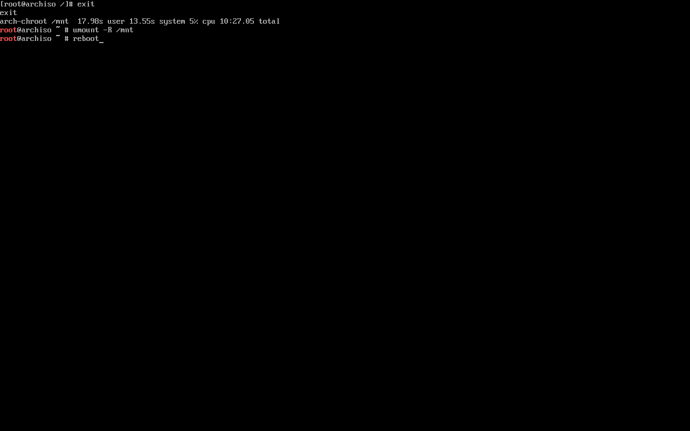

注意，**重启前要先拔掉优盘**，否则你重启后还是进安装程序而不是安装好的系统。

::: tip ℹ️ 提示

虚拟机直接重启即可。

:::

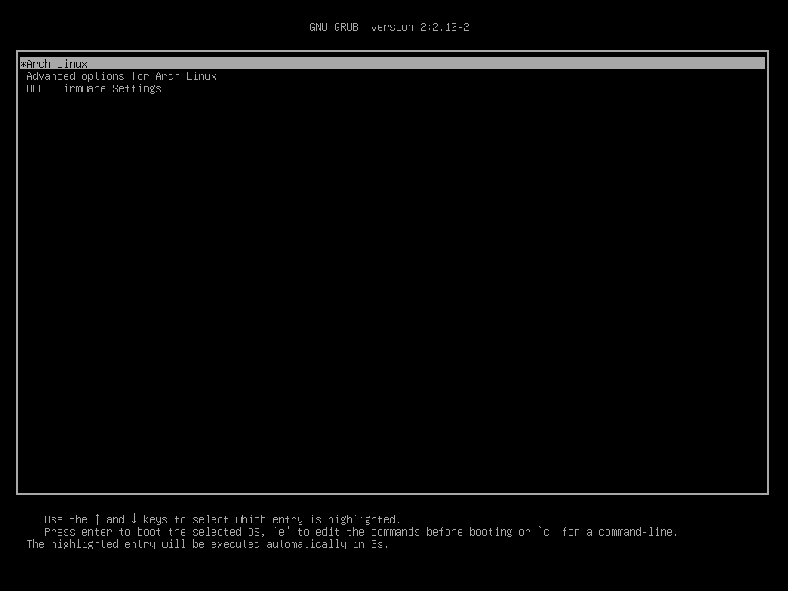

如图即为 GRUB 引导界面。

::: tip ℹ️ 提示

若引导了 win10 也会显示出来。

:::

::: tip ℹ️ 提示

若 win10 分区使用了 🔐 Bitlocker 加密，则第一次从 GRUB 进入需要输入解锁密钥。

你应该在步骤 [5. 获取 Bitlocker 恢复密钥](pre-install.md#_5-获取-bitlocker-恢复密钥) 中已经知晓了 Bitlocker 解锁密钥。

若无法从 [aka.ms 相关页面](https://aka.ms/myrecoverykey) 获取解锁密钥，请尝试在 BIOS 中将 Windows Boot Manager 移动到启动顺序首位再尝试进入 win10。

:::

2. 重启后使用 root 账户登录系统：


3. 设置开机自启并立即启动 networkmanager 服务，即可连接网络：

```bash
systemctl enable --now NetworkManager # 设置开机自启并立即启动 NetworkManager 服务
ping www.bilibili.com # 测试网络连接
```

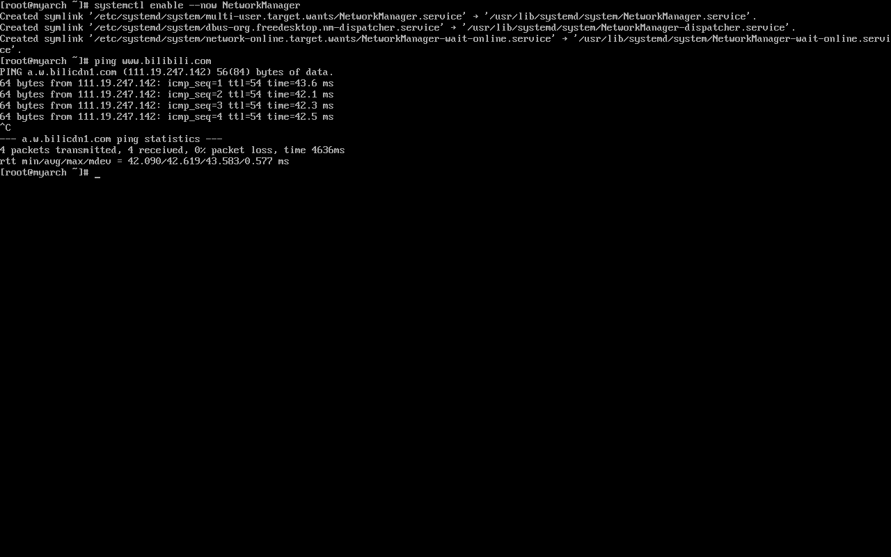

4. 若为无线连接，则需要在启动 `networkmanager` 后使用 `nmcli` 连接网络：

```bash
nmcli dev wifi list # 显示附近的 Wi-Fi 网络
nmcli dev wifi connect "Wi-Fi名（SSID）" password "网络密码" # 连接指定的无线网络
```

也可以使用 `nmtui` 来配置网络

```bash
nmtui
```

5. `neofetch` 可以将系统信息和发行版 logo 一并打印出来。通过 `pacman` 安装 `neofetch`：

```bash
pacman -S neofetch
```

使用 `neofetch` 打印系统信息：

```bash
neofetch
```


> #### 🍧 碎碎念
>
> 又到了 `neofetch` 的时间了吗？

## 🎉 祝贺！🎉

到此为止，一个基础的、无图形界面的 archlinux 已经安装完成了！这时你应该可以感到满满的满足感（即使你还没有见到图形化的界面）。好好享受一下成功安装 archlinux 的喜悦吧！

如果你对本节的部分步骤不理解，请仔细阅读下一节 [基础安装详解](basic-install-detail.md)。在此之后，我们来安装图形界面。

::: tip ℹ️ 提示

你可以使用以下命令关机：

```bash
shutdown -h now
# 或者
poweroff
```

:::

::: tip ℹ️ 提示

archlinux 在 2021 年 4 月在安装镜像中内置了一个 [安装脚本](https://archlinux.org/packages/extra/any/archinstall/)，类似一个一键安装脚本，提供一些选项，即可快速安装（填问卷安系统）。和所有一键安装脚本类似，提供自动化，但不灵活的安装过程。缺陷包括但不限于：

1. 只提供有限的文件系统格式
2. 只可限定在一个磁盘
3. 不能指定软件仓库镜像源
4. 只提供有限的桌面选择
5. 自动分区不可手动干预
6. 输入错误直接崩溃退出
7. 仅支持 UEFI 等

不建议使用这个安装脚本，除了以上各种原因，初学者也无法在这种安装过程中学到任何东西。如果你因为某些原因需要快速启动一个基础的 archlinux 环境，那么可以尝试此脚本。

:::
