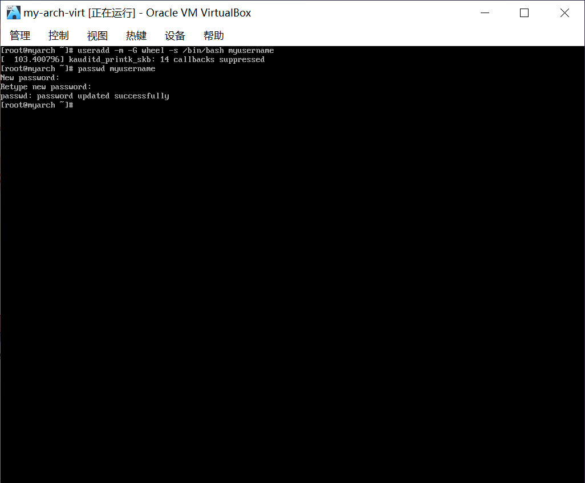
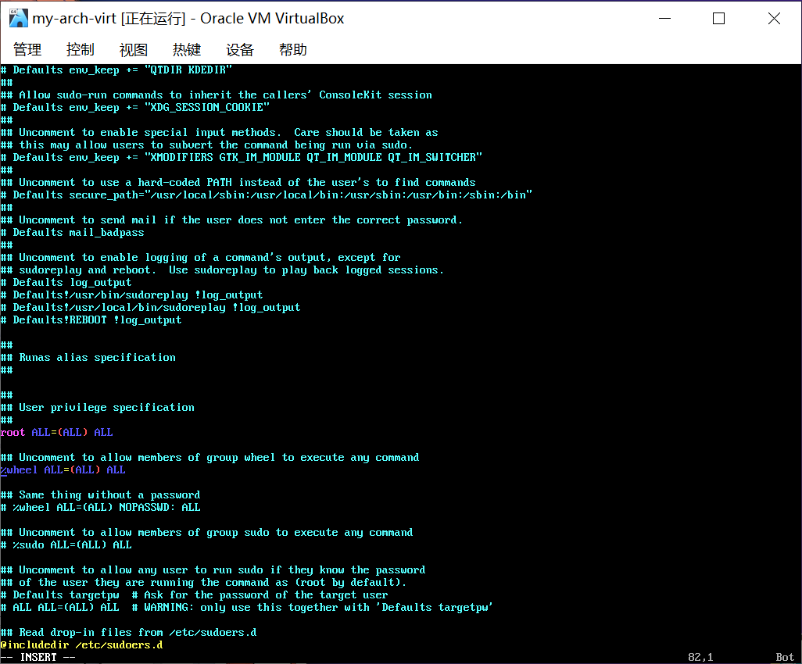
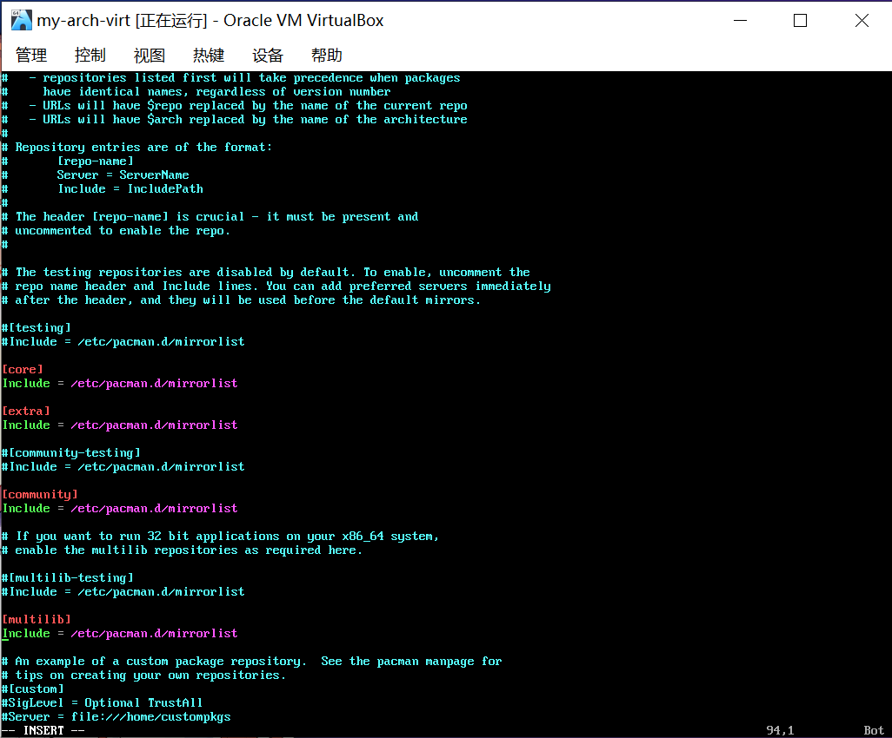
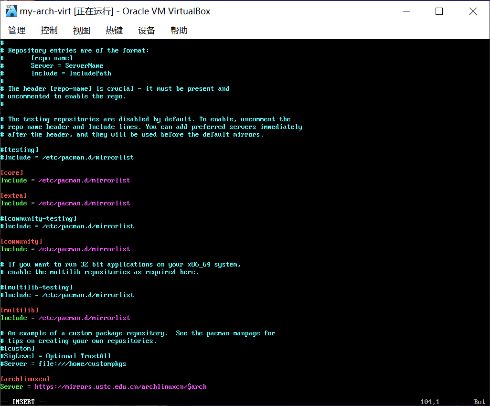
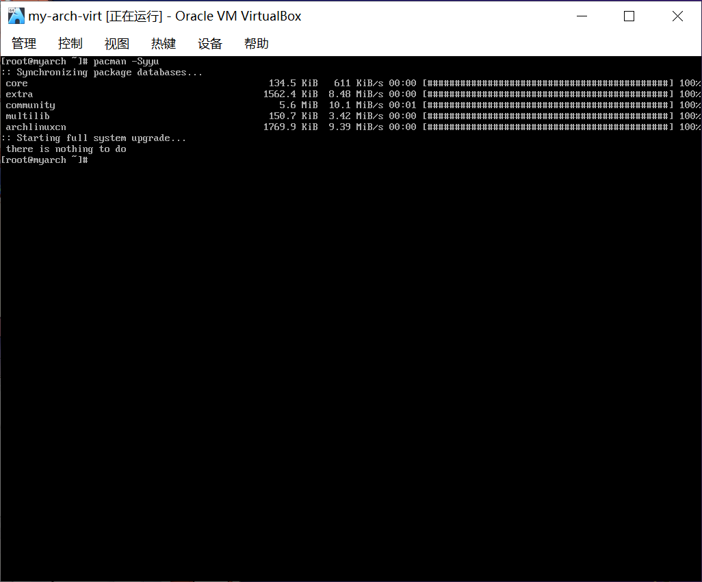
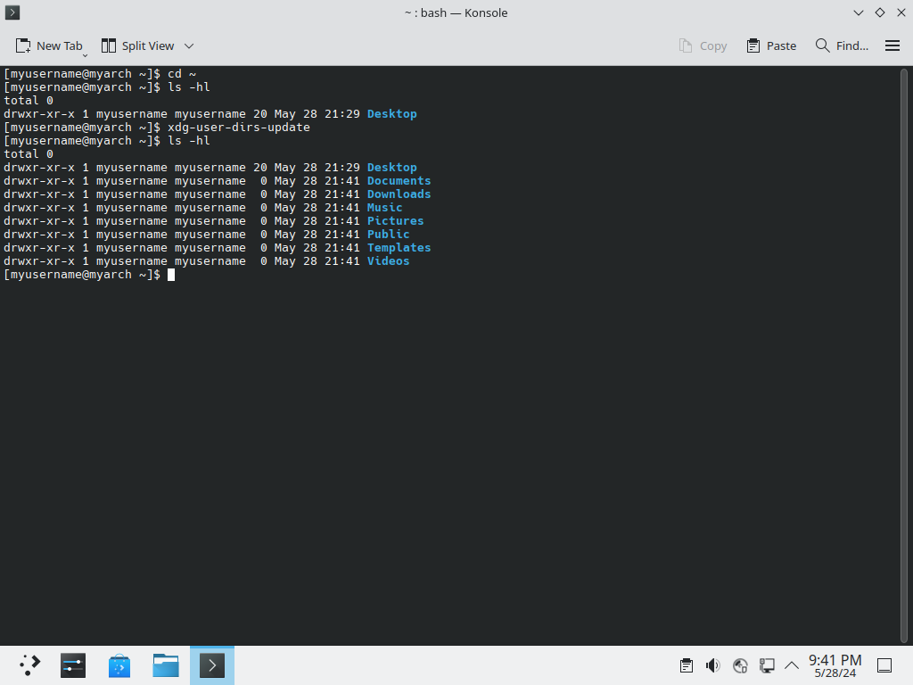
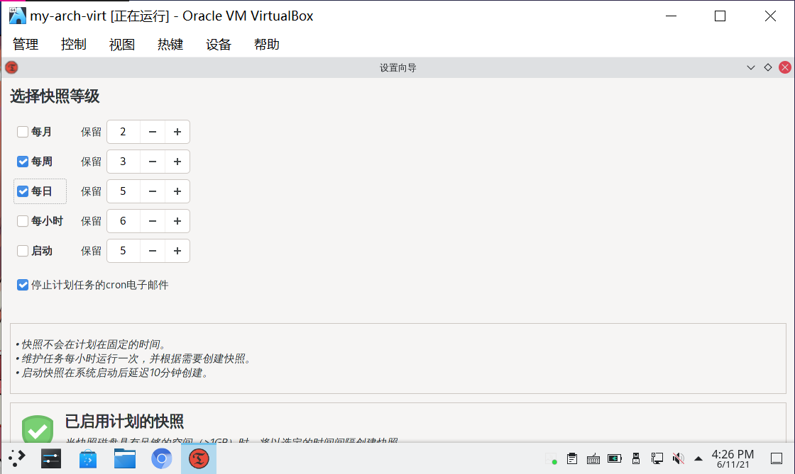

# 桌面环境与常用应用安装

> ### 🏔 两岸猿声啼不住，轻舟已过万重山
>
> 没有图形界面的 archlinux 显然作为日常使用的操作系统是不合适的。但经过这一节的安装和配置后，我们的系统就可以当作日常的操作系统使用了

> ### 🔖 这一节将会讨论：
>
> ::: details 目录
>
> [[toc]]
>
> :::

这一小节，我们开始着手安装桌面环境和一些常用的软件。如有需要可以参阅 [ArchWiki 一般性建议](<https://wiki.archlinux.org/title/General_recommendations_(%E7%AE%80%E4%BD%93%E4%B8%AD%E6%96%87)>)。

::: tip ℹ️ 提示

指南中带有 <sup>aur</sup> 角标的软件代表是在 [AUR](https://aur.archlinux.org/)（Arch User Repository）中用户自行打包的软件。不在 arch 官方支持范围内，可能会出现各种问题如更新不及时、无法安装、使用出错等。

指南中带有 <sup>cn</sup> 角标的软件代表是在 [archlinuxcn](https://www.archlinuxcn.org/archlinux-cn-repo-and-mirror/)（Arch Linux 中文社区仓库）中用户自行打包的软件。不在 arch 官方支持范围内，可能会出现各种问题如更新不及时、无法安装、使用出错等。

指南中带有 <sup>EULA</sup> 角标的软件代表是 [专有软件](https://www.gnu.org/proprietary/proprietary.html)。请自行斟酌是否使用。

:::

## 0. 确保系统为最新

如果你在做完章节 [archlinux 基础安装](basic-install.md) 的内容后，关机并放置过一段时间，那么需要先按照 [18. 完成安装](./basic-install.html#_18-完成安装) 中连接网络的方法重新连网，然后使用以下命令更新系统：

```bash
pacman -Syu # 升级系统中全部包
```


## 1. 配置 root 账户的默认编辑器

默认情况下，archlinux 在一些终端编辑场景调用 `vi` 编辑器，但是我们使用 `vim` 编辑器。

如果不做额外配置且不显式的指定编辑器，在一些终端场景下（如下面的 `visudo`、`git` 等）调用编辑器时会出错。

1. 使用 `vim` 编辑 `~/.bash_profile` 文件：

```bash
vim ~/.bash_profile
```

在适当位置加入以下内容：

```bash
export EDITOR='vim'
```

::: tip ℹ️ 提示

也可以添加到 `~/.bashrc` 中，但是（如果不做其它配置或显式的执行）在登录命令行 `tty` 后不会被执行，也就失去了意义。

一般来说我们登录 root 账户时很可能是在命令行 `tty` 登录的（有时也会 `su`）。

:::

2. 保存并退出 `vim`

## 2. 准备非 root 用户

1. 通过以下命令添加用户，比如新增加的用户叫 `myusername`：

```bash
useradd -m -G wheel -s /bin/bash myusername
```

> 📑 命令参数说明：
>
> - `-m` 创建用户的同时创建用户家目录
> - `-G` 选项后指定附加组
>   - `wheel` —— `wheel` 附加组可 `sudo` 进行提权
> - `-s` 选项后指定 shell 程序
> - `myusername` —— 用户名（**请自定义**，但不要包含空格和特殊字符）

2. 通过以下命令根据提示设置新用户 `myusername` 的密码：

```bash
passwd myusername
```

::: tip ℹ️ 提示

弱密码已经不被接受，请设置一个较为复杂的密码，如 `i_love_archlinux`。

:::



3. 使用 `vim` 编辑器通过 `visudo` 命令编辑 `sudoers` 文件：

```bash
EDITOR=vim visudo # 这里需要显式的指定编辑器，因为上面的环境变量还未生效
```

4. 找到如下这样的一行，把前面的注释符号 `#` 去掉：

```sudoers
#%wheel ALL=(ALL:ALL) ALL
```



> 📑 这里稍微解释一下：
>
> - `%wheel` —— 用户名或用户组，此处则代表是 `wheel` 组，`%` 是用户组的前缀
> - `ALL=` —— 主机名，此处则代表在所有主机上都生效（如果把同样的 `sudoers` 文件下发到了多个主机上）
> - `(ALL:ALL)` —— (任意用户:任意用户组)，此处则代表可以成为任意目标用户/用户组
> - 最后的 `ALL` —— 代表可以执行任意命令
>
> 几个更详细的例子:
>
> 1. 在 `mailadmin` 组里的用户可以作为 `root` 用户，在 `snow` 和 `rain` 这两台主机执行一些邮件服务器控制命令（命令之间用 `,` 分隔）：
>
> ```sudoers
> %mailadmin  snow,rain=(root)  /usr/sbin/postfix, /usr/sbin/postsuper, /usr/bin/doveadm
> ```
>
> 2. 用户 `whoami` 可以在所有主机上以 `root` 用户不输入密码执行 `rndc reload` 这条命令（正常来说 `sudo` 都是要求输入调用方的密码的）：
>
> ```sudoers
> whoami  ALL=(root)  NOPASSWD: /usr/sbin/rndc reload
> ```
>
> 3. 当在 `users` 组里的用户以 `sudo passwd` 或者 `sudo passwd root` 方式运行命令的时候，可以直接把 `root` 用户的密> 码 改掉，这真是太危险了！必须要把这两条命令禁止掉，但我们又希望用户可以通过 `sudo passwd` 修改其它用户的密码。那么我们可以在命令前面加上 `!` 来表示不可执行的命令：
>
> ```sudoers
> %users  ALL=(root)  !/usr/bin/passwd, /usr/bin/passwd [A-Za-z]*, !/usr/bin/passwd root
> ```
>
> 总结一下，语法如下：
>
> ```sudoers
> 用户名/%用户组名 主机名=(目标用户名) 命令1, 命令2, !命令3
> ```

5. 保存并退出 `vim` 编辑器

## 3. 开启 32 位支持库与 Arch Linux 中文社区仓库（archlinuxcn）

1. 编辑 `/etc/pacman.conf` 文件：

```bash
vim /etc/pacman.conf
```

2. 去掉 `[multilib]` 一节中两行的注释，来开启 32 位库支持



3. 在文档结尾处加入下面的文字，来添加 `archlinuxcn` 源。推荐的镜像源（选一个即可）也一并列出：

```conf {2}
[archlinuxcn]
Server = https://mirrors.ustc.edu.cn/archlinuxcn/$arch # 中国科学技术大学开源镜像站
Server = https://mirrors.tuna.tsinghua.edu.cn/archlinuxcn/$arch # 清华大学开源软件镜像站
Server = https://mirrors.hit.edu.cn/archlinuxcn/$arch # 哈尔滨工业大学开源镜像站
Server = https://repo.huaweicloud.com/archlinuxcn/$arch # 华为开源镜像站
```



::: tip ℹ️ 提示

此外，还有其它镜像源在 [archlinuxcn 官方 Github Repo](https://github.com/archlinuxcn/mirrorlist-repo#arch-linux-cn-community-repo-mirrors-list) 列出，可以根据自己实际情况另行选择。

archlinuxcn 仓库服务器位于欧洲，在中国大陆、中国香港、美国有镜像。

:::

4. 保存并退出 `vim` 编辑器

5. 通过以下命令刷新 `pacman` 数据库并更新：

```bash
pacman -Syyu
```



## 4. 安装 KDE Plasma 桌面环境

::: tip ℹ️ 提示

新手推荐安装 KDE Plasma 桌面环境，此外有 GNOME、 Xfce 等[桌面环境](https://wiki.archlinux.org/title/Desktop_environment)和一众[窗口管理器](https://wiki.archlinux.org/title/Window_manager)可供选择。本教程仅列出 KDE 安装使用教程。

:::

1. 通过以下命令安装相关软件包：

```bash
pacman -S plasma-meta konsole dolphin # plasma-meta 元软件包、konsole 终端模拟器和 dolphin 文件管理器
```


2. kde 默认安装的是[xorg](https://wiki.archlinuxcn.org/zh-hans/Xorg)，如果想使用[wayland](https://wiki.archlinuxcn.org/wiki/Wayland)的话安装以下包：

```bash
pacman -S  plasma-workspace xdg-desktop-portal
# N卡用户需要额外安装egl-wayland,xdg-desktop-portal包是为了如obs此类工具录制屏幕使用
# xdg-desktop-portal包组提供了不同环境下使用的软件包
# 例如kde用户可选择xdg-desktop-portal-kde包
```

3. 安装完成后，可以在后续登录时选择使用 xorg 还是 wayland

## 5. 配置并启动 greeter sddm

1. 开启 sddm.service 守护进程：

```
systemctl enable sddm
```

2. 通过以下命令启动显示管理器或重启电脑，即可看到欢迎界面：

```bash
systemctl start sddm  # 直接启动显示管理器，与以下reboot命令二选一即可
```

```bash
reboot
```


3. 输入新用户的密码并回车 `Enter` 即可登录桌面


::: tip ℹ️ 提示

若虚拟机下在 sddm 输入密码登录后无法进入桌面，只有黑屏和光标，请确认在步骤 [3. 配置 VirtualBox](pre-virt.md#_3-配置-virtualbox) 中**没有**勾选 `启用3D加速`。

:::


::: tip ℹ️ 提示

值得注意的是此时操作系统尚未安装相应的显卡驱动。如在进入桌面环境时遭遇闪退花屏等意外情况，建议尝试安装相应的显卡驱动。详情请参阅[显卡驱动](graphic-driver.md)。

:::

## 6. 安装基础功能包

1. 进入桌面后，在开始菜单搜索并打开 Konsole。它是 KDE 桌面环境默认的终端模拟器


2. 首先进行桌面环境中的网络设置：

```bash
ping www.bilibili.com # 测试网络连通性
```

KDE 桌面环境中连接网络和 win10 一样，这里不再赘述。

3. 接下来安装一些基础功能包：

```bash
sudo pacman -S sof-firmware alsa-firmware alsa-ucm-conf # 声音固件
sudo pacman -S ntfs-3g # 使系统可以识别 NTFS 格式的硬盘
sudo pacman -S adobe-source-han-serif-cn-fonts wqy-zenhei # 安装几个开源中文字体。一般装上文泉驿就能解决大多 wine 应用中文方块的问题
sudo pacman -S noto-fonts noto-fonts-cjk noto-fonts-emoji noto-fonts-extra # 安装谷歌开源字体及表情
sudo pacman -S firefox chromium # 安装常用的火狐、chromium 浏览器
sudo pacman -S ark # 压缩软件。在 dolphin 中可用右键解压压缩包
sudo pacman -S packagekit-qt6 packagekit appstream-qt appstream # 确保 Discover（软件中心）可用，需重启
sudo pacman -S gwenview # 图片查看器
sudo pacman -S steam # 游戏商店。稍后看完显卡驱动章节再使用
```

4. 最后执行安装 `archlinuxcn` 源所需的相关步骤：

```bash
sudo pacman -S archlinuxcn-keyring # cn 源中的签名（archlinuxcn-keyring 在 archlinuxcn）
sudo pacman -S yay # yay 命令可以让用户安装 AUR 中的软件（yay 在 archlinuxcn）
```

::: tip ℹ️ 提示

若安装 `archlinuxcn-keyring` 时报错，是由于密钥环的问题。可先按照 [archlinuxcn 官方说明](https://www.archlinuxcn.org/gnupg-2-1-and-the-pacman-keyring/) 执行其中的命令，再安装 `archlinuxcn-keyring`。

`archlinuxcn` 社区源的 `keyring` 包 `archlinuxcn-keyring` 由 `farseerfc` 的 key 签署验证，而 `Arch Linux` 官方 `keyring` 中包含了 farseerfc 的 key 。自 12 月初 `archlinux-keyring` 中删除了一个退任的 [master key](https://gitlab.archlinux.org/archlinux/archlinux-keyring/-/issues/246) 导致 `farseerfc` 的 key 的信任数不足，由 `GnuPG` 的 `web of trust` 推算为 `marginal trust`，从而不再能自动信任 `archlinuxcn-keyring` 包的签名。

如果你在新系统中尝试安装 `archlinuxcn-keyring` 包时遇到如下报错：

```bash
error: archlinuxcn-keyring: Signature from "Jiachen YANG (Arch Linux Packager Signing Key) <farseerfc@archlinux.org>" is marginal trust
```

请使用以下命令在本地信任 `farseerfc 的 key` 。此 `key` 已随 `archlinux-keyring` 安装在系统中，只是缺乏信任：

```bash
sudo pacman-key --lsign-key "farseerfc@archlinux.org"
```

之后继续安装 `archlinuxcn-keyring` ：
`sudo pacman -S archlinuxcn-keyring`
https://www.archlinuxcn.org/archlinuxcn-keyring-manually-trust-farseerfc-key/

:::

## 7. 检查家目录

检查家目录下的各个常见目录是否已经创建，若没有则需通过以下命令手动创建：

```bash
cd ~
ls -hl
xdg-user-dirs-update
```



## 8. 配置非 root 账户的默认编辑器

1. 使用 `vim` 编辑 `~/.bashrc` 文件：

```bash
vim ~/.bashrc
```

2. 在适当位置加入以下内容：

```bash
export EDITOR='vim'
```

::: tip ℹ️ 提示

也可以添加到 `~/.bash_profile` 中。

:::

## 9. 设置系统为中文

1. 打开 `System Settings` > `Language and Regional Settings` > 在 `Language` 中点击 `Add languages...` > 选择中文加入 `ADD`，再拖拽到第一位 > 点击 `Apply`


2. 注销并重新登陆即可生效


::: tip ℹ️ 提示

很多人会错误的更改 `System Settings` > `Regional Settings` > `Formats` 中的值为中文蒙古、默认或者其他值。这会导致系统中一半英文一半中文。这里的值要保持默认的 `en_US` 或 `zh_CN`，或者改为你在 `locale.gen` 中添加的任意一种语言。

部分设备在设置系统语言后仍然出现部分设置为英文的情况（比如右键、部分菜单设置项）
过修改 `~/.config/plasma-localerc` 中的为`zh_CN`可以`zh_CN.UTF-8`解决

:::

## 10. 安装输入法

如有需要可以参阅 [Fcitx5 官方文档](<https://wiki.archlinux.org/index.php/Fcitx5_(%E7%AE%80%E4%BD%93%E4%B8%AD%E6%96%87)>)。

1. 通过以下命令安装相关软件包：

```bash
sudo pacman -S fcitx5-im # 输入法基础包组
sudo pacman -S fcitx5-chinese-addons # 官方中文输入引擎
sudo pacman -S fcitx5-anthy # 日文输入引擎
sudo pacman -S fcitx5-pinyin-moegirl # 萌娘百科词库。二刺猿必备（archlinuxcn）
sudo pacman -S fcitx5-material-color # 输入法主题
```

2. 此外，我们还需要设置环境变量。通过 `vim` 创建并编辑文件 `~/.config/environment.d/im.conf`：

```bash
vim ~/.config/environment.d/im.conf
```

3. 在文件中加入以下内容并保存退出：

```environment
# fix fcitx problem
GTK_IM_MODULE=fcitx
QT_IM_MODULE=fcitx
XMODIFIERS=@im=fcitx
SDL_IM_MODULE=fcitx
GLFW_IM_MODULE=ibus
```


Konsole 以及 Dolphin 都需要这些环境变量，倒是 Firefox 和 Chromium 都不需要就可以输入中文。

::: tip ℹ️ 提示

1. 如果使用 Wayland 而非 X11，请参照如下方式进行配置而非上面的配置方法：

> 在「系统设置 - 输入设备 - 虚拟键盘」中选中 Fcitx 5；`environment` 仅保留 `XMODIFIERS=@im=fcitx` 一行；在基于 Chromium 的程序（包括浏览器和使用 Electron 的程序）中加入 `--enable-features=UseOzonePlatform --ozone-platform=wayland --enable-wayland-ime` 启动参数。

2. 检查一下是否有拼写错误，如果输入法无法正常切换，可尝试执行 `fcitx5-diagnose` 命令来诊断问题的原因。

由于存在[安全性问题](https://cve.mitre.org/cgi-bin/cvename.cgi?name=CVE-2010-4708)，自 2022 年 10 月 21 日起，[Arch Linux 默认不再读取](https://github.com/archlinux/svntogit-packages/commit/891610cfcc202916cf5eb46d6df56e885062f78e) `~/.pam_environment` 文件中的设置。

:::

4. 打开 `系统设置` > `区域设置` > `输入法`

5. 点击提示信息中的 `运行 Fcitx`：


6. 点击 `添加输入法` > 找到简体中文下的 `Pinyin` > 点击 `添加` 即可加入拼音输入法：


7. 接下来点击 `Pinyin` 右侧的配置按钮 > 点选 `云拼音` 和 `在程序中显示预编辑文本` > 最后点击 `应用`：


8. 回到输入法设置 > 点击 `配置附加组件` > 找到 `Classic User Interface` > 在主题里选择一个你喜欢的颜色 > 最后点击 `应用`：


9. 注销并重新登陆，发现已经可以在各个软件中输入中文了：


::: tip ℹ️ 提示

通过 `Ctrl` + `空格` 切换中英文输入。

:::

## 11. 启动蓝牙（若有）

通过以下命令开启蓝牙相关服务并设置开机自动启动：

```bash
sudo systemctl enable --now bluetooth
```

## 12. 设置 Timeshift 快照

1. 通过以下命令安装 Timeshift<sup>cn / aur</sup>：

::: code-group

```bash [cn]
sudo pacman -S timeshift
```

```bash [aur]
yay -S aur/timeshift
```

:::


::: tip ℹ️ 提示

若安装 AUR 时无法正常下载，请先参照章节 [透明代理](transparent.md) 配置透明代理。

:::

安装之后，如果 Timeshift 没有自动备份，需要手动开启`cronie`服务：

```bash
sudo systemctl enable --now cronie.service
```

2. 打开 Timeshift，第一次启动会自动启动设置向导

### 12-1. 若使用 Btrfs 文件系统

若按照步骤 [7. 分区和格式化（使用 Btrfs 文件系统）](basic-install.md#_7-分区和格式化-使用-btrfs-文件系统) 使用的 Btrfs 文件系统，则进行如下操作。

1. 快照类型选择 `BTRFS`，点击 `下一步`：


2. 快照位置选择 `BTRFS` 分区，点击 `下一步`：


::: tip ℹ️ 提示

Timeshift 只支持快照操作系统安装在具有 Ubuntu 类型的子卷布局（`@` 和 `@home` 子卷）的 BTRFS 分区。

若此处提示不支持的子卷布局，请确保按照步骤 [7. 分区和格式化（使用 Btrfs 文件系统）](basic-install.md#_7-分区和格式化-使用-btrfs-文件系统) 的说明分区。

:::

3. 选择快照计划，点击 `下一步`：



::: tip ℹ️ 提示

由于 BTRFS 类型快照占用空间相对较小，可以适当提高快照数量。

:::

4. 若希望 `/home` 用户主目录也快照，则勾选在备份中包含 `@home` 子卷，然后点击 `下一步`：


5. 点击 `完成` 结束配置

::: warning ⚠️ 注意

完成后建议执行下述指令删除 `subvolid`：

```bash
sudo sed -i -E 's/(subvolid=[0-9]+,)|(,subvolid=[0-9]+)//g' /etc/fstab
```

否则，恢复 BTRFS 类型快照时，可能因子卷 ID 改变导致无法正常进入系统，参阅 [恢复后无法挂载目录](../advanced/system-ctl.md#恢复后无法挂载目录)。

:::

### 12-2. 若使用 ext4 文件系统

若使用的为传统的 ext4 文件系统，则进行如下操作。

1. 快照类型选择 `RSYNC`，点击 `下一步`
2. 快照位置选择较大的分区，快照将保存在此分区的 `/timeshift` 目录下
3. 选择快照计划，点击 `下一步`

::: tip ℹ️ 提示

由于 RSYNC 类型快照占用空间较大，请不要保存过多的历史快照。

:::

4. `/home` 用户主目录可选全部包含，或者**选择排除一切，在下一项中进行更详细配置**。其中 `root` 默认全备份（即使选择排除一切）
5. 若用户主目录选择排除一切，在包含/排除模式中建议进行如下配置（注意顺序，可拖拽移动顺序）：
   - `+ /home/user/.config/***`（注意是 `***`）
   - `+ /home/user/.local/***`
   - `- /home/user/.**`
   - `- /home/user/**`
   - `- /root/**`
6. 点击 `完成` 结束配置

自此，Timeshift 快照已经成功设置。Timeshift 将按照计划快照系统并删除久远的快照。Timeshift 快照为系统增加了一层保障。

## 13. 自动生成快照启动项

通过安装 `grub-btrfs` 包，可以实现在每次使用 `grub-mkconfig` 重新生成 GRUB 启动项时，自动添加快照的启动入口。
如果希望在 Timeshift 自动创建快照的能够同时自动生成启动项，可以通过以下命令运行 `grub-btrfsd.service` 并将其配置为自动启动

```bash
sudo systemctl enable --now grub-btrfsd.service
```

由于该服务默认的监视路径为 `/.snapshots`，因此还需要对该路径进行修改，你需要：

1. 覆盖默认配置

```bash
sudo systemctl edit grub-btrfsd.service
```

在默认的光标位置，添加以下内容后保存并退出

```
[Service]
ExecStart=
ExecStart=/usr/bin/grub-btrfsd --syslog --timeshift-auto
```

2. 重载并重启服务

```bash
sudo systemctl daemon-reload
sudo systemctl restart grub-btrfsd.service
```

这样就能够实现在 Timeshift 生成快照时，自动添加快照启动项

::: tip ℹ️ 提示

目前（v24.06.3）Timeshift 创建的快照默认是可读可写，并且没有提供创建只读快照的功能。

如果你不是使用 Timeshift 对系统进行快照管理，而是使用其它工具，你可能会遇到由于创建了只读快照导致无法正常启动到快照系统的问题，你需要通过 `btrfs property set` 修改快照的读写属性才能解决。

对此，grub-btrfs 提供了一个[initramfs hook](https://github.com/Antynea/grub-btrfs/blob/master/initramfs/readme.md)，你可以添加这个名为 `grub-btrfs-overlayfs` 的 hook，使用 overlayfs 的方式启动只读快照。

这样每当启动到只读快照时，所有的写操作都会被重定向到 overlayfs 的 upper 层，也就是将数据写入到内存中，而不会影响到快照本身，就像 live-cd 一样。

你需要编辑 `/etc/mkinitcpio.conf`

```bash
sudo -e /etc/mkinitcpio.conf
```

找到 `HOOKS`，并在列表末尾添加 `grub-btrfs-overlayfs`，就像这样:

```
HOOKS=(base udev autodetect microcode modconf keyboard keymap consolefont block filesystems fsck resume numlock grub-btrfs-overlayfs)
```

并重新生成 initramfs:

```bash
sudo mkinitcpio -P
```

:::

## ✨ 太棒了

自此，一个可以当作日常系统使用的 archlinux 已经基本配置完成了！KDE 桌面环境经过了多年的迭代更新，已经非常完善和强大了，将 archlinux 作为日常使用的主力系统不在话下。

接下来，在下一节 [显卡驱动](graphic-driver.md) 中，我们将配置显卡驱动；最后将迎来 🌱 新手上路的最后一节 [透明代理](transparent.md)。

祝你好运！
