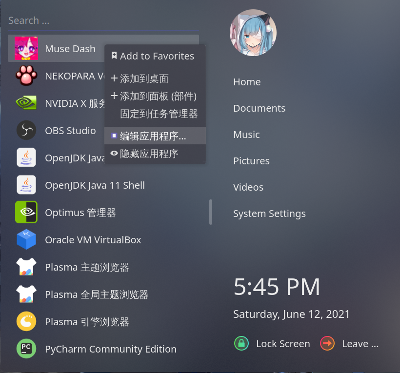
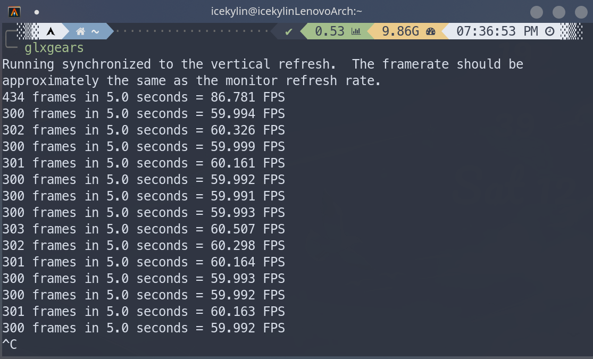

# archlinux 显卡驱动

> ### 🪁 接天莲叶无穷碧，映日荷花别样红
>
> 近年来，archlinux 的显卡驱动安装已经变得非常容易。本小节区分集成显卡、独立显卡和双显卡（集显 + 独显）三大类讨论 archlinux 显卡驱动的安装

> ### 🔖 这一节将会讨论：
>
> ::: details 目录
>
> [[toc]]
>
> :::

所有 AMD 显卡建议使用开源驱动，英伟达显卡建议使用闭源驱动。

::: tip ℹ️ 提示

进行本小节内容时建议按照步骤 [12. 设置 Timeshift 快照](desktop-env-and-app.md#_12-设置-timeshift-快照) 设置了 Timeshift 快照，并且已经有至少一张快照。

:::

::: tip ℹ️ 提示

虚拟机不需要安装显卡驱动。

:::

::: tip ℹ️ 提示

若在设置过程中导致黑屏无法进入桌面，请尝试使用使用 `Ctrl` + `Alt` + `F1 ~ F6` 在 `tty1 ~ tty6` 之间切换。

将导致黑屏的配置删掉或使用快照恢复后重新启动电脑。

:::

::: warning ⚠️ 注意

请确保已经按照本指南之前的章节安装配置好系统再向下进行，**不要多个教程混着看（尤其是一些过时的教程）**。因为可能导致漏掉本指南前置步骤中的某些操作，从而造成问题。

:::

## 集成显卡

### Intel 核芯显卡

如有需要可以参阅 [ArchWiki 相关内容](https://wiki.archlinux.org/index.php/Intel_graphics)。

通过以下命令安装如下几个包即可：

```bash
sudo pacman -S mesa lib32-mesa vulkan-intel lib32-vulkan-intel
```

::: tip ℹ️ 提示

不建议安装 `xf86-video-intel`，而应使用 Xorg 的 modesetting 驱动（也就是什么都不用装的意思）

注意，只有 Intel HD 4000 及以上的集显才支持 vulkan。

:::

### AMD 集成显卡

如有需要可以参阅 [ArchWiki 相关内容](https://wiki.archlinux.org/title/ATI)。

#### 选择驱动

对于具有集成显卡的 AMD 处理器，需要先确定集显架构（Architecture）是什么，再决定安装什么驱动。

推荐在 [TECHPOWERUP](https://www.techpowerup.com/) 进行查询，信息非常全面。在确定了显卡架构后，再根据架构对照下表决定安装什么驱动。

|   GPU 架构    |    Radeon 显卡    |   开源驱动    |  非开源驱动  |
| :-----------: | :---------------: | :-----------: | :----------: |
| GCN 4 及之后  |      多种\*       |   AMDGPU\*    | AMDGPU PRO\* |
|     GCN 3     |       多种        |    AMDGPU     |  AMDGPU PRO  |
|     GCN 2     |       多种        | AMDGPU/ ATI\* |    不支持    |
|     GCN 1     |       多种        | AMDGPU / ATI  |    不支持    |
| TeraScale 2&3 | HD 5000 - HD 6000 |      ATI      |    不支持    |
|  TeraScale 1  | HD 2000 - HD 4000 |      ATI      |    不支持    |
|    旧型号     |   X1000 及之前    |      ATI      |    不支持    |

\*[多种](https://en.wikipedia.org/wiki/List_of_AMD_graphics_processing_units)

\*[AMDGPU](<https://wiki.archlinux.org/title/AMDGPU_(%E7%AE%80%E4%BD%93%E4%B8%AD%E6%96%87)>)

\*[AMDGPU PRO](https://wiki.archlinux.org/title/AMDGPU_PRO)

\*[ATI](<https://wiki.archlinux.org/title/ATI_(%E7%AE%80%E4%BD%93%E4%B8%AD%E6%96%87)>)

::: tip ℹ️ 提示

对于 `GCN 2.0` 及以下架构的老显卡，**直接安装开源 ATI 驱动即可**，原本老旧的闭源 Catalyst 驱动在 2021 年已被废弃。

`GCN 2.0` 及以下架构的老显卡也**不要使用开源 AMPGPU 驱动**，因为其仅处于实验性质，需要各种自定义内核编译选项与配置，非常麻烦、得不偿失。

对于新型号（`GCN 3` 架构及更新）的集成显卡，**直接安装开源驱动 AMDGPU 即可**。

:::

下面是一些例子：

- 你的笔记本 cpu 是目前常见的 AMD Ryzen™ 7 4800U，它的集显为 Vega 8。通过查询，可知其为 `GCN 5.0` 架构，那么对照上表，你应该安装 AMDGPU 开源驱动。

- 你的台式机 cpu 是目前常见的 AMD Ryzen™ 5 3400G，它的集显为 Vega 11。通过查询，可知其为 `GCN 5.0` 架构，那么对照上表，你应该安装 AMDGPU 开源驱动。

- 再老一些的 7th Gen A10-9700 APU 处理器 ，它的集显为 Radeon R7。通过查询，可知其为 `GCN 2.0` 架构，那么对照上表，你应该安装 ATI 开源驱动。

#### 安装驱动

通过以下命令安装如下几个包即可：

::: code-group

```bash [开源驱动 AMDGPU]
sudo pacman -S mesa lib32-mesa xf86-video-amdgpu vulkan-radeon lib32-vulkan-radeon
```

```bash [开源 ATI 驱动]
sudo pacman -S mesa lib32-mesa xf86-video-ati
```

:::

## 独立显卡

### NVIDIA 独立显卡

::: tip ℹ️ 提示

部分 NVIDIA 独立显卡目前在 archlinux 下体验非常不好，存在以下问题：

1. 部分桌面特效（如窗口惯性晃动）很卡
2. 游戏无法正常运行
3. 画面撕裂

若遇到了上述问题，建议在 archlinux 中还是单独使用集成显卡（如果有）吧（还可以节省电量）。如果要 🎮 打游戏不妨重启到 win10。

:::

如有需要可以参阅 [ArchWiki 相关内容](<https://wiki.archlinux.org/title/NVIDIA_(%E7%AE%80%E4%BD%93%E4%B8%AD%E6%96%87)>)。

- 对于 [Turing (NV160/TUXXX)](https://nouveau.freedesktop.org/CodeNames.html#NV160) 系列或更新的显卡，需要安装 nvidia-open 驱动

::: tip ℹ️ 提示

该驱动的质量目前处于 'alpha quality' 状态，所以也许会有问题。并且它暂时不适用于具有 AMD 集成 GPU 的系统。

:::

::: code-group

```bash [linux]
sudo pacman -S nvidia-open nvidia-settings lib32-nvidia-utils # 必须安装
```

```bash [others]
sudo pacman -S nvidia-open-dkms nvidia-settings lib32-nvidia-utils # 必须安装
```

:::

- 其他较新型号的独立显卡使用以下命令直接安装如下几个包即可：

::: code-group

```bash [linux]
sudo pacman -S nvidia nvidia-settings lib32-nvidia-utils # 必须安装
```

```bash [others]
sudo pacman -S nvidia-dkms nvidia-settings lib32-nvidia-utils # 必须安装
```

:::

- 如果是 GeForce 630 以下到 GeForce 400 系列的老卡，使用以下命令安装 [nvidia-390xx-dkms](https://aur.archlinux.org/packages/nvidia-390xx-dkms/)<sup>aur</sup> 及其 32 位支持包：

```bash
yay -S nvidia-390xx-dkms nvidia-settings lib32-nvidia-390xx-utils
```

- 再老的显卡直接使用以下命令安装 [开源驱动](<https://wiki.archlinux.org/title/Nouveau_(%E7%AE%80%E4%BD%93%E4%B8%AD%E6%96%87)>) 即可：

```bash
sudo pacman -S mesa lib32-mesa xf86-video-nouveau
```

::: tip ℹ️ 提示

安装 NVIDIA 官方的驱动之后，需要编辑 `/etc/mkinitcpio.conf`，在 `HOOKS` 一行删除 `kms` 并保存，然后执行 `mkinitcpio -P` 重新生成一次镜像。这能防止 initramfs 包含 nouveau 模块，避免 nouveau 和官方驱动的冲突。

:::

### AMD 独立显卡

AMD 独立显卡的驱动安装步骤实际上**和 AMD 集成显卡是相同的**，都需要先确定架构，然后选定正确的驱动安装即可。参考步骤 [AMD 集成显卡](graphic-driver.md#amd-集成显卡)。

## 双显卡（集显 + 独显）

如有需要可以参阅 [ArchWiki 相关内容](<https://wiki.archlinux.org/title/PRIME_(%E7%AE%80%E4%BD%93%E4%B8%AD%E6%96%87)>)。

### NVIDIA 独立显卡

::: tip ℹ️ 提示

optimus-manager 已经支持 AMD 集成显卡 + NVIDIA 独立显卡组合。

:::

如有需要可以参考 [optimus-manager 官方文档](https://github.com/Askannz/optimus-manager/wiki)。

同时拥有集成显卡与独立显卡的笔记本电脑，同样需要**按照上述步骤先安装各个对应的软件包**。除此之外还需要安装 optimus-manager<sup>cn / aur</sup> 以及其图形前端 optimus-manager-qt<sup>aur</sup>。通过该程序可以在集成显卡和独立显卡间轻松切换。optimus-manager 提供三种模式 —— 分别为仅用独显、仅用集显以及 hybrid 动态切换模式。

1. 使用以下命令安装相关软件包：

::: code-group

```bash [cn]
yay -S optimus-manager optimus-manager-qt
```

```bash [aur]
yay -S aur/optimus-manager optimus-manager-qt
```

:::

2. 安装完成后重启即可使用。optimus-manager 安装完成后会默认设置 `optimus-manager.service` 服务自动启动，但建议还是通过以下命令手动设置一下：

```bash
sudo systemctl enable optimus-manager.service
```

3. 重启后在在菜单栏打开 optimus-manager 即可使用。可在其设置中设置开机自动启动：


此时你应该已经可以进行显卡切换了。

::: tip ℹ️ 提示

如果有问题，请详细阅读 optimus-manager 的文档，里面有详细的描述。由于各类问题太多，本文不再赘述。此处仅列出几项较为重要的注意事项:

- 如果需要在独显和集显模式间切换，要注意你没安装各类 GPU 监控插件，它们会阻止显卡切换，导致不可预料的错误
- 不要使用 Nvidia Control Panel 中的 `Save to X Configuration file` ，会导致配置冲突
- 在显卡之间的切换时，重新登陆后如在 splash screen 卡住或者黑屏，可以尝试按照上述提示在 `tty1 ~ tty6` 之间进行切换

:::

#### 动态切换

::: tip ℹ️ 提示

hybrid 动态切换模式并不是自动的（类似 win10），需要手动添加环境变量。

:::

hybrid 动态切换模式本质上是使用**针对使用闭源驱动**的双显卡 [PRIME](https://wiki.archlinux.org/title/PRIME#PRIME_render_offload) 方法进行切换 —— 这需要设置三个环境变量。有两种方法：

1. 通过命令手动添加前缀，也可直接添加环境变量在全局环境下（不推荐）。如果加在了全局环境中，在从 hybrid 动态切换模式切换到其他模式之前一定要去掉这三个环境变量，否则会黑屏

2. 用 nvidia-prime 包提供的命令 `prime-run`

##### prime-run 方法

::: tip ℹ️ 提示

`prime-run` 部分应用可以不需要安装 optimus-manager，直接运行。

但不推荐这样，因为除了部分应用会报错之外也无法使用仅独立显卡模式。

:::

1. 通过以下命令安装 nvidia-prime 包：

```bash
sudo pacman -S nvidia-prime
```

2. 通过以下命令（请将 `%command%` 替换为要运行的命令）以使用 NVIDIA 独立显卡运行程序：

```bash
prime-run %command%
```

运行 steam 游戏的例子：

```bash
prime-run steam steam://rungameid/570 # 运行 Dota 2
prime-run steam steam://rungameid/730 # 运行 CS:GO
```

::: tip ℹ️ 提示

steam 游戏的启动参数 `steam://rungameid/xxx` 可通过以下方式查找：

1. 右键需要运行的游戏图标 > 点击 `编辑应用程序...`：



2. 在 `应用程序` 选项卡 > `命令` 处查看：


:::

##### 环境变量方法

###### 手动输入

通过以下命令（请将 `%command%` 替换为要运行的命令）以使用 NVIDIA 独立显卡运行程序：

```bash
__NV_PRIME_RENDER_OFFLOAD=1 __GLX_VENDOR_LIBRARY_NAME="nvidia" __VK_LAYER_NV_optimus="NVIDIA_only" %command%
```

运行 steam 游戏的例子：

```bash
__NV_PRIME_RENDER_OFFLOAD=1 __GLX_VENDOR_LIBRARY_NAME="nvidia" __VK_LAYER_NV_optimus="NVIDIA_only"  steam steam://rungameid/570 # 运行 Dota 2
__NV_PRIME_RENDER_OFFLOAD=1 __GLX_VENDOR_LIBRARY_NAME="nvidia" __VK_LAYER_NV_optimus="NVIDIA_only"  steam steam://rungameid/730 # 运行 CS:GO
```

###### 全局变量

::: warning ⚠️ 注意

[optimus-manager 官方文档](https://github.com/Askannz/optimus-manager/wiki/Nvidia-GPU-offloading-for-%22hybrid%22-mode#setup) 中不推荐将此环境变量添加到全局环境。

_It is not recommended to set those variables system-wide (like in `/etc/environment`), since it would defeat the point of hybrid mode, and can also break desktop compositing on some environment (resulting in a black screen)._

也就是说会遇到这些问题：

1. Kwin / 显示特效混合器（混成器）奔溃（毛玻璃效果消失，原本是透明或毛玻璃效果的背景变黑）
2. 黑屏

:::

1. 使用 `vim` 编辑 `/etc/environment` 文件：

```bash
sudo vim /etc/environment
```

加入以下内容：

```bash
__NV_PRIME_RENDER_OFFLOAD=1
__GLX_VENDOR_LIBRARY_NAME="nvidia"
__VK_LAYER_NV_optimus="NVIDIA_only"
```

2. 保存并退出 `vim`

#### 电源管理

::: tip ℹ️ 提示

如果不是强烈追求能效控制以及注重电池寿命的用户，那么可以略过此段。配置电源管理需要针对你的硬件以及笔记本型号尝试正确的电源管理方式。

此部分的设置可能导致黑屏，并且尝试过程可能较长，也可能会遇到各类问题。请根据自身需求和能力选择是否操作。

:::

电源管理做的事情是，**在只用集显的模式下，确保正确关闭独立显卡**；而在混合模式下，绝大多数情况下 NVIDIA 模块实际是始终开启的，**电源管理并不生效**。

这件事情其实很复杂，因为对于不同的显卡型号，以及笔记本型号的组合，可行的方案都是不同的。笼统来说，最广泛适用的办法是 Bbswitch。但**不建议上来就按照此方式安装使用**，因为某些特定的硬件就是会出问题（黑屏）。

建议按照 [optimus-manager 官方文档](https://github.com/Askannz/optimus-manager/wiki/A-guide--to-power-management-options) 一步步尝试，最后找到属于你自己电脑合适的电源管理方式。**此文档必须详细阅读！**

针对大多数笔记本适用的 Bbswitch，此处进行安装使用的讲解。

1. 通过以下命令安装包 `bbswitch`；若使用其它内核，则安装包 `bbswitch-dkms`：

::: code-group

```bash [linux]
sudo pacman -S bbswitch
```

```bash [others]
sudo pacman -S bbswitch-dkms
```

:::

2. 右键 optimus-manager 的托盘图标 > 点击 `设置` > 在 Optimus 选项卡中的 `switch method` 中选择 `Bbswitch` 即可：


3. 重启之后，若使用仅集显模式使用如下命令验证 NVIDIA 独立显卡是否被禁用：

```bash
lspci | grep NVIDIA
```


若有 `rev ff` 字样，则表示独显已经成功禁用。

### AMD 独立显卡

虽然 AMD 独立显卡无法使用 optimus-manager，但可以使用**针对使用开源驱动**的双显卡 [PRIME](https://wiki.archlinux.org/title/PRIME#For_open_source_drivers_-_PRIME) 方法进行切换。也就是使用 `DRI_PRIME=1` 前缀使用独立显卡（可能还更简单了？🤔）。

- 通过以下命令（请将 `%command%` 替换为要运行的命令）以使用 AMD 独立显卡运行程序：

```bash
DRI_PRIME=1 %command%
```

运行 steam 游戏的例子：

```bash
DRI_PRIME=1 steam steam://rungameid/570 # 运行 Dota 2
DRI_PRIME=1 steam steam://rungameid/730 # 运行 CS:GO
```

- 可以使用以下命令分别对集成显卡和独立显卡进行性能测试，选择分数更高的一个使用：

::: code-group

```bash [集成显卡]
glmark2
```

```bash [独立显卡]
DRI_PRIME=1 glmark2
```

:::

关于 glmark2 的说明请参阅 [glmark2](graphic-driver.md#glmark2)。

- 可以在 steam 游戏的启动前缀中加入 `DRI_PRIME=1 mangohud %command%` 来使用独显的同时显示帧数等信息。关于 [mangohud](https://aur.archlinux.org/packages/mangohud)<sup>aur</sup> 的使用请参阅 [这里]()。

## 性能测试

如有需要可以参考 [ArchWiki 相关内容](<https://wiki.archlinux.org/title/Benchmarking_(%E7%AE%80%E4%BD%93%E4%B8%AD%E6%96%87)>)。

### glxgears

最传统和广为人知的方式是使用 `glxgears` 命令进行测试，其属于 [mesa-utils](https://www.archlinux.org/packages/extra/x86_64/mesa-utils/) 包。

1. 通过以下命令安装 [mesa-utils](https://www.archlinux.org/packages/extra/x86_64/mesa-utils/) 包（可能已经安装了）：

```bash
sudo pacman -S mesa-utils
```

2. 通过以下命令进行测试：

```bash
glxgears
```

随后会弹出一个小窗口运行测试程序：


帧数会打印在终端中：



3. 使用 `Ctrl` + `C` 退出测试

`glxgears` 仅仅只能提供简单的测试场景及帧数显示，只测试了当前 OpenGL 功能的一小部分，功能明显不足。笔者推荐如下两种工具。

### glmark2

glmark2 提供了一系列丰富的测试，涉及图形单元性能（缓冲、建筑、照明、纹理等）的不同方面，允许进行更全面和有意义的测试。每次测试单独计算帧速率。最终，程序根据之前的所有测试给出一个最终分数。在 archlinux 上属于包 [glmark2](https://aur.archlinux.org/packages/glmark2/)<sup>cn / aur</sup>。

1. 使用以下命令安装 glmark2：

::: code-group

```bash [cn]
sudo pacman -S glmark2
```

```bash [aur]
yay -S aur/glmark2
```

:::

2. 使用以下命令启动 glmark2：

```bash
glmark2
```

随后会弹出一个小窗口运行测试程序：


以笔者的硬件为例（集成显卡），测试结果如下：


### Unigine benchmark

Unigine 3D 引擎是一个更全面的基准测试工具。截止目前有五个版本，从新到旧分别是：

- superposition<sup>EULA</sup>（2017）
- valley<sup>EULA</sup>（2013）
- heaven<sup>EULA</sup>（2009）
- tropics<sup>EULA</sup>（2008）
- sanctuary<sup>EULA</sup>（2007）

1. 可以使用以下命令从 [AUR](https://aur.archlinux.org/packages/?O=0&K=unigine) 下载全部版本（选一个即可）：

```bash
yay -S unigine-superposition
yay -S unigine-valley
yay -S unigine-heaven
yay -S unigine-tropics
yay -S unigine-sanctuary
```


2. 使用以下命令启动 Unigine benchmark（输入对应安装的版本）：

```bash
unigine-superposition
unigine-valley
unigine-heaven
unigine-tropics
unigine-sanctuary
```


3. 调整参数后，点击 `RUN` 即可进入测试，帧数会显示在右上角

4. 点击左上角 `基准` 开始基准测试

5. 点击左上角 `退出` 并 `确定` 即可退出测试

此基准测试工具拥有实时的环境遮挡、来自不同来源的相互关联的灯光、HDR 效果图、逼真的水和具有大气光散射的动态天空。此外还可以设置抗锯齿级别、纹理质量和滤波、各向异性和着色器质量。

## 显卡信息查看

### NVIDIA 独立显卡

`nvidia-settings` 这个包即可全面的展示显卡相关信息（在步骤 [NVIDIA 独立显卡](graphic-driver.md#独立显卡) 中已经安装）。

### AMD 独立显卡 / 集成显卡

1. 通过以下命令安装 [radeon-profile-git](https://aur.archlinux.org/packages/?O=0&SeB=nd&K=radeon-profile-git&outdated=&SB=n&SO=a&PP=50&do_Search=Go)<sup>aur</sup> 包以及其依赖 [radeon-profile-daemon-git](https://aur.archlinux.org/packages/?O=0&SeB=nd&K=radeon-profile-daemon-git&outdated=&SB=n&SO=a&PP=50&do_Search=Go)<sup>aur</sup>：

```bash
yay -S radeon-profile-git radeon-profile-daemon-git
```

2. 使用以下命令启动这个进程，即可以图形化的方式查看 AMD 显卡信息：

```bash
sudo systemctl enable --now radeon-profile-daemon.service
```

::: tip ℹ️ 提示

不要对左下角的 `auto low high` 进行更改，有 bug 会导致卡死。

同时，显存占用在某些型号显卡上展示可能有误。

:::
