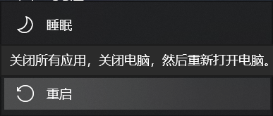
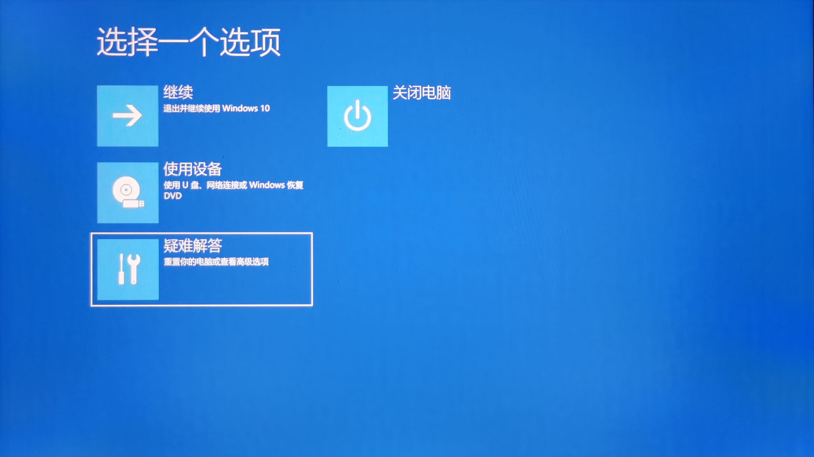
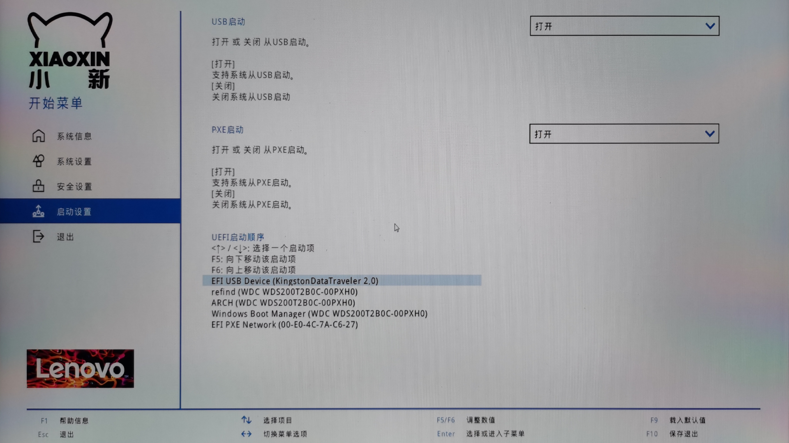
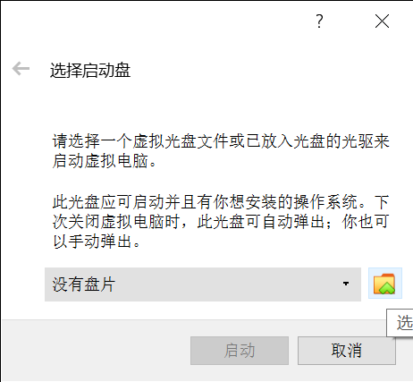
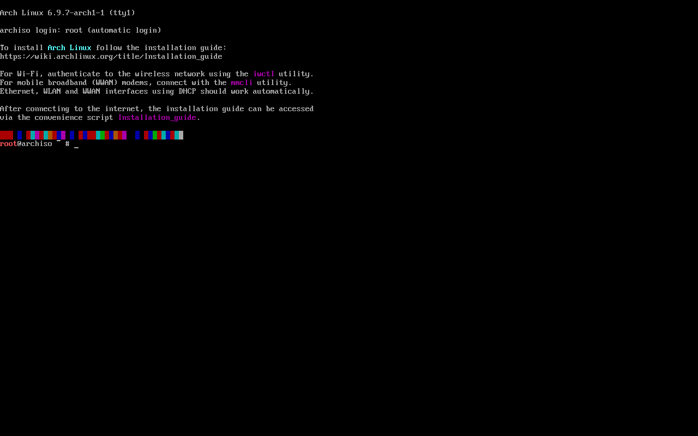

# 安装前的准备

> ### 🧭 凡事预则立，不预则废
>
> 这一章开始，我们正式开始安装 archlinux。但是我们首先要做一些准备工作。

::: tip ℹ️ 提示

由于当前 UEFI 已普及十余年，安装将全部以 `UEFI + GPT` 的形式进行，传统 `BIOS` 方式不再赘述。

:::

::: tip ℹ️ 提示

指南中带有 EULA 角标的软件代表是 [专有软件](https://www.gnu.org/proprietary/proprietary.html)。请自行斟酌是否使用。

:::

## 1. 确保网络环境

如果你可以使用路由器分接出来的网线，以 dhcp 的方式直接上网，那么不用准备什么。如果你的环境只能使用无线网络安装，需要事先把自己所用的
wifi 名称改成自己能记住的英文名称。因为**安装时无法显示和输入中文名的 wifi**，你会看到一堆不知道是什么的方块，并且在安装过程中你将没有办法输入中文的无线名称进行连接。

其次，有些笔记本电脑上存在无线网卡的硬件开关或者键盘控制，开机后安装前需要**确保你的无线网卡硬件开关处于打开状态**。

## 2. 下载安装镜像

安装镜像 iso 在开源镜像站（推荐）或者 [archlinux 官方下载页面](https://archlinux.org/download/) 下载。

下面是国内常用的提供 archlinux 安装镜像的开源镜像站（选一个即可）：

- [中国科学技术大学开源镜像站](http://mirrors.ustc.edu.cn/)
- [清华大学开源软件镜像站](https://mirrors.tuna.tsinghua.edu.cn/)
- [华为开源镜像站](https://repo.huaweicloud.com/archlinux/)
- [兰州大学开源镜像站](https://mirror.lzu.edu.cn/archlinux/)

其中前两者点击网页右侧侧栏的获取下载链接，选择 archlinux 下载即可。

后两者需要依次点击 `iso` > `20XX.XX.XX` > `archlinux-20XX.XX.XX-x86_64.iso`。

::: warning ⚠️ 注意

请确保下载最新的安装镜像！因为 archlinux 是滚动发行版，不存在使用旧的安装镜像安装旧版本的说法。

这里也可以看出 archlinux 每月 1 日释出新的安装镜像。

:::

中科大的开源镜像站下载速度还是很快的。

## 3. 刻录安装 U 盘

准备一个 2G 以上的 U 盘，刻录一个安装盘。

### 3-1. Windows

Windows 下推荐使用 [Ventoy](https://www.ventoy.net/cn/doc_start.html)、[Rufus](https://rufus.ie/)
或者 [Power ISO](https://www.poweriso.com/download.php)EULA 进行 U 盘刻录。三者皆为免费使用的软件。具体操作请自行查阅，都非常简单。

除此之外，如果你还嫌麻烦，还可以使用更为简单的安装盘制作工具 [balenaEtcher](https://www.balena.io/etcher/)：

::: tip ℹ️ 提示

使用 balenaEtcher 制作完成的安装盘若要重新作为普通 U
盘使用，需要用磁盘分区管理工具（如 [KDE 分区管理器](https://apps.kde.org/partitionmanager/)、[DiskGenius](https://www.diskgenius.cn/)
EULA）重建分区表才能正常格式化。

:::

### 3-2. Linux

Linux 下同样可以使用 Ventoy 和
balenaEtcher，具体步骤可参阅 [Ventoy（推荐）](../advanced/make-install-disk.md#ventoy-%E6%8E%A8%E8%8D%90)
以及 [balenaEtcher](../advanced/make-install-disk.md#balenaetcher)。

也可以直接用 `dd` 命令进行刻录，具体步骤可参阅 [dd 命令](/guide/advanced/make-install-disk.html#dd-命令)。

## 4. 为 archlinux 分出硬盘空间（可选）

### (1) 系统盘

如果目标是双系统（win10 + archlinux），并且 win10 和 archlinux 将要共存在一个硬盘上的话，往往要在 win10 使用的分区上分出空闲硬盘空间给
archlinux。这里建议**至少分 `128GB` 给 archlinux**。

1. 右键点击 `开始菜单` > 点击 `磁盘管理`

   

2. 右键点击 `需要压缩的分区` > 点击 `压缩卷`

   

3. 在 `输入压缩空间量(MB)` 输入需要分给 archlinux 的空闲硬盘空间大小。假设分配 `128GB` 则输入 `131072`（1GB =
   1024MB，128GB = 128 \* 1024MB = 131072MB）

   

4. 点击 `压缩`，完成之后关闭磁盘管理即可

::: warning ⚠️ 注意

请不要做多余的动作！不要在这里为分出的硬盘空间创建分区！

:::

### (2) EFI 分区

如果 archlinux 需要和 Windows 共存在一个硬盘上，需要通过 DiskGenius 或其他分区软件检查 EFI 分区容量不小于 256MB，如果小于，可能需要扩容（推荐，但可能不太好整）或者按照 [ArchWiki 提供的第三种挂载方式](https://wiki.archlinuxcn.org/wiki/EFI_%E7%B3%BB%E7%BB%9F%E5%88%86%E5%8C%BA#%E5%85%B8%E5%9E%8B%E6%8C%82%E8%BD%BD%E7%82%B9) 新增一个额外的挂载点。

## 5. 获取 Bitlocker 恢复密钥

若 win10 分区使用了 🔐 Bitlocker 加密，请提前获取恢复密钥。

关于解锁密钥的查找请参阅 [Microsoft 相关页面](https://support.microsoft.com/zh-cn/windows/%E5%9C%A8-windows-10-%E4%B8%AD%E6%9F%A5%E6%89%BE-bitlocker-%E6%81%A2%E5%A4%8D%E5%AF%86%E9%92%A5-6b71ad27-0b89-ea08-f143-056f5ab347d6)。

一般来说使用与 win10 相同的微软账号登录 [aka.ms 相关页面](https://aka.ms/myrecoverykey) 即可获取。

## 6. 进入主板 BIOS 进行设置

**插入优盘并开机**。在开机的时候，按下 `F2` / `F8` / `F10` / `DEL` 等（取决与你的主板型号，具体请查阅你主板的相关信息）按键，进入主板的
BIOS 设置界面。

除此之外，如果你还嫌麻烦，还可以使用以下方法进入 BIOS：

1. 在 win10 下 按住 `Shift` 键同时点击 `重启`

   

2. 保持按住 `Shift` 键直到进入如图所示界面

   

3. 选择 `疑难解答` 并回车 `Enter`

   

4. 选择 `UEFI 固件设置` 并回车 `Enter`

   

5. 按下 `Enter` 重启，此时应该已经进入了 BIOS

::: info 🍧 碎碎念

随着时代的发展，主板的 BIOS 界面也越来越现代；很多主板都有了中文，根据主板 BIOS 界面的提示进行操作吧！

:::

## 7. 关闭 BIOS 设置中的 Secure Boot

在类似名为 `security`（安全） 的选项卡中，找到一项名为 `Secure Boot`（安全启动，名称可能略有差异）的选项，选择 `Disable` 将其禁用。

::: info 🍧 碎碎念

有少数奇葩的主板里面，`Secure Boot` 被设置为开启，却不存在关闭它的选项，但系统主板内置有 Windows 系统的公钥证书签名，使其只能加载
Windows，其它系统（包括 archlinux）一律不予加载。用户不能关闭它，还没法换系统，实在让人无语 😶

如果你正好是这样的电脑，emmm... 不妨在虚拟机里尝试下 archlinux 吧！

:::

## 8. 调整启动方式为 UEFI（可能不需要）

在某些旧的主板里，需要调整启动模式为 `UEFI`，而非传统的 `BIOS/CSM`。在类似名为 `boot` 的选项卡中，找到类似名为 `Boot Mode`
的选项，确保将其调整为 `UEFI only`，而非 `legacy/CSM`。

## 9. 调整硬盘启动顺序

在类似名为 `boot` 的选项卡中，找到类似名为 `Boot Options`（名称可能略有差异）的设置选项，将优盘的启动顺序调至首位。

## 10. 保存 BIOS 设置

最后保存 BIOS 设置并退出，一般的按键是 `F10`。

## 11. 准备安装

此时电脑重启，不出意外的话根据提示你应该可以顺利进入 archlinux 的安装界面了（有一头 🐄 牛牛在讲话）。

::: tip ℹ️ 提示

archlinux 安装盘应该一直插在电脑上。

:::
