# 虚拟机安装前的准备

> ### ✔ 磨刀不误砍柴工
>
> 在实体机安装 archlinux 前，不妨先在虚拟机中尝试一下 archlinux 的安装。同样的，我们需要做一些设置。

> ### 🔖 这一节将会讨论：
>
> ::: details 目录
>
> [[toc]]
>
> :::

本小节将在 win11 环境下使用 [Oracle VM VirtualBox](https://www.virtualbox.org/) 虚拟机安装 archlinux。

> #### 📑 相关资料：VirtualBox
>
> VirtualBox 是一款开源虚拟机软件。由德国 Innotek 公司开发，Sun Microsystems 公司出品。使用 Qt 编写，在 Sun 被 Oracle 收购后正式更名成 Oracle VM VirtualBox。采用 GPL 协议开源。

## 1. 安装 VirtualBox

VirtualBox 安装包同样可以在开源镜像站（推荐）或者 [VirtualBox 官方下载页面](https://www.virtualbox.org/wiki/Downloads) 下载。

下面是国内常用的提供 VirtualBox 安装包的开源镜像站（选一个即可）：

- [清华大学开源软件镜像站](https://mirrors.tuna.tsinghua.edu.cn/help/virtualbox/)
- [哈尔滨工业大学开源镜像站](https://mirrors.hit.edu.cn/virtualbox/)

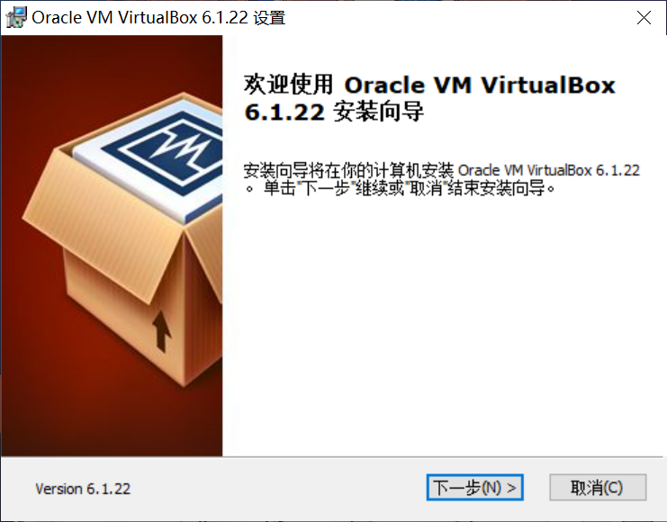

根据安装包的提示安装即可。

## 2. 下载安装镜像

同样的，虚拟机安装 archlinux 也需要安装镜像。

请参阅上一节 [安装前的准备](pre-install.md#_2-下载安装镜像) 下载。

## 3. 配置 VirtualBox

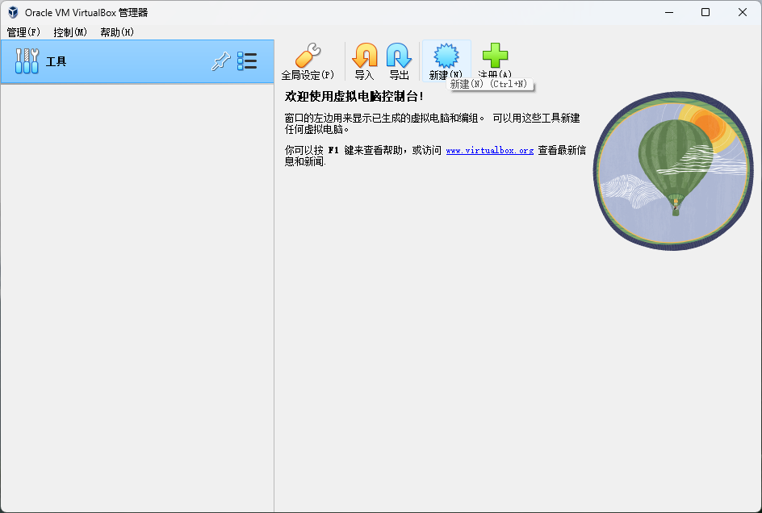

1. 打开 VirtualBox > 点击 `新建`

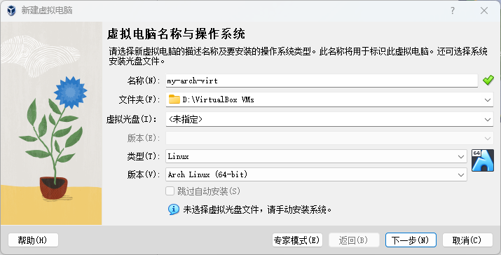

2. 基础设置
   1. 输入虚拟机的名字。建议不要在名字中带有特殊字符
   2. 选择虚拟机相关文件的保存位置（你的虚拟硬盘也会保存在这个位置！请确保有足够的磁盘空间）
   3. 若名字中含有 `arch` 字眼，VirtualBox 会自动将类型和版本修改为 archlinux，否则请手动选择
   4. 点击 `下一步`

::: tip ℹ️ 提示

你可以在这一步就选择虚拟光盘，但本教程将在后面启动时选择。

:::

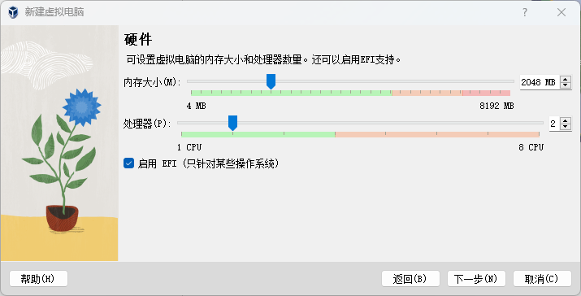

3. 设置硬件
   1. 将 `内存大小` 修改为合适大小。建议大于 2GB。因为即使 archlinux 可以在 512MB 的内存下运行，但安装还需要更多的内存
   2. 适当调整 `处理器数量`
   3. 勾选 `启用 EFI`
   4. 点击 `下一步`

4. 指定虚拟磁盘大小。建议大于 64 GB（因为是动态分配，不会立即占用硬盘空间，请放心选择；同时我们在虚拟机里不会安装过多的软件，所以 64GB 足够我们使用，当然你也可以自由调整） > 点击 `下一步`

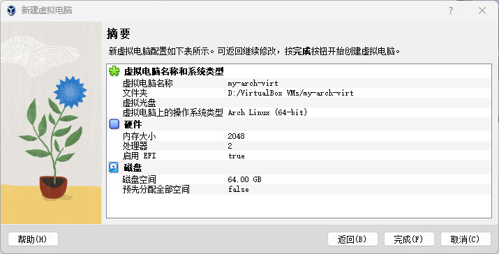

5. 确认无误后，点击 `完成`

::: tip ℹ️ 提示

设置向导完成后，请**不要**立即启动。

:::

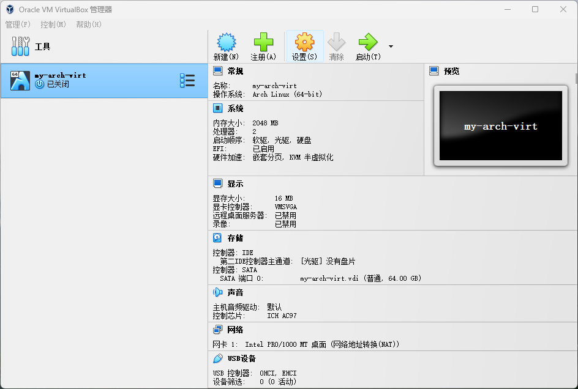

6. 点击 `设置`

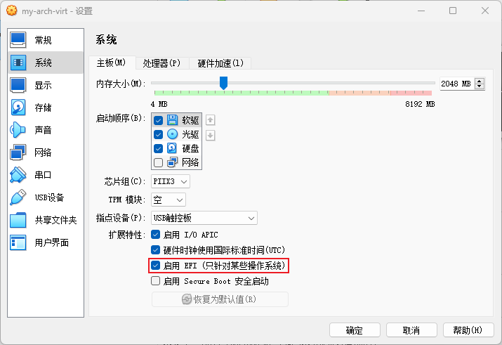

7. 点击侧栏 `系统` > `主板` > 在 `扩展特性` 中检查是否勾上 `启用 EFI` （如果没有，说明前面没有跟教程做，现在勾上也不晚！）

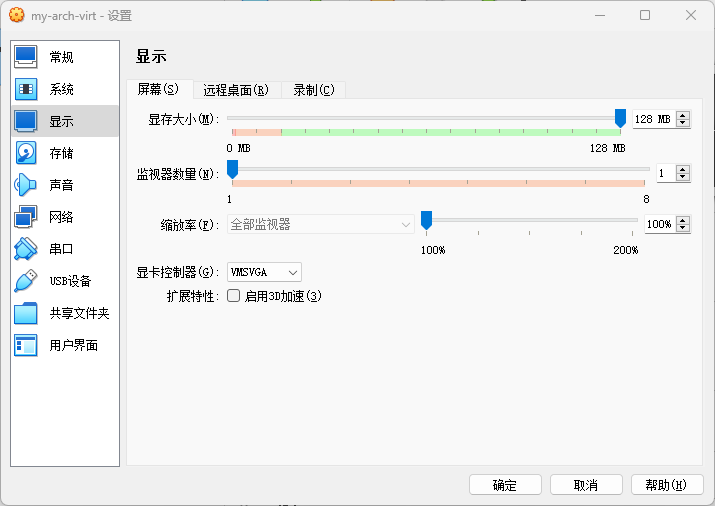

8. `显存大小` 可以做适当调整。如果是高分屏可以适当调大 `缩放率` 防止后面虚拟机启动后字太小

::: warning ⚠️ 注意

请不要勾选 `启用3D加速`。否则会导致安装好桌面环境后无法进入桌面，只有黑屏和光标。如有需要可以参阅 [ArchWiki 相关说明](<https://wiki.archlinux.org/title/VirtualBox_(%E7%AE%80%E4%BD%93%E4%B8%AD%E6%96%87)#Arch_Linux_guest%E8%99%9A%E6%8B%9F%E6%9C%BA%E4%B8%AD%E6%B2%A1%E6%9C%89%E7%A1%AC%E4%BB%B63D%E5%8A%A0%E9%80%9F>)。

:::

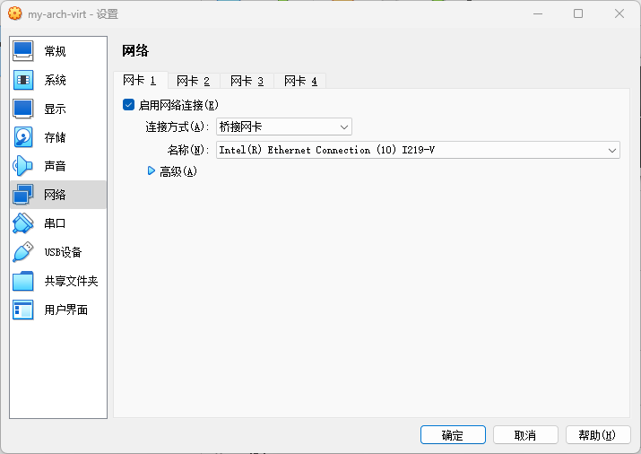

9. 在侧栏 `网络` > `网卡 1` > 将 `连接方式` 改为 `桥接网卡`

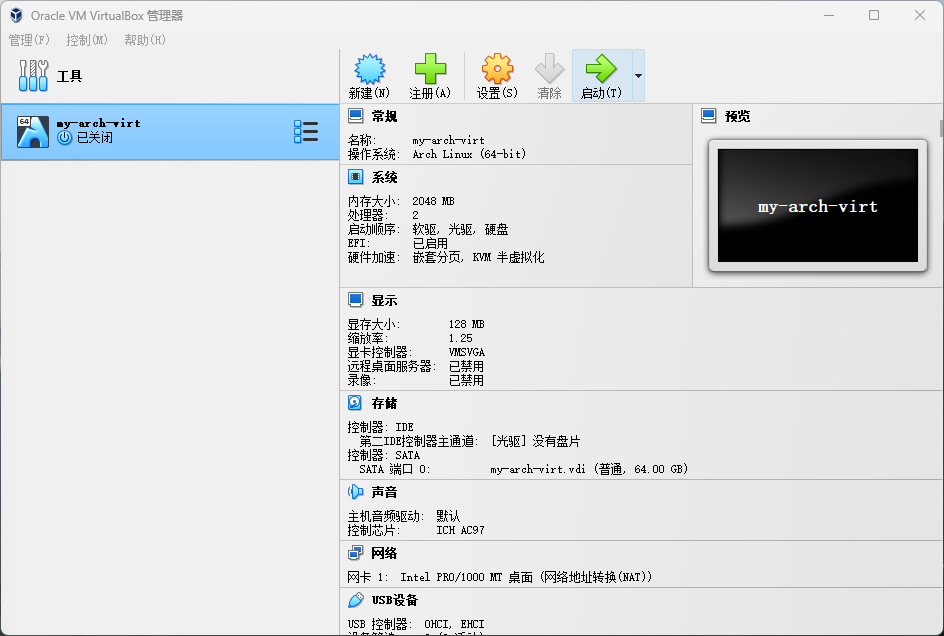

10. 点击 `启动`，开启虚拟机

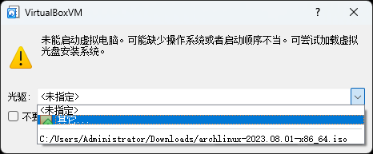

11. 在弹出的窗口的下拉菜单中选择 `其他`

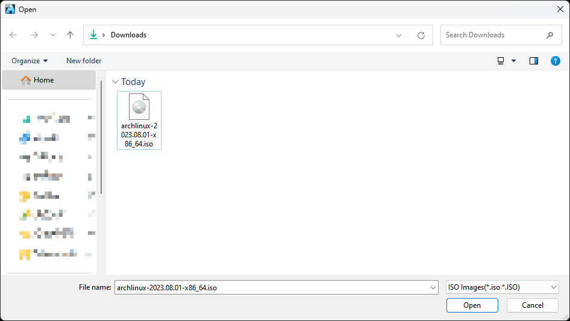

12. 在弹出的资源管理器中选择 `archlinux 安装镜像`

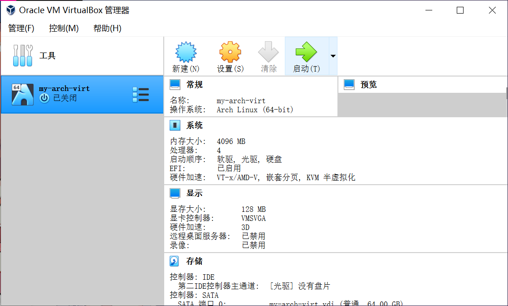

13. 点击 `挂载并尝试启动`

14. 在第一个选项回车 `Enter`

15. 此时虚拟机会黑屏一会，经过一段时间的等待和提示信息的刷屏，就可以进入安装环境了
