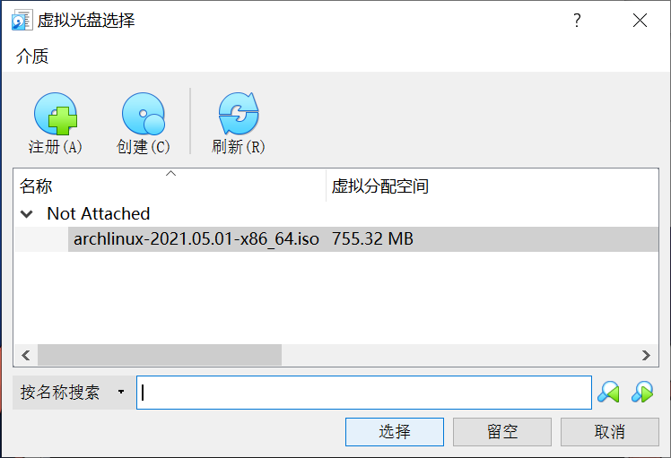
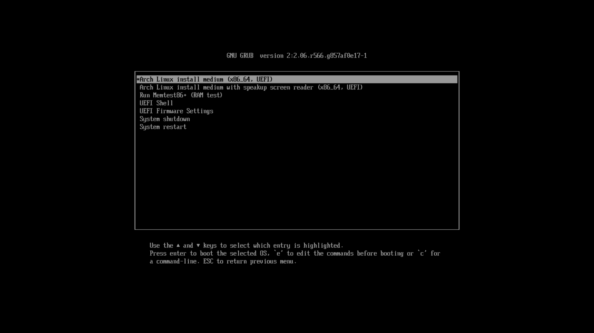
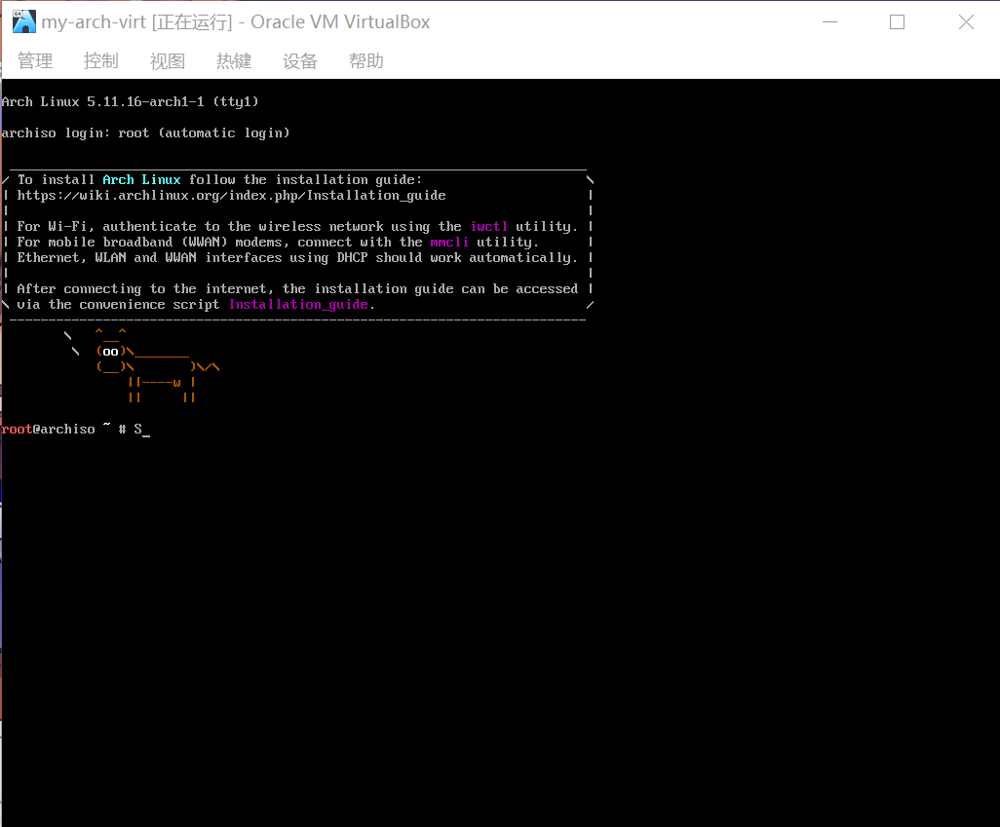

# 虚拟机安装前的准备

> ### ✔ 磨刀不误砍柴工
>
> 在实体机安装 archlinux 前，不妨先在虚拟机中尝试一下 archlinux 的安装。同样的，我们需要做一些设置。

> ### 🔖 这一节将会讨论：
>
> ::: details 目录
>
> [[toc]]
>
> :::

本小节将在 win10 环境下使用 [Oracle VM VirtualBox](https://www.virtualbox.org/) 虚拟机安装 archlinux。

> #### 📑 相关资料：VirtualBox
>
> VirtualBox 是一款开源虚拟机软件。由德国 Innotek 公司开发，Sun Microsystems 公司出品。使用 Qt 编写，在 Sun 被 Oracle 收购后正式更名成 Oracle VM VirtualBox。采用 GPL 协议开源。

## 1. 安装 VirtualBox

VirtualBox 安装包同样可以在开源镜像站（推荐）或者 [VirtualBox 官方下载页面](https://archlinux.org/download/) 下载。

下面是国内常用的提供 VirtualBox 安装包的开源镜像站（选一个即可）：

- [清华大学开源软件镜像站](https://mirrors.tuna.tsinghua.edu.cn/help/virtualbox/)
- [哈尔滨工业大学开源镜像站](https://mirrors.hit.edu.cn/virtualbox/)

根据安装包的提示安装即可。

## 2. 下载安装镜像

同样的，虚拟机安装 archlinux 也需要安装镜像。

请参阅上一节 [安装前的准备](pre-install.md#_2-下载安装镜像) 下载。

## 3. 配置 VirtualBox

1. 打开 VirtualBox > 点击 `新建`

2. 在弹出的设置向导窗口中输入虚拟机的名字以及虚拟机相关文件的保存位置。建议不要在名字中带有特殊字符。若名字中含有 `arch` 字眼，VirtualBox 会自动将类型和版本修改为 archlinux，否则请手动选择

3. 将内存大小修改为合适大小。建议大于 2GB。因为即使 archlinux 可以在 512MB 的内存下运行，但安装还需要更多的内存

4. 点击 `创建`

5. 选择 `VDI` 类型（默认） > 点击 `下一步`

6. 选择 `动态分配` （默认） > 点击 `下一步`

7. 选择合适的储存位置（一般默认即可） > 指定虚拟磁盘大小。建议大于 64 GB（因为是动态分配，不会立即占用硬盘空间，请放心选择；同时我们在虚拟机里不会安装过多的软件，所以 64GB 足够我们使用，当然你也可以自由调整） > 点击 `创建`

::: tip ℹ️ 提示

设置向导完成后，请**不要**立即启动。

:::

8. 点击 `设置`

9. 点击侧栏 `系统` > `主板` > 在 `扩展特性` 中勾上 `启用 EFI`

10. `处理器数量` 和 `显存大小` 可做适当调整

::: warning ⚠️ 注意

请不要在 `硬件加速` 中勾选 `启用3D加速`。否则会导致安装好桌面环境后无法进入桌面，只有黑屏和光标。如有需要可以参阅 [archWiki 相关说明](<https://wiki.archlinux.org/title/VirtualBox_(%E7%AE%80%E4%BD%93%E4%B8%AD%E6%96%87)#Arch_Linux_guest%E8%99%9A%E6%8B%9F%E6%9C%BA%E4%B8%AD%E6%B2%A1%E6%9C%89%E7%A1%AC%E4%BB%B63D%E5%8A%A0%E9%80%9F>)。

:::

11. 在侧栏 `网络` > `网卡 1` > 将 `连接方式` 改为 `桥接网卡`

12. 点击 `启动`，开启虚拟机

13. 在弹出的选择启动盘窗口点击 `文件夹小图标`

14. 点击 `注册` > 在弹出的资源管理器中选择 `archlinux 安装镜像`

15. 选中 `archlinux 安装镜像` > 点击 `选择`

16. 在第一个选项回车 `Enter`

17. 此时虚拟机会黑屏一会，经过一段时间的等待和提示信息的刷屏，就可以看到 🐂 牛牛了
