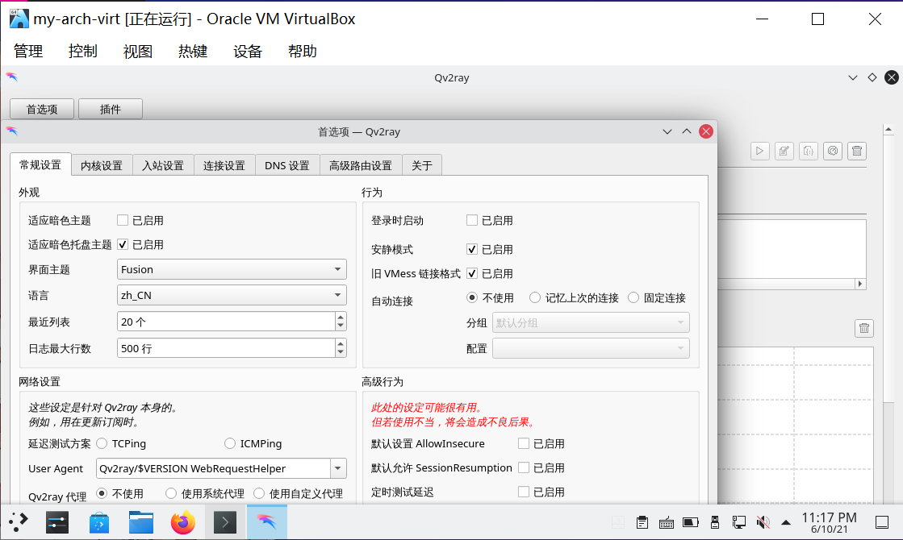
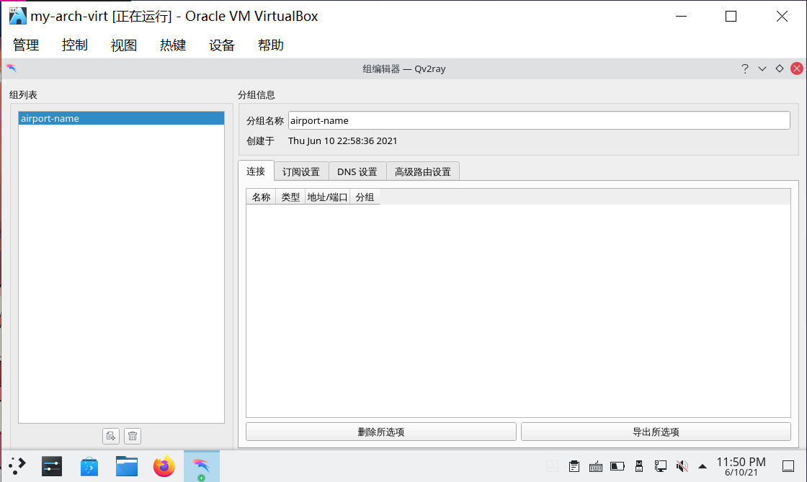
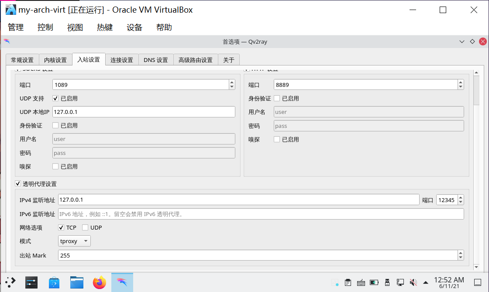
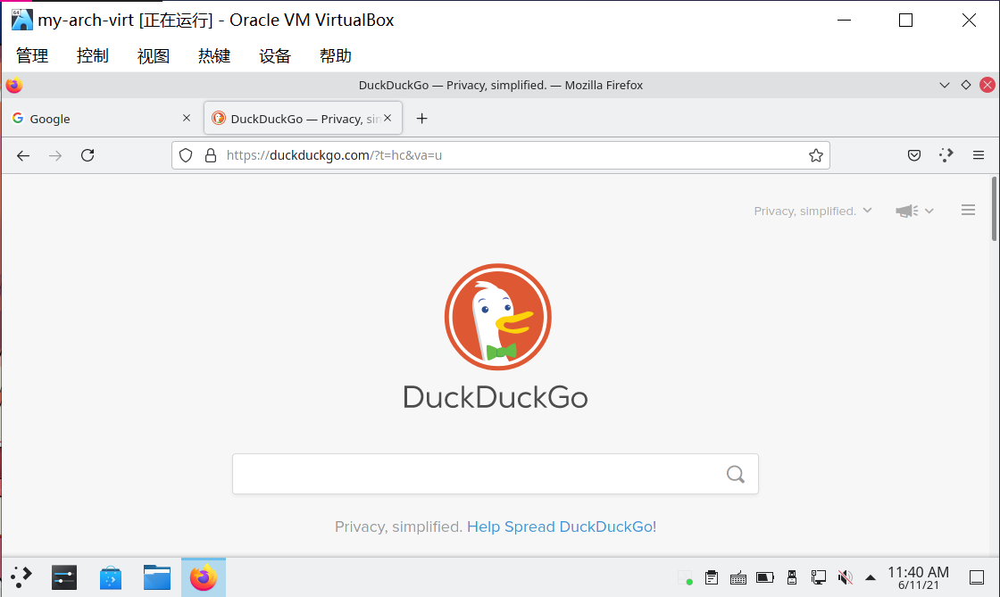
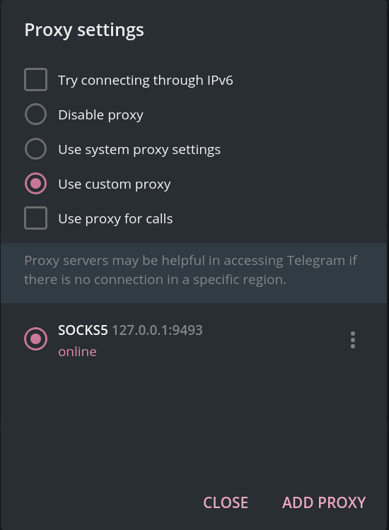
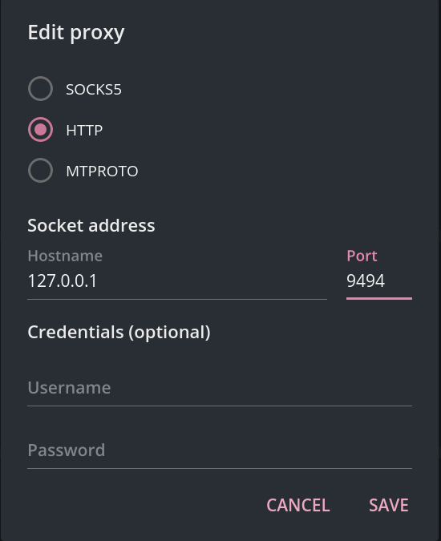
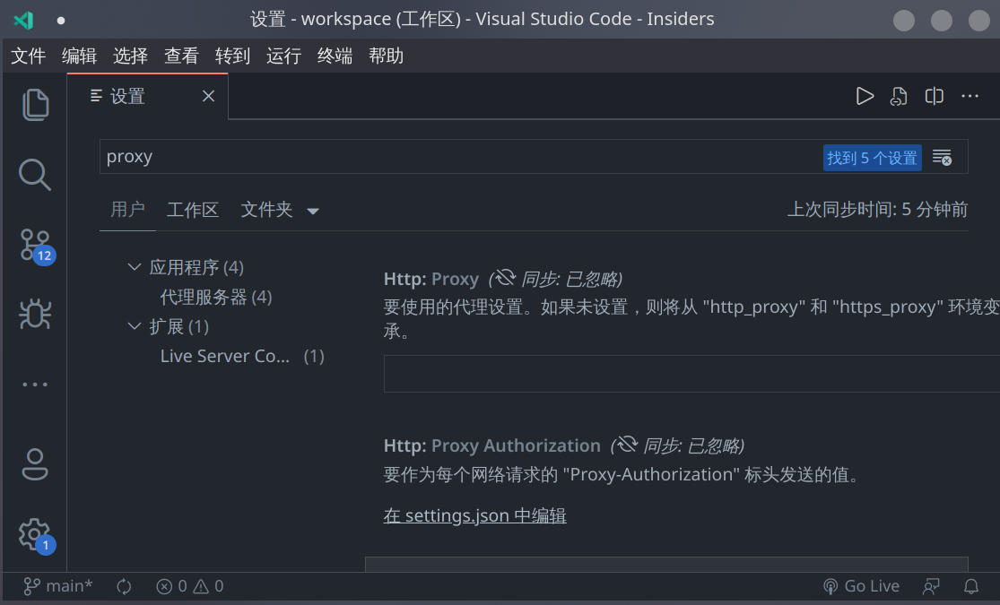
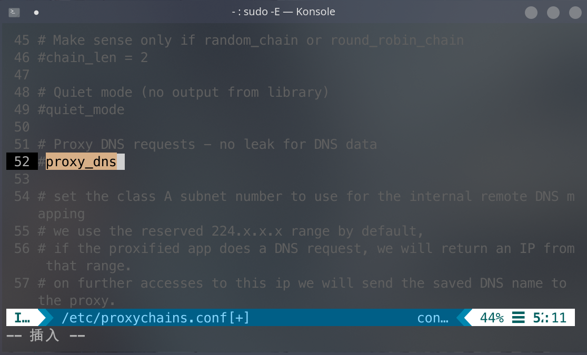

# archlinux 透明代理

> ### 🕊 纵使千山多万壑，犹有青鸾踏云间
>
> 全球化浪潮无法阻挡，我们常常有访问一些资料的客观需求。但有的时候因为一些因素往往导致无法正常访问（包括但不限于**终端中下载文件特别慢、无法访问部分网站、部分应用无法正常使用**等）。虽然前路千沟万壑，但无法阻挡我们前行的脚步。本节我们通过设置透明代理解决这一问题

::: tip ℹ️ 提示

鉴于 Qv2ray 原项目已[停止开发](https://github.com/Qv2ray/Qv2ray)，新的版本还不够完善，有魔法上网需求者建议使用 v2rayA 或 dae 替代 Qv2ray。

:::

## v2rayA

v2rayA 的优势：

- 支持一键开启全局代理，配置方便
- 客户端运行在浏览器中，轻量

### 安装 v2ray 和 v2rayA:

::: code-group

```bash [cn]
sudo pacman -S v2ray v2raya
```

```bash [aur]
sudo pacman -S v2ray
yay -S aur/v2raya
```

:::

### 配置 v2rayA

安装后启动服务：

```bash
sudo systemctl enable --now v2raya
```

随后在开始菜单中搜索 v2rayA，点击即可打开浏览器页面。在其中加入订阅(没有魔法上网节点？请参考[原文档相关内容](https://archlinuxstudio.github.io/ArchLinuxTutorial/#/rookie/fxckGFW?id=%e5%b7%b2%e6%9c%89%e7%a7%91%e5%ad%a6%e4%b8%8a%e7%bd%91%e7%9a%84%e8%8a%82%e7%82%b9%e7%9a%84%e6%83%85%e5%86%b5))。在设置中建议开启全局透明代理(选择`大陆白名单`)，同时开启防止 DNS 劫持功能，否则可能会拿不到被 DNS 污染的资源(如 github raw)。

## dae

::: tip ℹ️ 提示

v2rayA 开发者已逐步转向 dae。作为 v2rayA 的继承者，dae 放弃了 v2ray-core，以更灵活地满足用户的需求。daed 的图形化界面界面仍与 v2rayA 相似。

dae 的优势：

dae 是一种高性能透明代理解决方案。
为了尽可能提升分流性能，dae 利用了 Linux 内核中的 eBPF 技术，采用了透明代理和流量分流套件。因此，dae 可以使流量直接绕过代理应用程序转发，从而实现真正的直接分流。

你可以直接安装 dae 内核，或者安装带有图形化界面的 daed.

:::

### 安装 dae 或 daed:

::: code-group

```bash [cn]
sudo pacman -S dae daed
```

```bash [aur]
yay -S aur/dae aur/daed
```

:::

### 配置 dae

安装后启动服务：
::: code-group

```bash [dae]
sudo systemctl enable --now dae
```

```bash [daed]
sudo systemctl enable --now daed
```

:::

然后你就可以参照官方文档来使用了：

dae：https://github.com/daeuniverse/dae/blob/main/docs/zh/README.md

daed：https://github.com/daeuniverse/daed/blob/main/docs/getting-started.md
安装完 daed 后，打开浏览器访问 http://localhost:2023 开始使用

## 安装和配置 Qv2ray

### 1. 安装 Qv2ray 和 V2Ray / Xray 内核

通过以下命令安装 [Qv2ray](https://github.com/Qv2ray/Qv2ray)<sup>cn</sup> 和 [V2Ray](https://archlinux.org/packages/?sort=&q=v2ray&maintainer=&flagged=) / [Xray](https://github.com/XTLS/Xray-core)<sup>cn</sup> 内核：

::: code-group

```bash [V2Ray]
sudo pacman -S qv2ray-dev-git v2ray
```

```bash [Xray]
sudo pacman -S qv2ray-dev-git xray
```

:::

::: tip ℹ️ 提示

若安装 V2Ray 核心时报错，请尝试更换镜像源。

:::


> #### 📑 相关资料：Qv2ray
>
> Qv2ray 是一个使用 Qt 编写的跨平台的 v2ray 图形前端。

### 2. 配置 Qv2ray

1. 打开 Qv2ray > 点击 `首选项`：



2. 在 `内核设置` 选项卡中，点击 `检查 V2Ray 核心设置` 以验证 V2Ray 核心设置：


::: tip ℹ️ 提示

1. 若使用 Xray 内核，则先需修改：

   1. `V2Ray 核心可执行文件路径` 为 `/usr/bin/xray`

   2. `V2Ray 资源目录` 为 `/usr/share/xray`

2. 再点击 `检查 V2Ray 核心设置` 以验证 Xray 核心设置：


:::

### 3. 配置订阅

1. 在主窗口中点击 `分组`：


2. 修改 `分组名称` 的 `默认分组` 为自定义名称（通常为 ✈ 场名称）：



3. 切换到 `订阅设置` 选项卡并进行如下配置：

   1. 勾选 `此组是一个订阅`

   2. 设置 `订阅地址` 为 ✈ 场提供的 `订阅链接`

   3. 点击 `更新订阅` 按钮并等待完成

   4. 点击 `确定` 以应用设置并关闭对话框


::: tip ℹ️ 提示

若使用 `qv2ray-dev-git`<sup>cn</sup>，则需要注意的是最新的 `qv2ray-dev-git` 已经将机场的默认订阅类型改为规范 `SIP008`。

如果你的 ✈ 场订阅类型为 `base64`，则需要在 `订阅设置` 面板 > `订阅类型` 中，将 `SIP008` 改为 `base64`，否则你将拿不到订阅链接中的任何节点。

:::

### 4. 通过系统代理方式尝试连接

1. 双击分组中添加的订阅即可查看更新出的节点，右键并点击 `测试延迟` 可以测试分组或节点的延迟：


2. 右键需要连接的节点 > 点击 `连接到此服务器` 即可连接：


3. 打开不存在的网站验证连接：


::: tip ℹ️ 提示

Qv2ray 会自动配置系统代理。也可以点击托盘图标 > 在弹出菜单中，依次选择 `系统代理` > `启用 / 禁用系统代理` 以启用或禁用系统代理。

:::

::: tip ℹ️ 提示

GNOME 的系统代理设置非常有效。这是因为 GNOME 的系统代理设置得到了普遍的适配。

但是 KDE 的系统代理设置更像是一个玩具。甚至 KDE 系列应用程序本身也不会读取和使用那个配置。所以我们需要通过设置透明代理的方式解决这个问题。

同时这也可以使终端下的应用使用代理连接（如 git）。

:::

### 5. 安装 cgproxy

通过以下命令安装 [cgproxy](https://github.com/springzfx/cgproxy)<sup>cn / aur</sup>：

::: code-group

```bash [cn]
sudo pacman -S cgproxy-git
```

```bash [aur]
yay -S aur/cgproxy
```

:::

### 6. 配置 Qv2ray 透明代理设置

1. 打开 Qv2ray > `首选项` > `入站设置` > 取消勾选 `设置系统代理`：


2. 勾选 `透明代理设置`：



其它设置保持默认即可，`IPv4 端口` 可自定义为其它端口。

::: tip ℹ️ 提示

关于代理 `udp` 流量的设置稍微有一些复杂，配置有误便会导致无法上网。

本指南不对此展开介绍，如有需要可参考 [Project V 官方网站相关内容](https://www.v2ray.com/chapter_02/04_dns.html)。一般情况下不需要代理 `udp` 流量。

而属于 `udp` 类型的 `dns` 流量，我们只需要在系统设置里设置一个可用的 DNS 服务器即可。

:::

3. 点击 `确定` 保存设置

### 7. 配置 cgproxy

1. 通过 `vim` 编辑 `/etc/cgproxy/config.json` 文件：

```bash
sudo vim /etc/cgproxy/config.json
```

进行如下修改：

- 在 `cgroup_proxy` 中括号里加上 `"/"`（包含引号）
- 将 `port` 改为 Qv2ray 首选项里的透明代理端口（默认是和 Qv2ray 默认对应的 `12345`）
- 将 `enable_dns`、`enable_udp`、`enable_ipv6` 改为 `false`
- 如果希望当本机作为网关设备时为连接到本机网关的其他设备（如连接到本机开设的 wifi 热点的设备）也提供透明代理，则将 `enable_gateway` 改为 `true`


::: tip ℹ️ 提示

cgproxy 默认配置是代理所有 `tcp` 和 `udp`、`ipv4` 和 `ipv6` 的流量。

如果不希望代理其中的某种（些）流量，则将对应的 `enable_xxx` 改为 `false`。注意，这里的配置要和 Qv2ray 选项里的配置一致（例如 Qv2ray 选项里没有勾选 `udp`，则这里务必把 `enable_udp` 改为 `false`）

:::

2. 保存并退出 `vim`

### 8. 配置可用的 DNS 服务

1. 打开 `系统设置` > 点击侧栏 `连接`：


2. 选择当前连接 > 点击 `ipv4` 选项卡：


3. 在 `其它 DNS 服务器` 中添加没有污染的 DNS 服务器：


4. 保存并退出系统设置

### 9. 启动 cgproxy 服务

1. 在 Qv2ray 中连接一个节点

2. 在 Qv2ray 托盘菜单中关闭系统代理（如果已经启动）

3. 通过以下命令启动 cgproxy 服务：

```bash
sudo systemctl start cgproxy.service
```

::: tip ℹ️ 提示

每次重启后都要重新命令启动 cgproxy 服务。

若要设为开机自启，请执行以下命令：

```bash
sudo systemctl enable cgproxy.service
```

若要关闭 cgproxy 服务，请执行以下命令：

```bash
sudo systemctl stop cgproxy.service
```

:::

4. 通过以下命令检查 cgproxy 服务运行情况：

```bash
systemctl status cgproxy.service
```


5. 打开不存在的网站验证连接：



::: tip ℹ️ 提示

如果 cgproxy 不生效 😢，请尝试以下步骤：

1. 观察 Qv2ray 日志，看流量是否被定向到了 Qv2ray
2. 如果没有，请检查配置是否准确、cgproxy 服务是否开启等
3. 如果还是没发现问题，尝试更换端口
4. 使用以下命令尝试给核心文件加上相应的特权：

:::

::: code-group

```bash [V2Ray]
sudo setcap "cap_net_admin,cap_net_bind_service=ep" /usr/bin/v2ray
```

```bash [Xray]
sudo setcap "cap_net_admin,cap_net_bind_service=ep" /usr/bin/xray
```

:::

## nekoray

一个基于 Qt 的跨平台客户端，后端基于 Xray 和 sing-box。

```bash
yay -S nekoray
# yay -S nekoray-git #开发版
```

## Clash

::: tip ℹ️ 提示

下面所介绍的 Clash 系部分项目已删除或存档，但就目前而言不影响安装及使用。但建议换用仍在更新的客户端和内核。

:::

Clash 本身是一个网络连接的代理内核，通过预先定义的**规则**，对网络连接进行转发。Clash 内核规定了配置文件 `config.yaml` 的格式。支持 VMess、Shadowsocks、Trojan、Snell 协议。

[Clash.Meta（现改名成 mihomo）](https://github.com/MetaCubeX/mihomo/tree/Alpha)（为了表达方便后面会使用 Meta 指代这个版本）是一个基于开源项目 Clash 的二次开发版本，增加了一些独有特性。支持所有原版 Clash 开源核心的全部特性，支持原 Clash Premium 核心部分特性。基于目前原版内核已无人维护且 Meta 更新较为活跃，更推荐使用 Meta 而非原版。

Meta 的大体配置步骤可参考[官方教程](https://wiki.metacubex.one/startup/service/)，其中的 `config.yaml` 配置文件需要自己新建并填入内容，配置文件可直接复制 Meta 官方文档的[配置示例-懒人配置](https://wiki.metacubex.one/example/#_2)，在 `proxy-providers` 补充你的 ✈ 场提供的订阅链接即可。

::: details 原版 Clash 配置方法

```shell
# 配置文件
vim ~/.config/clash/config.yaml
```

如果你有一个 ✈ 场提供的订阅链接，可以通过以下指令手动配置到 Clash：

```shell
curl -A clash -o ~/.config/clash/config.yaml <SUSCRIPTION_URL>
# 使用`clash`的用户代理（UA）。
# 请将 <SUSCRIPTION_URL> 替换成你的订阅链接。
```

:::

::: tip ℹ️ 提示

请在使用 Clash 等代理服务前确保自己已经校准系统时钟，否则可能出现无法联网的问题。如果需要校准，可以使用

```shell
sudo timedatectl set-ntp true
```

:::

### Clash-verge-rev

Clash-Verge 目前的继任者（原版仓库目前还在存档），基于 tauri 框架开发的开源跨平台 Clash 客户端<small>（远离 Electron 从我做起）</small>

```
yay -S clash-verge-rev-bin
```

### Clash for Windows（不建议，现已停止更新）

这是一个功能较全的客户端，支持 Windows/macOS/Linux ，基于 Clash 和 Electron 的一个 GUI 客户端。未开源

```
yay -S clash-for-windows-bin
```

## 其它代理方法（非透明代理）

> 虽然 cgproxy 很好，但有的时候就是会有诡异的 bug。本指南为了内容的全面性，介绍其它的代理方法。

### 系统代理

如步骤 [4. 通过系统代理方式尝试连接](transparent.md#_4-通过系统代理方式尝试连接) 所述，但在很多应用不生效（主流浏览器已支持 KDE 的系统代理）。

### 应用自身的代理配置

#### Firefox

Firefox 可使用系统代理，也可手动配置：


#### Telegram

1. 点击 `Settings` > `Advanced` > `Connection type` > `Use custom proxy`



2. 点击 `ADD PROXY` > 填写合适的类型和端口 > `SAVE`：



#### Visual Studio Code（code OSS）

1. 点击 `File`（`文件`） > `Preference`（`首选项`） > `Settings`（`设置`）

2. 搜索 `proxy`，在其中填入 http 代理地址（`http://127.0.0.1:xxxx`）即可：



::: tip ℹ️ 提示

其它应用请自行寻找代理设置。

:::

### export

通过以下 `export` 命令设置当前终端的代理方式：

```bash
export https_proxy=http://127.0.0.1:xxxx
export http_proxy=http://127.0.0.1:xxxx
export all_proxy=http://127.0.0.1:xxxx
```

::: tip ℹ️ 提示

不同终端命令所识别的环境变量名不同，如 `all_proxy` 对 `curl` 生效，而对 `wget` 则不生效，具体可查看各个命令的 `man page`

:::

### proxychains-ng

如果对于一个应用，KDE 系统代理不生效，在终端 `export` 了 `ALL_PROXY` 变量再用终端启动此应用代理也不生效，并且这个应用自身也没有配置代理的选项，此时可以尝试使用 proxychains-ng。

它可以为单行命令配置代理。它是一个预加载的 hook，允许通过一个或多个 SOCKS 或 HTTP 代理重定向现有动态链接程序的 TCP 流量。

1. 通过以下命令安装 proxychains-ng 包：

```bash
sudo pacman -S proxychains-ng
```

2. 通过 `vim` 编辑 `/etc/proxychains.conf` 文件：

```bash
sudo vim /etc/proxychains.conf
```

把配置文件中最后两行改为 Qv2ray 代理的 ip 和端口：


在 `proxy_dns` 一行前添加 `#` 注释掉此行，否则使用 `proxychains` 启动 yay 会报错：



在 `quiet_mode` 一行前删除 `#` 解注释掉此行，以关闭调用 library 产生的输出：

```properties
# Quiet mode (no output from library)
quiet_mode
```

3. 使用代理方式为在单一命令前添加 `proxychains` 前缀：

```bash
proxychains %command%
```

如使用 proxychains-ng 代理 yay:

```bash
proxychains yay -Syu
```


> 📔 本节参考资料：
>
> - [Qv2ray](https://qv2ray.net/lang/zh/)
