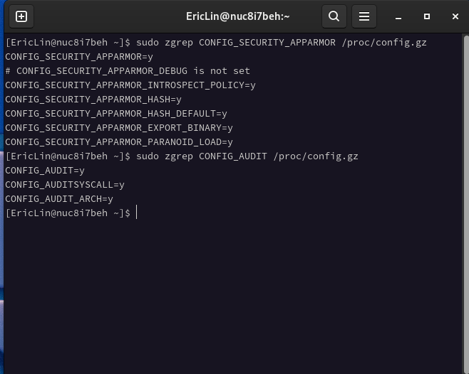
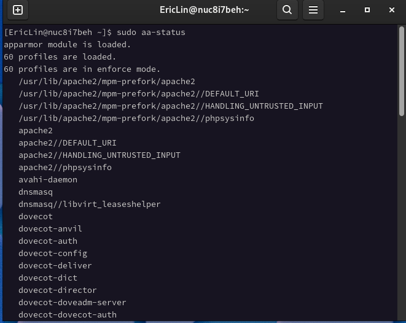

# Apparmor


## 什么是 Apparmor，它是干什么的？

AppArmor 是一个有效且易于使用的 Linux 应用程序安全系统 (LSM, Linux Security Module)。 AppArmor 通过强制访问控制（[MAC,  Mandatory access control](https://wiki.archlinux.org/title/Security#Mandatory_access_control)）来补充传统的Unix自主访问控制（DAC）模型，主动保护操作系统和应用程序免受外部或内部威胁，甚至 zero-day attacks。

# 在 Arch Linux 启用 Apparmor

## 1. 检查内核是否支持 Apparmor

如果你使用的是官方内核则无需检查，因为官方内核默认支持 Apparmor

如果你使用的是第三方内核，请检查内核是否支持 Apparmor：



__如果能找到 CONFIG_SECURITY_APPARMOR=y 和 CONFIG_AUDIT=y 则说明此内核支持 Apparmor__ 

## 2. 添加内核启动参数

由于官方内核默认没有开启 Apparmor，所以要添加 lsm=apparmor 和 audit=1 到内核启动参数里

```bash
sudo vim /boot/grub/grub.cfg

    ......
    GRUB_CMDLINE_LINUX_DEFAULT="quiet splash lsm=apparmor audit=1" # 找到这一行并添加参数到末尾
    ......

sudo grub-mkconfig -o /boot/grub/grub.cfg
```

## 3. 安装 Apparmor

3-1. 安装所需组件

```bash
sudo pacman -S apparmor audit

reboot
```

3-2. 重启后检查 Apparmor 状态

```bash
sudo aa-status
```


