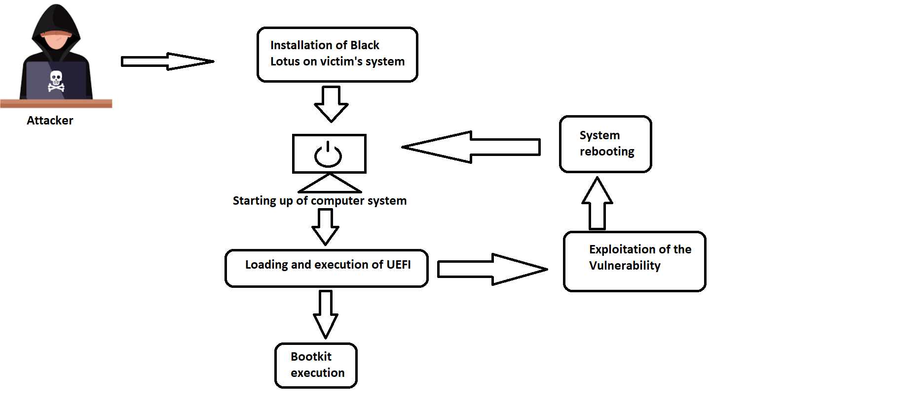
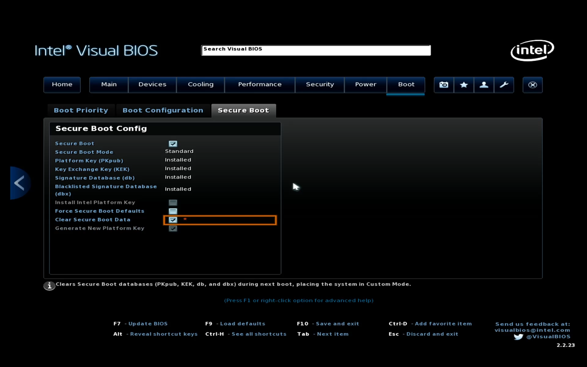
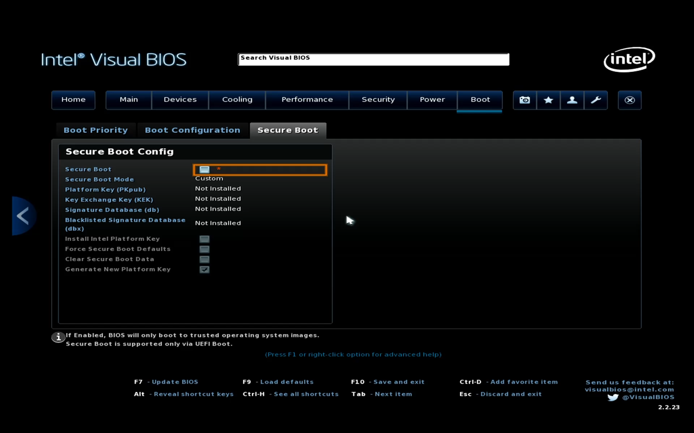

# 安全启动

## 什么是安全启动，它是干什么的？

安全启动 (Secure Boot) 是电脑行业成员开发的一种安全标准，用于帮助确保设备仅使用受OEM信任的软件进行启动。当电脑启动时，固件会检查每个启动软件片段的签名，包括 UEFI 固件驱动程序、EFI 应用程序和操作系统。 如果签名有效，则电脑将会启动，而固件会将控制权转递给操作系统。（来源：微软官方）

## 安全启动可以抵御哪些威胁？

可以抵御一种叫作 Bootkit [(例如BlackLotus) ](https://github.com/ldpreload/BlackLotus)的恶意软件，这种恶意软件在系统加载前注入恶意代码。相比常见的恶意软件，它更加难以被察觉，且不易被清除。

::: warning ⚠️ 注意

有些 Bootkit 带有微软的签名，如果没有更新 DBX 密钥，这种 Bootkit (如上述的 BlackLotus ) 可以绕开安全启动

:::


此图为 BlackLotus Bootkit 攻击示意图


# 在 Arch Linux 实现安全启动

## 1. 开始之前，请检查⚠️

1.  你需要一个可以正常启动的Arch Linux (纯属废话😄)

2. 你的电脑必须支持UEFI和Secure Boot，并且关闭 CSM 模式

3. ☢️ 你的电脑必须支持导入你自己的 Secure Boot 密钥 ☢️

## 2. 备份原来的密钥

2-1. 安装efitools

```bash
sudo pacman -S efitools
```

2-2. 备份密钥

```bash
sudo efi-readvar -v PK -o factory_PK.esl

sudo efi-readvar -v KEK -o factory_KEK.esl

sudo efi-readvar -v db -o factory_db.esl

sudo efi-readvar -v dbx -o factory_dbx.esl
```

::: warning ⚠️ 注意

如果想手动导入 DBX 密钥则必须执行 `sudo efi-readvar -v dbx -o factory_dbx.esl`

:::

## 3. 进入电脑的固件设置，将安全启动模式设置成Setup Mode (设置模式)

::: warning ⚠️ 注意

这里以 Intel NUC 为例，不同品牌的设置可能会不一样

:::

3-1. 按下 F2 进入固件设置，依次选择 `Boot -> Secure Boot -> Clear Secure Boot Data `__(这里要临时开启安全启动才可以执行此操作)__


3-2. 按下 F10 保存并退出

3-3. 再次进入固件设置，你会发现 PK、KEK、DB、DBX 密钥都被清除了


## 4. 安装 sbctl 并配置

4-1. 安装 [sbctl](https://archlinux.org/packages/extra/x86_64/sbctl/)<sup>Extra</sup> 包：

```bash
sudo pacman -S sbctl
```

4-2. 使用 `sbctl` 生成 `PK`、`KEK`、`DB` 密钥：

```bash
sudo sbctl create-keys
```

## 5. 重新安装GRUB

```bash
sudo grub-install --target=x86_64-efi --efi-directory=esp --bootloader-id=GRUB --modules="tpm" --disable-shim-lock   # 重新安装 Grub

sudo grub-mkconfig -o /boot/grub/grub.cfg    # 生成启动项
```

## 6. 对GRUB进行签名并将密钥导入UEFI环境里

6-1. 使用 `sbctl sign` 对引导文件签名：

```bash
sudo sbctl sign -s /boot/vmlinuz-linux

sudo sbctl sign -s /boot/EFI/GRUB/grubx64.efi
```
6-2. 进行检查

```bash
sudo sbctl verify
```

## 7. (可选) 手动导入 DBX 密钥

将原来备份的 DBX 密钥导入到 UEFI 环境里

```bash
sudo efi-updatevar -a -e -f factory_dbx.esl dbx
```

::: warning ⚠️ 注意

由于 `sbctl enroll-keys` 命令会导入 PK (Platform Key) 密钥，会导致安全启动模式变成 User 模式，使得导入新密钥很难，所以推荐你在执行 `sbctl enroll-keys` 命令前执行上述命令

通过此方法导入的 DBX 密钥是原机备份的，所以这个密钥可能不是最新的(目前最新版本是371)，可能需要[更新 DBX 密钥](#9-可选-更新-dbx-密钥)

:::

## 8. 将密钥导入UEFI环境并启用安全启动

如果你只安装Arch Linux且不需要双系统，请输入：

```bash
sudo sbctl enroll-keys
```

sbctl 只会把它生成的密钥导入UEFI环境里

 如果你安装 Arch 和 Windows 双系统，请输入：

```bash
sudo sbctl enroll-keys -m
```

sbctl 会把它生成的密钥和微软的密钥一并导入UEFI环境里

::: danger ☢️ 警告

使用“sudo sbctl enroll-keys”可能会导致你的电脑变砖。原因是你的电脑固件中的 [OpROM (Option ROM)](https://learn.microsoft.com/zh-cn/windows-hardware/manufacture/desktop/uefi-validation-option-rom-validation-guidance?view=windows-10) 带有微软的签名验证 (例如大部分独立显卡的VBIOS固件)，或者是电脑固件存在[BUG](https://wiki.archlinux.org/title/Lenovo_ThinkPad_T14s_(AMD)_Gen_1#Secure_boot)，这种情况可以尝试“sudo sbctl enroll-keys -m”。

:::

::: warning ⚠️ 注意

如果你导入了微软的密钥，强烈推荐你手动导入最新的DBX (Secure Boot Forbidden Signature Database) 密钥来防止如上述 [ BlackLotus ](https://github.com/ldpreload/BlackLotus) 这样的 Bootkit 绕开安全启动。

:::

再次进入固件设置，开启安全启动

## 9. (可选) 更新 DBX 密钥

::: tip ℹ️ 提示

此操作只对导入了微软密钥的设备有效

:::

9-1. 安装 fwupd

```bash
sudo pacman -S fwupd
```

9-2. 启用服务

```bash
sudo systemctl enable --now fwupd
```

9-3. 更新 fwupd 元数据

```bash
sudo fwupdmgr refresh --force
```

9-4. 对 fwupd 的 EFI 文件签名

```bash
sudo sbctl sign -s /usr/lib/fwupd/efi/fwupdx64.efi -o /usr/lib/fwupd/efi/fwupdx64.efi.signed
```

9-5. 更新 DBX 密钥

```bash
sudo fwupdmgr get-updates # 用于查看是否有更新

sudo fwupdmgr update # 用于更新
```

::: tip ℹ️ 提示

如果你的设备是联想的 ThinkPad 系列、惠普或者戴尔，可能会同时把设备 BIOS 固件一起更新了。注意更新 BIOS 固件时千万不能断电，否则后果很严重(可能无法开机)😱

:::
