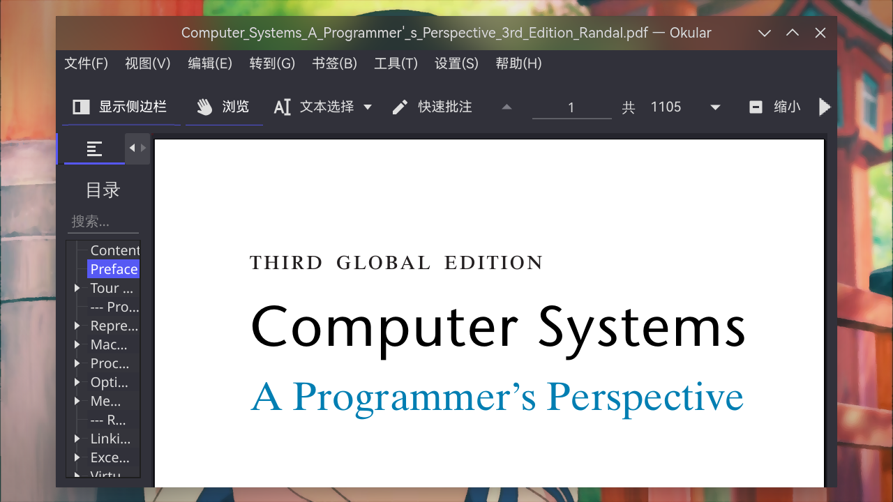
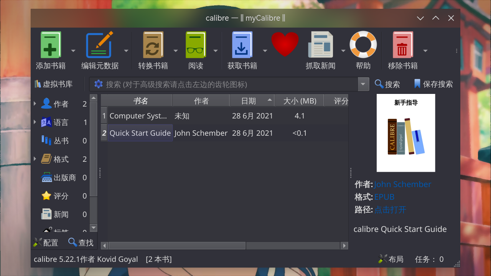

# 常用软件

> ### 🌼 采菊东篱下，悠然见南山
>
> 本小节讨论日常常用的软件，包括浏览器、电子书阅读器、截图工具、网盘、图片查看器等等

> ### 🔖 这一节将会讨论：
>
> [[toc]]

::: tip ℹ️ 提示

指南中带有 <sup>aur</sup> 角标的软件代表是在 [AUR](https://aur.archlinux.org/)（Arch User Repository）中用户自行打包的软件。不在 arch 官方支持范围内，可能会出现各种问题如更新不及时、无法安装、使用出错等。

指南中带有 <sup>cn</sup> 角标的软件代表是在 [archlinuxcn](https://www.archlinuxcn.org/archlinux-cn-repo-and-mirror/)（Arch Linux 中文社区仓库）中用户自行打包的软件。不在 arch 官方支持范围内，可能会出现各种问题如更新不及时、无法安装、使用出错等。

指南中带有 <sup>EULA</sup> 角标的软件代表是 [专有软件](https://www.gnu.org/proprietary/proprietary.html)。请自行斟酌是否使用。

:::

## 网页浏览器

### Mozilla Firefox

在步骤 [7. 安装基础功能包](../rookie/desktop-env-and-app.md#_7-安装基础功能包) 中若已安装，则无需重复安装。

火狐浏览器（Mozilla Firefox）是一个自由开源的网页浏览器，由 [Mozilla 基金会](https://foundation.mozilla.org/) 及其非营利子公司 [Mozilla 公司](https://www.mozilla.org/zh-CN/about/) 开发。

安装 [Firefox 浏览器](https://archlinux.org/packages/extra/x86_64/firefox/)：

```sh
sudo pacman -S firefox
```

同时还有 [Firefox 浏览器开发者版](https://www.mozilla.org/zh-CN/firefox/developer/)，使用此版本可获得最新功能、高速性能，以及打造开放 Web 所需的开发工具：

```sh
sudo pacman -S firefox-developer-edition
```


### Chromium

在步骤 [7. 安装基础功能包](../rookie/desktop-env-and-app.md#_7-安装基础功能包) 中若已安装，则无需重复安装。

[Chromium](https://www.chromium.org/) 是 Google 为发展浏览器 Google Chrome 而发布的免费开源软件项目，以 [BSD 许可协议](https://chromium.googlesource.com/chromium/src/+/refs/heads/main/LICENSE) 等数种许可发行并开源。Chromium 与 Google Chrome 共享大部分代码和功能。

安装 [Chromium](https://archlinux.org/packages/extra/x86_64/chromium/)：

```sh
sudo pacman -S chromium
```


::: tip ℹ️ 提示

Chromium 已不支持登录谷歌帐号进行同步。若有需要请使用 [Google Chrome](./daily.md#google-chrome)。

:::

### Brave

Brave 是一个基于 Chromium 网页浏览器及其 Blink 排版引擎的自由开源的网页浏览器，由 Mozilla 项目的联合创始人、JavaScript 的创造者布兰登·艾克宣布。它宣称阻止网站跟踪器和移除侵入式网络广告。该浏览器也宣称通过与广告客户分享更少数据来改善网络隐私。

安装 [Brave](https://archlinux.org/packages/extra/x86_64/falkon/)<sup>cn / aur</sup>：

:::: code-group
::: code-group-item cn

```sh
sudo pacman -S brave-bin
```

:::
::: code-group-item aur

```sh
yay -S aur/brave-bin
```

:::
::: code-group-item aur（git）

```sh
yay -S brave-git
```

:::
::::


### Falkon

Falkon 是 KDE 开发的一款全新的 Qt 网络浏览器。它是一款轻量级的跨平台浏览器。这个项目当初仅仅作为教育项目。但是从一开始，Falkon 就成长为一款功能丰富的浏览器。

安装 [Falkon](https://archlinux.org/packages/extra/x86_64/falkon/)<sup>extra / aur</sup>：

:::: code-group
::: code-group-item extra

```sh
sudo pacman -S falkon
```

:::
::: code-group-item aur（git）

```sh
yay -S falkon-git
```

:::
::::


### Tor 浏览器

[Tor 浏览器](https://www.torproject.org/zh-CN/) 是实现匿名通信的自由软件。其名源于“The Onion Router”（洋葱路由器）的英语缩写。用户可透过 Tor 浏览器接达由全球志愿者免费提供，包含 6000+ 个中继的覆盖网络，从而达至隐藏用户真实地址、避免网络监控及流量分析的目的。Tor 浏览器用户的互联网活动（包括浏览在线网站、帖子以及即时消息等通信形式）**相对**较难追踪。Tor 的设计原意在于保障用户的个人隐私，以及不受监控地进行秘密通信的自由和能力。

安装 [Tor 浏览器](https://aur.archlinux.org/packages/tor-browser/)<sup>cn / aur</sup>：

:::: code-group
::: code-group-item cn

```sh
sudo pacman -S tor-browser
```

:::
::: code-group-item aur

```sh
yay -S tor-browser
```

:::
::::


### Mircrosoft Edge

Microsoft Edge（微软前沿浏览器）是一个由微软研发的浏览器，于 2015 年 1 月 21 日公布，2015 年 3 月 30 日公开发布第一个预览版。

安装 [Microsoft Edge](https://archlinux.org/packages/extra/x86_64/falkon/)<sup>EULA / aur</sup>：

:::: code-group
::: code-group-item aur（beta）

```sh
yay -S microsoft-edge-beta-bin
```

:::
::: code-group-item aur（dev）

```sh
yay -S microsoft-edge-dev-bin
```

:::
::::


### Google Chrome

Google Chrome 是由 Google 开发的免费网页浏览器。Chrome 相应的开放源代码计划名为 Chromium，而 Google Chrome 本身是专有软件，未开放全部源代码。

安装 [Google Chrome](https://aur.archlinux.org/packages/google-chrome/)<sup>EULA / cn / aur</sup>：

:::: code-group
::: code-group-item cn

```sh
sudo pacman -S google-chrome
```

:::
::: code-group-item aur

```sh
yay -S google-chrome
```

:::
::::


### Opera

Opera 是由 Opera 软件公司为个人电脑推出的网页浏览器。

Opera 软件公司为纳斯达克上市的挪威软件公司，现在已被中国商人周亚辉联合 [奇虎 360](https://www.360.cn/) 收购。

安装 [Opera](https://archlinux.org/packages/community/x86_64/opera/)<sup>EULA / community / cn / aur</sup>：

:::: code-group
::: code-group-item community

```sh
sudo pacman -S opera
```

:::
::: code-group-item cn（beta）

```sh
sudo pacman -S opera-beta
```

:::
::: code-group-item aur（beta）

```sh
yay -S aur/opera-beta
```

:::
::::


### Vivaldi

‎Vivaldi‎‎ 是韦瓦第技术（Vivaldi Technologies）公司开发的网页浏览器 ‎‎。由创始人谭咏文（前 ‎‎Opera 软件公司的首席执行官、创始人）与富田龙起（Tatsuki Tomita，前 Opera 软件公司资深副总经理）在离开 Opera 公司后另起炉灶新创办的浏览器 ‎‎。 ‎

‎Vivaldi 追求「为我们的朋友而打造」，旨在为原先 Opera 的忠实用户，如高阶技术专家、重度的互联网用户，提供原 Presto Opera 的诸多专属功能，例如自订面板、笔记、分页群组、单键快捷键等等。

安装 [‎Vivaldi](https://archlinux.org/packages/community/x86_64/vivaldi/)<sup>EULA</sup>：

```sh
sudo pacman -S vivaldi
```


## PDF 以及电子书阅读器

PDF 可以使用上述的网页浏览器，也可以使用专门的阅读器。而一些特别的电子书格式（如 azw3）则只能使用这些专门的电子书阅读器了。

### Okular

Okular 是 KDE 开发的一款功能丰富、轻巧快速的跨平台文档阅读器。可以使用它来阅读 PDF 文档、漫画电子书、Epub 电子书，浏览图像，显示 Markdown 文档等。

安装 [Okular](https://archlinux.org/packages/extra/x86_64/okular/)<sup>extra / aur</sup>：

:::: code-group
::: code-group-item extra

```sh
sudo pacman -S okular
```

:::
::: code-group-item aur（git）

```sh
yay -S okular-git
```

:::
::::



### calibre

calibre 是一款功能强大且易于使用的电子书管理器。支持 epub、txt、azw3 等文件格式。

安装 [calibre](https://archlinux.org/packages/community/x86_64/calibre/)<sup>community / aur</sup>：

:::: code-group
::: code-group-item community

```sh
sudo pacman -S calibre
```

:::
::: code-group-item aur（git）

```sh
yay -S calibre-git
```

:::
::::



## 截图工具

### 火焰截图

#### 视频指南

<div
  style="
    position: relative;
    padding: 30% 45%;
    margin-top: 32px;
    margin-bottom: 32px;
  "
>
  <iframe
    style="position: absolute; width: 100%; height: 100%; left: 0; top: 0"
    src="//player.bilibili.com/player.html?aid=417575346&bvid=BV1hV411H7Sf&cid=322832461&page=1&as_wide=1&high_quality=1&danmaku=1"
    scrolling="no"
    border="0"
    frameborder="no"
    framespacing="0"
    allowfullscreen="true"
  ></iframe>
</div>

### Spectacle

## 网盘存储

## 图片查看器

## 实用工具

日常用到的各类小工具有很多实现，其中 KDE 的套件中就有很多，可以自行查询。

此处仅列出几个常用的例子。

- [KCalc](https://archlinux.org/packages/extra/x86_64/kcalc/) —— 科学计算器

  ```sh
  sudo pacman -S kcalc
  ```

  

- [Kamoso](https://archlinux.org/packages/extra/x86_64/kamoso/) —— 相机

  ```sh
  sudo pacman -S kamoso
  ```

- [KTimer](https://archlinux.org/packages/extra/x86_64/ktimer/) —— 倒计时执行器

  ```sh
  sudo pacman -S ktimer
  ```
