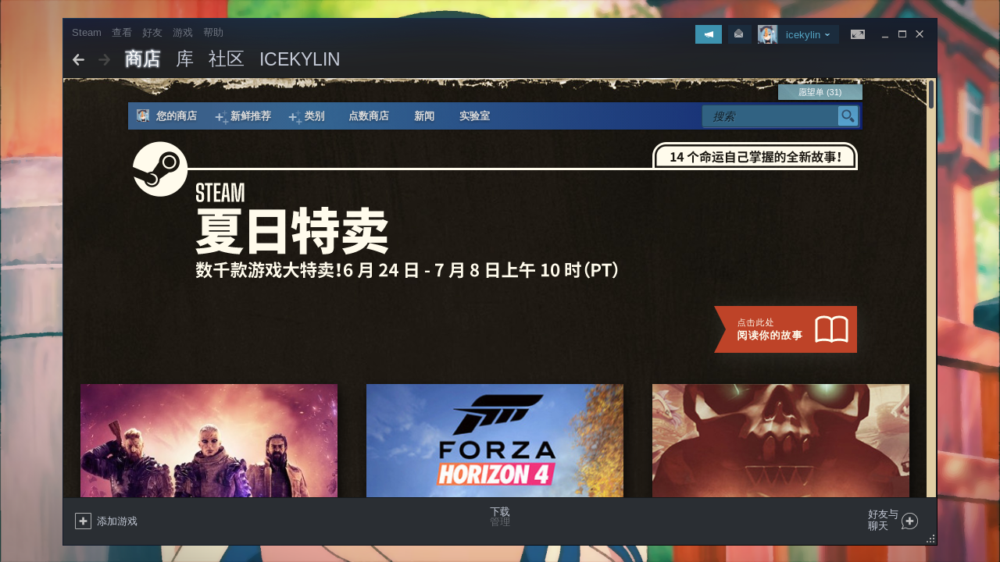
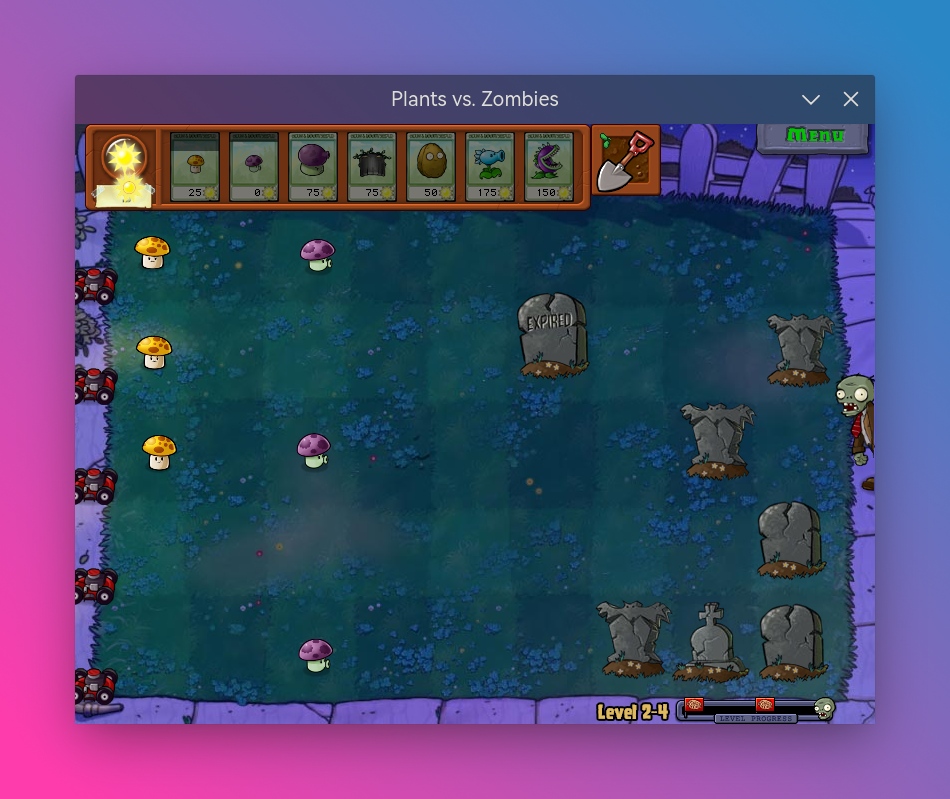

# 游戏娱乐

> ### 🕹️ 人生得意须尽欢，莫使金樽空对月
>
> 本小节讨论如何在 archlinux 上 👾 玩游戏

> ### 🔖 这一节将会讨论：
>
> ::: details 目录
>
> [[toc]]
>
> :::

::: tip ℹ️ 提示

指南中带有 <sup>aur</sup> 角标的软件代表是在 [AUR](https://aur.archlinux.org/)（Arch User Repository）中用户自行打包的软件。不在 arch 官方支持范围内，可能会出现各种问题如更新不及时、无法安装、使用出错等。

指南中带有 <sup>cn</sup> 角标的软件代表是在 [archlinuxcn](https://www.archlinuxcn.org/archlinux-cn-repo-and-mirror/)（Arch Linux 中文社区仓库）中用户自行打包的软件。不在 arch 官方支持范围内，可能会出现各种问题如更新不及时、无法安装、使用出错等。

指南中带有 <sup>EULA</sup> 角标的软件代表是 [专有软件](https://www.gnu.org/proprietary/proprietary.html)。请自行斟酌是否使用。

:::

## 🚂 Steam

<p class="shields normal-img-p">
  <a
    href="https://steamcommunity.com/id/ice-kylin/"
    target="_blank"
    rel="noopener noreferrer"
    ></a>
</p>

> ⛓ 相关链接：
>
> - [archWiki 相关内容](<https://wiki.archlinux.org/title/Steam_(%E7%AE%80%E4%BD%93%E4%B8%AD%E6%96%87)>)

::: tip ℹ️ 提示

在步骤 [7. 安装基础功能包](../rookie/desktop-env-and-app.md#_7-安装基础功能包) 中若已安装，则无需重复安装。

:::

[Steam](https://store.steampowered.com/) 是 [维尔福公司（Valve）](https://www.valvesoftware.com/zh-cn/) 推出的著名游戏分发平台。在 Steam 上购买并安装游戏不仅仅是支持正版的做法，更是简化了游玩流程、节省了时间。

2018 年 8 月 22 日，Steam [宣布](https://steamcommunity.com/games/221410/announcements/detail/1696055855739350561) 要给 Steam Play 增加一个新组件 Proton，用于支持在 Linux 平台上玩 Windows 的游戏，这个组件是 Wine 的一个分支。经过这些年的发展，体验已经很不错了。关于非 Linux 平台原生的游戏，通过 Steam Play 运行的兼容性列表可在 [ProtonDB](https://www.protondb.com/) 查询。

1. 安装 [Steam](https://archlinux.org/packages/multilib/x86_64/steam/)<sup>EULA</sup>：

   ```sh
   sudo pacman -S steam
   ```

   

2. 为了能够安装 Windows 下的游戏，还需要在菜单栏 `查看` > `设置` > 侧边栏 `Steam Play` > 勾选 `为所有其他产品启用 Steam Play`，在 `运行其他产品时使用` 中选择 `Proton Experimental`（最新版本）：

   

   随后即可安装 Windows 平台上的游戏，Steam 会自动下载并安装相关组件：

   

::: tip ℹ️ 提示

如果某些游戏启动或者游玩有问题，可以用终端使用 `steam` 命令启动 Steam 客户端，并观察游戏崩溃时的终端报错。一般都是缺少某种依赖造成的，可以根据具体情况自行安装依赖。

同时，archWiki 也提供了一个 [查错页面](https://wiki.archlinux.org/title/Steam/Game-specific_troubleshooting)，记录了一些游戏问题的解决方式。

:::

::: tip ℹ️ 提示

此外还有官方 Proton 的派生版本，如 [GE Proton](https://github.com/GloriousEggroll/proton-ge-custom)。可以支持一些额外的，官方暂不支持或支持不完善的游戏。

:::

## ⛏️ 我的世界

> ⛓ 相关链接：
>
> - [archWiki 相关内容](<https://wiki.archlinux.org/title/Minecraft_(%E7%AE%80%E4%BD%93%E4%B8%AD%E6%96%87)>)

我的世界（Minecraft）是一个关于击毁和放置方块的游戏。游戏一开始玩家的主要目的是搭建各种结构使自己免遭夜晚出没的怪物的攻击并生存下来，但随着游戏的进行，玩家们可以合作创造出一些不可思议的、富有想象力的东西。

1. 安装 [Minecraft Launcher（我的世界官服启动器）](https://aur.archlinux.org/packages/minecraft-launcher/)<sup>EULA / cn / aur</sup>：

   :::: code-group
   ::: code-group-item cn

   ```sh
   sudo pacman -S minecraft-launcher
   ```

   :::
   ::: code-group-item aur

   ```sh
   yay -S aur/minecraft-launcher
   ```

   :::
   ::::

   ::::: tip ℹ️ 提示

   除了官方启动器，还有第三方启动器 [HMCL（Hello Minecraft! Launcher）](https://hmcl.huangyuhui.net/)，支持模组管理、游戏定制、自动安装（Forge、LiteLoader 和 OptiFine）、模组包创建、UI 定制等。

   安装 [HMCL](https://aur.archlinux.org/packages/hmcl/)<sup>cn / aur</sup>：

   :::: code-group
   ::: code-group-item cn

   ```sh
   sudo pacman -S hmcl
   ```

   :::
   ::: code-group-item aur

   ```sh
   yay -S aur/hmcl
   ```

   :::
   ::::

   :::::

2. 打开 `Minecraft Launcher` > 根据提示登录帐号并下载主程序后即可畅玩：

   

   

## 👾 Lutris

[Lutris](https://lutris.net/) 是 Linux 上的开源游戏平台。可以使用 Lutries 安装、移除、配置、启动和管理游戏。它可以在一个单一界面中管理的 Linux 游戏、Windows 游戏、仿真控制台游戏和浏览器游戏。它还包含社区编写的安装脚本，使得游戏的安装过程更加简单。

Lutries 支持超过 20 个模拟器并且提供了从七十年代到现在的大多数游戏系统。目前支持的游戏系统包括但不限于：

- Linux 原生
- Windows
- Steam（Linux 和 Windows）
- MS-DOS
- 街机
- Amiga 电脑
- Atari 8 和 16 位计算机和控制器
- 浏览器（Flash 或者 HTML5 游戏）
- Commmodore 8 位计算机
- 基于 SCUMM 的游戏和其它点击式冒险游戏
- Magnavox Odyssey²、Videopac+
- Mattel Intellivision
- NEC PC-Engine Turbographx 16、Supergraphx、PC-FX
- Nintendo NES、SNES、Game Boy、Game Boy Advance、DS
- Game Cube 和 Wii
- Sega Master Sytem、Game Gear、Genesis、Dreamcast
- SNK Neo Geo、Neo Geo Pocket
- Sony PlayStation
- Sony PlayStation 2
- Sony PSP

1. 安装 [Lutries](https://archlinux.org/packages/community/any/lutris/)<sup>community / aur</sup>：

   :::: code-group
   ::: code-group-item community

   ```sh
   sudo pacman -S lutris
   ```

   :::
   ::: code-group-item aur

   ```sh
   yay -S aur/lutris
   ```

   :::
   ::: code-group-item aur（git）

   ```sh
   yay -S lutris-git
   ```

   :::
   ::::

2. 安装

## 🍷 原生 Wine

通过原生 Wine 也可运行简单 Windows 小游戏，但是很多情况下需要自行处理 Windows 下的依赖问题。常用的工具是 [Winetricks](https://archlinux.org/packages/multilib/x86_64/winetricks/)。但是这种方式费时费力，只运行无需处理依赖的小游戏或者 GalGame 还好。

## 🎮 Xbox 无线手柄

## 🎛️ 性能监控

## 🔥 性能提升

## 🐧 Fsync 内核

> 📔 本节参考资料：
>
> - [在 Linux 上使用 Lutries 管理你的游戏](https://linux.cn/article-10200-1.html)
