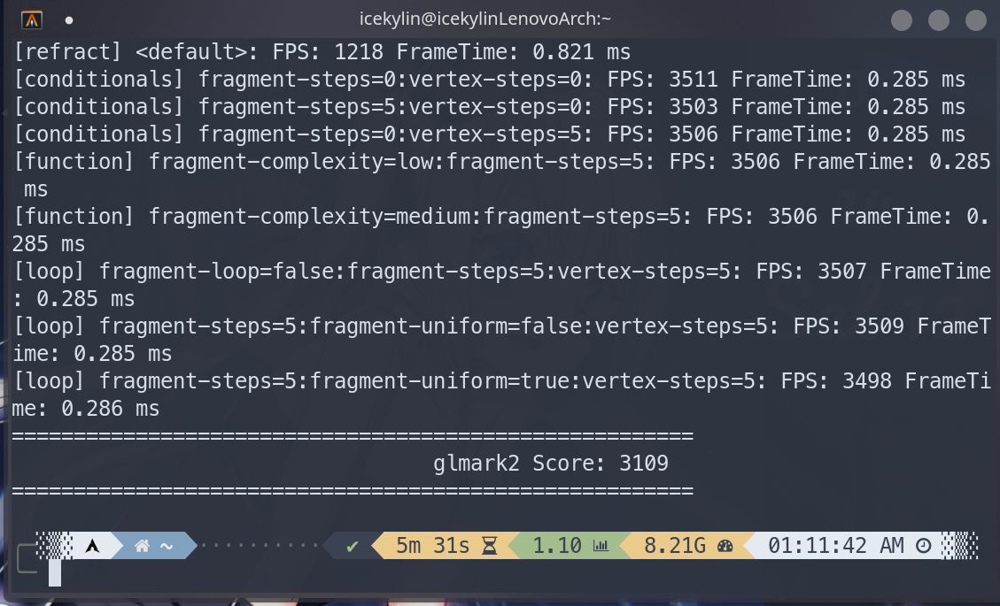
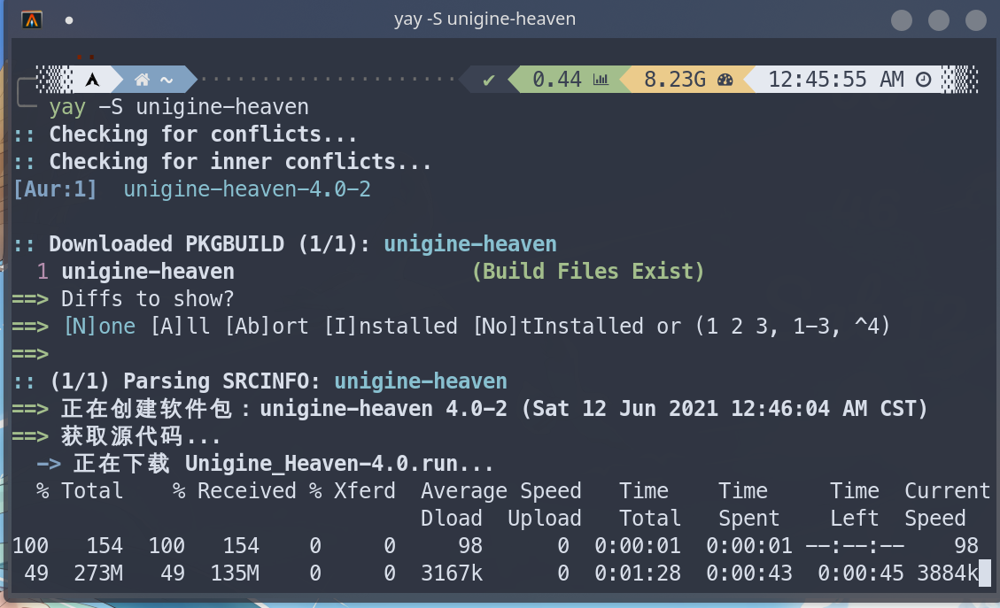

# archlinux 显卡驱动

> ### 🪁 接天莲叶无穷碧，映日荷花别样红
>
> 近年来，archlinux 的显卡驱动安装已经变得非常容易。本小节区分核芯显卡和独立显卡两大类讨论 archlinux 显卡驱动的安装

> ### 🔖 这一节将会讨论：
>
> [[toc]]

所有 AMD 显卡建议使用开源驱动，英伟达显卡建议使用闭源驱动。

## 核芯显卡

### Intel 核芯显卡

如有需要可以参阅 [archWiki 相关内容](https://wiki.archlinux.org/index.php/Intel_graphics)。

通过以下命令安装如下几个包即可：

```bash
sudo pacman -S mesa lib32-mesa vulkan-intel lib32-vulkan-intel
```

::: tip ℹ️ 提示

不建议安装 `xf86-video-intel`，而应使用 Xorg 的 modesetting 驱动（也就是什么都不用装的意思）

注意，只有 Intel HD 4000 及以上的核显才支持 vulkan。

:::

### AMD 核芯显卡

如有需要可以参阅 [archWiki 相关内容](<https://wiki.archlinux.org/title/Xorg_(%E7%AE%80%E4%BD%93%E4%B8%AD%E6%96%87)#AMD>)。

#### 选择驱动

对于具有核芯显卡的 AMD 处理器，需要先确定核显架构（Architecture）是什么，再决定安装什么驱动。

推荐在 [TECHPOWERUP](https://www.techpowerup.com/) 进行查询，信息非常全面。在确定了显卡架构后，再根据架构对照下表决定安装什么驱动。

|   GPU 架构    |                                 Radeon 显卡                                 |                                                                 开源驱动                                                                 |                        非开源驱动                         |
| :-----------: | :-------------------------------------------------------------------------: | :--------------------------------------------------------------------------------------------------------------------------------------: | :-------------------------------------------------------: |
| GCN 4 及之后  | [多种](https://en.wikipedia.org/wiki/List_of_AMD_graphics_processing_units) |                        [AMDGPU](<https://wiki.archlinux.org/title/AMDGPU_(%E7%AE%80%E4%BD%93%E4%B8%AD%E6%96%87)>)                        | [AMDGPU PRO](https://wiki.archlinux.org/title/AMDGPU_PRO) |
|     GCN 3     | [多种](https://en.wikipedia.org/wiki/List_of_AMD_graphics_processing_units) |                        [AMDGPU](<https://wiki.archlinux.org/title/AMDGPU_(%E7%AE%80%E4%BD%93%E4%B8%AD%E6%96%87)>)                        | [AMDGPU PRO](https://wiki.archlinux.org/title/AMDGPU_PRO) |
|     GCN 2     | [多种](https://en.wikipedia.org/wiki/List_of_AMD_graphics_processing_units) | [AMDGPU](<https://wiki.archlinux.org/title/AMDGPU_(%E7%AE%80%E4%BD%93%E4%B8%AD%E6%96%87)>) / [ATI](https://wiki.archlinux.org/title/ATI) |                          不支持                           |
|     GCN 1     | [多种](https://en.wikipedia.org/wiki/List_of_AMD_graphics_processing_units) | [AMDGPU](<https://wiki.archlinux.org/title/AMDGPU_(%E7%AE%80%E4%BD%93%E4%B8%AD%E6%96%87)>) / [ATI](https://wiki.archlinux.org/title/ATI) |                          不支持                           |
| TeraScale 2&3 |                              HD 5000 - HD 6000                              |                           [ATI](<https://wiki.archlinux.org/title/ATI_(%E7%AE%80%E4%BD%93%E4%B8%AD%E6%96%87)>)                           |                          不支持                           |
|  TeraScale 1  |                              HD 2000 - HD 4000                              |                           [ATI](<https://wiki.archlinux.org/title/ATI_(%E7%AE%80%E4%BD%93%E4%B8%AD%E6%96%87)>)                           |                          不支持                           |
|    旧型号     |                                X1000 及之前                                 |                           [ATI](<https://wiki.archlinux.org/title/ATI_(%E7%AE%80%E4%BD%93%E4%B8%AD%E6%96%87)>)                           |                          不支持                           |

::: tip ℹ️ 提示

对于 `GCN 2.0` 及以下架构的老显卡，均强烈建议**安装开源 ATI 驱动**，**不要使用闭源 Catalyst 驱动**，实际上即使 GCN3.0 显卡的用户也不应该使用 Catalyst 驱动。因为此闭源驱动已经停止支持，并且需要降级 Xorg 才能使用，非常麻烦且容易出错，基本在 archlinux 上已经处于无法使用的地步。

`GCN 2.0` 及以下架构的老显卡也**不要使用开源 AMPGPU 驱动**，因为其仅处于实验性质，需要各种自定义内核编译选项与配置，非常麻烦、得不偿失。

对于新型号（`GCN 3` 架构及更新）的核心显卡，直接安装开源驱动 AMDGPU 即可。

:::

下面是一些例子：

- 比如你的笔记本 cpu 是目前常见的 AMD R7 4800U，那么它的核显为 Vega 8。通过查询，可知其为 GCN 5.0 架构，那么对照 arch 官方文档，你可选择安装 AMDGPU 开源驱动。

- 再比如你的台式机 cpu 是目前常见的 锐龙 5 3400G，那么它的核显为 Vega 11。通过查询，可知其为 GCN 5.0 架构，那么对照 arch 官方文档，你可选择安装 AMDGPU 开源驱动。

- 再老一些的 apu A10-9700 处理器 ，它的核显为 Radeon R7。通过查询，可知其为 GCN 2.0 架构，那么对照 arch 官方文档，你可选择安装 ATI 开源驱动。

#### 安装驱动

通过以下命令安装如下几个包即可：

:::: code-group
::: code-group-item 开源驱动 AMDGPU

```bash
sudo pacman -S mesa lib32-mesa xf86-video-amdgpu vulkan-radeon lib32-vulkan-radeon
```

:::
::: code-group-item 开源 ATI 驱动

```bash
sudo pacman -S mesa lib32-mesa xf86-video-ati
```

:::
::::

## 独立显卡

这部分会分为仅有独立显卡（无核显）与同时拥有独立显卡和核芯显卡两种情况进行讨论。

### 仅独显

#### NVIDIA 独立显卡

如有需要可以参阅 [archWiki 相关内容](<https://wiki.archlinux.org/title/NVIDIA_(%E7%AE%80%E4%BD%93%E4%B8%AD%E6%96%87)>)。

- 较新型号的独立显卡使用以下命令直接安装如下几个包即可：

```bash
sudo pacman -S nvidia nvidia-settings lib32-nvidia-utils # 必须安装
```

- 如果是 GeForce 630 以下到 GeForce 400 系列的老卡，使用以下命令安装 [nvidia-390xx-dkms](https://aur.archlinux.org/packages/nvidia-390xx-dkms/)<sup>aur</sup> 及其 32 位支持包：

```bash
yay -S nvidia-390xx-dkms nvidia-settings lib32-nvidia-390xx-utils
```

- 再老的显卡直接使用以下命令安装 [开源驱动](<https://wiki.archlinux.org/title/Nouveau_(%E7%AE%80%E4%BD%93%E4%B8%AD%E6%96%87)>) 即可：

```bash
sudo pacman -S mesa lib32-mesa xf86-video-nouveau
```

#### AMD 独立显卡

AMD 独立显卡的驱动安装步骤实际上**和 AMD 核芯显卡是相同的**，都需要先确定架构，然后选定正确的驱动安装即可。参考步骤 [AMD 核芯显卡](./graphic-driver.md#amd-核芯显卡)。

此外，可以使用 `glmark2`，`DRI_PRIME=1 glmark2` 分别对核显和独显进行测试，选择分数更高的一个进行使用。

可以在 steam 游戏的启动前缀中加入 `DRI_PRIME=1 mangohud %command%` 来使用独显。

关于 [mangohud](https://aur.archlinux.org/packages/mangohud) 的使用请参阅 [这里]()。

笔记本上使用独立显卡运行 steam 游戏的另一个例子：

```bash
DRI_PRIME=1 steam steam://rungameid/570 # 运行 Dota 2
DRI_PRIME=1 steam steam://rungameid/730 # 运行 CS:GO
```

### 双显卡

如有需要可以参考 [NVIDIA 官方文档](https://wiki.archlinux.org/index.php/NVIDIA_Optimus) 以及 [optimus-manager 官方文档](https://github.com/Askannz/optimus-manager/wiki)。

同时拥有核芯显卡与独立显卡的笔记本电脑，同样需要按照上述步骤先安装各个软件包。除此之外还需要安装 optimus-manager<sup>cn / aur</sup>。可以在核芯显卡和独立显卡间轻松切换。optimus-manager 提供三种模式，分别为仅用独显，仅用核显，和 hybrid 动态切换模式。

1. 使用以下命令安装相关软件包：

```bash
yay -S optimus-manager optimus-manager-qt
```

2. 安装完成后重启即可使用。optimus-manager 安装完成后会默认启动 `optimus-manager` 服务，你可在重启前检查其状态，若没有 enable 则手动将其 enable。重启后在菜单栏搜索 optimus-manager 点击即可使用。可在其设置中设置开机自动启动。

```bash
sudo systemctl enable optimus-manager
```

此时你应该已经可以进行显卡切换了

::: tip ℹ️ 提示

如果有问题，请详细阅读 optimus-manager 的文档，里面有详细的描述。由于各类问题太多，本文不再赘述。此处仅列出几项较为重要的注意事项:

- 如果需要在独显和核显模式间切换，要注意你没安装各类 GPU 监控插件，它们会阻止显卡切换，导致不可预料的错误
- 不要使用 Nvidia Control Panel 中的 `Save to X Configuration file` ，会导致配置冲突
- 在显卡之间的切换时，重新登陆后如在 splash screen 卡住或者黑屏，可以尝试在 `tty` 之间进行切换

:::

最后详细说下动态切换模式。本质上其还是使用官方的 [PRIME](https://wiki.archlinux.org/index.php/PRIME#PRIME_render_offload) 方法进行切换。需要设置三个环境变量，或者用 nvidia-prime 包提供的命令 prime-run，二者本质也是一样的，都是设置三个环境变量。

```bash
sudo pacman -S nvidia-prime #这个包提供prime-run 命令，其作为前缀可以自动帮你为启动的程序添加这三个环境变量
```

在你要使用动态模式启动程序前需要添加如下三个环境变量，或者添加 prime-run 前缀。也可直接添加环境变量在/etc/environment 全局环境下。如果加在了全局环境中，在从 hybrid 模式切换到其他模式之前一定要去掉这三个环境变量，否则会黑屏。

```bash
__NV_PRIME_RENDER_OFFLOAD=1
__GLX_VENDOR_LIBRARY_NAME="nvidia"
__VK_LAYER_NV_optimus="NVIDIA_only"
```

#### 电源管理

::: tip ℹ️ 提示

如果不是强烈追求能效控制以及注重电池寿命的用户，那么可以略过此段。配置电源管理需要针对你的硬件以及笔记本型号尝试正确的电源管理方式。

此部分的设置可能导致黑屏，并且尝试过程可能较长，也可能会遇到各类问题。

:::

电源管理做的事情是，在只用核显的模式下，确保正确关闭独立显卡；在混合模式下，在不需要独立显卡时使其处于关闭或低功耗的状态。

这件事情其实很复杂，因为对于不同的显卡型号，以及笔记本型号的组合，可行的方案都是不同的。笼统来说，最广泛适用的办法是 Bbswitch。但**不建议上来就按照此方式安装使用**，因为某些特定的硬件就是会出问题，也就是黑屏。

建议按照 [optimus-manager 官方文档](https://github.com/Askannz/optimus-manager/wiki/A-guide--to-power-management-options) 一步一步来，按步骤尝试，最后找到属于你自己的电脑合适的电源管理方式。**此文档必须详细阅读！**

针对大多数笔记本适用的 Bbswitch，此处进行安装使用的讲解。

1. 通过以下命令安装包 bbswitch：

```bash
sudo pacman -S bbswitch
```

2. 右键点击 optimus-manager 的托盘设置，在 Optimus 选项卡中的 switch method 选择 Bbswitch 即可

## 性能测试

如有需要可以参考 [archWiki 相关内容](<https://wiki.archlinux.org/title/Benchmarking_(%E7%AE%80%E4%BD%93%E4%B8%AD%E6%96%87)>)。

最传统和广为人知的方式是使用 `glxgears` 命令进行测试，其属于 [mesa-demos](https://www.archlinux.org/packages/extra/x86_64/mesa-demos/) 包。但其仅仅只能提供简单的测试场景及帧数显示，只测试了当前 OpenGL 功能的一小部分，功能明显不足。笔者推荐如下两种工具。

### glmark2

glmark2 提供了一系列丰富的测试，涉及图形单元性能（缓冲、建筑、照明、纹理等）的不同方面，允许进行更全面和有意义的测试。每次测试单独计算帧速率。最终，用户根据以前的所有测试获得了一个成绩分数。在 archlinux 上属于包 [glmark2](https://aur.archlinux.org/packages/glmark2/)<sup>cn / aur</sup>。

1. 使用以下命令安装 glmark2：

:::: code-group
::: code-group-item cn

```bash
sudo pacman -S glmark2
```

:::
::: code-group-item aur

```bash
yay -S aur/glmark2
```

:::
::::

2. 使用以下命令启动 glmark2：

```bash
glmark2
```

随后会弹出一个小窗口运行测试程序：


以笔者的硬件为例（核芯显卡），结果如下：



### Unigine benchmark

Unigine 3D 引擎是一个更全面的基准测试工具。截止目前有五个版本，从新到旧分别是：

- superposition<sup>EULA</sup>（2017）
- valley<sup>EULA</sup>（2013）
- heaven<sup>EULA</sup>（2009）
- tropics<sup>EULA</sup>（2008）
- sanctuary<sup>EULA</sup>（2007）

1. 可以使用以下命令从 [AUR](https://aur.archlinux.org/packages/?O=0&K=unigine) 下载全部版本（选一个即可）：

```bash
yay -S unigine-superposition
yay -S unigine-valley
yay -S unigine-heaven
yay -S unigine-tropics
yay -S unigine-sanctuary
```



2. 使用以下命令启动 Unigine benchmark（输入对应安装的版本）：

```bash
unigine-superposition
unigine-valley
unigine-heaven
unigine-tropics
unigine-sanctuary
```


3. 调整参数后，点击 `RUN` 即可进入测试，帧数会显示在右上角

4. 点击左上角 `基准` 开始基准测试

5. 点击左上角 `退出` 并 `确定` 即可退出测试

这些基准测试工具拥有实时的环境遮挡、来自不同来源的相互关联的灯光、HDR 效果图、逼真的水和具有大气光散射的动态天空。用户还可以设置抗锯齿级别、纹理质量和滤波、各向异性和着色器质量。除了能够以多个步骤测试硬件的“基准测试”按钮之外，您还可以自由地漫游，改变一天中的时间（改变世界的照明），并准确地确定“掰弯”硬件最多的条件。

## 显卡信息查看

### NVIDIA 独立显卡

`nvidia-settings` 这个包即可全面的展示显卡相关信息（在步骤 [NVIDIA 独立显卡](./graphic-driver.md#独立显卡) 中已经安装）。

### AMD 独立显卡 / 核芯显卡

1. 通过以下命令安装 [radeon-profile-git](https://aur.archlinux.org/packages/?O=0&SeB=nd&K=radeon-profile-git&outdated=&SB=n&SO=a&PP=50&do_Search=Go)<sup>aur</sup> 包以及其依赖 [radeon-profile-daemon-git](https://aur.archlinux.org/packages/?O=0&SeB=nd&K=radeon-profile-daemon-git&outdated=&SB=n&SO=a&PP=50&do_Search=Go)<sup>aur</sup>：

```bash
yay -S radeon-profile-git radeon-profile-daemon-git
```

2. 使用以下命令启动这个进程，即可以图形化的方式查看 AMD 显卡信息：

```bash
sudo systemctl enable --now radeon-profile-daemon.service
```

::: tip ℹ️ 提示

不要对左下角的 `auto low high` 进行更改，有 bug 会导致卡死。

同时，显存占用在某些型号显卡上展示可能有误。

:::
