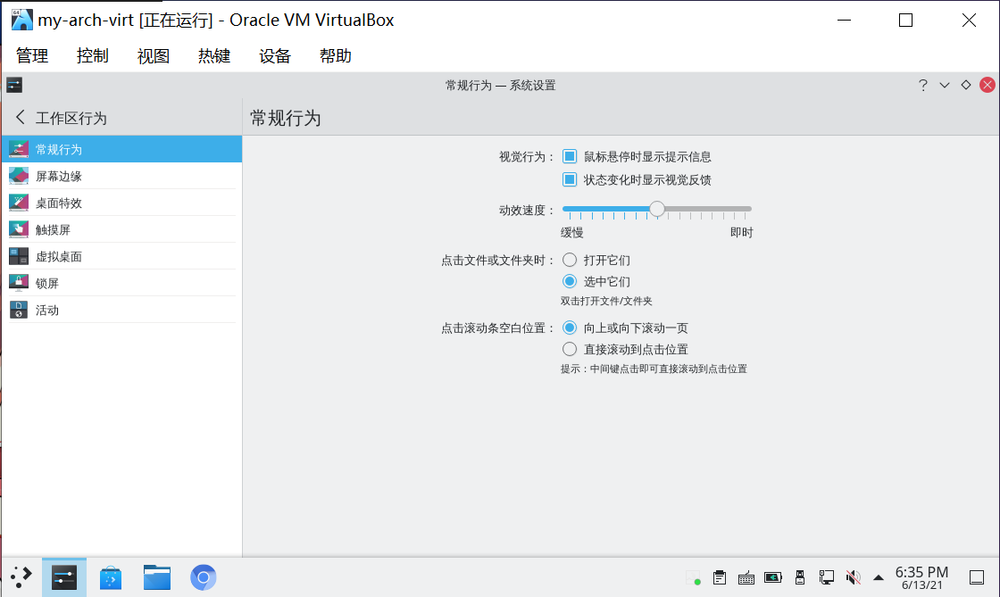
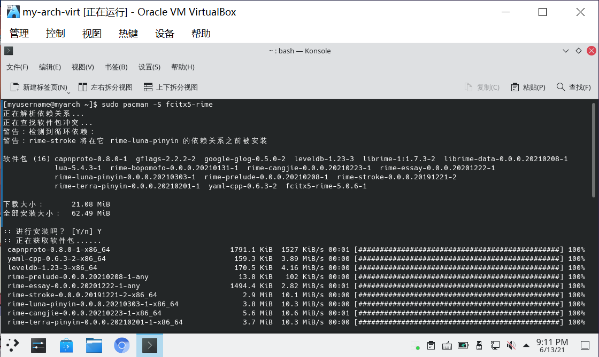
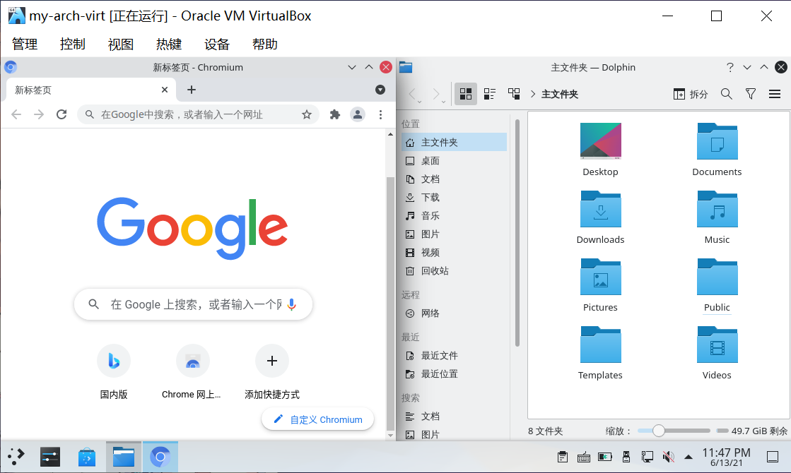
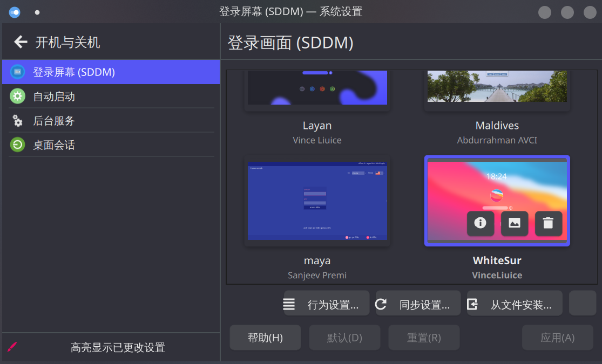
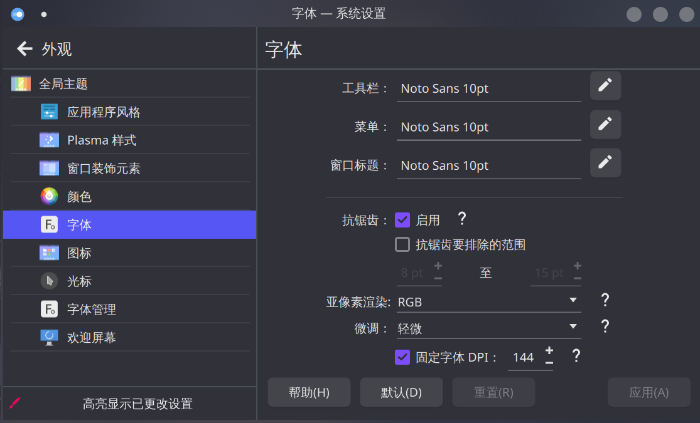
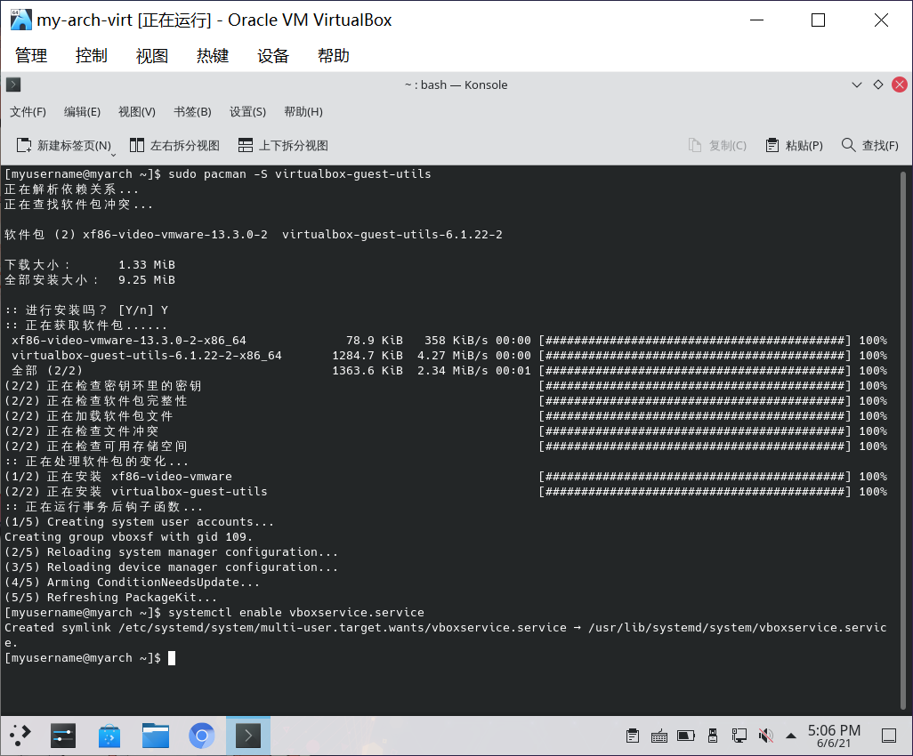
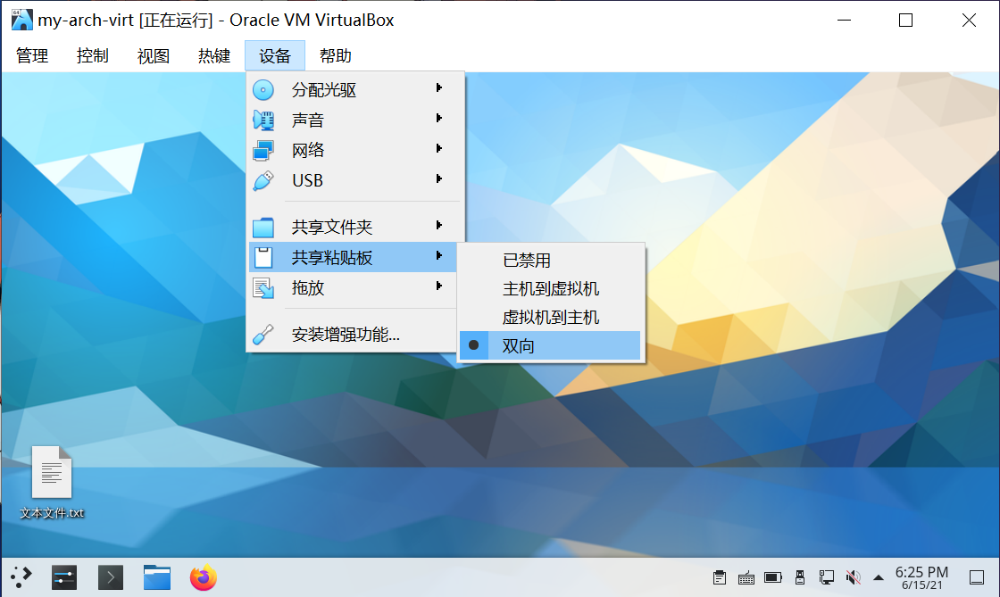
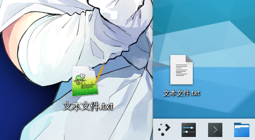
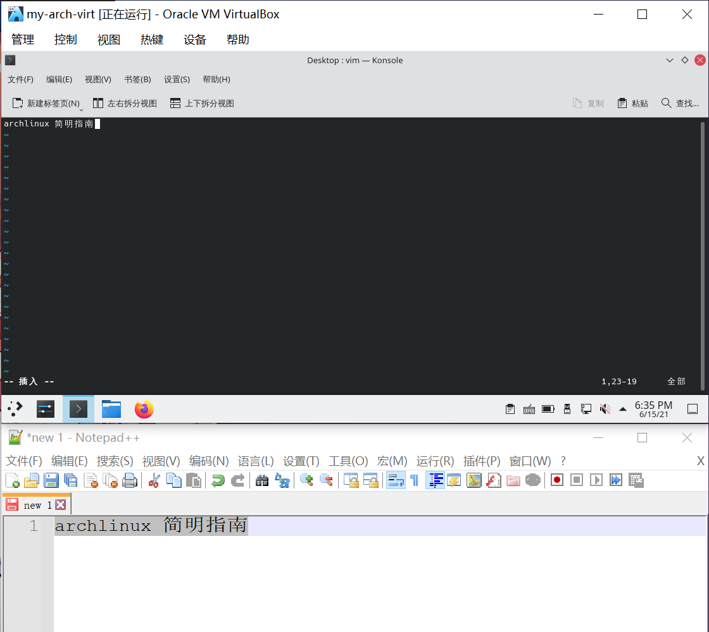

# 其它可选配置

> ### 🎑 一分耕耘，一分收获
>
> 这一节的配置都是可选的。这些配置根据个人喜好进行配置，往往可以让系统变得更好用

> ### 🔖 这一节将会讨论：
>
> [[toc]]

## ⚙ 调整部分系统设置

### 以空会话启动

默认情况下，KDE 桌面环境中关机之后再开机会恢复先前保存的对话（如浏览器没有关掉，那么开机之后浏览器还在）。

如果你不喜欢这样，请按照以下步骤设置：

1. 打开 `系统设置` > 点击侧栏 `开机与关机` > `桌面会话`

2. 将 `登入时` 的选项改为 `以空会话启动`：


3. 点击 `应用` 保存设置

### 点击文件 / 文件夹行为

默认情况下，KDE 桌面环境中打开文件 / 文件夹是单击，若不习惯常常造成误触发。

若希望改为双击打开文件 / 文件夹（类似 win10），请按照以下步骤设置：

1. 打开 `系统设置` > 点击侧栏 `工作区行为` > `常规行为`

2. 将 `点击文件或文件夹时` 的选项改为 `选中它们`：



3. 点击 `应用` 保存设置

## 🀄 字体设置

字体可以在 `系统设置` > `外观` > `字体` 中进行设置，一般默认即可：


有关用户全局级别更改日文异型字的设置，可参阅 [archWiki 相关说明](<https://wiki.archlinux.org/index.php/Localization_(%E7%AE%80%E4%BD%93%E4%B8%AD%E6%96%87)/Simplified_Chinese_(%E7%AE%80%E4%BD%93%E4%B8%AD%E6%96%87)#%E4%BF%AE%E6%AD%A3%E7%AE%80%E4%BD%93%E4%B8%AD%E6%96%87%E6%98%BE%E7%A4%BA%E4%B8%BA%E5%BC%82%E4%BD%93%EF%BC%88%E6%97%A5%E6%96%87%EF%BC%89%E5%AD%97%E5%BD%A2>)。

关于字体的更多设置请参阅 [系统美化]()。

## 🍀️ 输入法

由于 Fcitx5 自带词库简陋，部分本地化符号难以输入（如中文输入下按下 `/` 键无法打出 `、`），Emoji 输入复杂等问题，本指南提供额外输入方案。

在步骤 [11. 安装输入法](./desktop-env-and-app.md#_11-安装输入法) 中，我们已经安装了 Fcitx5 相关的包。接下来的操作要依赖之前的包。

1. 通过以下命令安装 Rime 输入法：

```bash
sudo pacman -S fcitx5-rime
```



2. 然后添加 Rime 输入法。打开 `系统设置` > 点击侧栏 `区域设置` > `输入法`：


::: tip ℹ️ 提示

若提示检测到更新，点击 `更新` 即可。

:::

3. 点击 `添加输入法` > 找到**汉语**下的 `Rime` > 点击 `添加`：


4. 若不想要之前的 Pinyin 输入法了，可以点击它最右边的按钮移除掉：


5. 通过以下命令安装 [🍀️ 四叶草拼音输入方案](https://github.com/fkxxyz/rime-cloverpinyin)<sup>cn / aur</sup>：

:::: code-group
::: code-group-item cn

```bash
sudo pacman -S rime-cloverpinyin
```

:::
::: code-group-item aur

```bash
yay -S aur/rime-cloverpinyin
```

:::
::::


5. 然后切换到 🍀️ 四叶草拼音输入方案。使用 `vim` 创建并编辑 `~/.local/share/fcitx5/rime/default.custom.yaml`：

```bash
mkdir ~/.local/share/fcitx5/rime # 创建 rime 目录
vim ~/.local/share/fcitx5/rime/default.custom.yaml
```

在文件中加入以下内容：

```yaml
patch:
  "menu/page_size": 8
  schema_list:
    - schema: clover
```

其中 `8` 表示打字的时候输入面板的每一页的候选词数目，可以设置成 `1 ~ 9` 任意数字。


::: tip ℹ️ 提示

若有需要，关于 `default.custom.yaml` 文件的更多解释，可以参考 [Rime 官方定制指南](https://github.com/rime/home/wiki/CustomizationGuide)。

:::

6. 保存并退出 `vim`

7. 在可输入的位置通过 `Ctrl` + `空格` 切换到 `Rime` 输入法（此时将提示 `Rime` 就绪），在输入法托盘菜单的 `🌏 方案列表` 里面应该就有 `🍀️四叶草拼音输入法` 的选项了：


::: tip ℹ️ 提示

若之前 Rime 输入法已经启动了，那么请右键输入法托盘图标 > 点击 `重新部署`。在输入法托盘菜单的 `🌏 方案列表` 里应该就有 `🍀️四叶草拼音输入法` 的选项了。

若 `🍀️四叶草拼音输入法` 不是默认方案，只需点击 `🌏 方案列表` > 点击 `🍀️四叶草拼音输入法` 即可：


:::

8. 尝试在各个软件中输入中文：


::: tip ℹ️ 提示

同样的，通过 `Ctrl` + `空格` 切换中英文输入（若 Pinyin 输入法未移除则会在这三者之间循环切换）。

:::

关于 Fcitx5 输入法的美化请参阅 [系统美化]()。

## 💤 休眠（hibernate）设置

如有需要可以参阅 [archWiki 相关内容](<https://wiki.archlinux.org/title/Power_management_(%E7%AE%80%E4%BD%93%E4%B8%AD%E6%96%87)/Suspend_and_hibernate_(%E7%AE%80%E4%BD%93%E4%B8%AD%E6%96%87)>)。

KDE 自身提供开箱即用的睡眠功能（sleep），即将系统挂起到内存，消耗少量的电量。休眠（hibernate）则会将系统挂起到交换分区或交换文件，几乎不消耗电量。

挂起到硬盘的映像大小一般最大为物理内存的 `2/5`，其值在 `/sys/power/image_size` 中确定。故若想使用休眠功能，Swap 大小一般设置为物理内存的 60% 即可。

::: tip ℹ️ 提示

若 Swap 分区大小不够，则可尝试创建并休眠到 Swap 文件中。

但是需要注意！休眠镜像不能跨多个交换分区和 / 或交换文件。它必须完全适配**一个交换分区或一个交换文件**。

:::

### 休眠到 Swap 分区

1. 通过以下命令确认 Swap 分区的 `UUID`：

:::: code-group
::: code-group-item lsblk

```bash {8}
lsblk -o name,mountpoint,size,uuid
```

:::
::: code-group-item blkid

```bash
sudo blkid
```

:::
::::

输出结果应类似：

:::: code-group
::: code-group-item lsblk

```bash {6}
NAME   MOUNTPOINT              SIZE UUID
sda                             64G
├─sda1 /boot/efi               244M E519-88D8
├─sda2                           1G
├─sda3                           1G
├─sda4 [SWAP]                    4G 13ec7b86-eb9c-45a9-ae50-9606279b506a
└─sda5 /run/timeshift/backup  57.8G 860b9d91-590c-44d0-9d38-e4bf137b5d90
sr0                          755.3M 2021-05-01-05-18-20-00
```

:::
::: code-group-item blkid

```bash {2}
/dev/sr0: BLOCK_SIZE="2048" UUID="2021-05-01-05-18-20-00" LABEL="ARCH_202105" TYPE="iso9660" PTTYPE="PMBR"
/dev/sda4: UUID="13ec7b86-eb9c-45a9-ae50-9606279b506a" TYPE="swap" PARTUUID="7a9e75d7-eca2-c849-9372-85c6889a7861"
/dev/sda2: PARTUUID="bfc5f742-be1e-cb41-911f-ec5466d670de"
/dev/sda5: LABEL="myArch" UUID="860b9d91-590c-44d0-9d38-e4bf137b5d90" UUID_SUB="5551b2c6-b767-4459-b7fc-de91500baec0" BLOCK_SIZE="4096" TYPE="btrfs" PARTUUID="815c3576-3bb8-dc4e-86d4-f41c45cffd42"
/dev/sda3: PARTUUID="23bddb1f-4ef9-844c-a92a-805a4063e3c1"
/dev/sda1: SEC_TYPE="msdos" UUID="E519-88D8" BLOCK_SIZE="512" TYPE="vfat" PARTUUID="1976beb2-c881-8046-9066-21d5dac457ce"
```

:::
::::

> #### 📑 相关资料：UUID
>
> UUID 即 **U**niversally **U**nique **Id**entifier（通用唯一识别码），它可以帮助 Linux 系统识别一个磁盘分区而不是块设备文件。

2. 使用 `vim` 编辑 `/etc/default/grub` 文件：

```bash
sudo vim /etc/default/grub
```

将相关参数加入内核启动参数中 —— 找到 `GRUB_CMDLINE_LINUX_DEFAULT` 一行，在其值后添加类似如下数据（根据你自身的 UUID 确定，参数之间以空格分隔）：

```conf
resume=UUID=13ec7b86-eb9c-45a9-ae50-9606279b506a
```


> #### 🍧 碎碎念
>
> 这个内核启动参数在步骤 [17. 安装引导程序](./basic-install.md#_17-安装引导程序) 中也修改过，现在应该稍微熟悉一点了吧？

3. 接下来参考步骤 [共同后续步骤](./optional-cfg.md#共同后续步骤) 完成配置。

### 休眠到 Swap 文件（Btrfs）

### 休眠到 Swap 文件（ext4）

1. 首先确认 Swap 文件所在分区的 `UUID`：

```bash
sudo findmnt -no UUID -T /swapfile
```

2. 确认 Swap 文件的偏移值：

```bash
sudo filefrag -v /swapfile
```

第一行数据中的 `physical_offset` 一列的值即为所需要的数据。

3. 随后将这两个参数加入内核启动参数中。通过 `vim` 编辑 `/etc/default/grub` 文件：

```bash
sudo vim /etc/default/grub
```

找到 `GRUB_CMDLINE_LINUX_DEFAULT` 一行，在其值后添加类似如下两项数据，内容根据刚才查询的 `UUID` 以及偏移值确定。参数以空格分隔：

```conf
resume=UUID=9a940a0a-fa72-4973-9ccc-3eb93ad73b37 resume_offset=6418432
```

4. 接下来参考步骤 [共同后续步骤](./optional-cfg.md#共同后续步骤) 完成配置。

### 共同后续步骤

1. 通过以下命令更新 GRUB 配置：

```bash
sudo grub-mkconfig -o /boot/grub/grub.cfg
```


2. 除此之外，还需配置 `initranfs` 的 `resume` 钩子。使用 `vim` 编辑 `/etc/mkinitcpio.conf`：

```bash
sudo vim /etc/mkinitcpio.conf
```

在 HOOKS 行添加 `resume` 值。注意，`resume` 需要加入在 `udev` 后。若使用了 LVM 分区，`resume` 需要加入在 `lvm2` 后：


::: tip ℹ️ 提示

使用 Intel CPU 并且为触摸板加载 `intel_lpss_pci` 模块的笔记本电脑，可能会在唤醒时发生内核崩溃（Caps Lock 灯闪烁），黑屏并无法成功唤醒。

此时需要编辑 `/etc/mkinitcpio.conf`，在 MODULES 行添加 `intel_lpss_pci` 值：

```conf
MODULES=(intel_lpss_pci)
```

:::

3. 最后通过以下命令重新生成 `initramfs` 镜像：

```bash
sudo mkinitcpio -P
```


4. 重启电脑

5. 重启之后可以开几个应用，尝试休眠：




虚拟机也可以通过休眠成功唤醒。

::: tip ℹ️ 提示

虚拟机可能在休眠唤醒后的关机时发生内核崩溃（Caps Lock 灯也会闪烁）。

:::

## 🔍 rEFind

## 🚀 zsh

## ✨ DPI 设置

若发现 SDDM 显示字体和图标过小，可以尝试以下步骤。

1. 打开 `系统设置` > 点击侧栏 `开机与关机` > `登录屏幕（SDDM）`：



2. 点击 `同步配置` > `同步`：


3. 重启查看是否成功修改。若大小已经改变，则无需下面的步骤。若没有改变（通常发生在 NVIDIA 独显模式下），请确保你已经按照步骤 []() 安装了 optimus-manager，然后右键 optimus-manager 托盘图标 > 点击 `设置` > 点击侧栏 `NVIDIA`

4. 将 `DPI` 的数值适量提高：


::: tip ℹ️ 提示

`DPI` 数值可参考步骤 [🀄 字体设置](./optional-cfg.md#🀄-字体设置) 中下方的 `固定字体 DPI`：



:::

5. 点击 `确定` 保存设置

6. 重启查看效果

## ⚒ 虚拟机增强功能（客体机插件）

[VirtualBox 客体机插件](https://archlinux.org/packages/?name=virtualbox-guest-utils) 为虚拟机提供了必要的驱动与应用，作用包括改善图像分辨率与鼠标支持等。通过安装此插件，虚拟机分别率会自动适应虚拟机窗口大小。

1. 通过以下命令安装 VirtualBox 客体机插件：

```bash
sudo pacman -S virtualbox-guest-utils
```

2. 启动 `vboxservice` 服务：

```bash
sudo systemctl enable vboxservice.service
```



3. 重启虚拟机 > 点击菜单栏 `设备` > `拖放` > 点击 `双向`：


4. 同理，`共享粘贴板` > 点击 `双向`：



5. 尝试调整窗口大小、共享粘贴板、拖拽文件功能：



archlinux 向 win10 拖拽文件。

::: tip ℹ️ 提示

即使开启了双向拖拽文件，win10 向 archlinux 拖拽文件也可能无效。

:::


archlinux 根据窗口大小自动调整分辨率。



共享粘贴板。
