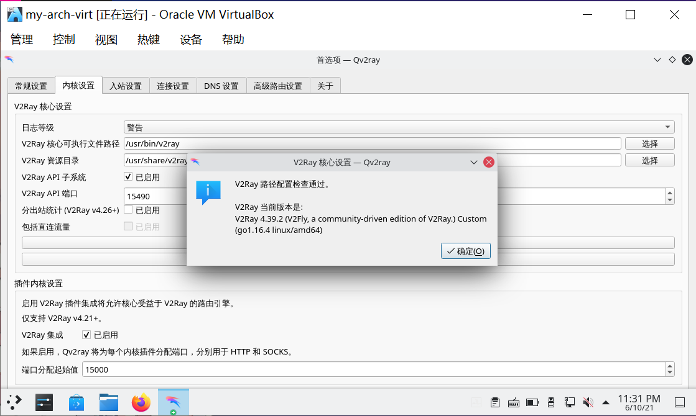
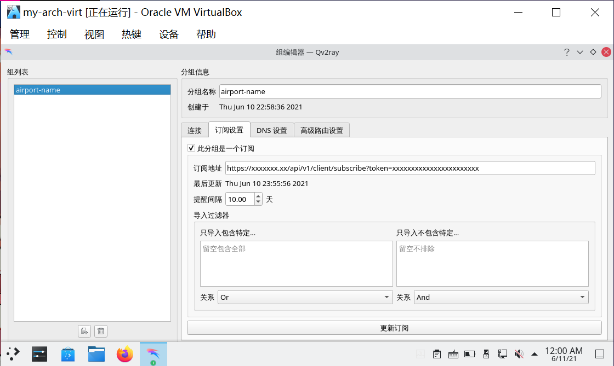
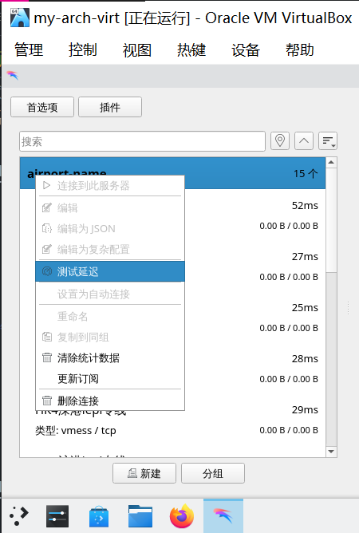
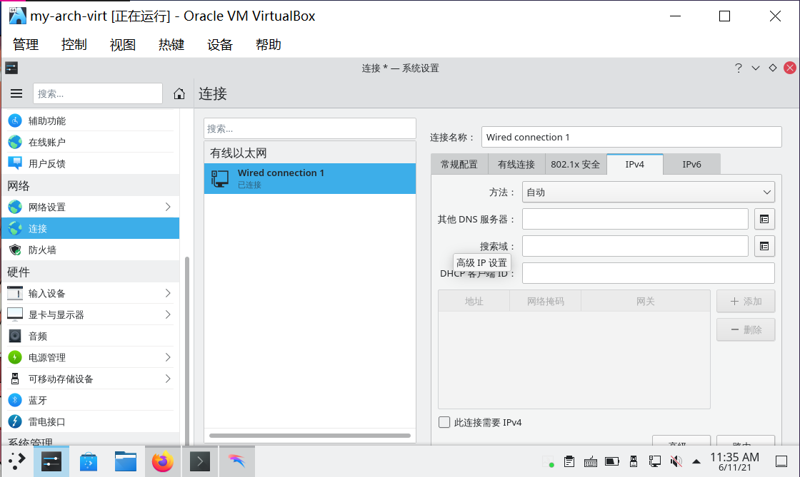

# archlinux 透明代理

> ### 🕊 纵使千山多万壑，犹有青鸾踏云间
>
> 全球化浪潮无法阻挡，我们常常有访问一些资料的客观需求。但有的时候因为一些因素往往导致无法正常访问。虽然前路千沟万壑，但无法阻挡我们前行的脚步。本节我们通过设置透明代理解决这一问题

> ### 🔖 这一节将会讨论：
>
> [[toc]]

::: danger ☢️ 警告

_第六条　计算机信息网络直接进行国际联网，必须使用邮电部国家公用电信网提供的国际出入口信道。_

_任何单位和个人不得自行建立或者使用其他信道进行国际联网。_

-- 中华人民共和国计算机信息网络国际联网管理暂行规定

:::

## 1. 安装 Qv2ray 和 V2Ray / Xray 内核

通过以下命令安装 [Qv2ray](https://github.com/Qv2ray/Qv2ray)<sup>cn</sup> 和 [V2Ray](https://archlinux.org/packages/?sort=&q=v2ray&maintainer=&flagged=) / [Xray](https://github.com/XTLS/Xray-core)<sup>cn</sup> 内核：

:::: code-group
::: code-group-item V2Ray

```bash
sudo pacman -S qv2ray-dev-git v2ray
```

:::
::: code-group-item Xray

```bash
sudo pacman -S qv2ray-dev-git xray
```

:::
::::

::: tip ℹ️ 提示

若安装 V2Ray 核心时报错，请尝试更换镜像源。

:::


> #### 📑 相关资料：Qv2ray
>
> Qv2ray 是一个使用 Qt 编写的跨平台的 v2ray 图形前端。

## 2. 配置 Qv2ray

1. 打开 Qv2ray > 点击 `首选项`：


2. 在 `内核设置` 选项卡中，点击 `检查 V2Ray 核心设置` 以验证 V2Ray 核心设置：



::: tip ℹ️ 提示

1. 若使用 Xray 内核，则先需修改：

   1. `V2Ray 核心可执行文件路径` 为 `/usr/bin/xray`

   2. `V2Ray 资源目录` 为 `/usr/share/xray`

2. 再点击 `检查 V2Ray 核心设置` 以验证 Xray 核心设置：


:::

## 3. 配置订阅

1. 在主窗口中点击 `分组`：


2. 修改 `分组名称` 的 `默认分组` 为自定义名称（通常为 ✈ 场名称）：


3. 切换到 `订阅设置` 选项卡并进行如下配置：

   1. 勾选 `此组是一个订阅`

   2. 设置 `订阅地址` 为 ✈ 场提供的 `订阅链接`

   3. 点击 `更新订阅` 按钮并等待完成

   4. 点击 `确定` 以应用设置并关闭对话框



::: tip ℹ️ 提示

若使用 `qv2ray-dev-git`<sup>cn</sup>，则需要注意的是最新的 `qv2ray-dev-git` 已经将机场的默认订阅类型改为规范 `SIP008`。

如果你的 ✈ 场订阅类型为 `base64`，则需要在 `订阅设置` 面板 > `订阅类型` 中，将 `SIP008` 改为 `base64`，否则你将拿不到订阅链接中的任何节点。

:::

## 4. 通过系统代理方式尝试连接

1. 双击分组中添加的订阅即可查看更新出的节点，右键并点击 `测试延迟` 可以测试分组或节点的延迟：



2. 右键需要连接的节点 > 点击 `连接到此服务器` 即可连接：


3. 打开不存在的网站验证连接：


::: tip ℹ️ 提示

Qv2ray 会自动配置系统代理。也可以点击托盘图标 > 在弹出菜单中，依次选择 `系统代理` > `启用 / 禁用系统代理` 以启用或禁用系统代理。

:::

::: tip ℹ️ 提示

GNOME 的系统代理设置非常有效。这是因为 GNOME 的系统代理设置得到了普遍的适配。

但是 KDE 的系统代理设置更像是一个玩具。甚至 KDE 系列应用程序本身也不会读取和使用那个配置。所以我们需要通过设置透明代理的方式解决这个问题。

同时这也可以使终端下的应用使用代理连接（如 git）。

:::

## 5. 安装 cgproxy

通过以下命令安装 [cgproxy](https://github.com/springzfx/cgproxy)<sup>cn / aur</sup>：

:::: code-group
::: code-group-item cn

```bash
sudo pacman -S cgproxy-git
```

:::
::: code-group-item aur

```bash
yay -S aur/cgproxy
```

:::
::::

## 6. 配置 Qv2ray 透明代理设置

1. 打开 Qv2ray > `首选项` > `入站设置` > 取消勾选 `设置系统代理`：


2. 勾选 `透明代理设置`：


其它设置保持默认即可，`IPv4 端口` 可自定义为其它端口。

::: tip ℹ️ 提示

关于代理 `udp` 流量的设置稍微有一些复杂，配置有误便会导致无法上网。

本指南不对此展开介绍，如有需要可参考 [Project V 官方网站相关内容](https://www.v2ray.com/chapter_02/04_dns.html)。一般情况下不需要代理 `udp` 流量。

而属于 `udp` 类型的 `dns` 流量，我们只需要在系统设置里设置一个可用的 DNS 服务器即可。

:::

3. 点击 `确定` 保存设置

## 7. 配置 cgproxy

1. 通过 `vim` 编辑 `/etc/cgproxy/config.json` 文件：

```bash
sudo vim /etc/cgproxy/config.json
```

进行如下修改：

- 在 `cgroup_proxy` 中括号里加上 `"/"`（包含引号）
- 将 `port` 改为 Qv2ray 首选项里的透明代理端口（默认是和 Qv2ray 默认对应的 `12345`）
- 将 `enable_dns`、`enable_udp`、`enable_ipv6` 改为 `false`
- 如果希望当本机作为网关设备时为连接到本机网关的其他设备（如连接到本机开设的 wifi 热点的设备）也提供透明代理，则将 `enable_gateway` 改为 `true`


::: tip ℹ️ 提示

cgproxy 默认配置是代理所有 `tcp` 和 `udp`、`ipv4` 和 `ipv6` 的流量。

如果不希望代理其中的某种（些）流量，则将对应的 `enable_xxx` 改为 `false`。注意，这里的配置要和 Qv2ray 选项里的配置一致（例如 Qv2ray 选项里没有勾选 `udp`，则这里务必把 `enable_udp` 改为 `false`）

:::

2. 保存并退出 `vim`

## 8. 配置可用的 DNS 服务

1. 打开 `系统设置` > 点击侧栏 `连接`：


2. 选择当前连接 > 点击 `ipv4` 选项卡：



3. 在 `其它 DNS 服务器` 中添加没有污染的 DNS 服务器：


4. 保存并退出系统设置

## 9. 启动 cgproxy 服务

1. 在 Qv2ray 中连接一个节点

2. 在 Qv2ray 托盘菜单中关闭系统代理（如果已经启动）

3. 通过以下命令启动 cgproxy 服务：

```bash
sudo systemctl start cgproxy.service
```

4. 通过以下命令检查 cgproxy 服务运行情况：

```bash
systemctl status cgproxy.service
```


5. 打开不存在的网站验证连接：


> 📔 本节参考资料：
>
> - [Qv2ray](https://qv2ray.net/lang/zh/)
